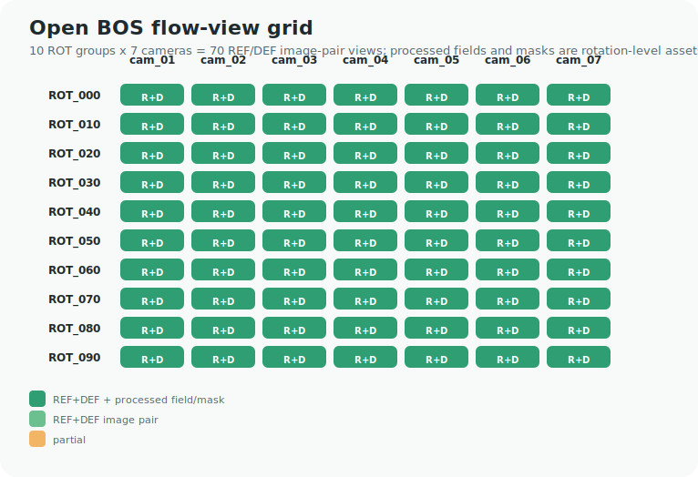

# Open BOS 索引摘要与视角预演

生成日期：2026-07-07

用途：把 Penn State Data Commons 的 255 KB 官方 zip 内容清单转成可讨论、可执行的数据入口。这里不包含 51.66 GB 全量数据。

## 关键结论

- 官方清单共解析出 12 个 zip、1838 个文件条目和 106 个目录条目。
- calibration 是 13 个角度 x 7 台相机，共 91 个 `.mat` 标定文件；这不是论文中 70 views 的直接计数。
- flow image-pair 视角是 10 个 `ROT_***` 旋转组 x 7 台相机，共 70 个 REF/DEF image-pair views，和论文 reported 70 views 对齐。
- 对你的毕设最有用的抽象是：`rotation_id` + `cam_id` + `REF/DEF image pair` + `HSOF/CC/WOF deflection` + `mask` + `calibration`。

## 顶层目录规模

| 目录 | 文件数 | 未压缩字节 | 为什么重要 |
| --- | ---: | ---: | --- |
| `batch/` | 1 | 521 | 批处理入口，帮助定位主流程 |
| `cad/` | 7 | 51,666,316 | 飞行体几何，只能作为 open benchmark 几何 |
| `cal_data/` | 101 | 3,057,931,008 | 相机/视角标定，迁移到 OERF 时最需要替换 |
| `cal_pkg/` | 399 | 13,020,912,375 | 标定包/图片，辅助理解几何 |
| `data/` | 22 | 11,224,201,335 | 处理后的 deflection/mask/volume 数据，适合先做小报告 |
| `def_data/` | 204 | 19,381,515,254 | REF/DEF 原始图、CC/HSOF/WOF 位移结果，是 loader 的核心 |
| `pyscripts/` | 12 | 82,823 | Python 工具线索 |
| `readme.pdf` | 1 | 3,747,566 | 官方说明文档，下载全量前先读 |
| `results/` | 535 | 7,878,332,136 | 论文结果和可视化，可用于 sanity check |
| `scripts/` | 379 | 273,161,473 | MATLAB pipeline 线索，用来读变量名和处理流程 |
| `tools/` | 177 | 1,114,642 | 辅助工具，适合只读结构 |

## 70 视角矩阵

| ROT group | cam_01 | cam_02 | cam_03 | cam_04 | cam_05 | cam_06 | cam_07 | processed fields |
| --- | --- | --- | --- | --- | --- | --- | --- | --- |
| `ROT_000` | REF+DEF+PROC | REF+DEF+PROC | REF+DEF+PROC | REF+DEF+PROC | REF+DEF+PROC | REF+DEF+PROC | REF+DEF+PROC | CC, HSOF, WOF40, MASK |
| `ROT_010` | REF+DEF+PROC | REF+DEF+PROC | REF+DEF+PROC | REF+DEF+PROC | REF+DEF+PROC | REF+DEF+PROC | REF+DEF+PROC | CC, HSOF, WOF40, MASK |
| `ROT_020` | REF+DEF+PROC | REF+DEF+PROC | REF+DEF+PROC | REF+DEF+PROC | REF+DEF+PROC | REF+DEF+PROC | REF+DEF+PROC | CC, HSOF, WOF40, MASK |
| `ROT_030` | REF+DEF+PROC | REF+DEF+PROC | REF+DEF+PROC | REF+DEF+PROC | REF+DEF+PROC | REF+DEF+PROC | REF+DEF+PROC | CC, HSOF, WOF40, MASK |
| `ROT_040` | REF+DEF+PROC | REF+DEF+PROC | REF+DEF+PROC | REF+DEF+PROC | REF+DEF+PROC | REF+DEF+PROC | REF+DEF+PROC | CC, HSOF, WOF40, MASK |
| `ROT_050` | REF+DEF+PROC | REF+DEF+PROC | REF+DEF+PROC | REF+DEF+PROC | REF+DEF+PROC | REF+DEF+PROC | REF+DEF+PROC | CC, HSOF, WOF40, MASK |
| `ROT_060` | REF+DEF+PROC | REF+DEF+PROC | REF+DEF+PROC | REF+DEF+PROC | REF+DEF+PROC | REF+DEF+PROC | REF+DEF+PROC | CC, HSOF, WOF40, MASK |
| `ROT_070` | REF+DEF+PROC | REF+DEF+PROC | REF+DEF+PROC | REF+DEF+PROC | REF+DEF+PROC | REF+DEF+PROC | REF+DEF+PROC | CC, HSOF, WOF40, MASK |
| `ROT_080` | REF+DEF+PROC | REF+DEF+PROC | REF+DEF+PROC | REF+DEF+PROC | REF+DEF+PROC | REF+DEF+PROC | REF+DEF+PROC | CC, HSOF, WOF40, MASK |
| `ROT_090` | REF+DEF+PROC | REF+DEF+PROC | REF+DEF+PROC | REF+DEF+PROC | REF+DEF+PROC | REF+DEF+PROC | REF+DEF+PROC | CC, HSOF, WOF40, MASK |

## 建议的本科预演任务

1. 只读 `open_bos_index_summary.json`，先生成一个 70-view manifest，不下载全量数据。
2. 按 `ROT_000`、`ROT_010`、`ROT_020` 选 3 个旋转组，模拟 21-view 或 9-view 子采样。
3. 给每个 view 记录 `ref_image_path`、`def_image_path`、`hsof_path`、`mask_path` 和 `calibration_path`，字段缺失就显式写 `missing`。
4. 做第一版 `view_grid.png/svg` 和 `view_manifest.csv`，先证明数据组织没错。
5. 再进入重投影误差、NeRIF-style neural field 或 PIV-BOST 补偿，不一开始就追完整 NIRT 复现。

## 给何远哲的具体问题

1. OERF 九视角 BOST 更接近 `ROT group x cam_id`，还是固定物理相机编号？
2. 组内数据是否也能给到 REF/DEF 原始图，还是只有处理后的 displacement/deflection field？
3. 如果先交付 data loader + view-quality report，是否比直接跑 NeRIF 更符合组内近期需求？
4. 真实数据里是否存在与 `HSOF`、`CC`、`WOF40` 类似的多算法位移结果可做 baseline 对照？
5. 标定文件能否公开字段名和单位，即使图像数据暂时不能公开？

## 迁移边界

- Open BOS 的物理对象是高速飞行体，不是火焰；可以迁移数据结构、少视角选择、重投影和报告工具，不能迁移物理结论。
- `cal_data/Angle_*_deg` 是公开 benchmark 标定角度；迁移到 OERF 时要替换为组内 camera matrix / ray model。
- 网页仓库只提交官方索引、摘要和小图，不提交 12 个 zip 数据包。
