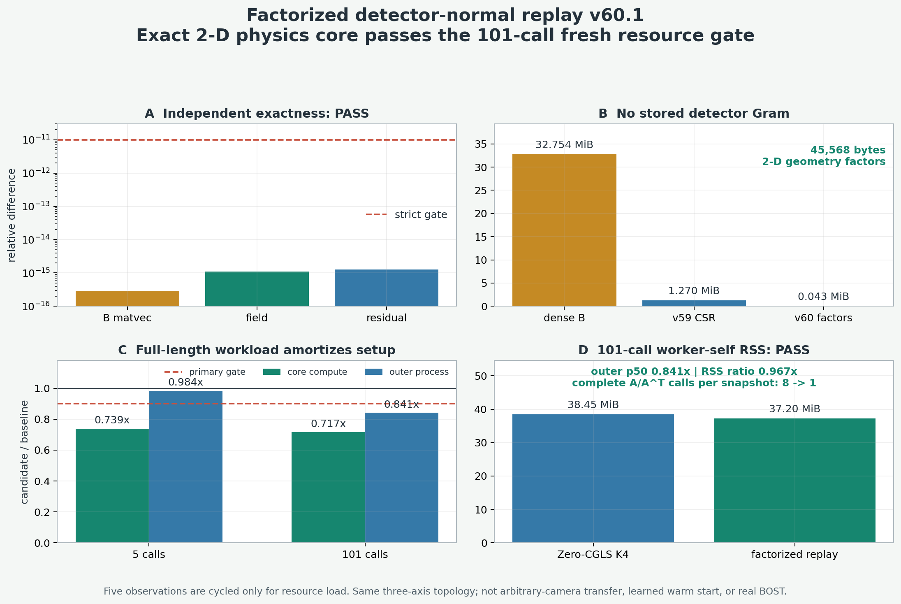

# v60.1：因子化探测器正规算子结果

## 一句话结论

在当前冻结的三正交轴、projection-first、straight-ray 代理几何中，
`B=A A^T` 不必保存成稠密矩阵或 CSR，也不必在每次 `B` 乘法中形成三维场。
它可以由精确的二维梯度伴随、视线权重收缩和外积完成。

独立程序在 17 个随机探测器向量和 5 个已打开外部 observation 上复算后，
最大 `B` 乘法、K4 场和 residual 相对差分别为
`2.92e-16`、`1.09e-15` 和 `1.28e-15`。在事前冻结的 101 次调用资源负载中，
候选的核心计算、fresh outer wall 中位数和 worker-self RSS 比值分别为
`0.716687`、`0.841184` 和 `0.967493`，全部通过冻结门。

这是重要的代理正结果，但还不是任意相机、曲折光线、神经算子或真实 BOST 结果：

```text
exact_factorized_algebra_pass=true
primary_101_call_resource_gate_pass=true
arbitrary_camera_geometry_transfer=false
curved_ray_transfer=false
operator_learning_result=false
real_bost=false
global_novelty_proven=false
algorithm_breakthrough=false
paper_success=false
```



## 1. v59 暴露了什么问题

v59 已经证明：从 BLASTNet 外部坐标重新构造 `A`、`B=A A^T` 和 CSR 后，
detector-space 重放仍与 zero-start CGLS K4 在机器精度内一致。但是五帧
fresh-process 资源门失败：

```text
core compute ratio = 0.809684
outer wall ratio   = 1.023894
RSS ratio          = 1.153122
```

因此，问题不在 Krylov 代数，而在保存、解压、加载和使用稀疏 `B` 的固定成本。
v60 没有继续微调 CSR，而是问了更直接的问题：

> 当前三轴投影算子的结构，是否允许根本不构造 `B`？

## 2. 从三维正规算子到二维收缩

将第 `s` 个视角写成

```text
A_s = G_s P_s
```

其中：

- `P_s` 沿该视角的 LOS 权重把三维场投影成二维标量图；
- `G_s` 对二维投影图做 detector-plane differentiation 和 interior selection，
  得到该视角的两个偏折分量。

把所有视角堆叠后，探测器正规算子的 `(t,s)` 分块为

```text
B_ts = A_t A_s^T
     = G_t (P_t P_s^T) G_s^T .
```

于是对源视角数据 `y_s` 的作用可以拆成三步：

1. `G_s^T y_s`：在源探测器平面得到二维梯度伴随图；
2. `P_t P_s^T`：只做 LOS 权重收缩和外积；
3. `G_t`：在目标探测器平面恢复两个偏折分量。

当前三正交轴拓扑下：

- `s=t` 时，`P_s P_s^T` 退化为 LOS 权重平方和乘二维图；
- `s!=t` 时，只需沿共享坐标做一次一维收缩，再与另一条 LOS 权重做外积；
- 所有中间量都是一维或二维数组，不产生 `16×16×32` 三维场。

正式实现只保存导数矩阵、interior selection 和 LOS 权重，总计
`45,568 bytes`。作为数量级对照：

```text
dense B     约 32.754 MiB
v59 CSR     约  1.270 MiB
v60 factors 约  0.043 MiB
```

## 3. 为什么它仍能精确重放 CGLS K4

zero-start CGLS 的场始终位于 `Range(A^T)`，可写成

```text
x_k = A^T z_k .
```

令 measurement residual 为 `r_k=y-Ax_k`，再令 `B=A A^T`。CGLS 中
`||A^T r_k||^2` 可改写为

```text
gamma_k = <r_k, B r_k>.
```

将 CGLS 的搜索方向也写成 `A^T d_k` 后，得到 detector-space
Conjugate Residual 递推：

```text
q_k     = B d_k
alpha_k = gamma_k / <q_k,q_k>
z_{k+1} = z_k + alpha_k d_k
r_{k+1} = r_k - alpha_k q_k
beta_k  = <r_{k+1},B r_{k+1}> / gamma_k
d_{k+1} = r_{k+1} + beta_k d_k .
```

四步结束后只做一次 `x_4=A^T z_4`。这不是标准 CGNE；两者的系数和递推对象
不同。这里的 CR lift 才与当前 zero-start CGLS 严格对应。

每帧完整算子账因此从

```text
Zero-CGLS K4: 4A + 4A^T
```

变为

```text
factorized replay K4: 4 factorized-B + 1A^T
```

即完整 `A/A^T` 调用从 8 次降到 1 次，减少 `87.5%`。这只是调用结构；
是否真的更快仍由 fresh-process wall 实测决定。

## 4. 独立代数复算

正式 runner 与独立 validator 使用不同实现。validator 不导入正式 factorized
core 或 runner，重新构造几何、二维收缩和 K4 递推，并验证输入在运行前后未变化。

| 检查对象 | 样本数 | 最大相对差 | 冻结门 | 结果 |
| --- | ---: | ---: | ---: | --- |
| `Bv` | 17 个随机 detector vector | `2.919950e-16` | `1e-12` | PASS |
| K4 field | 5 个 observation | `1.094627e-15` | `1e-11` | PASS |
| K4 residual | 5 个 observation | `1.277697e-15` | `1e-11` | PASS |

另一个小尺寸显式矩阵审计直接构造 `A` 和 `A A^T`，也与二维因子化作用一致。
因此这里的“精确”指当前离散算子的舍入误差等价，不是对真实光学的精确声明。

## 5. 为什么五次调用几乎不快，101 次调用却通过

资源协议在正式 fresh 结果产生前冻结两个负载：

- 5 calls：短 bundle 诊断，不能决定 PASS；
- 101 calls：对应公开 PoolFire 一条轨迹的帧数，是主资源门。

101 次调用只是按固定顺序循环同 5 个不可变 observation，用来测固定初始化成本如何
摊销。它不是 101 个独立科学样本、新轨迹或泛化证据。

| 负载 | core compute p50 | worker lifetime p50 | outer wall p50 | outer wall p90 |
| --- | ---: | ---: | ---: | ---: |
| 5 calls | `0.739354` | `0.929098` | `0.983849` | `0.998433` |
| 101 calls | `0.716687` | `0.751969` | `0.841184` | `0.876558` |

短任务中，Python 启动、模块导入、读取输入和构造几何占比较大，所以核心快约 26%，
端到端只快约 1.6%。当同一 worker 连续处理 101 帧时，固定成本被摊薄，outer
wall 中位数变为基线的 `84.12%`，p90 为 `87.66%`，worst 为 `91.25%`。

正式资源实验共运行 68 个串行 fresh process：

```text
2 workloads × 2 arms × 17 repetitions = 68
```

独立 validator 重新读取所有 68 条 worker record、34 个配对行和两份 batch
摘要，完整复算 gate 判决。

## 6. 内存结果的准确口径

101-call armwise worker-self RSS p90-higher 为：

```text
Zero-CGLS K4       38.453125 MiB
factorized replay  37.203125 MiB
ratio               0.967493
```

该指标来自 worker 自身 `ru_maxrss`。它不是 process-tree 采样峰值，也不是把父进程、
浏览器或操作系统缓存都算进去的 whole-pipeline memory。当前能说的是 worker-self
RSS 不劣并略低，不能把它扩大成整套实验系统的内存结论。

## 7. 这项结果的论文价值与原创性边界

数据空间迭代和不显式保存灵敏度矩阵并不是新概念。2007 年的
[Data space conjugate gradient inversion for 2-D magnetotelluric data](https://academic.oup.com/gji/article/170/3/986/2043364)
已经讨论了 data-space CG、按 forward calls 比较成本以及时间和内存之间的权衡。
因此，当前不能把“转到 measurement space”本身写成创新。

v60.1 的真实价值更窄：

1. 对当前 BOST-like 三轴投影算子，给出了不存 `B`、不形成三维中间场的精确二维
   作用公式；
2. 在外部坐标构造上同时闭合舍入误差等价、调用账、fresh outer wall 和
   worker-self RSS；
3. 将未来学习任务从“让网络替代整个逆问题”缩成“只学习真实相机/曲折光线相对
   可解释直线核心的修正”。

这更像一个有潜力成为论文方法骨架的 classical physics core，而不是已经完成的
神经算子论文。

## 8. 决定论文上限的下一门

何远哲师兄的
[NeRIF](https://arxiv.org/html/2409.14722v2)
把 voxel BOST 写成包含 tomographic projection `S`、differential operator `D`
和世界到相机投影 `P` 的系统；数值验证使用 9 个视角、角度覆盖
`0°–170°`，实验系统也使用九路光纤输入和相机内外参标定，并沿校准光线回溯。

这说明当前 `LOS axis = x/y/z` 的三视角模型还没有触达真实难点。下一门必须改变
视角拓扑，而不是只改变坐标尺度：

1. 构造 9-view、非轴对齐、带相机投影的 straight-ray operator；
2. 检查是否还能得到可复用的低维/张量化 `A A^T` 作用，还是三轴外积结构消失；
3. 与 matrix-free `A(A^T y)`、低秩/分块近似和直接 CGLS 做相同精度、调用、
   wall、RSS 对照；
4. 只有误差来源能由 deployment-visible geometry/residual 解释时，才训练最小
   correction operator；
5. 最后用组内真实标定、位移和重复测量定义“同精度”，再决定论文级别。

如果第 2 步失败，v60.1 仍是一条诚实的三轴代理正结果；如果非轴对齐多视角仍能
获得精确或可控误差的结构化核心，并且学习修正优于强基线，论文上限才会明显提高。

