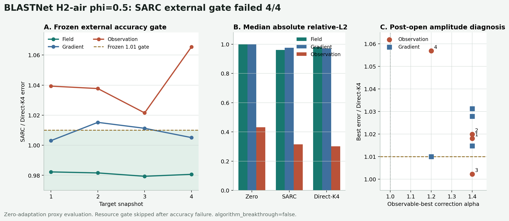

# v40.2：SARC-K3-M4 在外部氢气火焰 DNS 上没有通过

> 判决日期：2026-07-29
> 数据：BLASTNet 预混 H2-air 槽式燃烧器 DNS，`phi=0.5`
> 正式状态：`FINAL_VALIDATED_NEGATIVE_EXTERNAL_ACCURACY_V40_2`

## 一句话结论

冻结的 SARC-K3-M4 在没有针对 BLASTNet 训练或调参的条件下，第一次进入与
PoolFire 不同的数据族。四个目标时刻均降低了 Zero 的 field、gradient 和
observation error，field error 也均低于 Direct-K4；但四帧没有一帧能同时满足
冻结的三指标精度门，因此正式外部检验是 **0 / 4，FAIL**。

```text
external_accuracy_gate_pass=false
resource_gate_run=false
algorithm_breakthrough=false
paper_success=false
```



## 为什么必须做这一步

v37-v39.1 的正结果都来自 PoolFire，且所有官方 PoolFire 流已经被历史流程打开。
继续在同一数据族中调模型只能增加开发证据，不能回答跨燃烧场是否成立。

这次选择 BLASTNet 的预混氢气-空气 DNS，是因为它在物理与数据形态上都与
PoolFire 不同：槽式燃烧器、贫预混 H2-air、DNS、`651 x 401 x 201` 网格和五个
时刻。官方元数据明确提供密度变量 `RHO_kgm-3`。三份网格文件和五份密度文件均从
公开发布端重新下载一次，并与第一份本地副本逐字节一致后，才生成代理观测。

正式运行前冻结了数据裁剪、粗网格、straight-ray 代理、curved forward、
SARC checkpoint、四个对照、三指标门和独立验证程序；结果出来后没有换模型或
放宽阈值。

## 正式精度门

每个目标时刻都必须同时满足：

1. SARC 的 field、gradient、observation relative-L2 都不超过
   `1.01 x Direct-K4`；
2. 三项都优于 Zero；
3. 不被更便宜的 Direct-K3 在成本-精度意义上 Pareto 支配。

后两项在四帧全部成立，但第一项 4 / 4 失败。

| 时刻 | field / Direct-K4 | gradient / Direct-K4 | observation / Direct-K4 | 判决 |
|---|---:|---:|---:|---|
| 0.002 s | 0.982258 | 1.003059 | 1.039317 | FAIL |
| 0.004 s | 0.981588 | 1.015216 | 1.037703 | FAIL |
| 0.006 s | 0.979353 | 1.011266 | 1.021523 | FAIL |
| 0.008 s | 0.980637 | 1.005087 | 1.065418 | FAIL |

SARC 的中位 field error 为 `0.960429`，优于 Direct-K4 的 `0.979420`；但中位
gradient error 为 `0.975342`，高于 `0.971054`，中位 observation error 为
`0.314620`，高于 `0.301608`。这说明它没有完全失效，却没有守住论文要求的
matched-accuracy。

这些绝对 field error 都接近 1，Direct-K4 也同样如此。因而这里更准确的表述是：
当前 PoolFire 学到的先验没有零适配迁移到该 BLASTNet 全域代理；不能把相对比值
写成高质量三维重建。

## 独立复算

正式 runner 先封存全部预测，再打开 truth。随后独立 validator 不导入正式
runner 的指标或判门函数，重新执行 16 次 curved forward，并重算四帧、四种方法
的全部指标。

```text
PASS_INDEPENDENT_RECOMPUTATION_EXTERNAL_BLASTNET_SARC_V40_2
maximum metric absolute difference = 8.881784197001252e-16
maximum observation receipt difference = 2.220446049250313e-16
sealed fields unchanged = true
prediction barrier unchanged = true
```

因此 FAIL 不是汇总脚本或浮点解析造成的。

## 为什么没有继续跑资源速度

协议顺序是“先过 matched-accuracy，再测 wall/RSS”。精度门已失败，继续测速只会
得到一个不等精度方法的速度，不能支撑“同精度下降低重建成本”。所以
`resource_gate_run=false` 是正确停止，而不是任务漏做。

## 失败机理：不只是幅度太小

外部门开封后，另做了一次明确标注为 post-open 的机理诊断。它不再产生新的外部
泛化证据，只回答：如果沿原 SARC 修正方向调一个标量，能否修好？

对每帧在 `alpha in [0, 2]` 扫描，观测最优幅度分别为：

```text
1.4, 1.4, 1.4, 1.2
```

这说明冻结校正普遍偏弱。但最优幅度下仍是 0 / 4 同时通过三指标门；其中三帧连
observation 门都过不了，四帧的 gradient 均超过对应兼容界。结论是：

```text
POST_OPEN_CORRECTION_SPAN_INSUFFICIENT_FOR_OBSERVATION_GATE
```

即单纯把 correction 乘大无法修复。下一版若仍有价值，必须改变 correction 的
空间方向或尺度条件，而不是只学习一个全局增益。

## 是否成功

**算法外部检验没有成功。** 这是当前最重要的诚实结论。

成功完成的是证伪：我们已经知道 v39.1 的 PoolFire 正结果不能零适配外推到这个
H2-air DNS；也知道问题不是单一幅度不足。它把下一轮算法问题从模糊的“提升泛化”
收窄为可检验命题：

- correction 需要感知物理尺度和密度梯度频谱；
- 需要用部署可见 observation 选择多个修正方向，而非一个固定直线 Krylov 方向；
- 必须在另一个开发数据上设计，BLASTNet `phi=0.5` 只能作为已开封诊断集；
- 下一次正式外部门必须换成结果前未见的工况或真实组内 BOST。

## 突破性进展判决

```text
algorithm_breakthrough=false
```

没有算法突破，也没有论文成功。真正新增的是一个有独立复算支持的失败边界：
SARC 在新数据族中能改善场误差，却牺牲梯度和观测一致性；沿原修正方向调幅也不能
消除这个矛盾。这个负结果足以否决“原模型直接平移即可”的路线，并为下一版
多方向、尺度感知的修正器提供了明确靶点。

## 公开来源

- [BLASTNet: Premixed Flame H2-Air](https://blastnet.github.io/premixed_slot_flame_h2air)
- [BLASTNet phi=0.5 official metadata](https://blastnet.github.io/assets/json/quentin2024/premixed-flame-slot-burner-dns-h2air-phi05-info.json)
- [Hydrogen reaction rate modeling based on CNN for LES](https://doi.org/10.1017/dce.2025.1)

公开页面和摘要不包含原始 DNS、私有场、checkpoint、执行路径、release 或哈希。
