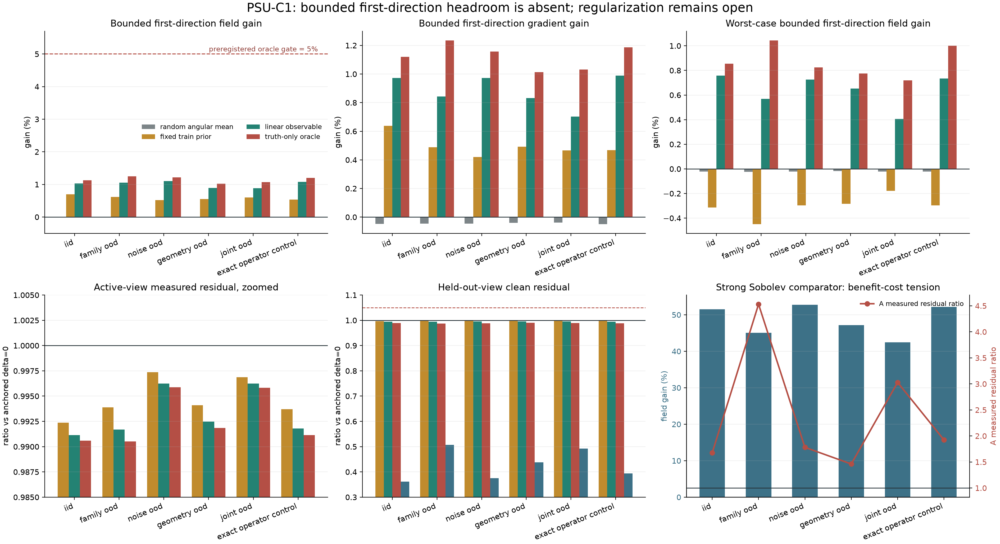

# PSU-C1：为什么现在应停止训练“第一搜索方向”，转向正则化与停止策略

> **审计结论：** `NO_GO_FIRST_DIRECTION_HEADROOM_ABSENT_POSTOPEN`
>
> **独立验证：** `VALID`
>
> **突破监测：** **无算法突破；有真实路线收缩。**
>
> **适用范围：** 公开 PSU 九视角射线几何 + 解析反应场 + 合成噪声的 post-open rehearsal。
> **不适用范围：** 真实实验三维真值、未见装置泛化、OERF 组内验证、NeRIF/TDBOST/DeepONet/FNO 优越性和论文成功。

---

## 1. 一句话说清这次做了什么

我们原来准备训练一个小网络，只改变 CGLS 的**第一条搜索方向**，再让后面 23 步继续做严格的测量一致性迭代。

这次没有直接训练网络，而是先问一个更便宜也更关键的问题：

> 即使把三维真值偷偷交给一个 evaluator-only oracle，让它在固定的 5% 半径内选择最有利的第一方向，24 步结束后能否稳定得到至少 5% 的场误差收益？

答案是不能。两个预先指定的主分区中，truth-only oracle 的平均 field relative-L2 gain 只有 **1.1288%** 和 **1.2465%**。它们远低于冻结的 **5%** headroom 门。因此，继续把线性映射扩成 CNN、DeepONet 或 FNO，不符合当前证据。

这不是“所有算子学习失败”，而是一个很窄、很有用的结论：

> **在当前 PSU-C1、5% 有界修正和固定 24 步外壳内，first-direction 不是优先值得训练的自由度。**

---

## 2. 为什么先做简单对照，而不是先训练神经网络

如果简单对照没有做，网络出现 1% 左右收益时，我们无法区分：

1. 网络真的读懂了 geometry 和 observation；
2. 任意随机偏转都能得到类似收益；
3. 只是把第一方向乘了一个常数；
4. 一个所有 case 共用的固定方向已经足够；
5. 第一方向本身就没有足够的可改善空间。

因此 PSU-C1 固定了九种方法，每个候选都使用相同的 `24F/24A^T` 算法预算：

| 方法 | 它在排除什么 | 部署时能否使用 |
|---|---|---|
| anchored `delta=0` | 参考解；完全不改第一方向 | 可以 |
| `1.05 g` | 纯缩放是否造成假收益 | 可以 |
| 3 个 random angular seeds | 任意角度扰动是否也会赢 | 可以 |
| train-fitted fixed | 是否只需一个全局固定先验 | 可以 |
| linear observable | geometry、噪声、观测和 pooled adjoint 的线性映射是否有信号 | 可以 |
| truth angular oracle | 第一方向的理想上限是否足够大 | **不可以，读取真值** |
| inverse-Sobolev5 | 同 `24F/24A^T` 下强经典正则化方向 | 可以 |

线性方向的离线拟合使用 72 个 train cases，ridge 选择使用 24 个 validation cases；全部分区在协议冻结前已经打开，所以本实验始终是 post-open mechanism rehearsal，不是 confirmatory test。

---

## 3. 审计为什么推翻了第一次运行

第一次运行完成后，独立红队在结果进入网页或论文前发现六个问题：

1. held-out B 为空时可能改变统计分母；
2. truth oracle 额外使用的一次 `A^T` 没有进入 evaluator 成本；
3. 切片图按 test-family-OOD 真值收益挑了最好案例；
4. 本地几何没有和公开 PSU identity manifest 做 fail-closed 绑定；
5. train/validation 的拟合 setup 成本没有报告；
6. 运行失败时会删除 `.building`，不保留失败证据。

因此 attempt 0 被明确标为无效。修订 1.1 **没有改变任何方法、split、半径、随机种子、阈值或主门**，只修复审计、成本和可视化选择。随后从干净提交 `2ccfaa42a2bb003d7b91562d9d28dbd1d6a9ae80` 重新运行。

独立 validator 不导入 runner，重新读取 1,296 行指标，复算 54 个 split-method 单元、全部门槛和最终状态。结果为 `VALID`。

---

## 4. 两个主分区的决定性结果

### 4.1 Field relative-L2 gain

| 方法 | test-IID | family-OOD | 冻结门 | 判决 |
|---|---:|---:|---:|---|
| random angular，三 seed 逐 case 平均 | -0.0093% | -0.0113% | 仅作可疑信号控制 | 无随机假收益 |
| train-fitted fixed | +0.6987% | +0.6149% | 非主门 | 小信号 |
| linear observable | +1.0302% | +1.0542% | 每个主分区 ≥2%，且比 fixed 多 ≥1 pp | **失败** |
| truth-only oracle | +1.1288% | +1.2465% | 每个主分区 ≥5% | **失败，决定 NO-GO** |
| inverse-Sobolev5 | +51.5234% | +45.0628% | 强对照，不用于事后改门 | 发现另一条机制线索 |

linear observable 在 IID 的 95% post-open mask-pattern bootstrap interval 为 `[0.9693%, 1.0913%]`，在 family-OOD 为 `[0.9944%, 1.1052%]`。区间下界为正不等于通过，因为预注册要求的是**至少 2% 平均收益，且比 fixed direction 多至少 1 个百分点**；两项都失败。

### 4.2 六个描述性分区

| split | truth oracle field gain | linear field gain | fixed field gain | Sobolev field gain | Sobolev A-measured ratio | Sobolev held-out-B ratio |
|---|---:|---:|---:|---:|---:|---:|
| IID | +1.1288% | +1.0302% | +0.6987% | +51.5234% | 1.6752 | 0.3619 |
| family-OOD | +1.2465% | +1.0542% | +0.6149% | +45.0628% | 4.5303 | 0.5073 |
| noise-OOD | +1.2140% | +1.1052% | +0.5213% | +52.7765% | 1.7809 | 0.3750 |
| geometry-OOD | +1.0210% | +0.8920% | +0.5514% | +47.1341% | 1.4612 | 0.4384 |
| joint-OOD | +1.0709% | +0.8820% | +0.6007% | +42.4402% | 3.0286 | 0.4923 |
| exact-operator control | +1.1980% | +1.0812% | +0.5317% | +52.1557% | 1.9239 | 0.3938 |

这里的 OOD 只是已经打开的解析 morphology、噪声和模拟几何变化，不是未见真实 rig，更不是跨实验室泛化。

---

## 5. 图应该怎样读



上排把 first-direction 方法单独放大。红色虚线是冻结的 5% truth-oracle 门；所有 oracle 柱都只有约 1%。这就是停止神经 first-direction fit 的直接原因。

左下显示三种可部署简单方向在 active measured residual 上只做了很小改变。中下显示 held-out B；first-direction 方法只带来约 0.5%--1.2% 的变化，而 inverse-Sobolev 明显更低。右下同时画出 inverse-Sobolev 的 field gain 和 active measured residual ratio：场误差大幅下降，但 active measured residual 在多数 split 上变差，family-OOD 甚至达到 `4.5303x`。

这张图不允许读成“Sobolev 新算法胜出”。它只告诉我们：**正则化强度/迭代停止比第一方向更可能控制当前误差。**

---

## 6. 为什么 Sobolev 能让场更准，却让 active measured residual 更差

这是欠定逆问题里最重要的物理与数值直觉之一。

设测量模型为

```text
y = A x + noise
```

九视角仍不足以直接观察每个三维体素自由度。未正则化的 CGLS 继续迭代时，会越来越努力地拟合当前 active views 中的细节，其中一部分可能是噪声、离散误差或几何失配。于是会出现：

- `||Ax-y||` 更小；
- 但 `||x-x_true||` 反而更大；
- held-out views 也可能受伤。

inverse-Sobolev 对高频、粗糙方向施加更强抑制。对本次平滑解析反应形态，它显著减少了场误差，并改善了 held-out B；代价是不能像 24 步原始 CGLS 那样追逐 active measured data。

因此三个指标回答不同问题：

| 指标 | 回答的问题 | 不能单独证明什么 |
|---|---|---|
| field relative-L2 | 有真值时，三维场是否更接近 truth | 真实实验通常没有体真值 |
| active A measured residual | 是否拟合当前输入观测 | 小残差不保证场正确，可能拟合噪声 |
| held-out B clean residual | 是否能解释未参与重建的射线 | 仍是 proxy，不是完整三维真值 |

真实 BOST 中没有解析体真值时，必须依赖 calibration phantom、重复实验、独立相机/射线、已知守恒量或同步诊断来建立可信度，不能只选一个对自己有利的 residual。

---

## 7. 成本账本

### 7.1 每个评价 case

- 每个算法：`24F/24A^T`；
- 每个方法评分：额外 `1F`；
- truth-only oracle：再额外 `1A^T` 构造 evaluator-only truth direction；
- held-out B：24/24 cases 全覆盖，没有静默删样本。

### 7.2 离线线性拟合

- train：72 case-equivalent `A^T`；
- validation：24 case-equivalent `A^T`；
- 总 setup：96 case-equivalent `A^T`；
- 若只部署 1 个 case，摊销仍是 96 次；部署 100 个 case 时为每例 0.96 次。

所以“推理同为 24/24”不代表端到端成本相同。将来比较任何神经方法，都必须同时列出数据生成、训练、调参、setup、推理、评分和摊销帧数。

---

## 8. 这次真正关闭了什么

### 已关闭

当前 PSU-C1 上：

- 5% bounded first-direction correction 作为下一优先神经训练对象；
- 通过扩大 linear observable 到 CNN/DeepONet/FNO 来追逐 1% signal；
- 用 first-direction oracle 的小正收益为 L1 scientific fit 签发授权。

### 没有关闭

- learned regularization strength；
- learned stopping；
- multi-step / trajectory correction；
- nonlinear or curved-ray operator correction；
- 4D low-rank spatiotemporal reconstruction；
- NeRIF 式连续场表示；
- 在真实 OERF callable 和数据合同上的新问题。

### 没有取得

- 算法成功；
- 新颖性；
- 真实 BOST 结果；
- 泛化证据；
- 对 DeepONet、FNO、FFNO、NeRIF 或 TDBOST 的优越性；
- 高水平论文所需的完整证据。

---

## 9. 下一算法主线：学“正则化轨迹”，不要只学第一步

### 9.1 推荐主候选：Observable Regularization and Stopping Policy

这是**待验证的研究假设，不是已经提出成功的新算法**。

核心思想：在 matrix-free CGLS/PCGLS 路径中，不让网络直接输出完整三维场，也不只修正第一方向；网络只根据部署可见信息，输出一个受限的正则化/停止策略。

可见输入可以包括：

- 每视角 mask、噪声估计和标定摘要；
- `||r_k||`、相邻残差下降率和 discrepancy ratio；
- `||A^T r_k||`、搜索方向夹角和少量 Lanczos/Ritz 标量；
- geometry summary、像素/射线尺度和有限孔径参数；
- 前几步 active-A 与预留-B proxy，但 B 不能进入最终测试时的训练泄漏路径。

受限输出优先考虑：

1. 每步 Sobolev/Tikhonov strength `lambda_k`；
2. 在少量固定谱滤波器基之间的非负、和为一系数；
3. stop/continue 概率，但必须经过 deterministic envelope；
4. 最多一个 bounded trajectory correction，而不是任意三维场。

安全结构：

```text
observable features
      ↓
small policy network
      ↓
bounded lambda_k / convex filter weights
      ↓
matrix-free physics step
      ↓
active residual envelope + calibrated held-out proxy
      ↓
accept or fall back to frozen discrepancy/regularized baseline
```

### 9.2 为什么它比 first-direction 更贴合本次证据

- first-direction truth oracle 只有约 1% headroom；
- 固定 Sobolev 在同 24/24 预算下有 42%--53% field signal；
- 但 Sobolev 的 active measured residual 会恶化，说明“强度和停止点”必须按 case 控制；
- policy 学的是一个低维、受界定、可回退的决策，比直接输出 32^3 场更容易解释和迁移；
- 该思路和何远哲师兄的 computational reconstruction 主线仍然相邻，但需要真实接口确认其痛点是否确实是 noise/limited views/regularization，而不是 curved-ray bias 或标定误差。

### 9.3 必须正面击败的基线

同数据、同 split、同 operator 和完整成本下至少比较：

- discrepancy-stopped CGLS；
- 固定 checkpoint CGLS；
- 固定 Tikhonov / inverse-Sobolev 强度；
- validation 选择的 fixed strength；
- TV/Huber 或实验室现用强正则化；
- 简单 residual-rule stopping；
- FCG-NO 风格 nonlinear preconditioner；
- 直接 DeepONet/FNO/iFNO；
- 与组内问题匹配时再比较 NeRIF/TDBOST，而不是强行把不同任务放进同一表。

FCG-NO 已经把 neural operator 用作 flexible-CG nonlinear preconditioner，因此不能声称“首次把算子学习放进 Krylov”。可检验的新颖性只能更窄，例如：**BOST 几何条件化、trajectory-level bounded regularization policy、独立 A/B consistency 与 fail-closed fallback 的联合设计**。

---

## 10. 两条条件支线

### 支线 A：4D low-rank regularization policy

何远哲师兄的 TDBOST 把时间分辨 BOST 组织为四维时空重建。若能获得真实多帧数据与当前 baseline，可将 policy 输出从单帧 `lambda_k` 扩展为：

- 时空低秩强度；
- rank/temporal smoothness 的受限选择；
- 对突发反应前沿的 change-point aware stopping；
- 在不破坏短时突变的前提下降低逐帧成本。

这条支线必须等真实 4D 数据合同，不应先用单帧 synthetic 数字冒充 TDBOST 提升。

### 支线 B：curved-ray discrepancy correction

若师兄确认主要误差来自折射引起的曲光线偏差，而不是 regularization，则优先研究：

- straight-ray 与 curved-ray residual 的层级差；
- 可调用 JVP/VJP；
- bounded learned operator correction；
- 几何失配下的校准和回退。

没有 JVP/VJP 或至少可重复 forward callable 时，这条支线不能严谨训练。

---

## 11. 现在应问何远哲师兄的九个问题

1. 组内当前三维/四维重建最主要的误差是有限视角、噪声、曲光线、标定、时间成本还是内存？请排序。
2. 现有 forward callable 输入/输出和单位是什么？
3. 是否有严格配对的 adjoint、VJP 或 JVP？
4. straight-ray 和 curved-ray residual 分别在哪一层计算？
5. 当前最强基线是 NeRIF、TDBOST、voxel tomography、TV/Tikhonov 还是其他组内代码？
6. 是否已有按 session/rig 隔离的数据 split？
7. 是否有 calibration phantom、synthetic truth 或同步诊断可提供 field proxy？
8. 真实部署最关心的是精度、速度、内存还是 4D temporal fidelity？
9. 师兄是否认可“学习受限 regularization/stopping policy”比“学习第一方向”更接近当前痛点？

把这些答案写入私有 `interface_contract.json` 后，才能决定主候选还是两条支线。

---

## 12. 七天学习与研究动作

### Day 1：看懂半收敛

手画 CGLS 随 iteration 的 measured residual 与 field error：前者通常继续下降，后者可能先降后升。读 inverse problems 的 iterative regularization 章节。

### Day 2：复算本次四个指标

从 `metric_rows.csv` 手算一个 IID case 的 field gain、A measured ratio、A clean ratio 和 held-out B ratio。能解释为什么它们不必同向。

### Day 3：固定强度基线

只在新冻结的 development seeds 上比较 5--7 个 Sobolev/Tikhonov strengths 和 discrepancy stopping；禁止用本次 test splits 选强度。

### Day 4：轨迹特征

记录每步 `||r_k||`、`||A^T r_k||`、方向夹角、步长和少量 Ritz 指标。先画图，不训练网络。

### Day 5：最小 policy

先做 ridge/logistic policy，只预测 fixed-strength index 或 stop/continue。若线性策略没有信号，不扩网络。

### Day 6：公平基线与成本

写出 fixed strength、discrepancy CGLS、TV/Huber、small policy、FCG-NO-style 的数据、调参、`A/A^T`、wall 和 memory 表。

### Day 7：师兄审核

提交一页纸：真实痛点、接口、主假设、失败门、数据 split、基线和算力。只有师兄认可且 fresh protocol 冻结后，再启动训练。

---

## 13. 可复现入口

- [审计结果 summary](../demo_t16_operator/results/lgwo_a24_psu_simple_controls_rehearsal_v1/summary.json)
- [全部 1,296 行指标](../demo_t16_operator/results/lgwo_a24_psu_simple_controls_rehearsal_v1/metric_rows.csv)
- [独立 validation](../demo_t16_operator/results/lgwo_a24_psu_simple_controls_validation_v1/validation.json)
- [分尺度 PNG](../demo_t16_operator/results/lgwo_a24_psu_simple_controls_visualization_v1/psu_c1_scale_separated.png)
- [论文式 PDF](../demo_t16_operator/results/lgwo_a24_psu_simple_controls_visualization_v1/psu_c1_scale_separated.pdf)
- [固定样本切片](../demo_t16_operator/results/lgwo_a24_psu_simple_controls_rehearsal_v1/slice_example.png)
- [冻结配置](../demo_t16_operator/configs/lgwo_a24_psu_simple_controls_rehearsal_v1.json)
- [attempt 0 无效记录](../demo_t16_operator/results/lgwo_a24_psu_simple_controls_attempt0_invalid/invalid_record.json)
- [独立 validator 源码](../site_tools/validate_lgwo_a24_psu_simple_controls.py)

---

## 14. 一级来源与相邻工作

- [PSU open-source BOS tomography dataset](https://doi.org/10.26208/1VE2-5C19)：本次只使用其九视角射线几何身份，不使用实验 displacement 训练或评分。
- [He et al., NeRIF, Physics of Fluids 2025](https://doi.org/10.1063/5.0250899)：何远哲师兄的直接主线，用隐式神经场处理 voxel-based BOST 的分辨率、离散误差、噪声和成本问题。
- [He et al., TDBOST, ACM TOG 2026](https://doi.org/10.1145/3809488)：四维时空 BOST 与张量分解主线；本次单帧 rehearsal 不构成对其结果的复现或比较。
- [Rudikov et al., FCG-NO, ICML 2024](https://proceedings.mlr.press/v235/rudikov24a.html)：神经算子作为 flexible-CG nonlinear preconditioner 的直接相邻工作。
- [Neural Refractive Index Primitives, arXiv 2026](https://arxiv.org/abs/2605.11454)：提示“隐式折射率场 + hash encoding + gradient loss”已经更拥挤，不能把另一个 MLP 本身当作新颖性。

---

## 15. 最终允许写进汇报的句子

> 在公开 PSU 九视角几何与解析反应形态构成的 PSU-C1 post-open rehearsal 中，预注册的 5% 有界 first-direction truth oracle 在两个主分区仅得到 1.13% 与 1.25% 平均 field relative-L2 gain，未显示足以授权神经 first-direction fit 的重建余量；独立验证复算 1,296 行指标后确认 NO-GO。强 inverse-Sobolev 对照提示正则化/停止策略可能是更值得检验的自由度，但其 active measured residual 与 field/held-out 指标存在冲突，因此当前没有算法、真实 BOST、泛化或突破结论。
