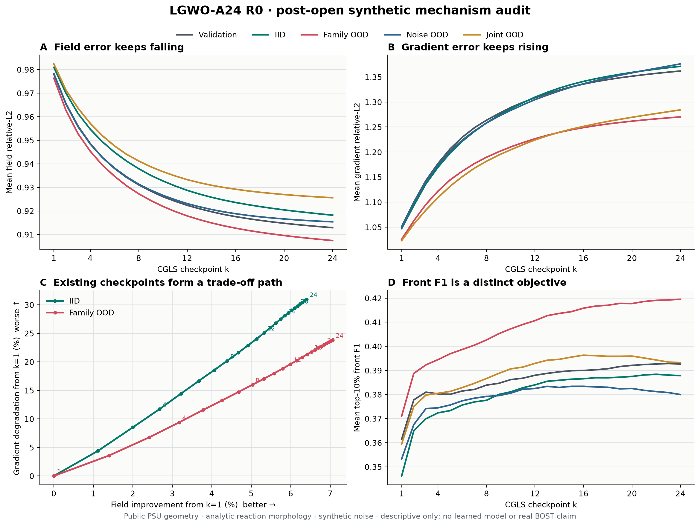

# LGWO-A24 R0：早停没有可学标签，下一步应改变正则化路径

> **R0 判决：** `VALID_NO_GO_STOPPING_HEADROOM_OR_DIVERSITY_ABSENT_POSTOPEN`
>
> **机制复算：** `VALID_POSTOPEN_SYNTHETIC_FIELD_GRADIENT_PATH_CONFLICT`
>
> **独立验证：** 原始 R0 `VALID`；机制分析 `VALID / 1098 checks`
>
> **突破监测：** **没有算法突破；有一条明确关闭的路线和一条更尖锐的机制问题。**
>
> **证据范围：** 公开 PSU 九视角射线几何、确定性解析反应场、合成噪声、所有分区已打开的 post-open 描述性实验。
> 不包含真实 PSU/OERF 测量值、真实三维体真值、未见装置、NeRIF/TDBOST 对比或论文级泛化证据。

---

## 1. 先说结论

PSU-C1 提示“正则化/半收敛可能比第一方向更重要”，所以 R0 保存了每个 case 的完整 `k=1...24` CGLS 轨迹，
先问：**不同样本是否有不同的最佳停止步，并且这种差异是否足够大，值得训练一个 observable-only 早停策略？**

答案是否定的：

- validation 的平均 field relative-L2 最优点是 `k=24`；
- test-IID 的 24/24 个 case，truth-field oracle 全部选择 `k=24`；
- family-OOD 的 24/24 个 case，同样全部选择 `k=24`；
- 因此 truth-field oracle 相对固定 `k=24` 的收益为 `0%`，可学标签只有一个常数；
- held-out-B oracle 虽能偶尔提前一点，却让主分区的 field mean gain 为负；
- noise discrepancy 在高噪声分区产生了多样的 `k`，但 field 和 held-out-B 都比 `k=24` 更差。

所以现在不应训练“输入一个轨迹，预测停止步”的网络。它最多学会一直输出 24，或者学到一个会伤害场误差的噪声规则。

但完整轨迹揭示了另一件更值得研究的事：**field relative-L2 一路改善，gradient relative-L2 却一路恶化。**
在两个主分区上，24 个平均 checkpoint 全部位于 field/gradient Pareto 轨迹上。只从现有 checkpoint 中挑一个，
不能同时解决两者；下一候选必须改变迭代路径或正则化器。

---

## 2. R0 到底测了什么

每个 case 从零场出发，运行 24 步 fully reorthogonalized CGLS，保存每一步的：

- field relative-L2；
- gradient relative-L2；
- top-10% front F1；
- active measured/clean weighted residual；
- held-out-B clean residual；
- expected sensor-noise norm 和 discrepancy ratio；
- 方向正交性、breakdown、投影一致性、算子调用和张量 hash。

数据矩形：

| 项目 | 数量 |
|---|---:|
| validation cases | 24 |
| evaluation cases | 144 |
| 总 trajectory cases | 168 |
| checkpoints / case | 24 |
| trajectory rows | 4,032 |
| selector rows | 1,152 |
| aggregate cells | 48 |
| breakdown rows | 0 |

算法成本是每例严格 `24F/24A^T`；24 个 checkpoint 的批量 evaluator 另记 `1` 次 API forward、
`24` 次 case-equivalent forward。生成所有 clean projections 另用了 `14` 次批量 API forward、
`168` 次 case-equivalent forward。算法总 wall time 为 `16.284 s`，平均 `0.0969 s/case`；完整程序总 wall time
为 `35.285 s`，运行于 Mac 的 MPS。它们是当前 toy 尺度的审计成本，不代表真实 OERF 速度。

---

## 3. 八种停止选择器

| 选择器 | 使用的信息 | 部署资格 | 在 R0 中的用途 |
|---|---|---|---|
| fixed `k=24` | 常数 | 可以 | 主参考 |
| historical `k=4` | 常数 | 可以 | 旧短预算控制 |
| validation-global `k` | validation truth | 冻结后可部署 | validation 选出 `k=24` |
| active measured minimum | active residual | 可以 | active residual 会偏向末步 |
| sensor-noise discrepancy | 合成 sigma + active residual | 合同内可算，但未校准真实模型偏差 | 检查噪声信号 |
| held-out-B clean oracle | 干净 B 真值 | **不可部署** | 独立视角 ceiling |
| truth-gradient oracle | 三维 truth gradient | **不可部署** | 梯度 ceiling |
| truth-field oracle | 三维 truth | **不可部署** | 停止 headroom ceiling |

oracle 只用于判断“这个自由度最多有多少空间”，不是可用算法。

---

## 4. 主判决：field oracle 没有停止 headroom

| split / selector | mean selected `k` | unique `k` | IQR | field gain vs `k=24` | held-out-B ratio vs `k=24` |
|---|---:|---:|---:|---:|---:|
| IID truth-field oracle | 24.00 | 1 | 0 | 0.0000% | evaluator ceiling |
| family-OOD truth-field oracle | 24.00 | 1 | 0 | 0.0000% | evaluator ceiling |
| IID discrepancy | 23.75 | 2 | 0 | -0.0097% | 1.0007 |
| family-OOD discrepancy | 23.88 | 2 | 0 | -0.0049% | 1.0003 |
| noise-OOD discrepancy | 16.33 | 10 | 4.00 | -0.3534% | 1.0146 |
| joint-OOD discrepancy | 16.75 | 9 | 2.25 | -0.3250% | 1.0128 |

预注册要求 truth-field oracle 在每个主分区至少有 5% mean gain、bootstrap 下界非负、至少 3 个不同 checkpoint、
IQR 至少 2 且无明显 harm。两个主分区只通过了平凡的 nonnegative/no-harm 项；mean gain、diversity 和 IQR 全失败。
因此 `R1 observable screen authorized = false`，`neural model authorized = false`。

更重要的是：noise/joint-OOD 的 discrepancy 虽然出现标签多样性，却同时让 field 和 B proxy 变差。
**标签多样不等于标签有用。**

---

## 5. 新的机制证据：field 与 gradient 走向相反



独立的 post-open 分析没有重跑 solver，只读取封存 CSV 并复算每条轨迹：

| split | field 最优 `k` | gradient 最优 `k` | field `k1→k24` | gradient `k1→k24` | front F1 `k1→k24` | front 平均最优 `k` |
|---|---:|---:|---:|---:|---:|---:|
| IID | 24 | 1 | **+6.405%** | **恶化 30.961%** | +14.844% | 22 |
| family-OOD | 24 | 1 | **+7.065%** | **恶化 23.803%** | +13.822% | 24 |
| noise-OOD | 24 | 1 | +6.407% | 恶化 31.158% | +9.775% | 16 |
| geometry-OOD | 24 | 1 | +5.329% | 恶化 27.205% | +8.864% | 17 |
| joint-OOD | 24 | 1 | +5.787% | 恶化 25.541% | +10.340% | 16 |
| exact-operator control | 24 | 1 | +6.546% | 恶化 28.440% | +10.639% | 24 |

IID 的 paired mean field improvement 95% bootstrap interval 为 `[5.930%, 6.896%]`，gradient degradation 为
`[29.345%, 32.642%]`；family-OOD 对应为 `[6.481%, 7.614%]` 和 `[20.557%, 26.917%]`。
这些区间是已打开数据上的描述性不确定性，不是 confirmatory 推断。

两个主分区的 24/24 条轨迹均满足：

- field error 每一步不增；
- gradient error 每一步不减；
- field 的逐 case oracle 全是 `k=24`；
- gradient 的逐 case oracle 全是 `k=1`；
- 24 个 mean checkpoints 在 field/gradient 二目标下都不被另一 checkpoint 同时支配。

这说明当前问题不是“找到正确的停止点”这么简单，而是 CGLS 路径本身在两个目标间做交换。

---

## 6. 为什么 front F1 与 gradient relative-L2 可以同时给出不同答案

这两个指标看起来都与边缘有关，但实际问的是不同问题：

| 指标 | 它怎样看误差 | 典型敏感性 |
|---|---|---|
| gradient relative-L2 | 比较整个体内梯度向量的幅值和方向 | 对全局高频噪声、振铃和幅值偏差敏感 |
| top-10% front F1 | 把最强的 10% 梯度位置二值化，再比较重叠 | 更关心强前沿位置，忽略许多幅值误差 |

因此，迭代可以把主要前沿的位置逐渐放对，使 F1 上升，同时在整个体内增加许多弱高频误差，使 gradient L2 变差。
不能把“front F1 提升”写成“梯度场整体更准”，也不能只用 gradient L2 否定前沿定位价值。

这正是以后论文必须把 field、gradient、front、active A、held-out B 和下游任务分开报告的原因。

---

## 7. 下一条算法路线：先改路径，再决定是否学习

### R2-A：固定显式正则化基线

先在完全相同的 `24F/24A^T` 预算中比较：

1. validation-fixed checkpoint CGLS；
2. discrepancy-stopped CGLS；
3. fixed Tikhonov / H1-Sobolev strength；
4. hybrid projected regularization；
5. TV/Huber 或 edge-superiorized Krylov；
6. 组内当前最强 voxel/NeRIF/TDBOST 近邻基线，只在任务与指标匹配时加入。

先画完整 regularization path，不先挑一个最好数字。若固定经典方法已经给出稳定 Pareto 改善，网络没有必要。

### R2-B：受保护的双目标路径

若固定方法仍出现稳定 field/gradient 冲突，再测试一个很窄的候选：

```text
CGLS / hybrid state
      ↓
bounded H1-TV-Sobolev perturbation
      ↓
active residual envelope + heldout-view proxy
      ↓
accept, damp, or deterministic fallback
```

它的目标不是在旧轨迹上预测 `k`，而是在不增加或严格记账少量算子调用的前提下，产生新的 Pareto checkpoint。
候选必须先证明自己至少支配旧路径的一部分；如果只是沿旧曲线换一个点，就没有算法价值。

### R2-C：只有出现 observable headroom 后才学习

学习模块只能读取部署可见量，例如 geometry、noise estimate、residual history、`A^T r` 范数、Ritz/Lanczos 标量和
预注册 heldout proxy；只输出固定滤波器基的凸权重或有界正则强度。先用 ridge/logistic 证明信号，再用小 MLP。

允许升级的最低条件：

- truth-only 新路径 oracle 在主分区有非平凡、稳定的 field/gradient Pareto headroom；
- observable linear rule 保留大部分 headroom；
- 同预算强经典基线无法解释收益；
- unseen geometry/session 尾部不恶化；
- 真实 callable、标定、目标指标与组内基线已由师兄确认。

---

## 8. 现在需要何远哲师兄决定的五件事

1. 组内真实目标更重视体场 relative-L2、密度梯度/前沿、reprojection、PIV 补偿还是时间连续性？请给优先级。
2. `24F/24A^T` 是否接近当前组内基线的现实预算，还是实际只能承受更少/更多调用？
3. 当前已有哪种 H1/TV/Tikhonov/hybrid/superiorization 基线？哪些代码可直接调用？
4. 主要误差究竟是噪声半收敛，还是 curved-ray、标定、support、遮挡或有限视角模型偏差？
5. 能否提供最小 callable、JVP/VJP、held-out camera 和匿名 geometry/data contract，用于把 synthetic 机制迁移到真实问题？

若主指标是 PIV 补偿或时间一致性，就不应由当前 field-L2 单独决定路径；必须把下游速度误差或 4D temporal metric
写进目标后重做 headroom audit。

---

## 9. 可复现入口

- [R0 冻结协议](lgwo_a24_r0_semiconvergence_protocol_2026-07-20.md)
- [R0 封存结果说明](../demo_t16_operator/results/lgwo_a24_r0_semiconvergence_v1/README.md)
- [R0 机器可读判决](../demo_t16_operator/results/lgwo_a24_r0_semiconvergence_v1/summary.json)
- [R0 独立验证](../demo_t16_operator/results/lgwo_a24_r0_semiconvergence_validation_v1/validation.json)
- [float32 provenance 修订](lgwo_a24_r0_validator_float32_amendment_2026-07-20.md)
- [float32 derived-check 修订](lgwo_a24_r0_validator_float32_derived_amendment_2026-07-20.md)
- [机制分析包](../demo_t16_operator/results/lgwo_a24_r0_regularization_conflict_postopen_v1/README.md)
- [机制分析机器可读结果](../demo_t16_operator/results/lgwo_a24_r0_regularization_conflict_postopen_v1/summary.json)
- [机制分析独立验证](../demo_t16_operator/results/lgwo_a24_r0_regularization_conflict_validation_v1/validation.json)
- [分析脚本](../site_tools/analyze_lgwo_a24_r0_regularization_conflict.py)
- [独立验证脚本](../site_tools/validate_lgwo_a24_r0_regularization_conflict.py)
- [正则化与停止文献地图](psu_c1_regularization_stopping_literature_map_2026-07-20.md)
- [给师兄的真实接口沟通单](n5_d5_advisor_first_contact_2026-07-19.md)

复现命令：

```bash
.venv/bin/python site_tools/analyze_lgwo_a24_r0_regularization_conflict.py \
  --input demo_t16_operator/results/lgwo_a24_r0_semiconvergence_v1 \
  --output demo_t16_operator/results/lgwo_a24_r0_regularization_conflict_postopen_v1

.venv/bin/python site_tools/validate_lgwo_a24_r0_regularization_conflict.py \
  --source demo_t16_operator/results/lgwo_a24_r0_semiconvergence_v1 \
  --analysis demo_t16_operator/results/lgwo_a24_r0_regularization_conflict_postopen_v1 \
  --output demo_t16_operator/results/lgwo_a24_r0_regularization_conflict_validation_v1
```

---

## 10. 最终允许写进汇报的措辞

> 在公开 PSU 几何、解析反应场和合成噪声的已打开 24 步 CGLS 轨迹上，truth-field oracle 在 IID 与
> family-OOD 的所有样本均选择末步，因此当前轨迹不支持训练 instance-specific early-stopping policy。
> Post-open 复算同时显示 field relative-L2 随迭代改善，而 gradient relative-L2 在全部主分区样本上持续恶化，
> 表明下一实验应比较改变迭代路径的显式正则化与双目标 safeguard，而不是在现有轨迹上学习停止点。

禁止写成：

- “发现了新的重建算法”；
- “已经改进 NeRIF/TDBOST/DeepONet/FNO”；
- “在真实 BOST 上有效”；
- “能够泛化到未见装置”；
- “取得突破或论文成功”。

**当前突破标签：NO。当前最有价值的成果是及时证伪早停方向，并把下一问题收缩为可测的正则化路径冲突。**
