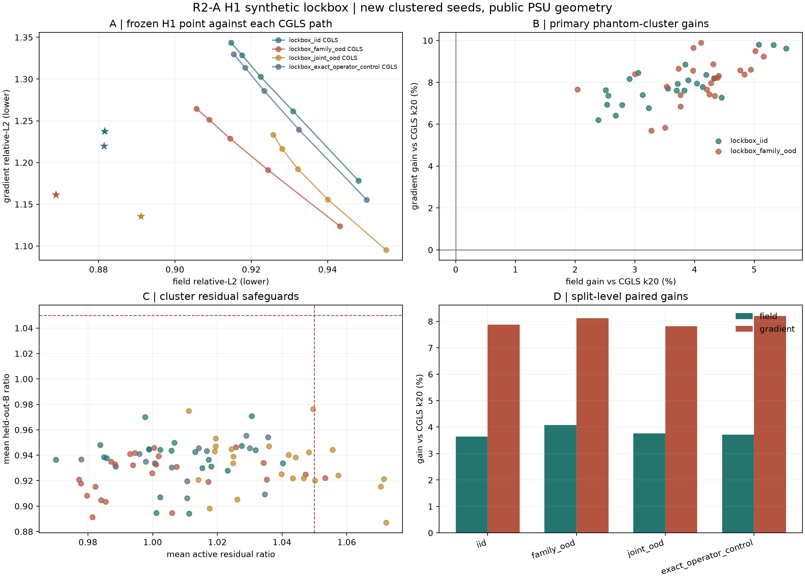

# R2-A H1 合成锁箱结果：经典正则化终于造出了新 Pareto 路径

> 一句话判决：在预注册的公开 PSU 几何+解析反应场合成锁箱中，固定 H1 候选在同一 `20F/20Aᵀ` 求解预算下，同时降低了 field 和 gradient 误差，并在 IID、family-OOD、joint-OOD 及无失配对照中通过尾部门。这是值得保留的经典基线证据，但不是新算法、真实 BOST 或论文成功。

## 1. 这一轮在问什么

R0 已经看到无正则 CGLS 的一条明显冲突：随迭代增加，体场 relative-L2 下降，但全局梯度 relative-L2 上升。因此 R2-A 的问题不是“网络能不能猜到更好的停止步”，而是：

> 在同样的物理算子调用预算下，固定的经典 H1 路径能否跳出旧 CGLS 的 field-gradient 交换曲线？

这是神经算子之前必须过的门。如果经典方法已经解决问题，就不应把“更大的网络”当成创新。

## 2. 首次打开前锁了什么

- 候选：`classic H1`, `lambda_h1 = 1e-3`, `lambda_l2 = 0`, `k = 20`。
- 对照：同预算 fully reorthogonalized CGLS，保存 `k=4,8,12,16,20` 五个 checkpoint。
- 求解成本：每条候选和对照路径各 `20F/20Aᵀ`。数据生成和 evaluator 的 forward 成本单独记账，不混入求解器宣称。
- 规模：336 cases、672 solver paths、3,360 raw checkpoint rows、84 geometry/morphology clusters。
- 主分区：`lockbox_iid` 和 `lockbox_family_ood`，各 24 clusters × 4 replicates。
- 次级应力：`lockbox_joint_ood` 24 × 4，同时减少视角、提高噪声并改换形态。
- 无失配对照：`lockbox_exact_operator_control` 12 × 4，使用更低 qmc8 渲染，与主实验不配对。
- 统计：两个主终点共享同一个 cluster-resampled mask，进行 50,000 次 studentized max-T bootstrap，同时控制 field 和 gradient 下界。
- 尾部门：逐 case/逐 cluster 最差收益、harm rate、active residual ratio、held-out-B ratio、与全部 CGLS checkpoint 的 Pareto 关系。

正式配置 SHA256：

```text
361c9233a454a23d81464690f01c61cfd71503361d2b72d4e67e8963e76d0678
```

正式源码 commit：

```text
ba686bb7ec24ad8b897f67df9688320dac350d19
```

## 3. 主结果

| 分区 | 平均 field gain | 平均 gradient gain | 最差 case field / gradient | active residual 平均 / 最差 | held-out B 平均 / 最差 |
|---|---:|---:|---:|---:|---:|
| IID | +3.6412% | +7.8708% | +1.3181% / +5.0631% | 1.0065 / 1.0886 | 0.9368 / 0.9851 |
| family-OOD | +4.0791% | +8.1137% | +1.8017% / +4.6598% | 1.0023 / 1.0898 | 0.9243 / 0.9813 |
| joint-OOD | +3.7626% | +7.8189% | +1.5587% / +2.5232% | 1.0387 / 1.1380 | 0.9327 / 0.9871 |
| exact-operator control | +3.7152% | +8.2085% | +1.7050% / +5.6476% | 1.0133 / 1.0606 | 0.9352 / 0.9732 |

两个主分区的 simultaneous 95% lower bounds 也为正：

- IID：field `+3.1907%`，gradient `+7.3904%`。
- family-OOD：field `+3.7298%`，gradient `+7.5905%`。

其他重要现象：

- 四个分区的 field/gradient `>2% harm` case rate 和 cluster rate 都为 0。
- 候选的 mean point 在四个分区都支配至少一个 CGLS checkpoint，且不被任一 CGLS mean checkpoint 支配。
- held-out-B ratio 在四个分区的平均和最差 case 都小于 1；这是合成独立视角一致性信号，不是真实相机泛化。
- joint-OOD 的 active residual 有代价，平均为 `1.0387`、最差为 `1.1380`；所以后续方法不能只追 field/gradient，必须保留 residual envelope。



## 4. 独立验证

独立 validator 不导入正式 runner 的统计与判门函数，重新检查：

- raw row 配对、case/cluster 聚合、主终点和共享 mask max-T；
- raw aggregate Pareto、最差 case/cluster、harm、active/held-out 门；
- 求解器、数据生成器和 evaluator 的成本账本；
- 源码 commit、配置和结果 checksums；
- 不可越界的 claim boundary。

结果：`VALID`，共 43,932 checks，`errors=[]`。篡改一行 decision CSV 的故障注入会返回 `INVALID`。

已封存的正式锁箱不应为了“看看是否还能赢”反复重跑。可以随时运行独立验证：

```bash
python site_tools/validate_lgwo_a24_r2a_h1_lockbox.py
```

## 5. 对研究路线的真实影响

### 现在可以说

1. 在这个新 seed、clustered、预注册的合成锁箱中，经典 H1 路径有稳定的双终点信号。
2. R0 的 field-gradient 冲突在当前合成设置中不是无法跳出的；改变正则路径比学习早停更有信息。
3. H1 必须成为下一轮 TV/Huber/hybrid/学习方法的必比强基线，不能再只与 CGLS 比。

### 现在不能说

- 不能说提出了新算法；`classic H1` 是经典方法。
- 不能说击败 DeepONet、FNO、NeRIF 或 TDBOST；本轮没有这些对照。
- 不能说证明真实 BOST、未见 rig 或 OERF 泛化；全部是公开几何+解析反应形态的 synthetic evidence。
- 不能说论文已成功或出现“突破”。

## 6. 下一轮的三级候选

### R2-B1：确定性 TV/Huber 强对照

先不训练网络。在同一 `20F/20Aᵀ` 物理预算下比较预先冻结的 TV、Huber-TV、H1 和 CGLS，使用相同 split、cluster bootstrap、最差 case、active/held-out 门。如果 TV/Huber 只改善 front F1 而伤害 field 或 residual，也要如实报告。

### R2-B2：H1–TV/Huber 混合路径

只在 B1 显示 H1 和 TV 各有不可互换的优势时，比较固定凸组合或 projected/hybrid 路径。最低通过条件是：不能只击败 CGLS，必须在主分区和尾部上击败已封存 H1，同时守住 active residual 和 held-out B。

### R2-C：有界学习控制器

只有当 B2 中存在“不同 case 的最优固定凸组合不同”，且 geometry/noise/residual/Ritz 等可观测量能在不读 truth 的情况下预测这种差异，才允许小模型输出：

- `[w_H1, w_TV]` 的有界凸权重；或
- 少量预定义正则强度中的选择；或
- `accept / fallback-to-H1` 的 fail-closed 决策。

这个学习器的对手是最强固定 H1/TV/hybrid，不是最弱的 CGLS。

## 7. 需要何远哲师兄确认的六件事

1. 真实代码中可调用的 `A/Aᵀ` 或 JVP/VJP 入口在哪里？
2. straight-ray 与 curved-ray residual 分别在哪一层形成？
3. 组内当前最强的经典正则基线是什么：Tikhonov、TV、Huber、Sobolev，还是其他？
4. 实验中最主要的失败是 field bias、前沿发虚、噪声/振铃、曲光线模型误差，还是 4D 计算成本？
5. 是否有可匿名的最小标定+少量投影+基线输出，用于先完成 real-interface smoke test？
6. 师兄认为论文主指标应是 field L2、gradient/front、reprojection、时间，还是对特定物理量的偏差？

可直接发送的问题单见 [第一次真实接口沟通单](n5_d5_advisor_first_contact_2026-07-19.md)。

## 8. 证据入口

- [正式配置](../demo_t16_operator/configs/lgwo_a24_r2a_h1_lockbox_v1.json)
- [预注册协议](lgwo_a24_r2a_h1_lockbox_protocol_2026-07-20.md)
- [正式 summary](../demo_t16_operator/results/lgwo_a24_r2a_h1_lockbox_v1/summary.json)
- [3,360 行 raw results](../demo_t16_operator/results/lgwo_a24_r2a_h1_lockbox_v1/raw_rows.csv)
- [336 行 paired decisions](../demo_t16_operator/results/lgwo_a24_r2a_h1_lockbox_v1/decision_rows.csv)
- [84 行 cluster results](../demo_t16_operator/results/lgwo_a24_r2a_h1_lockbox_v1/cluster_rows.csv)
- [独立 validation](../demo_t16_operator/results/lgwo_a24_r2a_h1_lockbox_validation_v1/validation.json)
- [独立 validator 源码](../site_tools/validate_lgwo_a24_r2a_h1_lockbox.py)

---

**突破监测：没有算法突破。** 有一个重要且可复算的证据里程碑：经典 H1 已成为下一阶段必须击败的强基线。真实 BOST 证据、新算法、神经模型、未见实验 rig 与论文成功仍为 0。
