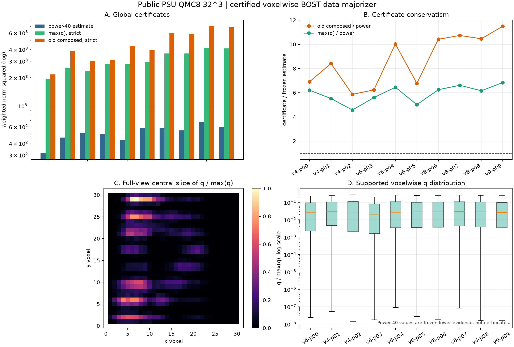

# R2-B0D：逐体素严格 majorizer 已通过数学门，但发现了稀疏覆盖风险

> 一句话判决：我们已经对加权 BOST 算子实现了不调用 `A/A^T` 的严格逐体素对角 majorizer，小矩阵 PSD 反查和公开 PSU `32^3` 空间诊断都已闭环。它把上轮全局 composed 上界再收紧 `1.11x-1.70x`，但也显示当前离散射线只给 `54.2%-68.6%` 的 support 体素正的数据质量。这是可验证的数值基础设施进展，不是重建、新算法或论文成功。

## 1. 我们真正证明了什么

令支撑约束后的加权物理算子为：

```text
B = W A = W M D P
```

定义非负比较矩阵：

```text
C = W |M| |D| P
```

因为 `|B| <= C` 逐元素成立，对每个测量行定义行质量：

```text
r = C 1
```

再把行质量反传回体素：

```text
q = C^T r = C^T(C 1)
```

对任意体场向量 `x`，每行用加权 Cauchy--Schwarz：

```text
(sum_j C_ij |x_j|)^2 <= r_i sum_j C_ij x_j^2
```

对行求和得到：

```text
||B x||_2^2 <= sum_j q_j x_j^2
```

因此：

```text
diag(q) - B^T B  is positive semidefinite
||B||_2^2 <= max(q) <= ||C||_1 ||C||_infinity
```

最后一个不等式解释了为什么 `max(q)` 不会比上轮 composed 严格上界更松。它不是幂迭代估计，也不需要知道真值场。

## 2. 程序如何不展开巨型矩阵

新实现沿用 R2-B0 的 chunked physical factors：

1. 用 `|D|P1` 计算每个射线、每个探测分量的 `r_i`；
2. 用 `r_i` 加权 `W|M|` 的转置散射；
3. 用 `|D|^T` 反传回体素，最后再乘 support `P`；
4. 所有归约在 CPU float64 完成，MPS factors 先安全转 CPU；
5. 建立证书期间的物理调用账本为 `0F/0A^T`。

返回的 `q` 保留为 CPU float64 张量。后续 solver 只能在冻结证书后把它转到求解设备，不能在迭代中暗中改动。

## 3. 怎样排除“公式看起来对”

### 3.1 密集小矩阵反查

在 `5 x 6 x 7` 网格上逐基向量调用物理算子，显式展开加权矩阵 `B`，然后直接计算：

```text
lambda_min(diag(q) - B^T B)
```

测试要求最小特征值在浮点容差内非负，并额外抽取 16 个随机 `x` 重算二次型不等式。

### 3.2 实现一致性

- streaming 与 monolithic 算子的 `q` 一致；
- chunk 从 4 条射线改成 6 条后 `q` 不变；
- support 外 `q` 必须精确为零；
- 全零测量权重必须返回全零 `q`；
- 负权重、NaN 和错误形状 fail closed；
- MPS factors 路径返回 CPU float64 证书，且不调用物理映射。

本轮聚焦回归为 `29 passed`，新产物的独立 validator 从 NPZ 重算逐 case 最大值、分位数、support、hash、上游冻结 power 证据与 claim boundary，共 `333 checks, VALID`。

## 4. 公开 PSU `32^3` 结果

本轮使用和 R2-B0 完全相同的 10 个确定性缺失视角模式。上轮的 power-40 结果由 summary SHA256 锁定后复用，没有重跑 400F/400A^T。

| 指标 | 10 个 mask |
|---|---:|
| `max(q)` / frozen power-40 estimate | `4.570-6.841x`，均值 `5.922x` |
| 上轮 composed bound / `max(q)` | `1.112-1.698x`，均值 `1.461x` |
| support 内 `q>0` 体素比例 | `54.2%-68.6%`，均值 `61.96%` |
| 每个 mask 的 `q` p95 / p05 | `4,186-11,296x` |
| 10 个 mask 累计 support 内零 `q` | `102,715` |
| 证书物理调用 | 全部 `0F/0A^T` |



`max(q)` 的全局证书仍比 power estimate 大约 4.6--6.8 倍，因此它严格但仍然保守。更重要的是 `q` 空间动态范围极大，表明标量步长会把强覆盖区和弱覆盖区强行绑在一起。这正是对角预条件可能有用的结构前提，但还不是性能证据。

## 5. 零 `q` 不能怎样解释

当前公开合同是 9 个视角、每视角 256 条射线、每条 QMC8，但 support 是整个 `30^3` 内部立方体。所以 `q_j=0` 只能表示：

> 在当前 straight-ray、当前离散采样、当前活动视角和权重下，数据项的非负比较算子没有耦合到该坐标。

它不能表示：

- 真实流场在这里为零；
- 曲光线或更密孔径采样也不能看到这里；
- 组内真实几何也有相同覆盖；
- 用一个任意 epsilon 替代零质量后，算法就获得了可识别信息。

对 data-only 检查，零 `q` 坐标应冻结或显式列入 null/coverage ledger。加入 TV/Huber 后，正则算子可以给这些坐标提供局部质量，但那是先验耦合，不是新的测量信息。

## 6. 下一步的合法算法路线

不直接把 `1/q_A` 接入完整 TV solver。先对 forward-Neumann 正则梯度构造同类证书：

```text
q_G = |G P|^T (|G P| 1)
```

对固定 dual steps `sigma_A` 和 `sigma_G`，组合：

```text
q_total = sigma_A q_A + sigma_G q_G
tau_j = eta / q_total_j,   0 < eta < 1
```

然后在小矩阵上检查：

```text
|| Sigma^(1/2) K T^(1/2) ||_2^2 < 1
K = [W A; G P]
```

严格执行顺序：

1. **R2-B0E**：证明 `q_G` 和 `q_total` ，密集反查 Schur/PSD；
2. **R2-B1a**：data-only 只在 `q_A>0` 坐标做轨迹健康检查，与 scalar PDHG 同 `20F/20A^T`；
3. **R2-B1b**：接入 `q_total` 的 TV/Huber，保持每迭代 `1F/1A^T`；
4. **R2-B1c**：同预算比 scalar PDHG、diagonal PDHG、CGLS 和冻结 H1；
5. 只有 field、gradient/front、active/held-out residual、最差 case 和 harm 同时过门，才能说有算法进展；
6. 只有固定组合的逐 case 最优路径真的变化，才允许小模型学有界 metric/hybrid 参数。

## 7. 这一步离论文创新还有多远

当前可以写进 methods 备忘录的是：

- BOST geometry-induced 非负比较算子；
- 流式、无 `A/A^T` 调用的逐体素严格 majorizer；
- 对每个缺失视角 mask 显式暴露数据覆盖零质量；
- 将来与 TV/Huber 局部质量组合的可证明步长合同。

当前不能写的是：

- 比 scalar PDHG、H1、DeepONet、FNO 或 NeRIF 更好；
- 提高了三维重建、前沿或真实 BOST 精度；
- 对未见 rig/session 泛化；
- 已构成可发表新算法。

可发表的潜在贡献必须来自后续同时成立的三件事：**证书正确、同预算重建确实改善、改善在真实或至少独立 rig 上不崩溃**。

## 8. 复现入口

```bash
.venv/bin/python -m pytest -q \
  demo_t16_operator/test_psu_b0_reconstruction_interface.py \
  demo_t16_operator/test_psu_b0_streaming_operator.py \
  site_tools/test_run_lgwo_a24_r2b_norm_bound_diagnostic.py \
  site_tools/test_run_lgwo_a24_r2b_diagonal_majorizer_diagnostic.py

.venv/bin/python site_tools/run_lgwo_a24_r2b_diagonal_majorizer_diagnostic.py
.venv/bin/python site_tools/validate_lgwo_a24_r2b_diagonal_majorizer_diagnostic.py
```

主机器结果在 `demo_t16_operator/results/lgwo_a24_r2b_diagonal_majorizer_v1/`。其中 `voxel_diagonals.npz` 保留 10 个完整 `q` 场与 support，用于独立重算；不包含受限论文、VPN 内容、凭据、组内数据或真实重建体。
