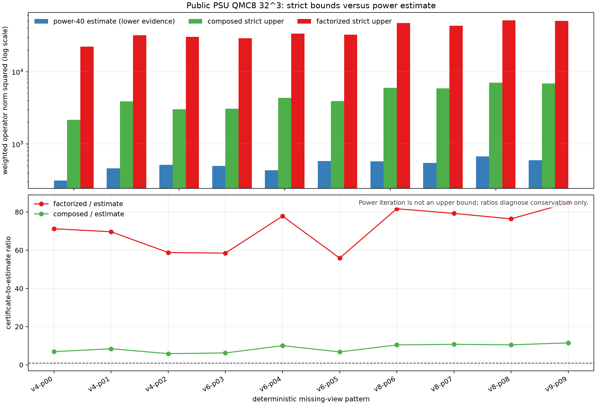

# R2-B0：先给 TV/Huber 一把不会越界的尺

> 一句话判决：在公开 PSU 九视角、QMC8、`32^3` 物理算子上，直接组合的严格谱范数上界把旧分解上界的保守度降低了 `7.30x-10.31x`，10 个缺失视角模式全部成立，且建立证书不调用 `A/A^T`。这是阶段性基础设施突破，不是 TV/Huber 重建成功、算法创新或论文结果。

## 1. 为什么这一步必须先做

PDHG、TV 和 Huber 都要选择步长。步长太大，迭代可能发散；步长太小，固定 20 次物理算子预算内几乎停在零场。旧 scalar-PDHG 的公开负结果已经说明，随意继续扫正则权重并不能解决 block conditioning。

要诚实比较 H1、TV/Huber 和后续混合路径，首先要有一个对每个相机 mask 和噪声权重都成立的 `||WA||_2^2` 上界。这里的 `A` 是物理 BOST 投影算子，不是神经网络；`W` 是由活动相机和噪声尺度得到的测量权重。

## 2. 新证书在算什么

把支持约束后的物理算子写成：

```text
W A = W M D P
```

- `P`：零外边界 support；
- `D`：物理算子使用的三维一侧/中心有限差分；
- `M`：三线性插值、相机方向投影、沿光线积分和系统尺度；
- `W`：活动视角与噪声白化权重。

旧证书把两段分开：

```text
||WA||_2^2 <= ||WM||_1 ||WM||_infinity ||D||_2^2
```

它严格，但丢掉了 `M`、`D` 和 support 的局部结构。新证书构造非负比较矩阵：

```text
C = W |M| |D| P
```

因为 `|WMDP| <= C` 逐元素成立，所以：

```text
||WA||_2^2 <= ||C||_1 ||C||_infinity
```

程序不展开巨型稠密矩阵。它逐 chunk 传播 `|D|P1` 得到行和，再传播 `|M|^T W1` 和 `|D|^T` 得到列和；所有归约都在 CPU float64 完成，兼容 MPS 输入，并且不增加物理 forward/adjoint 账本。

## 3. 怎样验证没有“上界写反”

### 小算子精确 SVD

单元测试在 `5 x 6 x 7` 网格上显式展开完整加权矩阵，用 SVD 计算真实谱范数平方。流式算子与 H1 使用的单块算子必须返回同一个上界；不同 chunk 切法也必须相同。负权重、NaN、错误形状必须 fail closed。

### 公开 PSU 几何诊断

- 几何：公开 PSU 九视角 support geometry；
- 算子：nominal QMC8 straight-ray voxel-gradient BOST；
- 网格：`32 x 32 x 32`；
- mask：10 个固定模式，覆盖 4、6、8、9 个活动视角；
- 权重：冻结 PSU view-noise factors 的 RMS-normalized `mask/sigma`；
- 参照：每个 mask 做 40 步幂迭代。它只是谱尺度下界证据，不是严格上界；
- 成本：严格证书 `0F/0A^T`，幂迭代单独支付 `40F/40A^T`。

## 4. 结果

| 指标 | 10 个 mask 的结果 |
|---|---:|
| 新 composed bound / power-40 estimate | `5.867-11.499x`，均值 `8.734x` |
| 旧 factorized bound / power-40 estimate | `55.859-84.757x`，均值 `71.382x` |
| 旧上界 / 新上界 | `7.301-10.311x`，均值 `8.388x` |
| 新上界被选择 | `10/10` |
| 严格证书物理调用 | `0F/0A^T` |
| 独立算术与边界复核 | `155 checks, VALID` |



蓝柱是 power-40 estimate，只用于判断上界有多保守；绿色和红色才是严格上界。绿色仍比蓝色大约 6 到 11 倍，因此它已经能保证安全，却未必能让标量 PDHG 在 20 步内足够快。

## 5. 这算不算突破

**阶段性基础设施突破：是。** 我们把一个可证明但过松的证书，在 10 个真实公开几何 mask 上稳定收紧约一个数量级，并补齐了 CPU/MPS、流式/单块、SVD、调用账本和公开结果边界。

**算法、重建、真实实验或论文突破：否。** 本轮没有使用三维场真值，没有运行 TV/Huber 重建，没有比较 field/H1/front/held-out 指标，也没有组内真实数据。JSON 中 `breakthrough=false`、`new_algorithm=false` 和 `reconstruction_success=false` 必须保持。

## 6. 下一条最有价值的算法路线

不要直接用新标量上界扫几百组 alpha。更有希望的是从同一个比较矩阵构造逐体素对角 majorizer。令 `r_i = sum_j C_ij`，再令：

```text
q_j = sum_i C_ij r_i
```

由加权 Cauchy 不等式可得：

```text
||WAx||_2^2 <= sum_j q_j x_j^2
```

这给出一个可证明的空间非均匀数据项 majorizer。下一轮应先完成：

1. 在小矩阵上验证 `diag(q) - A^T A` 半正定；
2. 在公开 `32^3` 几何上报告 `q` 的空间分布、动态范围和零支持行为；
3. 把它接入 diagonal/block PDHG，并保持每迭代 `1F/1A^T`；
4. 先做 data-only 收敛对照，再加入 TV/Huber；
5. 只有同 `20F/20A^T` 下击败封存 H1，才进入 H1-to-Huber warm hybrid；
6. 只有 fixed hybrid 的逐 case 最优路径确实变化，才允许学习一个有界选择器。

这条路线的潜在创新不是“又写一个 FNO”，而是 **BOST 几何诱导、可证明安全的对角 majorization，加上 H1/TV 路径选择**。它仍只是候选思想，必须由重建指标和真实接口决定是否成立。

## 7. 当前外部阻塞

公开几何可以继续做算法机制验证，但论文主张仍需要何远哲师兄确认：真实 callable `A/A^T`、straight/curved residual 层级、JVP/VJP、标定、主要失败场景、组内强基线、训练/测试 split 和最终指标。沟通入口仍是 [第一次真实接口问题单](n5_d5_advisor_first_contact_2026-07-19.md)。

## 8. 复现入口

```bash
.venv/bin/python -m pytest -q \
  demo_t16_operator/test_psu_b0_streaming_operator.py \
  site_tools/test_run_lgwo_a24_r2b_norm_bound_diagnostic.py

.venv/bin/python site_tools/run_lgwo_a24_r2b_norm_bound_diagnostic.py
.venv/bin/python site_tools/validate_lgwo_a24_r2b_norm_bound_diagnostic.py
```

机器结果、图、验证报告、runner 与 validator 都由聚焦主页直接链接。受限论文、VPN 内容、凭据、组内数据和私有 cache 不进入发布包。
