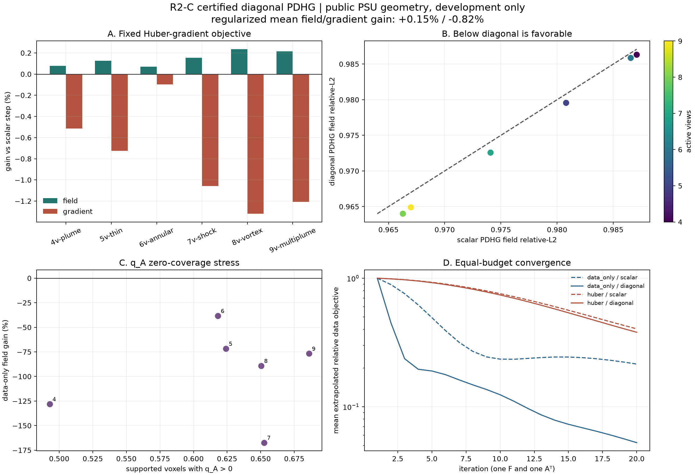
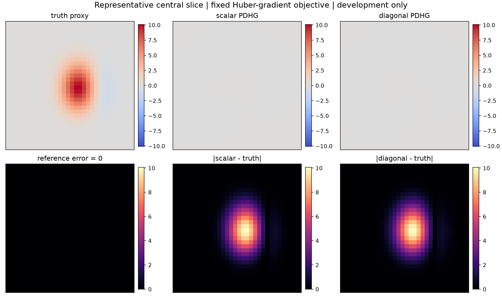

# R2-C：完整对角 PDHG 首轮 NO-GO，以及下一条可证明安全的插值路线

> 一句话判决：`q_G`、`q_total`、组合 Schur 上界和 `1F/1A^T` 对角 PDHG 已经实现并通过显式矩阵与 MPS 检查；但在 6 个公开 PSU 几何开发 case、固定 20 次预算上，完整对角度量只把 field relative-L2 平均改善 `0.1469%`，却把 gradient relative-L2 平均恶化 `0.8203%`，所以预先写好的开发门返回 **NO-GO**。这是一个可信的算法候选失败，不是突破。

## 1. 这次终于跑了什么

上一阶段只有数据项证书：

```text
B = W A
B^T B <= diag(q_A)
```

但公开 PSU 当前离散合同中，support 内只有约一半到三分之二体素有正 `q_A`。本轮给 forward-Neumann 正则梯度 `G` 构造：

```text
C_G = |G| P
q_G = C_G^T(C_G 1)
(G P)^T(G P) <= diag(q_G)
```

对固定 dual steps `sigma_A, sigma_G`，组合质量为：

```text
q_total = sigma_A q_A + sigma_G q_G
tau_j = eta / q_total_j,  0 < eta < 1
```

于是对堆叠算子 `K=[WA; GP]`：

```text
K^T Sigma K <= diag(q_total)
||Sigma^(1/2) K T^(1/2)||_2^2 <= eta < 1
```

这条合同不是口头推导。测试把 PSU 小算子和正则梯度显式展开成矩阵，直接检查组合 Schur 矩阵最小特征值，并计算归一化堆叠算子的真实谱范数；同时验证 CPU float64 证书、内容摘要、防原地篡改、零质量冻结、非法输入 fail-closed 和 Apple MPS 求解。新增与相关聚焦回归为 `57 passed`。

## 2. 开发实验怎样避免偷换问题

配置在首次运行前提交并冻结。矩形只有 6 个 case，作用是机制证伪，不是统计泛化：

- 公共 PSU support geometry，QMC8，`32^3`；
- 解析反应场 proxy：plume、thin front、annular kernel、oblique shock、vortex pair、multi-plume；
- 4、5、6、7、8、9 个活动视角，各有固定 mask、field seed、noise seed；
- 两个固定目标：data-only 与 `lambda=1e-3` Huber-gradient；
- scalar 与 diagonal 使用相同 `sigma_A`、`sigma_G`、目标函数、数据和 `20F/20A^T`；
- 每条路径额外记 1 次 evaluator forward，不混进求解预算；
- 未使用 H1 锁箱 case，也没有改动 H1 冻结证据。

总计运行 24 条路径、`480F/480A^T`，Apple MPS 端到端约 `3.39 s`。证书和组合 metric 建立均为 `0F/0A^T`。

## 3. 结果：为什么必须判 NO-GO

| 固定目标 | mean field gain | worst field gain | mean gradient gain | worst gradient gain | mean residual ratio | 判决 |
|---|---:|---:|---:|---:|---:|---|
| data-only | `-95.20%` | `-167.37%` | `-338.59%` | `-553.07%` | `0.472` | 明确 NO-GO |
| Huber-gradient `1e-3` | `+0.1469%` | `+0.0702%` | `-0.8203%` | `-1.3192%` | `0.969` | gradient 门失败 |



data-only 分支尤其有解释力。`q_A>0` 只覆盖 support 的 `49.3%-68.6%`，完整 `1/q_A` 度量在极小正质量位置产生非常大的局部步，同时把零质量坐标冻结。它更快压低测量残差，却在 20 次预算内严重破坏 field 和 gradient。这里的“NO-GO”是**固定预算下的重建质量 NO-GO**，不是说数学迭代必然发散。

加入 `q_G` 后，6/6 case 的所有 support 坐标都有正总质量，极大步长也被限制。结果稳定得多：所有 case 的 field 都有 `0.07%-0.24%` 小改善，残差也略低；但所有 case 的 gradient 都变差。这种方向一致的尾部伤害不能用均值遮住。

代表性中心切片也很诚实：20 次 PDHG 仍接近零场，scalar 和 diagonal 肉眼差别很小。这说明当前 fixed Huber-PDHG 本身还不是能挑战冻结 H1 的强基线，不能拿 `0.15%` 当论文结果。



## 4. 独立复核做了什么

独立 validator 不调用 runner 的聚合函数，重新完成：

- 8 个原始产物的 SHA-256；
- 6 case x 2 objective x 2 metric 的完整矩形；
- 每条 `20F/20A^T + 1F evaluator` 调用账本；
- 从 NPZ 的 `q_A` 重新构造 `q_G` 和 `q_total`，逐 case 核对数组与 metric digest；
- 重新计算 field/gradient gain、残差比、均值、中位数和最差 case；
- 检查 24 条 20-step history、三份代表场与两张图非空；
- 确认所有 success、generalization、paper、breakthrough 标志仍为 false。

结果为 `376 checks, VALID_INDEPENDENT_R2C_DEVELOPMENT_NO_GO`。

## 5. 下一候选不是盲调 lambda：安全凸插值 metric

标量步太保守，完整对角步又对 gradient 太激进。两者之间可以构造一条仍有证明的路径。

令 scalar 证书在 support 上为：

```text
q_scalar = sigma_A L_A + sigma_G L_G
```

其中 `L_A`、`L_G` 分别是严格全局上界。已有：

```text
diag(q_scalar P) - K^T Sigma K >= 0
diag(q_diagonal) - K^T Sigma K >= 0
```

对单个全局参数 `beta in [0,1]`：

```text
q_beta = (1-beta) q_scalar P + beta q_diagonal
tau_beta,j = eta / q_beta,j
```

则：

```text
diag(q_beta) - K^T Sigma K
= (1-beta)[diag(q_scalar P)-K^T Sigma K]
  + beta[diag(q_diagonal)-K^T Sigma K]
>= 0
```

所以 `beta=0` 精确回到 scalar，`beta=1` 回到本轮完整 diagonal，中间点仍严格安全。data-only 时，只要 `beta<1`，scalar 部分还会给 `q_A=0` 坐标正质量，避免百万量级局部步和硬冻结。

一个重要限制：上述证明适用于**每个 case 一个全局 beta**。让网络逐体素输出 `beta_j` 后，通常不能把矩阵差写成两个 PSD 矩阵的标量凸组合，安全性不再自动成立。因此下一阶段只能先测固定全局 `beta`，以后最多让小模型从 geometry/noise/residual 预测一个有界 case-level beta，并保留 scalar fallback。

## 6. 下一步严格顺序

1. **R2-C-beta post-open diagnosis**：只在已打开的 6 case 上画 `beta={0,.25,.5,.75,1}` 的 field-gradient-residual 路径，判断是否存在连续 trade-off；不作为验证结论。
2. **冻结新种子小验证**：若中间 beta 同时改善 field 与 gradient，先冻结一个 beta，在全新 morphology/mask/noise 上测尾部与 harm。
3. **强基线门**：通过后仍要在相同数据和成本下比较 CGLS、冻结 H1、scalar PDHG、简单阻尼/线性插值；赢 scalar 不等于有论文价值。
4. **预算诊断**：分别报告 20、50、100 次 convergence，不用长预算成绩冒充 20 次等成本胜利。
5. **真实接口迁移**：向何远哲师兄确认真实 callable、曲/直光线 residual 层级、JVP/VJP、标定、真实 mask/ray coverage 与主指标；公开 PSU 的零覆盖比例不能外推到 OERF。
6. **学习器最后启动**：只有固定 beta 的逐 case 最优确有变化，并能由部署可见量预测，才允许两层小网络输出 `beta`；超出 calibration envelope 时回退 scalar/H1。

## 7. 当前证据等级

可以说：

- `q_G` 与组合 Schur 证书已实现并由显式小矩阵验证；
- 逐体素 PDHG 保持每轮 `1F/1A^T`；
- 在这个已打开的 6-case 开发集上，完整 diagonal metric 是 gradient NO-GO；
- 零覆盖会让 data-only 完整对角步成为很差的固定预算质量候选；
- 安全 scalar-diagonal 插值是下一条合理、可证明的算法路线。

不能说：

- 找到新算法或突破；
- diagonal PDHG 普遍失败；
- 比 H1、DeepONet、FNO、NeRIF 或 TDBOST 更好；
- 已完成真实 BOST 重建或未见 rig 泛化；
- 已有论文结果。

## 8. 复现入口

```bash
.venv/bin/pytest -q \
  demo_t16_operator/test_diagonal_pdhg_metric.py \
  demo_t16_operator/test_interface_baselines.py \
  demo_t16_operator/test_psu_b0_absolute_regularization_factor.py \
  demo_t16_operator/test_psu_b0_streaming_operator.py

.venv/bin/python site_tools/run_lgwo_a24_r2c_diagonal_pdhg_development.py
.venv/bin/python site_tools/validate_lgwo_a24_r2c_diagonal_pdhg_development.py
```
