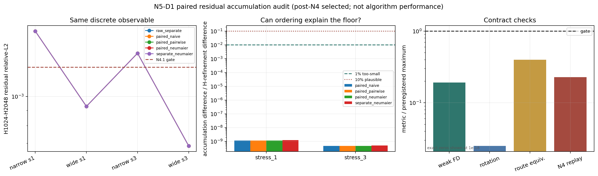
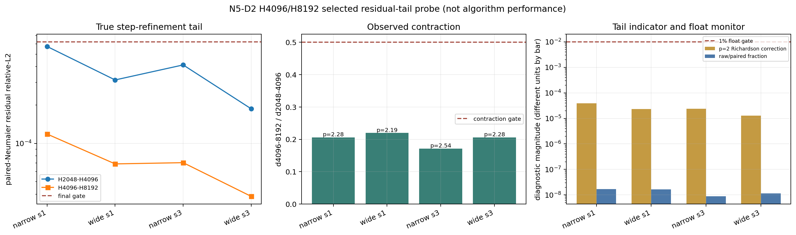

# N2-PVGR N5-D1/D2：小残差相消与 H8192 尾差审计

日期：2026-07-18

## 一句话结论

D1 排除了“浮点累加顺序导致 N4.1 两格失败”的假说；D2 表明同四个 post-selected synthetic
cells 在 H4096-H8192 已进入稳定的约二阶尾部。它清除了一个局部数值阻塞，但没有证明真实 BOST、
三维重建、神经算子或泛化成功。

## 为什么要分 D1 和 D2

N4.1 的两个失败格不是完整 detector output 发散，而是 curved-straight 的小残差相对误差略高于
`1.25e-3`。这里有两个不同解释：

1. 两个大积分最后相减时发生浮点 cancellation；
2. 积分步长还没进入真正的截断误差尾部。

如果不先区分机制，直接把 H 加大或训练网络，无法知道改善来自哪里。D1 只改变数学上等价的求和顺序；
D2 在 D1 排除求和解释后，才真正增加 H。两个协议都在正式 selected-cell 结果出现前提交并做一次性证明。

## D1：求和顺序不能解释 floor

D1 固定四格、H1024/H2048、256 条共同 rays 和五种累加：

- 两个积分普通求和后相减；
- matched integrand 先相减再普通求和；
- 先相减再 pairwise sum；
- 先相减再 Neumaier compensated sum；
- 两个积分分别 Neumaier 后相减。

中点求积是线性的，所以精确算术下五者表示同一离散 observable。D1 的门与结果如下：

| 合同检查 | 预注册门 | 实测最坏值 | 结果 |
|---|---:|---:|---|
| constant field 最大输出 | `0` | `0` | 通过 |
| 弱场二阶 finite-difference relative-L2 | `3e-2` | `5.750e-3` | 通过 |
| 90 度旋转 equivariance relative-L2 | `2e-10` | `5.008e-12` | 通过 |
| 与冻结 N4 route 等价 relative-L2 | `5e-12` | `1.999e-12` | 通过 |
| N4 adjacent metric 重放绝对差 | `1e-12` | `2.278e-13` | 通过 |

两个 N4.1 失败格上，四种非 raw 方法与 raw 的最大 L2 差，分别只占真实 H1024-H2048
refinement L2 差的：

- stress 1 narrow：`1.270e-9`；
- stress 3 narrow：`5.191e-10`。

预注册的“太小、不能解释”门是 `1e-2`。实测比这个门还低约七个数量级，因此机器判决为：

`D1_ACCUMULATION_ORDER_TOO_SMALL_TO_EXPLAIN_N4_FLOOR`

**讲人话：**不是电脑“加数的顺序不够聪明”。pairwise、补偿求和和先减后加都没有实质改变结果。

## D2：真正提高 H 后进入约二阶尾部

D2 精确复用 D1 四格和已冻结的 H2048 `paired_neumaier` 数组，只新增 H4096 与 H8192。
结果前固定四个逐格门：final adjacent `<=6.25e-4`、收缩比 `<=0.5`、H8192 raw/paired 差
不超过 final refinement 的 `1%`，以及 finite/domain/stencil/direction 全通过。

| cell | H2048-H4096 | H4096-H8192 | 收缩比 | 观测阶 p | 二阶 Richardson correction 指标 | 全门 |
|---|---:|---:|---:|---:|---:|---|
| narrow, stress 1 | `5.741e-4` | `1.183e-4` | `0.2060` | `2.279` | `3.942e-5` | 通过 |
| wide, stress 1 | `3.139e-4` | `6.901e-5` | `0.2198` | `2.185` | `2.300e-5` | 通过 |
| narrow, stress 3 | `4.116e-4` | `7.056e-5` | `0.1714` | `2.544` | `2.352e-5` | 通过 |
| wide, stress 3 | `1.865e-4` | `3.841e-5` | `0.2059` | `2.280` | `1.280e-5` | 通过 |

最坏 H8192 raw/paired 差只占 final refinement 的 `1.696e-8`。四格共记录
`528,482,304` 次逻辑标量场查询，本机 CPU 计算墙钟合计 `216.18 s`。独立 validator 重新读取
所有 `256x2` 数组、核对 SHA-256、复算指标、父 D1 manifest、查询账本与图像，结果为 valid。

机器判决：`D2_SELECTED_TAIL_RESOLVED_AT_H8192`

## 物理和数值上怎样理解

1. **D1 是排除机制。**它说明 N4.1 floor 不是 ordinary floating-point summation order。
2. **D2 是局部尾部证据。**四格收缩比约 `0.17-0.22`，观测阶约 `2.2-2.5`，与 midpoint
   quadrature 进入二阶区间相符。
3. **Richardson 只是指标。**`d/3` 是固定二阶假设下的 correction 指标，不是严格误差上界；一次
   观测到的 p 不能证明以后永远保持。
4. **仍是 post-selected synthetic evidence。**四格由 N4.1 失败触发，不是 fresh blind sample；
   D2 不能单独替代 population-level reconciliation。

## 现在能说与不能说

可以说：

- 这四个 synthetic cells 的小残差数值尾部在 H8192 已过预注册门；
- 浮点累加顺序相对真正的步长 refinement 可以忽略；
- 本机足以承担这一层 reference 审计，不需要租 GPU。

不能说：

- “我们开发的新算法已经优于 DeepONet/FNO/FFNO”；
- “H8192 就是真实实验真值”；
- “32 格已经 fresh 32/32”；
- “field JVP/VJP、三维重建、真实数据和泛化已经授权”；
- “Richardson 指标是严格误差界”。

## 下一步硬顺序

1. 组装 32 格 adaptive reference pack：N4.1 的 23 个 H1024、7 个 H2048，加 D2 的 2 个
   H8192 失败格；保存逐格 method、step、array hash 与来源提交。
2. 为同一 curved-ray tensor forward 预注册 tiny field JVP/VJP：dot test、多个 h 的中心有限差分、
   finite/domain/query 成本门。
3. 进入 6 个 support views + 2 个 held-out views 的最小三维重建闭环；先和强数值方法比较，不训练网络。
4. 向何远哲师兄索取 observable 定义、pixel/physical units、同 rig flow-off repeats、mask/confidence/
   covariance，把 synthetic 尾差换算到真实 noise units。
5. 只有 reference、field derivative、三维闭环与 noise-floor 都过，才训练小型 residual operator，
   再按同 A/A^T 调用、墙钟、参数量和 OOD split 比 DeepONet/FNO/FFNO。

## 复核入口

- D1 配置与结果：`demo_t16_operator/configs/n2_pvgr_n5_d1_paired_residual_preregistered_v1.json`、
  `demo_t16_operator/results/n2_pvgr_n5_d1_paired_residual_v1/`
- D2 配置与结果：`demo_t16_operator/configs/n2_pvgr_n5_d2_extreme_refinement_preregistered_v1.json`、
  `demo_t16_operator/results/n2_pvgr_n5_d2_extreme_refinement_v1/`
- D1 validator：`site_tools/validate_n2_pvgr_n5_d1_paired_residual.py`
- D2 validator：`site_tools/validate_n2_pvgr_n5_d2_extreme_refinement.py`

以上结果没有使用受限论文、私密材料或组内数据。
