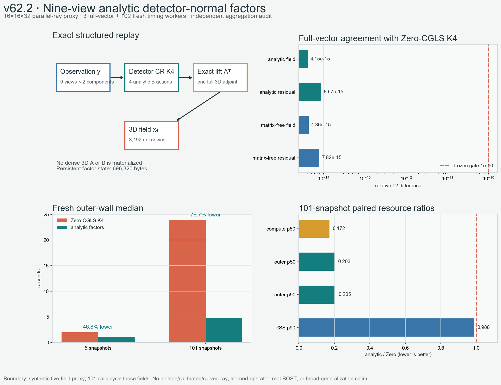

# v62.2：九视角解析因子的可扩展构造与 fresh 资源门

## 一句话结论

v61 只在 `8³` 小审计问题上证明九视角 detector-normal block 具有精确
Kronecker rank-one 结构。v62.2 已把这条结构直接构造成 `16×16×32` 的可运行
算法，全程不 materialize dense 三维 `A` 或 `B=A A^T`。

在 3 个全向量正确性进程和 102 个串行 fresh 计时进程中，解析因子法保持
zero-start CGLS K4 的完整场与 residual 到舍入误差，并在 101 次循环负载上把
fresh outer-wall 中位数从 `23.901 s` 降到 `4.850 s`：

```text
maximum field relative-L2 difference       4.149e-15
maximum residual relative-L2 difference    8.674e-15
101-call outer wall p50 ratio               0.202526
101-call outer wall p90 ratio               0.205030
101-call outer wall worst ratio             0.209606
101-call process-tree RSS p90 ratio          0.988063
101-call worker-self RSS p90 ratio           0.986844
```

这是一条可信的**九视角结构化数值核正结果**，但不是算子学习、针孔相机、曲折
光线、真实 BOST、广义泛化或论文成功：

```text
scalable_analytic_factor_construction=true
fresh_proxy_resource_gate=true
parallel_camera_transfer=true
pinhole_camera_transfer=false
calibrated_camera_transfer=false
curved_ray_transfer=false
operator_learning_result=false
real_bost=false
algorithm_breakthrough=false
paper_success=false
```



## 1. v62.2 真正解决了 v61 的哪两个缺口

v61 的 factors 来自小尺寸显式 `B` 的逐 block SVD。它证明结构存在，却没有证明
真实尺寸上能直接构造，更没有给出资源优势。

v62.2 直接从一维竖直和二维水平 primitives 生成每个 view/component pair 的
Kronecker factors：

```text
A_(theta,c) = Z_c ⊗ H_(theta,c)

B_((t,ct),(s,cs))
  = (Z_ct Z_cs^T) ⊗ (H_(t,ct) H_(s,cs)^T).
```

因此一次 `Bz` 只需要对 detector 张量做两个小矩阵作用，不需要：

- 显式形成 `A∈R^(9216×8192)`；
- 显式形成 `B∈R^(9216×9216)`；
- 在四次 detector-space 迭代中反复生成完整三维中间场。

正式尺寸与状态为：

| 项目 | 数值 |
| --- | ---: |
| 三维场 | `32×16×16` |
| unknowns | `8,192` |
| views | `9`，覆盖 `0°–170°` |
| observation / snapshot | `9,216` |
| primitive state | `606,208 bytes` |
| persistent factor state | `696,320 bytes` |
| 最大中间数组 | `165,888 elements` |
| primitive 构造 | `0.03536 s` |
| pairwise factor 构造 | `0.000724 s` |
| matrix-free control setup | `0.173795 s` |

这里的 `696,320 bytes` 是结构 factors 自身，不是完整 Python 进程内存；两种数字
不能混写。

## 2. 三条算法臂为什么公平

三条臂都从同一 observation 出发、运行四步，并输出同一三维场：

| 算法臂 | 每 snapshot 完整算子账 |
| --- | --- |
| Zero-CGLS K4 | `4A + 4A^T` |
| matrix-free detector CR K4 | `4A + 5A^T` |
| analytic-factor detector CR K4 | `4 analytic-B + 1A^T` |

matrix-free detector CR 是关键控制。它把递推搬到 detector space，却仍通过
`A(A^T·)` 计算 `B·`。如果它也很快，收益可能只是“换了递推变量”；如果只有
analytic factor 快，收益才来自九视角结构。

101 次负载的结果恰好支持后一种解释：

```text
matrix-free / Zero outer p50        1.053712
matrix-free / Zero compute p50      1.055804
analytic / Zero outer p50           0.202526
analytic / Zero compute p50         0.172307
```

matrix-free control 比 Zero 慢约 5.4%，解析因子法却快约 79.7% 的端到端中位
时间。速度来源不是 detector-space 这个名字，而是删除了昂贵的三维往返。

## 3. 完整向量精度，不再只比 norm

正式 correctness batch 为每条算法臂单独启动 fresh process，并保存 5 个完整
field 和 residual 数组。解析因子法相对 Zero-CGLS K4：

| 检查 | 最大 relative-L2 | 冻结门 | 结果 |
| --- | ---: | ---: | --- |
| 三维 field | `4.149e-15` | `1e-10` | PASS |
| observation residual | `8.674e-15` | `1e-10` | PASS |

matrix-free control 的最大 field/residual 差为
`4.364e-15 / 7.818e-15`，也通过。独立代数 validator 重新计算 `B` 作用、
K4 replay 和 adjoint，最大独立误差仍在 `8.808e-15` 内。

因此 v62.2 证明的是完整输出等价，不是两个向量碰巧拥有相同 norm。

## 4. fresh 资源实验

资源门使用两种 workload：

- `5`：五个不同 seeded proxy observations；
- `101`：按冻结顺序循环这五个 observation，模拟一条 PoolFire 长度的计算量。

每个 workload、每条算法臂做 17 次 fresh process，共：

```text
2 workloads × 3 arms × 17 repeats = 102 timing workers
```

三条臂在每个 randomized complete block 内相邻、顺序随机、全程串行，避免后台
并发污染。controller 记录 outer wall，并每 `5 ms` 采样 worker process tree
RSS；worker 自己还报告 high-water RSS。

### 5 次负载

| 指标 | analytic / Zero |
| --- | ---: |
| compute p50 | `0.173966` |
| outer p50 | `0.532681` |
| outer p90 | `0.537050` |
| outer worst | `0.545969` |
| process-tree RSS p90 | `0.971727` |
| worker-self RSS p90 | `0.971574` |

### 101 次负载

| 指标 | analytic / Zero |
| --- | ---: |
| compute p50 | `0.172307` |
| outer p50 | `0.202526` |
| outer p90 | `0.205030` |
| outer worst | `0.209606` |
| process-tree RSS p90 | `0.988063` |
| worker-self RSS p90 | `0.986844` |

**讲人话：**短任务里 Python 启动、读取和序列化仍占一半左右，所以整体只快
46.7%；处理 101 次后固定成本被摊薄，端到端典型时间下降 79.7%。RSS 没有恶化，
但只下降约 1%–3%，不能包装成显著内存突破。

## 5. 首轮为什么永久作废

v62.2 的第一轮也完成了 3 个 correctness worker 和 102 个 timing worker，但
controller 在检查区组无重叠时使用了长度不相等的 strict zip，导致在 controller
专有的 wall/RSS/monotonic 账本落盘前异常退出。

这轮没有 summary，也没有独立验证；外层计时只存在于已经丢失的 controller
内存中。项目没有根据 worker 文件补写结果，而是：

1. 写入永久 invalid marker；
2. 明确禁止复用这 102 个 worker 的任何资源数值；
3. 修复相邻区间检查并新增“正常日程先通过、重叠日程必须拒绝”的回归测试；
4. 绑定新的完整执行闭包；
5. 从头重新运行 3 + 102 个 fresh process。

本文所有资源数字只来自第二轮正式批次。

## 6. 独立验证覆盖了什么，没有覆盖什么

独立 validator 不导入正式 runner 或数值 core，重新读取 102 个 worker、3 个
完整向量 worker和 68 个配对表行，重算：

- 两种 workload 的逐臂统计；
- 配对 wall/RSS ratios；
- 完整 field/residual 误差；
- 所有资源门和最终判决；
- 区组相邻、随机完整性和时间不重叠；
- 结果校验和及父代代数 closure。

正式报告与独立重算的 batch、correctness、gate、CSV 最大差都为 `0`。

但必须保留两条边界：

1. 独立 validator 没有再运行第二套 102 次 timing experiment；它独立聚合和审计
   同一批原始进程回执。
2. resource ledger anchor 由 controller 传给 validator，并非外部认证时间戳或
   对抗性文件系统证明。

所以这是一条可信的本机可复现资源结果，不是恶意环境下的取证证明。

## 7. 为什么还不能叫“顶刊算法突破”

v62.2 的成立依赖：

- 九视角都是 parallel rays；
- 相机只绕竖直轴旋转；
- detector-v 轴共享；
- 规则 tensor grid 与冻结边界；
- 五个 seeded synthetic proxy fields；
- 101 次负载只是循环五个 observation，不是 101 个独立物理样本。

针孔透视、相机 elevation/roll、逐射线标定误差和未知场导致的曲折光线，都可能
破坏精确 Kronecker 等式。当前没有组内真实位移图、相机内外参、重复测量噪声或
认可的实验基线。

此外，data-space CG、projection-space normal operator、Kronecker/tensor
分解本身都有大量先验工作。不能声称“首次使用 data-space”“首次 Kronecker”
或“全球唯一”。当前可守住的新意候选只是：

> BOST 特定九视角平行几何的精确 detector-normal Kronecker 核心，配合严格的
> full-vector matched-output、fresh wall/RSS 资源账，并把学习只留给真实相机与
> 曲折光线造成的结构化残差。

## 8. 下一道科学门

下一步不再重复 parallel-ray 资源实验，也不直接训练大网络。最能改变论文判断的
实验是：

1. 在固定 `16×16×32` 场与九视角下加入针孔距离、elevation 和 roll；
2. 用显式或独立 matrix-free oracle 测量 `B` 相对 analytic core 的残差；
3. 报告每个 view/component block 的 Kronecker spectrum、作用误差和 K4 终点误差；
4. 判断误差能否被少量额外 Kronecker terms 或部署可见的相机参数稳定解释；
5. 只有该残差在不同 synthetic fields 和几何扰动上低秩、稳定、可观测，才训练
   最小 correction operator；
6. 最终仍需组内真实九视角 BOST 的相机标定、位移图和重复测量闭环。

这一步将直接决定论文是：

- “理想平行几何的快速精确数值核”；还是
- “精确物理核心 + 可学习相机/曲线失配修正”的更完整方法。

## 参考入口

- [NeRIF：九视角 BOST 与神经折射率场](https://arxiv.org/html/2409.14722v2)
- [UBOST：unified BOST framework](https://link.springer.com/article/10.1007/s00348-020-2912-1)
- [BOS review](https://link.springer.com/article/10.1007/s00348-015-1927-5)
- [Data-space conjugate gradients](https://academic.oup.com/gji/article/170/3/986/2043364)
- [Three-dimensional data-space conjugate gradients](https://academic.oup.com/gji/article/186/2/567/587531)
- [Exact Gram filtering in CT](https://aapm.onlinelibrary.wiley.com/doi/abs/10.1002/mp.15547)
