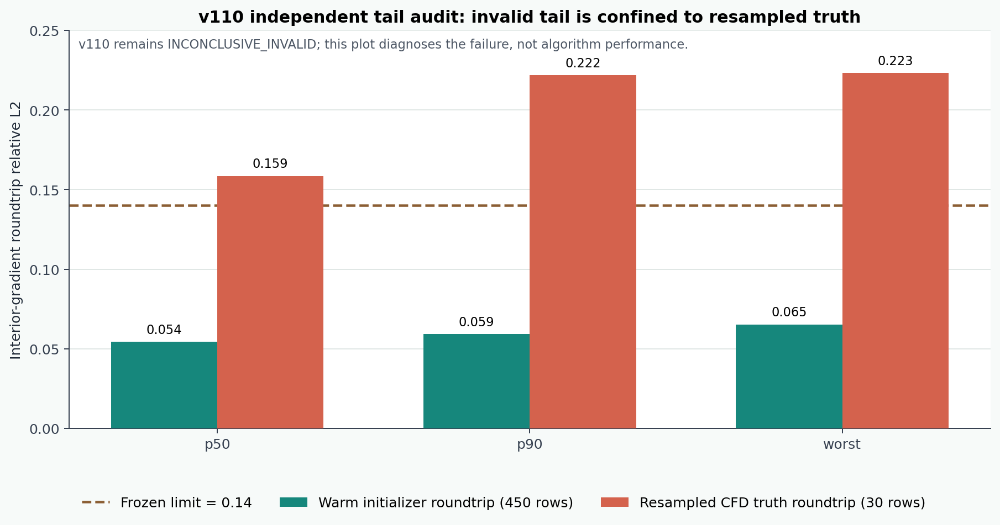

# v110 独立根因审计：失败尾部来自真值重复重采样，不来自 warm initializer

## 一句话结论

v110 的正式执行仍然是无效的：`INCONCLUSIVE_INVALID_COMPOSED_DIFFEOMORPHIC_EXECUTION_V110`。但是，另一条不导入正式尾部汇总代码的独立程序重算了全部 `480` 行，定位出内部梯度超限几乎全部来自**公开 CFD 真值在多次坐标搬运中的重复三线性重采样**，而不是 warm initializer 本身。

这是一项可信的失败归因，不是修复后的算法结果。

## 为什么必须做这次审计

v109 已经证明：固定物理宽度、支撑随场输运、亚粗网格平滑边界可以让连续坐标输运在四级嵌套网格上稳定收敛。v110 随后尝试把这套机制接到坐标条件 warm-start 评估里，却在内部梯度尾部门失败。

若不拆开真值和候选的坐标往返误差，可能会得出两种相反但都没有证据的结论：

1. 错怪 learned initializer，认为模型输出破坏了局部梯度；
2. 忽略无效执行，直接把其余漂亮指标写成成功。

因此这次只回答一个问题：冻结的 `0.14` 内部梯度上限究竟被哪类张量触发。

## 独立复算结果

| 分组 | 行数 | mean | p50 | p90-higher | worst | 是否低于 `0.14` |
|---|---:|---:|---:|---:|---:|---:|
| warm initializer 往返 | `450` | `0.04096` | `0.05422` | `0.05917` | **`0.06524`** | 是 |
| 重采样 CFD 真值往返 | `30` | `0.11714` | `0.15862` | `0.22183` | **`0.22335`** | 否 |

额外诊断：

- 最坏的 `20` 行全部来自真值；
- `xy` 形变 worst 最高只有 `0.02239`；
- 涉及长轴的 `yz / zx` 形变 worst 分别达到 `0.22307 / 0.22335`；
- 正式记录与独立重算的最大绝对差为 `2.43e-16`；
- 阈值判决不一致为 `0`。

## 这改变了什么

它排除了“v110 尾部失败主要由 initializer 输出引起”这一解释，并指出实现层需要改变的具体位置：

1. 先在连续参考坐标中复合所有坐标映射；
2. 对每个原始源张量只执行一次三线性 gather；
3. 不再把一次插值后的 CFD 真值继续作为下一次插值的源；
4. 后续模型仍只允许读取部署可见的观测、已知相机几何和因果历史。

这正是 v111 采用“single composed coordinate + single gather”结构的理由。v111 在通过真实数据、matched-accuracy、调用账和独立外门之前，仍只是待验证的新实现。

## 成功、失败与突破边界

- **成功：** 独立程序把 v110 的失败根因定位到真值重复重采样，并与正式数值逐项闭合。
- **失败：** v110 没有被修复，正式执行仍然无效，不能比较模型优劣。
- **没有算法突破：** 没有有效 warm-start 性能、未见坐标泛化、exact `A/A^T` 减少、wall/RSS 或真实 BOST 结果。
- **状态：** `algorithm_breakthrough=false`、`paper_success=false`、`real_BOST=false`。

---

# v110 independent root-cause audit: the failed tail comes from repeated truth resampling, not the warm initializer

## One-sentence verdict

The formal v110 execution remains invalid: `INCONCLUSIVE_INVALID_COMPOSED_DIFFEOMORPHIC_EXECUTION_V110`. A separate implementation recomputed all `480` rows without importing the formal tail summarizer and localized the interior-gradient violation to repeated trilinear resampling of the public CFD truth. The warm-initializer roundtrips stayed well below the frozen limit.

This is a validated failure diagnosis, not a repaired algorithm result.

## Independently recomputed evidence

| Group | Rows | Mean | p50 | p90-higher | Worst | Below `0.14` |
|---|---:|---:|---:|---:|---:|---:|
| Warm-initializer roundtrip | `450` | `0.04096` | `0.05422` | `0.05917` | **`0.06524`** | Yes |
| Resampled CFD-truth roundtrip | `30` | `0.11714` | `0.15862` | `0.22183` | **`0.22335`** | No |

The twenty worst rows are all truth rows. The maximum `xy` error is only `0.02239`, while `yz` and `zx` reach `0.22307` and `0.22335`. Formal-to-independent numerical disagreement is at most `2.43e-16`, with zero gate mismatches.

## Consequence for the next implementation

The next implementation must compose coordinate maps first and gather each untouched source tensor exactly once. It must not feed an interpolated CFD tensor into another interpolation. This motivates v111's single-composed-coordinate, single-gather structure, but v111 remains unvalidated until it clears real inputs, matched accuracy, exact-call accounting, and an independent external gate.

## Boundary

- Root-cause localization: **passed**.
- v110 repaired: **no**.
- Valid warm-start performance result: **no**.
- Algorithmic breakthrough, paper success, or real BOST result: **no**.

Public artifacts:

- `docs/nine_view_case6_diffeomorphic_v110_tail_root_cause_public_summary.json`
- `assets/nine_view_case6_diffeomorphic_v110_tail_root_cause.png`
