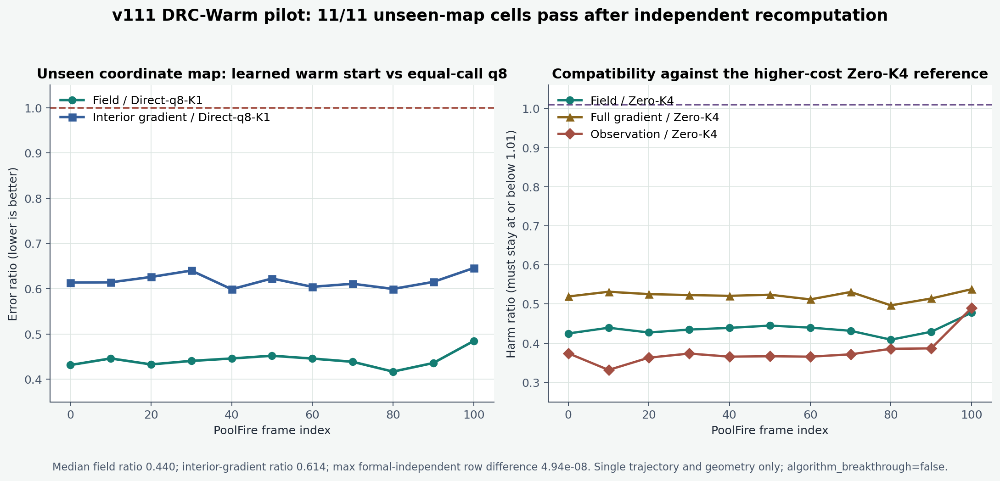

# v111 DRC-Warm：单轨迹未见微分同胚上的独立复算正信号

> English summary follows the Chinese evidence report.

## 一句话判决

v111 在一条公开 PoolFire 三维密度场轨迹、一个已知九视角几何和一个训练时未出现的双轴平滑微分同胚上，连续 11 帧全部通过冻结的八项精度门；另一程序独立复算后得到同一判决。它证明当前“微分同胚坐标条件 + observation-only warm correction”存在真实的单轨迹学习信号，但还没有证明跨轨迹、跨几何、外部反应流或真实 BOST 泛化。

## 为什么做这个试验

师兄提出的关键问题是：输入观测与相机参数如果发生坐标变化，模型能否学到随坐标变化而稳定变化的三维初始化，而不是只记住固定网格上的场形状。

v111 因此没有让网络替代物理求解器。它只读取部署时可见的信息：九视角观测、已知相机几何和坐标映射。模型输出一个受限的三维 warm correction，然后仍由精确的物理算子和未修改的 K1 迭代完成提升。在线候选的完整账为 `2A + 2A^T`。

## 实际执行

- 公开数据：PoolFire CFD 三维密度场；
- 三维逆问题网格：`32 x 16 x 16`；
- 观测：9 个已知视角；
- 训练坐标映射：恒等映射与六个单轴正负平滑微分同胚，共 7 类；
- 未见坐标映射：双轴正向平滑微分同胚；
- 评估帧：`0, 10, ..., 100`，共 11 帧；
- 模型参数量：`42,237`；
- 训练：Apple MPS，60 epochs，best epoch 55，约 99.71 秒；
- fit-only validation 目标相对改善：`67.59%`。

## 未见坐标映射结果

| 指标 | v111 pilot |
|---|---:|
| 八门联合通过 | **11 / 11** |
| severe harm | **0 / 11** |
| field 优于 Direct q8-K1 | **11 / 11** |
| interior-gradient 优于 Direct q8-K1 | **11 / 11** |
| field-L2 中位比值 / Direct q8-K1 | **0.44043** |
| interior-gradient-L2 中位比值 / Direct q8-K1 | **0.61411** |
| 候选完整算子账 | **2A + 2A^T** |

比值小于 1 表示误差更低。这里的 11/11 不是挑选最好一帧，而是冻结的全部 11 帧都同时守住 field、full-gradient、interior-gradient 和 observation 相对 Zero-K2 / Zero-K4 的八个门。

## 独立复算

独立验证程序没有导入正式 runner，重新执行 held-out 评估、聚合和全部门值：

- 逐帧指标最大绝对差：`4.94e-8`；
- 聚合指标最大绝对差：`2.00e-8`；
- 正式 / 独立 fit-only improvement：`0.67594924 / 0.67594927`；
- 正式与独立状态一致：通过。

两套程序仍共享已经冻结的物理核，因此尚未证明端到端 physics implementation independence；process-level never-read 也没有在本次 pilot 中证明。这个边界保留在公开摘要中。

## 成功了什么

1. **学习信号成立。** 先前 v110 只有无效执行与失败根因；v111 首次在真实加载的 q8 物理起点和完整 `2A + 2A^T` 候选壳中完成训练与评估。
2. **未见复合坐标变化成立。** 训练只看单轴映射，评估使用双轴复合映射，11 帧全部通过。
3. **不是靠牺牲局部梯度换 field。** full-gradient、interior-gradient 与 observation 门同步通过，severe harm 为 0。
4. **结果可复算。** 独立程序给出相同判决，数值差在 `5e-8` 以内。

## 还没有成功什么

- 只有 1 条轨迹、1 套几何、1 个 seed 的开发 pilot；
- 没有跨轨迹或跨相机几何结论；
- 没有外部反应流族一次性测试；
- 没有 fresh-process wall time 或 whole-pipeline peak RSS 优势；
- straight-ray 代理不等于 curved-ray，也不等于组内真实 BOST；
- 不能写成 SOTA、论文成功或算法突破。

当前严格状态：`algorithm_breakthrough=false`、`paper_success=false`、`real_bost=false`。

## 下一项正式判定

保持架构、输入、损失、算子账和八项门不变，把执行扩展到 5 条 fit 轨迹、3 套已知几何和 3 个预先冻结的 seed。三个 seed 必须分别守门，并与 Direct q8-K1、Zero-K2、Zero-K4 和便宜线性/岭对照公平比较。只有这一门通过，才有资格打开独立公开反应流外门和 fresh wall/RSS 资源门。

---

## English evidence summary

### Verdict

On one public three-dimensional PoolFire trajectory, one known nine-view geometry, and one held-out two-axis smooth diffeomorphism, v111 passes all eight frozen accuracy gates on all 11 evaluated frames. An independent program reproduces the same decision. This is a real single-trajectory learning signal for a diffeomorphism-conditioned, observation-only warm correction; it is not evidence of cross-trajectory, cross-geometry, external-family, or real-BOST generalization.

### What was executed

The 42,237-parameter model reads only deployment-visible nine-view observations, known geometry, and the coordinate map. It was fitted on identity plus six single-axis smooth maps and evaluated on an unseen two-axis map. Training completed 60 epochs on Apple MPS in about 99.71 seconds. The candidate retains an exact `2A + 2A^T` operator ledger and an unmodified K1 refinement shell.

### Result and boundary

- joint eight-gate pass: **11/11**;
- severe harm: **0/11**;
- median field error ratio versus Direct q8-K1: **0.44043**;
- median interior-gradient error ratio: **0.61411**;
- independent maximum per-frame difference: **4.94e-8**.

The result authorizes the frozen five-trajectory, three-geometry, three-seed formal experiment. It does not authorize a resource, external-generalization, curved-ray, real-BOST, SOTA, or paper-success claim. `algorithm_breakthrough=false`.
