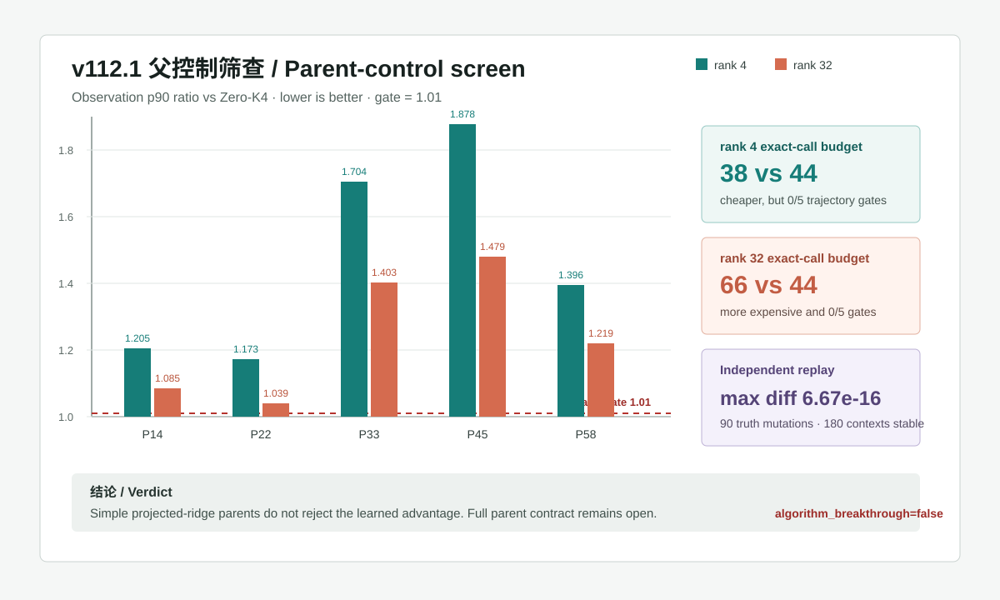

# v112.1：Projected-ridge 父控制筛查

**更新时间 / Updated:** 2026-08-03

**Formal status:** `PASS_V112_1_PROJECTED_RIDGE_SCREEN_NO_ELIGIBLE_REJECTION`

**Independent status:** `PASS_INDEPENDENT_RECOMPUTATION_V112_PROJECTED_RIDGE_SCREEN`

## 中文摘要

v112.1 回答一个直接影响论文含金量的问题：v111 的多轨迹正结果，是否只是一个简单的“PCA 低秩先验 + projected ridge + CGLS K1”就能解释？如果同成本或更便宜的经典控制也能守住相同精度，那么 learned initializer 的独立价值就不成立。

筛查覆盖 5 条已开封 PoolFire 轨迹、3 套已知九视角几何、6 个留出坐标映射和 11 帧。两个控制共形成 `1980` 个控制单元；候选参考包含 `2970` 个单元和 3 个冻结 seed。

| 控制 | 11 帧 map-geometry 上下文总 exact calls | 相对候选 44 次 | 五条轨迹通过数 | 判决 |
|---|---:|---:|---:|---|
| rank-4 projected ridge + K1 | `38` | 更低 | `0 / 5` | 有拒绝资格，但精度/伤害门失败 |
| rank-32 projected ridge + K1 | `66` | 更高 | `0 / 5` | 只作诊断，而且精度/伤害门失败 |

rank-4 控制在五条轨迹上的联合通过率依次为 `18.18% / 9.09% / 0% / 0% / 0%`。它相对 Zero-K4 的 observation p90 比值为 `1.205 / 1.173 / 1.704 / 1.878 / 1.396`；门槛是 `1.01`，因此不能把较少调用写成“同精度加速”。rank-32 也没有通过任何轨迹，而且总 exact-call 成本高于候选。

在 3 个候选 seed 与两个控制的六组配对中，候选的 field 逐单元更优比例为 `97.37%–100%`，interior-gradient 更优比例均为 `100%`。但这只说明这两个 projected-ridge 父控制没有解释掉 v111 的信号，不等于所有经典或神经父模型都已经排除。

## 独立复算

独立验证器没有导入正式预测器或评分器。它重新构造 fold-only PCA/ridge proposal、精确物理提升和 K1，并重算 `1980` 个控制单元与 `2970` 个候选单元：

- 最大绝对数值差：`6.67e-16`；
- 封存预测在验证前后保持不变；
- 另外生成 `90` 份大幅有限真值扰动副本；
- 扰动存在期间，从部署观测独立重放全部 `180` 个上下文，预测字节保持不变。

这证明当前检查范围内的 API 级 truth-mutation non-interference；它不证明整个进程从未读取真值。几何构造、坐标输运和 `A/A^T` 仍共享冻结物理核，因此端到端物理独立性也没有证明。

## 准确结论

1. **成功排除两个简单解释。** rank-4 projected ridge 更便宜但不能守住同一精度；rank-32 更贵且仍失败。
2. **learned advantage 没有被这两个父控制否定。** 这是父控制筛查正结果，不是完整算法突破。
3. **完整父控制合同仍未完成。** 三个预注册 CNN 父控制、候选侧更强的进程级 never-read 证据、fresh wall/RSS、独立公开反应流外门和真实 BOST 仍待完成。
4. 当前状态保持 `algorithm_breakthrough=false`、`paper_success=false`、`external_generalization=false`、`real_bost=false`。

---

## English summary

v112.1 asks whether the v111 multi-trajectory result can be explained by a simpler parent: a fold-local PCA prior, projected ridge, and one CGLS step. A learned-advantage claim would fail if an equal-cost or cheaper classical control passed the same accuracy and harm gates.

The screen covers five opened PoolFire trajectories, three known nine-view geometries, six held-out coordinate maps, and eleven frames. The two controls contribute `1980` control cells; the candidate reference contains `2970` cells across three frozen seeds.

| Control | Total exact calls per 11-frame map-geometry context | Versus candidate 44 | Trajectories passed | Verdict |
|---|---:|---:|---:|---|
| rank-4 projected ridge + K1 | `38` | lower | `0 / 5` | eligible to reject, but fails accuracy/harm gates |
| rank-32 projected ridge + K1 | `66` | higher | `0 / 5` | diagnostic only and also fails accuracy/harm gates |

For rank 4, the joint-pass fractions are `18.18% / 9.09% / 0% / 0% / 0%`. Its observation p90 ratios relative to Zero-K4 are `1.205 / 1.173 / 1.704 / 1.878 / 1.396`, all above the `1.01` gate. Rank 32 passes no trajectory and costs more than the candidate.

Across the six candidate-seed/control comparisons, the candidate has lower cellwise field error in `97.37%–100%` of cells and lower interior-gradient error in `100%`. This rules out only these two projected-ridge explanations; it does not complete the full parent-control contract.

An independent validator reconstructs the proposal, exact physics lift, K1 shell, all `1980` control cells, and all `2970` candidate cells without importing the formal predictor or scorer. The maximum absolute numeric difference is `6.67e-16`. While `90` scoring-truth copies contain large finite sentinels, all `180` deployment contexts replay to identical prediction bytes. This establishes API-level truth-mutation non-interference for this screen, not process-level never-read or end-to-end physics independence.

The exact conclusion is therefore narrow: the two projected-ridge parents do not reject the learned advantage, but the full parent contract, resource gate, independent public reacting-flow gate, and real BOST transfer remain open. `algorithm_breakthrough=false`.
