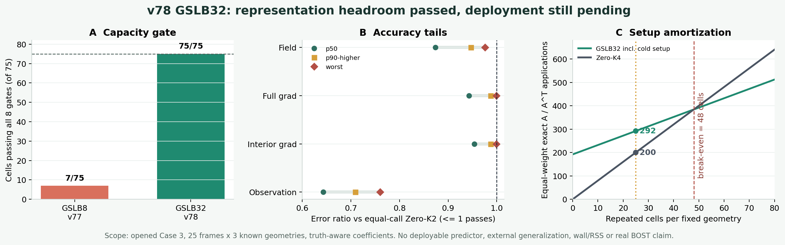

# v78 GSLB32 表示容量：75/75 独立复算通过

> 日期：2026-07-31  
> 科学状态：`PASS_GSLB32_REPRESENTATION_HEADROOM_ALL_75_V78`  
> 独立验证：`PASS_INDEPENDENT_RECOMPUTATION_GSLB32_V78`  
> 边界：`algorithm_breakthrough=false`，`paper_success=false`

## 一句话结论

在已经开封的 BLASTNet vitiated H2-air Case 3 的 25 帧、三档已知九视角几何上，
预注册的 32 个 geometry-only low-observability spline modes 第一次让全部 75 个单元
同时守住 field、full-gradient、interior-gradient、observation 及其 K4 harm / 同调用 K2
八道门；在线精确账仍为 `2A+2A^T`。

这解决的是**表示空间有没有足够容量**，不是“部署时能否从 observation 预测系数”。
因此它是阶段性关键正结果，但还不是算法突破、速度结论、外部泛化或真实 BOST 成果。



## 1. 为什么这一步必要

v75 已证明固定 PoolFire q8-K1 直接跨到 Case 3 只有 `5/75` 完整通过；v76 又以严格
证书关闭了两个全局系数的 `span{h,n}`；v77 将修正扩为 8 个三维 spline modes，仍只有
`7/75` 完整见证。若 32 模态依旧没有 75/75 headroom，那么训练更大的网络只是在学习
一个本来就不够用的输出空间。

v78 没有换数据、放宽阈值、增加在线精确调用或打开 Case 4/6。它只把同一几何特征
系统的嵌套前缀从 8 扩到 32：

```text
z  = loaded-q8 detector CR4(y)
h  = A_g^T z
x0 = h + U_g,32 a
x1 = one unchanged exact CGLS step from x0
```

truth 只在这次已经开封的容量诊断中选择 `a`；未来部署模型不得看 truth、K2/K4、
`A_g h` 或任何候选前 exact residual。

## 2. 正式结果与独立复算

| 项目 | 结果 |
|---|---:|
| 总单元 | 75 |
| 完整八门通过 | **75** |
| 冻结搜索 negative | 0 |
| 数值 inconclusive | 0 |
| F12+ / F15+ / F30+ | **25 / 25 / 25** |
| 每单元独立重跑的声明起点 | 21 |
| 最大 metric 重算差 | `1.33e-14` |
| 最大 mode-column 差 | `1.55e-13` |
| 最大 projector 差 | `1.30e-13` |
| 最大声明起点系数差 | `3.66e-12`，门为 `1e-9` |
| 最大 gate 重算差 | `5.37e-11`，门为 `1e-9` |

独立程序没有导入正式 runner、optimizer helper 或 spline/mode helper；它重新读取原始
rho，重建三档几何、32 个模态、75 组 observation、K2/K4 controls、全部起点和必要重启，
再逐项重算八门。两条路径仍共享冻结的底层几何算子 kernels，所以不能写
`end_to_end_physics_independence_proven=true`。

## 3. 逐指标结果

下表是候选相对**同调用 Zero-K2** 的误差比，门为每个单元不超过 1：

| 指标 | p50 | p90-higher | worst |
|---|---:|---:|---:|
| field | 0.873745 | 0.946468 | **0.975803** |
| full gradient | 0.942623 | 0.987476 | **0.999036** |
| interior gradient | 0.953824 | 0.987565 | **0.999036** |
| observation | 0.643254 | 0.709242 | **0.760340** |

相对 Zero-K4 的 1.01 harm 门也在 75 个单元全部通过。最紧的是 F30+：其最坏
normalized maximum gate 为 `-0.001927`，虽然严格在门内，但余量很薄。这意味着未来
预测器必须按逐帧 worst case 和拒绝覆盖率验收，不能只报平均 coefficient MSE。

## 4. 调用减少为什么还不能写成总加速

在线每单元：

```text
GSLB32 exact-K1 : 2A + 2A^T
Zero-K4         : 4A + 4A^T
```

但 `U_g,32` 的冷构造每套几何需要 `160A+32A^T`。当前每套几何只有 25 个单元；若把
`A` 与 `A^T` 等权计算：

```text
GSLB32 total = 192 + 25*4 = 292
Zero-K4 total =       25*8 = 200
ratio = 1.46
```

满接受率下至少需要 48 个单元/几何才能在等权 exact-call 总账上打平；若接受率为
`p`，乐观 break-even 为 `ceil(48/p)`。这还没有计 q8 工件、模型加载、推理、缓存、
数据搬运、wall 和 RSS。因此 v78 只证明在线表示 headroom，不证明当前 25 帧任务更快。

## 5. 修复为何没有改变科学合同

第一次独立验证在写出任何结果前中止：一个声明起点经过一次向球内缩放后，仍因
float64 舍入高出半径一个 ULP。修复只让验证器把缩放因子逐 ULP 朝 0 移动，直到进入
同一个球，最多允许 8 步；实际只有 1 个投影用了 2 步。修复后的声明起点与封存正式
起点最大差 `3.66e-12`，仍远小于原有 `1e-9` 门。

正式 75 行没有重跑或改写。原提交、formal result、checksum manifest、READY、五份正式
载荷和首次失败日志均被精确锚定；两轮独立红队审计最终为 `P0=0 / P1=0`。数据、几何、
rank、radius、起点 roster、optimizer、八门、controls 和调用账全部未改变。

## 6. 后验模型尺寸诊断

下面只用于决定下一轮候选，不能冒充 held-out 性能：

- 前 8 / 16 / 24 个 GSLB 模态只承载平均系数能量的 `6.6% / 17.7% / 41.0%`；
- 第 25-32 模态承载 `59.0%`，所以不能把物理表示再截回 8 或 16；
- 75 个物理修正场的 centered pooled 90% / 95% / 99% 统计能量秩约为 `10 / 12 / 18`；
- coefficient ball 最大使用率约 `0.503`，球约束在本批结果中不是主要瓶颈。

统计低秩不等于逐单元八门可行。下一轮任何 PCA、decoder、scaler 和 rank 都必须在
frame-grouped outer fold 内拟合；三套几何共享同一 truth 帧，不能随机拆 75 个 cells。

## 7. 下一步已经被结果限定

v78 只授权**冻结下一份协议**，尚未授权直接训练大网络。下一门按价值排序：

1. 在相同 `2A+2A^T` 在线账内先跑 analytic `U32` observation-ridge；
2. 加入 `A^T A U32` normal-image Range-safe control；
3. 同帧三几何同折，使用五个连续时间块和 embargo；
4. 只有解析 controls 不支配、且 fold-local latent oracle 逐单元八门通过，才训练最小
   reduced-rank linear head；
5. full-32 ridge、参数匹配 MLP、Zero-K1/K2/K4、BP、PCGLS、dual-ridge 和 direct-field
   全部保留为公平 controls；
6. 任一 full-32 observation-only control 在 grouped folds 仍无法预测见证，就停止放大网络，
   转向增加独立 fit 数据或改变 observation-adaptive 表示。

Case 3 永久只作 post-open development。Case 4/6、fresh wall/RSS、curved ray 与组内真实
BOST 仍封存；只有部署可见 predictor 真正通过后才进入这些门。

## 8. 当前最诚实的定位

**可以说：**GSLB32 在同在线精确调用预算下，解决了 GSLB8 的表示容量不足，并经独立
重算在 75/75 已开封单元找到完整见证。

**不能说：**已经有可部署算法、已经比 FNO/DeepONet 更好、总计算更少、外部泛化、真实
BOST 成功、全球首次或论文已经完成。

这一步真正改变了研究判断：现在训练一个很小、可拒绝、observation-only 的系数映射是
有科学依据的；在 v78 之前，训练网络只是试图挽救一个容量不足的输出空间。
