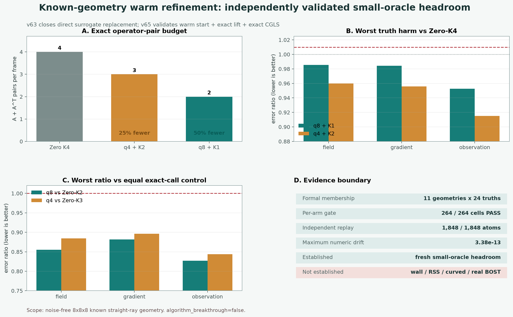

# v63-v65：低秩几何近似从“替代算子”转成 Warm Start 后通过全新几何门

## 一句话结论

小秩 Kronecker 近似不能直接替代真实已知几何算子，但可以先在 detector space
生成一个便宜起点，再经过一次精确 `A_g^T` 提升和一到两步未修改 CGLS。这个
角色转换在结果前冻结的 11 个新几何、24 个新 truth 上得到独立复算：

```text
q8 warm + exact A_g^T + exact K1    264 / 264 cells PASS
q4 warm + exact A_g^T + exact K2    264 / 264 cells PASS
```

这是可靠的 **fresh known-geometry small-oracle headroom**，不是目标尺寸加速、
算子学习、曲折光线、真实 BOST 或论文成功。



## 1. 为什么先有一个正式失败

v63 问的是：能否把平行几何 `A_0` 加一个小秩修补，直接当成真实已知几何
`A_g`，然后在这个近似算子上完成 K4？

答案是不能。18 个几何场景、22 个 truth、两族近似和 `q=1/2/4/8` 一共形成
13,032 个冻结原子。`q=1/2/4` 没有一个通过选择门，而且
`A_0 + residual` 在同秩下始终比 standalone 近似更差。独立 NumPy 验证器没有
导入正式射线、三线性、梯度、分解或 runner，仍复现相同 FAIL；九张表的最大
数值差约为 `1.03e-12`。

所以被关闭的是：

```text
small approximation -> directly replace A_g -> final reconstruction
```

继续增加 `q` 或换大网络去掩盖这个失败没有意义。

## 2. 真正有效的角色转换

v64 把近似算子降级为起点生成器：

```text
observation y
  -> four cheap detector-CR steps with standalone A_tilde
  -> dual proposal z
  -> one exact lift x0 = A_g^T z
  -> one or two unmodified exact-geometry CGLS steps
```

这里最终场始终经过真实 `A_g` 的残差和梯度校正。近似算子不再冒充物理，
只负责把迭代送到一个更好的子空间。v64 在已开封场景出现全 cell 正信号后，
才在任何 v65 数值生成前冻结全新的角度、几何 pattern、truth seed、两个候选和
逐 cell 门。

## 3. v65 冻结了什么

v65 没有在看到结果后重新选择 `q`、迭代数或阈值：

| 项目 | 冻结值 |
|---|---:|
| 全新已知几何 | 11 |
| 每个几何的 truth | 19 随机 + 5 结构 |
| 每个候选 cell | 264 |
| controls / candidates | 5 / 2 |
| 正式原子 | 1,848 |
| truth no-harm 门 | field、gradient、observation 均 `<= 1.01` |
| 同调用对照门 | 三项误差均 `<= 1.00` |

几何包含新角度的平行控制、正负 elevation/roll，以及有限源距、焦距、主点、
目标偏移和逐视角 pattern 的组合。它们仍是无噪声 straight-ray 已知几何，
不是实验相机标定或未知折射曲线。

## 4. 两个候选都逐 cell 通过

### q8 + 精确提升 + K1

```text
exact cost                         2A + 2A^T
exact-pair reduction vs Zero-K4   50%
worst field / gradient / observation harm vs Zero-K4
                                   0.985320 / 0.984208 / 0.952726
worst ratio vs equal-cost Zero-K2  0.855251 / 0.881628 / 0.827317
```

### q4 + 精确提升 + K2

```text
exact cost                         3A + 3A^T
exact-pair reduction vs Zero-K4   25%
worst field / gradient / observation harm vs Zero-K4
                                   0.959885 / 0.955884 / 0.915029
worst ratio vs equal-cost Zero-K3  0.884484 / 0.896546 / 0.843994
```

所有数值都小于 1。也就是说，不是均值变好但藏着坏样本；在每一个冻结 cell
上，两个候选都没有伤害 Zero-K4 的三项 truth 精度，并且都击败了使用相同精确
调用数的 Zero-K2 或 Zero-K3。

## 5. 独立复算排除了什么

clean-room 验证器只使用 NumPy 和同一冻结 JSON，重新实现：

- 相机轴、有限源距/平行射线和采样点；
- 三线性权重、有限差分梯度的转置和 dense `A_g`；
- 每 view/component 重排 SVD 与 q4/q8 standalone 近似；
- detector CR、zero/warm CGLS、全部 truth 和稳定比值；
- 1,848 个 atom ID、五张 CSV、调用账和最终门。

最大绝对数值差为 `3.38e-13`。Torch 正式后端与 NumPy 独立累加得到的 dense
矩阵不是逐字节相同，但可比数值、伴随门、逐 cell 判决和总判决一致。

## 6. 为什么它值得继续，但还不能叫突破

这次真正的新信息不是“低秩近似很准”。v63 已证明它作为最终算子不够准。
新信息是：

> 一个不够准的几何近似，仍可能提供精确 Krylov 前几步得不到的有用方向；
> 精确 `A_g^T` 提升和少量真实 CGLS 再负责把结果拉回物理一致空间。

这是一条可解释、可审计的 **geometry-compressed augmented Krylov warm start**
候选。它的精确调用账有明确优势，但 cheap q-factor 动作、factor setup、
端到端 wall 和峰值内存尚未测量，所以现在不能把“调用减少”偷换成“速度提升”。

```text
fresh_known_geometry_small_oracle=true
target_scale_resource_result=false
wall_time_speedup=false
whole_pipeline_peak_memory_result=false
noise_or_calibration_robustness=false
curved_ray_transfer=false
operator_learning_result=false
real_bost=false
algorithm_breakthrough=false
paper_success=false
```

## 7. 下一道真正有价值的门

下一步只把这两个固定候选扩到 `16×16×32`，逐 view/component 构造 q4/q8
standalone factors，不形成全局 dense `A_g`。公平比较必须同时报告：

1. Zero-K4、Zero-K2/K3、A0 warm、PCGLS、q8-K1 和 q4-K2；
2. factor setup 时间与多帧摊销，不把离线代价藏掉；
3. exact `A/A^T`、cheap factor actions 和实际 wall；
4. fresh-process whole-pipeline peak RSS；
5. PoolFire 与另一个公开反应流族上的 field/gradient/observation 尾部；
6. 噪声、标定扰动和 observable fail-closed residual。

只有目标尺寸与公开外部反应流门同时成立，才值得训练一个最小
geometry/observation-conditioned rank 或 coefficient predictor。真实论文仍需要
组内位移图、相机标定、重复测量噪声和师兄认可的基线。
