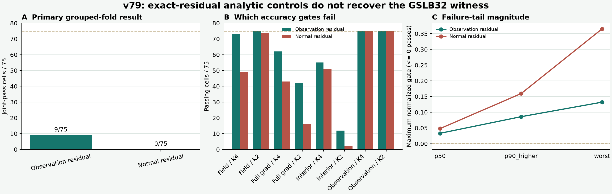

# v79 GSLB32 解析映射：观测拟合通过，三维梯度兼容失败

> 日期：2026-07-31  
> 科学状态：`NO_PRIMARY_OR_SECONDARY_ANALYTIC_CONTROL_PASSES_ALL_75_V79`  
> 独立验证：`PASS_INDEPENDENT_RECOMPUTATION_ANALYTIC_CONTROLS_V79_2`  
> 边界：`algorithm_breakthrough=false`，`paper_success=false`

## 一句话结论

v78 已证明 32 个几何样条模态在已经开封的 75 个 Case 3 单元中具有 `75/75`
truth-aware 表示容量。v79 随即测试两个不需要神经网络、部署时只增加小矩阵求解的解析
系数映射：observation-residual projected ridge 完整通过 `9/75`，normal-residual
projected ridge 完整通过 `0/75`。两者都让 observation 两道门达到 `75/75`，却无法
稳定保住 full-gradient 与 interior-gradient。

因此 v79 关闭的是这两个冻结的解析 control，不是所有 observation-only predictor。
它没有授权神经训练、资源测试、新外部工况或真实 BOST。



## 1. 为什么先测解析方法

v78 的系数由 truth-aware oracle 选择。它回答“输出空间够不够”，没有回答“部署时能否
从可见 observation 找到正确系数”。在训练 FNO、DeepONet 或 MLP 前，最便宜且最难被
学习模型合理回避的对照，是直接把精确 residual 投影到同一个 `U_g,32` 空间。

两条 control 共用相同的 loaded-q8 anchor `h`、相同 coefficient ball、相同一轮未修改
CGLS 和相同八道精度门：

```text
observation residual : r_h = y - A h
normal residual      : n_h = A^T (y - A h)
x0                   : h + U_g,32 a
x1                   : one unchanged exact CGLS step from x0
```

- observation-residual control 用 `A U_g,32` 对 `r_h` 做 ridge；
- normal-residual control 用 `A^T A U_g,32` 对 `n_h` 做 ridge；
- 五个连续时间块做 grouped evaluation，同一 truth 帧的三档几何始终同折；
- shared-lambda 是主判决，geometry-specific lambda 是次判决；两者都失败；
- 在线精确账均保持 `2A+2A^T`，系数求解不增加完整 `A/A^T`。

这两个 control 使用精确 residual，因此不能冒充更严格的 pre-residual、observation-only
神经 predictor。

## 2. 正式结果

| 方法 | 完整八门通过 | Field K4 / K2 | Full-grad K4 / K2 | Interior K4 / K2 | Observation K4 / K2 |
|---|---:|---:|---:|---:|---:|
| Observation residual | **9/75** | 73 / 75 | 62 / 42 | 55 / **12** | **75 / 75** |
| Normal residual | **0/75** | 49 / 74 | 43 / 16 | 51 / **2** | **75 / 75** |

两个方法的 shared-lambda 与 geometry-specific 结果相同：每个外折都选择冻结 roster 中的
`lambda=1.0`。因此没有“共享参数失败、已知几何单独调参即可通过”的隐藏正结果。

最大 normalized gate 以 `<=0` 为通过：

| 方法 | p50 | p90-higher | worst |
|---|---:|---:|---:|
| Observation residual | 0.03309 | 0.08588 | 0.13216 |
| Normal residual | 0.04807 | 0.15940 | 0.36540 |

这组拆解很重要：measurement residual 并不是主要失败点。两条方法的 observation/K4 和
observation/K2 都是 `75/75`，但 equal-call interior-gradient 只有 `12/75` 与 `2/75`。
换句话说，“更符合测量”没有自动变成“更接近正确的三维密度梯度场”。这正是病态逆问题
中必须同时检查 field 与 derivative 的原因。

## 3. 独立验证与修复边界

第一版独立 validator 经红队发现上游协议与原始采集证据绑定不够完整，因此其结论被
废止，没有作为科学证据使用。v79.2 只修验证闭包，不改 formal 结果、数据、几何、方法、
lambda roster、fold、八门或调用账。最终 validator：

- 独立重写 metric、gradient、enrichment 与八门判决，不导入正式 metric helper；
- 重新核对 1,200 条 arm rows 与 300 条 outer rows；
- 绑定完整 v79 协议、上游 v75/v66 合同、几何因子与公开数据采集证据；
- 验证前后正式输入、原始输入和因子工件均未变化；
- 三轮同一红队最终给出 `P0=0 / P1=0`。

协调器又用只依赖 Python 标准库的独立 seal 检查输出 roster、checksums、两个干净 detached
worktree 和全部边界。主要数值差为：

| 复算项 | 最大差 |
|---|---:|
| mode projector | `3.62e-13` |
| mode column | `2.08e-13` |
| arm rows（scaled） | `1.07e-11` |
| outer rows（scaled） | `3.83e-12` |
| selection（scaled） | `2.93e-14` |
| summary（scaled） | `3.63e-14` |

第一次启动 v79.2 时所用 Python 缺少 SciPy，程序在 import 阶段失败；它没有读取 formal
或 raw 数据，也没有产生输出。随后用已经绑定依赖版本的项目环境继续同一个冻结验证尝试，
结果通过。这个错误只属于执行透明度，不是一次科学试验，也没有被隐藏或计作成功运行。

两条验证路径仍共享冻结的底层物理 kernels，所以
`end_to_end_physics_independence_proven=false`。

## 4. 这次负结果实际关闭了什么

**已经关闭：**

- frozen observation-residual `U32` projected ridge；
- frozen normal-residual `U32` projected ridge；
- 试图仅靠“把 measurement residual 拟合得更好”就保住三维梯度的这两个具体解析方案。

**没有关闭：**

- 所有 observation-only predictor；
- fold-local 的最小线性或小型非线性 predictor；
- 改变 observation-adaptive 表示本身的方案；
- 噪声、曲线光线、真实标定下的组内 BOST 问题。

Case 4/6 仍未打开。没有 wall、RSS、内存、curved ray、跨数据集泛化或真实 BOST 结果。
`range_safe=false` 也必须保留：normal-residual control 的系数最终通过 `U_g,32` 解码，
不能把它写成严格的 `Range(A^T)` 初始化器。

## 5. 对下一步的约束

v79 允许的下一动作只是**结果前冻结**一份严格 observation-only 的最小 predictor 协议；
它本身不授权训练。新协议必须满足：

1. 输入只含部署时可见 observation、几何标签及可在精确 residual 前计算的特征；
2. 同一 truth 帧的三档几何同折，所有 scaler、decoder、rank 和超参数只在 fold 内拟合；
3. 先与这两个解析 control、Zero-K1/K2/K4、BP、PCGLS 和 direct-field controls 公平比较；
4. 仍以逐单元八门而不是 coefficient MSE 或平均 observation loss 为准；
5. 若无法把 equal-call interior-gradient 从 `12/75` 的瓶颈提升到 `75/75`，立即记录负结果，
   不靠扩大网络或打开 Case 4/6 补考；
6. 只有部署可见 predictor 经独立复算通过，才允许计算 cold setup、fresh wall 与 RSS。

## 6. 当前最诚实的定位

**可以说：**v79 经独立复算证明，两个自然且低成本的 exact-residual ridge controls 都不能
把 v78 的 75/75 truth-aware 表示 headroom 转化为逐单元三维梯度兼容；失败机制已经定位到
gradient，尤其是 equal-call interior-gradient，而不是 observation fit。

**不能说：**神经网络一定能解决、所有 observation-only 方法都失败、已经减少总计算、已经
优于 FNO/DeepONet、已经外部泛化、真实 BOST 成功、算法突破或论文完成。

这是一项实质增量：它用很低成本排除了两个最直接的候选，并把后续模型的真正门槛从
“观测损失下降”收紧为“观测可见输入能否同时恢复局部三维梯度”。
