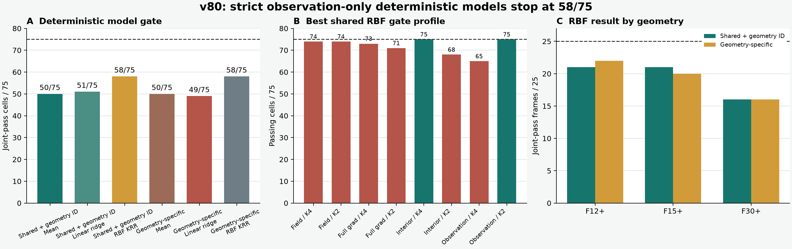

# v80 严格 observation-only 可学习性门：RBF 到 58/75，仍未全覆盖

> 科学状态：`NO_FROZEN_STRICT_OBSERVATION_MODEL_PASSES_ALL_75_V80`  
> 独立验证：`PASS_INDEPENDENT_RECOMPUTATION_STRICT_OBSERVATION_KRR_V80`  
> 当前结论：`neural_training_authorized=false`、`algorithm_breakthrough=false`

## 先说人话

v78 已经证明：如果离线时允许看三维真值，32 个 GSLB 模态里确实能为全部 75 个单元
找到合格修正。因此问题不再是“答案空间里有没有好答案”，而是“部署时只看九视角观测，能不能
可靠找到这组系数”。

v80 用三个从简单到非线性的确定性模型直接回答这个问题：训练集均值、线性 ridge、RBF kernel
ridge。最好的 RBF 方法在两种策略下都只通过 `58/75`；还剩 17 个单元至少违反一个冻结精度门。
所以它是有明显信号的负结果，不是可以发布为成功的模型。

## 为什么先做这个，而不是直接训练 FNO 或 DeepONet

这一步是更短、更便宜也更能定位问题的可证伪实验。若 RBF 已能 75/75，通过同一输入训练一个
小型网络才有依据；若连 RBF 都没有稳定 headroom，马上扩大网络会把“输入信息不足”“监督标签
不规范”和“模型容量不足”混在一起。

v80 因此保持以下内容不变：

- 数据仍是已经开封的 BLASTNet vitiated H2-air Case 3，共 25 帧；
- 三档已知九视角几何各形成 25 个单元，总计 75 个；
- 外层是 5 个连续时间块，并在训练侧留一帧 embargo，禁止随机拆帧；
- 目标仍是 v78 已验证的 32 维 oracle witness；
- 预测后仍用同一精确 `A^T` 提升和未修改 CGLS K1；
- 在线精确调用仍为 `2A+2A^T`；
- field、full-gradient、interior-gradient、observation 的八个门一个都没有放宽。

## 部署时模型能看到什么

每个模型只接收第一次精确 forward 之前已经可见的量：

1. `U^T h` 的 32 个坐标；
2. `(AU)^T y` 的 32 个投影观测；
3. `(AU)^T r_q8` 的 32 个廉价探测器残差投影；
4. `y`、`z_q8`、`r_q8`、`h` 的 4 个对数范数。

几何专属模型共有 100 维输入；共享模型再加固定三维几何 one-hot，共 103 维。模型禁止读取真值、
真值梯度、held-out oracle 系数、`y-Ah`、`A^T(y-Ah)`、Zero-K2/K4 状态、帧号和时间。

## 正式结果

| 策略 | 训练集均值 | 线性 ridge | RBF KRR | 最佳方法 |
|---|---:|---:|---:|---|
| 共享模型 + 已知几何编号 | 50/75 | 51/75 | **58/75** | RBF |
| 每档几何单独建模 | 50/75 | 49/75 | **58/75** | RBF |

两种 RBF 虽然同为 58/75，但共享模型的失败尾部更温和：最大门的 p90 / worst 为
`0.030743 / 0.056599`；几何专属模型为 `0.039720 / 0.357980`。门值 `<=0` 才通过，
因此二者都没有达到全覆盖。

### RBF 逐几何完整通过

| 冻结几何 | 共享 RBF | 几何专属 RBF |
|---|---:|---:|
| F12+ | 21/25 | 22/25 |
| F15+ | 21/25 | 20/25 |
| F30+ | 16/25 | 16/25 |

最难的仍是 F30+。这说明“拆成三个模型”没有系统解决问题，共享非线性模型也没有把几何差异
完全吸收。

### 共享 RBF 的八门通过数

| 门 | 通过数 |
|---|---:|
| field 相对 Zero-K4 不伤害 | 74/75 |
| field 不劣于同调用 Zero-K2 | 74/75 |
| full-gradient 相对 Zero-K4 不伤害 | 73/75 |
| full-gradient 不劣于同调用 Zero-K2 | 71/75 |
| interior-gradient 相对 Zero-K4 不伤害 | 75/75 |
| interior-gradient 不劣于同调用 Zero-K2 | 68/75 |
| observation 相对 Zero-K4 不伤害 | 65/75 |
| observation 不劣于同调用 Zero-K2 | 75/75 |

17 个失败单元中，9 个只失败在 observation/K4，4 个只失败在 interior-gradient/K2；其余
4 个含 full-gradient 或多门联合失败。换句话说，RBF 已比 v79 两条解析 control 更接近目标，
但仍无法同时守住“不能伤害 K4 精度”和“不能输给同调用 K2”这两个方向的约束。

## 独立复算检查了什么

独立程序没有复用正式模型的训练或选择实现，而是重新执行嵌套选择、预测、径向投影、物理指标
和八门判决：

- 6 个策略/模型组合，共 `450` 份 outer prediction 和 `450` 行物理判决；
- raw prediction、projected prediction、metric 的最大绝对差均为 `0`；
- gate 最大差为 `5.55e-16`；
- 修改 held-out 标签后，冻结 predictor API 的输出最大变化仍为 `0`；
- 正式输出和绑定源码在验证前后均未改变；
- 每个在线单元的精确账独立闭合为 `2A+2A^T`。

这里必须保留一个边界：API 级 held-out 标签不干扰已经证明，但整个预测阶段“从未读取相关文件”
的进程隔离没有证明，也不作此声明。

## 这次真正关闭了什么

关闭的是这三类冻结模型：

- fold-local constant mean；
- nested linear ridge；
- nested RBF kernel ridge。

关闭范围还包含本次固定的 100/103 维部署可见特征、原始 v78 witness 系数目标、五折时间分组和
八门合同。它**不等于所有 observation-only 方法失败**，也不证明更大网络在数学上不可能成功。

## 下一步为什么要改“学习目标”，而不是先堆网络

v78 的 32 维 oracle witness 是优化器找到的一组可行系数，但不一定是唯一、连续或最容易从观测
识别的那一组。v80 的结果支持下一步先检验两个问题：

1. 相近的部署可见特征是否对应跳变很大的 oracle 系数；若是，原始系数监督本身存在歧义。
2. 能否在同一可行集合中定义一个可复现的规范目标，例如最小范数、最接近解析 control，或对
   观测变化更平滑的 witness，再用同样的小模型做一次可学习性门。

只有新的规范目标或 observation-adaptive 表示先让确定性 sentinel 获得稳定全覆盖，才有理由
训练最小神经模型。否则增加网络容量只会增加参数，不能回答失败来自哪里。

## 不能写进论文摘要的内容

- 不能写成算法突破、论文成功或 SOTA；
- 不能写成外部泛化，因为 Case 3 已经是开发数据；
- 不能写成 wall / RSS 加速，资源门没有运行；
- 不能写成曲线光线、噪声鲁棒、相机标定或真实 BOST；
- Case 4 和 Case 6 仍封存，没有用来补考。

准确表述是：**在固定 Case 3、三档已知九视角几何和严格时间分组下，确定性 RBF 将完整通过数
提高到 58/75，但没有把 v78 的 truth-aware 75/75 表示容量转化为可部署全覆盖；下一问题转向
系数目标规范化与 observation-adaptive 表示。** `algorithm_breakthrough=false`。
