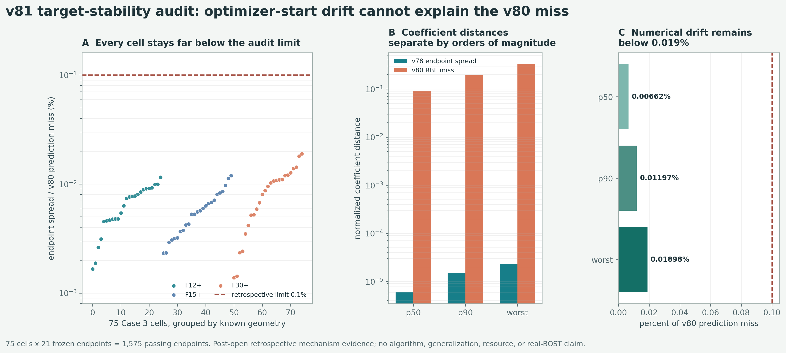

# v81 目标稳定性审计：随机起点不是 v80 失败的主因

> 科学状态：`V78_MULTISTART_VARIABILITY_BELOW_0P1_PERCENT_OF_V80_MISS_V81` 
> 独立验证：`PASS_INDEPENDENT_RECOMPUTATION_TARGET_STABILITY_V81` 
> 当前结论：`algorithm_breakthrough=false`、`paper_success=false`

## 先说人话

v80 最好的 observation-only RBF 只通过了 `58/75`。一个合理怀疑是：v78 用真值搜索得到的
32 维监督标签会不会不稳定，同一个单元换一个优化起点就得到很不一样的系数，导致模型根本学
不住。

v81 把 v78 已经封存的全部 `75` 个单元、每个单元 `21` 个起点重新拿出来比较。结果是：所有
`1575` 个起点都落到通过八门的端点，而且同一单元内最远两个端点之间的距离，相对于 v80 的
RBF 预测误差，最坏也只有 `0.01898%`。因此，在 v78 原来的 minimax 目标和这 21 个起点范围内，
随机起点造成的数值漂移小了几个数量级，解释不了 v80 的失败。

## 为什么做这个审计

直接换一种标签、继续做 canonicalization，或者扩大网络，都隐含了一个判断：当前监督目标真的
因为多解或优化随机性而不稳定。这个判断若不先检验，会把大量算力花在一个没有证据的原因上。

v81 因而没有训练新模型，也没有重新优化。它只回答一个窄问题：

> 在已经运行过的 v78 目标函数和起点集合中，数值端点波动是否足以解释 v80 的系数预测误差？

## 正式结果

| 量 | p50 | p90-higher | worst |
|---|---:|---:|---:|
| 端点最远距离 / v80 RBF 预测误差 | `0.00662%` | `0.01197%` | `0.01898%` |
| 端点最远距离 / v78 系数半径 | `5.95e-6` | `1.51e-5` | `2.32e-5` |
| 物理修正场最远距离 / 最佳修正场范数 | `2.94e-5` | `4.57e-5` | `6.36e-5` |
| 21 个端点的最大门值范围 | `2.40e-11` | `4.56e-11` | `8.42e-11` |
| v80 RBF 预测误差 / v78 系数半径 | `0.09058` | `0.19174` | `0.32863` |

三档几何各有 25 个单元，全部满足“端点漂移不超过 v80 预测误差的 `0.1%`”这条回顾性判据。
最坏值 `0.01898%` 仍比 `0.1%` 上限低约 5.27 倍。

## 独立复算

正式程序用显式两两向量差计算端点距离；独立程序改用 Gram 矩阵公式重算，不导入正式 runner。
独立程序重新核验父结果、75 个单元、1575 个端点、物理修正场、门值和汇总统计：

- 科学判决完全一致；
- 单元级指标最大绝对差 `5.55e-11`；
- 汇总指标最大绝对差 `5.55e-11`；
- 正式输出、父结果和绑定源码在验证前后均未改变。

两种距离公式对极小差值会产生浮点舍入差，因此独立一致性容差固定为 `1e-9`。这项工程容差比
科学判据 `1e-3` 小六个数量级，不改变通过或失败的判断。

## 这次关闭了什么

关闭的是一个具体原因：

- 在冻结的 v78 minimax 目标下，21 个既定优化起点导致的数值端点不稳定，不足以解释 v80 的
  预测误差和 17 个失败单元。

它没有关闭以下问题：

- 换成另一种 truth-aware 目标后，可行集合是否存在概念上的多解；
- 固定 GSLB32 是否缺少随 observation 改变的局部空间方向；
- 更丰富的部署可见输入是否能可靠预测修正；
- 独立公开工况、曲线光线、噪声、标定误差或真实 BOST 上是否成立。

## 策略因此怎样改变

不再优先做“同一 v78 标签的多起点 canonicalization”，也不直接扩大 RBF 或训练大网络。下一项
实验应改变表示而不是只换回归器：让低维修正基随部署可见的 observation 与已知 geometry
自适应，同时保持同一 `2A+2A^T` 在线账、同一时间分组和同一八门。

第一步仍应是小而可证伪的 sentinel：用 observation-visible 的残差谱、视角能量不平衡或局部
探测器特征生成少量自适应方向，再检查 truth-aware capacity 和严格 observation-only 可学习性。
只有这一表示先在已开封 Case 3 上恢复稳定全覆盖，才值得冻结最小神经模型并打开新的独立外门。

## 证据边界

本审计是在先看过父结果摘要后冻结的回顾性机制分析，不是预注册的外部确认实验。它没有产生
新算法、训练结果、调用减少、wall/RSS 优势、外部泛化或真实 BOST 证据。准确表述是：

**v78 既定目标下的多起点数值波动比 v80 预测误差小至少三个数量级，因而不是当前失败的主要
解释；研究优先级转向 observation-adaptive representation。**

`algorithm_breakthrough=false`、`paper_success=false`。
