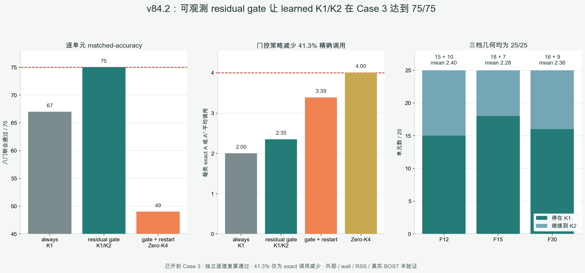

# v84.2：可观测残差门控 K1/K2 在 Case 3 上 75/75

## 一句话结论

在已经开封的 BLASTNet H2-air Case 3、`25 帧 × 3 档几何 = 75` 个开发单元上，v84.2
只用部署时可见的 measurement residual 决定“停在 learned K1”还是“继续一次未修改 CGLS 到 K2”。
门控策略在全部 `75/75` 单元同时通过 field、full-gradient、interior-gradient、observation 的
八项逐单元约束，同时把每类精确算子调用从 Zero-K4 的 `4` 降到平均 `2.3467`，理论减少
`41.3%`。



这是一个独立复算通过的 **Case 3 开发集机制正结果**。它还没有经过 Case 4/6 外部门，也没有
fresh wall、whole-pipeline RSS、curved ray 或真实 BOST 证据，所以
`algorithm_breakthrough=false`、`paper_success=false`。

## 方法到底做了什么

v83.1 的 enriched148 RBF warm initializer 在 K1 时通过 `68/75`。七个失败都只剩最终 observation
相对 Zero-K4 的 no-harm 门，而 residual 在部署时可直接计算。因此 v84.2 冻结了一个非常小的策略：

```text
s = ||y - A x_K1||_2 / max(||y||_2, 1e-30)

if s <= fold-local frozen threshold:
    accept x_K1                       # 2A + 2A^T
else:
    continue the same CGLS recurrence # 3A + 3A^T total
```

阈值不是用 75 个 held-out 结果调出来的。每个 outer fold 内先为 fit 行生成严格 OOF residual，
把同一 truth frame 的三档几何取最大值，再用 lower 75th percentile 冻结阈值。outer held-out
只向策略暴露 observation、known geometry、candidate 和 residual，不提供 truth、门值、Zero-K2/K4
指标、帧号或时间邻居。

## 冻结策略与结果

| 策略 | 八门联合通过 | 平均每类精确调用 | 解释 |
|---|---:|---:|---|
| always learned K1 | `67/75` | `2.0000` | 不安全，仍有 8 个单元失败 |
| **residual-gated K1/K2 continuation** | **`75/75`** | **`2.3467`** | 49 个停 K1，26 个继续 K2 |
| gated K1 / restart Zero-K4 | `49/75` | `3.3867` | fallback 花掉已用 K1 成本，且完整八门仍失败 |
| Zero-K2 reference | `0/75` | `2.0000` | 只对 equal-call 四门自洽 |
| Zero-K4 reference | `4/75` | `4.0000` | 只对 no-harm 四门自洽 |

主策略逐几何全部为 `25/25`：

| 几何 | K1 接受 | K2 continuation | 平均每类调用 |
|---|---:|---:|---:|
| F12 | `15` | `10` | `2.40` |
| F15 | `18` | `7` | `2.28` |
| F30 | `16` | `9` | `2.36` |

所有 75 个单元的 maximum gate 都为负：p50 `-0.06754`、p90-higher `-0.04382`、worst
`-0.03107`。因此这不是靠平均值掩盖少数失败，也不是勉强卡在零附近。

调用减少来自固定策略本身：

```text
mean A calls  = (49 × 2 + 26 × 3) / 75 = 2.3466667
mean A^T calls                              = 2.3466667
reduction vs Zero-K4                        = 41.3333%
```

这里的 `41.3%` 只代表 exact `A/A^T` 账，不能替代端到端 wall 或内存测量。

## 为什么两个 reference 不需要自己通过全部八门

八门由两组不同参照组成：四项要求不比 Zero-K4 坏超过 1%，另外四项要求不比同调用 Zero-K2 差。
所以 Zero-K4 只必然在自己的四个 no-harm 比值上等于 1；它与不同的 Zero-K2 比较时可能因
半收敛而失败。Zero-K2 也只必然在自己的四个 equal-call 比值上等于 1。

正式程序和独立验证器分别检查了这两个本征 identity，比值相对 1 的最大偏差都为 `0`，调用账分别
严格为 `2A+2A^T` 与 `4A+4A^T`。候选和门控策略仍然必须通过完整八门，标准没有降低。

## 独立复算

独立 validator 不导入正式 v84 runner 或安全门 helper。它从原始 Case 3 rho 重新构造 75 个单元、
五折 split-local upstream、276 条 calibration、375 条策略、真实 forward/adjoint 调用账和全部八门，
并重新生成五种策略的 field 与 residual。正式与独立结果为：

```text
field / residual maximum difference          0 / 0
prediction / calibration maximum difference 0 / 0
threshold / fit-target maximum difference    0 / 0
selection / upstream / outer maximum diff    0 / 0 / 0
held-out label mutation changed sealed bytes false
formal outputs changed during validation     false
Case 4 or Case 6 read                        false
```

API 级 noninterference 得到验证；由于同一进程仍从已开封模拟真值生成 observation，进程级 never-read
和端到端 physics 完全独立没有证明。

## 能说什么，不能说什么

可以说：在已开封 Case 3、固定五折与八门合同下，一个只看 residual 的 fail-closed K1/K2 策略把
v83.1 的 `68/75` K1 模型推进到 `75/75`，并把理论 exact 调用从每类 4 次降到 2.3467 次。

不能说：已经外部泛化、真实提速、节省内存、神经算子优于 FNO/DeepONet、适用于曲线光线、真实 BOST
有效、全球首创、SOTA 或论文已经成功。当前结果仍来自 post-open Case 3，而且使用的是小型 RBF
predictor 加可观测门控，不是大规模神经算子。

## 下一道科学门

先用全部 Case 3 开发数据生成一个结果前冻结的 full-fit deployment artifact：固定 predictor、
预处理、超参数、阈值、接受规则、调用账和报告模板。之后严格按 v75 早已预先指定的顺序打开
Case 4 与 Case 6，不能看外部真值后重调阈值或只汇报容易工况。

只有外部两工况继续逐单元通过 matched-accuracy，才运行 fresh-process wall 与 whole-pipeline RSS；
再往后才有理由接组内真实位移图、相机标定、重复测量噪声和认可基线。
