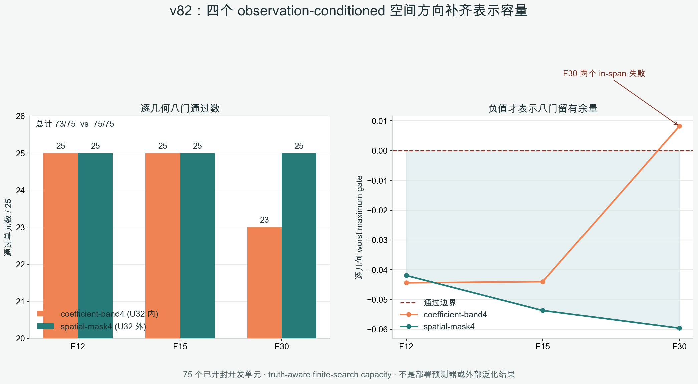

# v82 表示容量诊断：四个空间调制方向补齐 75/75

## 一句话结论

在已经开封的 BLASTNet H2-air Case 3、`25 帧 × 3 档几何 = 75` 个单元上，四个
observation-conditioned 空间调制方向找到了 `75/75` 个通过原八门的 truth-aware 终点；参数数目、
物理尺度与在线 `2A+2A^T` 壳相同的 GSLB32 内系数分段对照只有 `73/75`。

这是“**空间自适应表示值得继续**”的开发集机制证据，不是可部署算法。四个系数仍由真值可见的
oracle 搜索，因而当前仍是 `algorithm_breakthrough=false`。

## 为什么做这一步

v78 已证明完整 GSLB32 在同一 75 个单元上具有 `75/75` truth-aware 容量，v80 却显示只看部署可见
observation 的最佳冻结 RBF 只能达到 `58/75`。v81 又排除了“同一目标下随机优化起点让标签严重漂移”
这个解释。剩下更直接的问题是：**固定 32 维空间本身是否缺少随观测位置变化的局部形变能力？**

v82 不训练大网络，而是先用两个同为四参数的家族做最小机制对照：

| 家族 | 四个方向 | 是否离开固定 U32 | 额外在线 exact 调用 |
|---|---|---:|---:|
| coefficient-band4 | 把 GSLB32 系数分成四段修正 | 否 | `0A + 0A^T` |
| spatial-mask4 | 用 `z/y/x/径向` 掩膜调制 observation-conditioned 基础修正 | 是 | `0A + 0A^T` |

两者都使用相同物理度量白化、相同 `[-1,1]^4` 盒、相同物理预算、相同 13 个 SLSQP 起点和相同原
v75 八门。每个候选仍放进同一个 strict CGLS K1 壳，总在线账为 `2A+2A^T`。

## 正式结果

| 家族 | 总通过 | 救回 v80 的 17 个失败 | F12 | F15 | F30 | 最坏 maximum gate |
|---|---:|---:|---:|---:|---:|---:|
| coefficient-band4 | `73/75` | `15/17` | `25/25` | `25/25` | `23/25` | `+0.00821` |
| spatial-mask4 | **`75/75`** | **`17/17`** | `25/25` | `25/25` | `25/25` | **`-0.04192`** |

maximum gate 小于等于 0 才表示八门同时通过。固定空间内对照剩下的两个失败都来自最难的
`F30` 几何：Case 3 第 3 帧为 `+0.00821`，第 15 帧为 `+0.00484`。空间调制在这两个单元分别得到
`-0.16442` 与 `-0.05960`，而且最佳扰动相对 U32 的投影残差分别为 `0.5661` 与 `0.3634`；它不是把
原来的 32 维系数换一种写法。

## 独立复算

原始独立 validator 在发布任何验证结果前暴露一个维度错误：它把 32 维 base coefficient 送进只接受
4 维 beta 的 gate 路径，按 fail-closed 规则中止。v82.1 修复只删除这次无效调用；每个 arm 已有的
`beta=0` 基线复算、终点 exact replay、原八门、1950 个独立起点、raw SLSQP 约束与调用账全部保持不变。
修复验证器与原正式提交分别记录，正式结果没有重跑或修改。

独立复算最终确认：

- formal 与 independent 的 `1950/1950` 个终点全部完整；
- 两家族通过数分别仍为 `73/75` 与 `75/75`；
- maximum gate 最大差 `4.44e-16`，八项 metric 最大差 `0`；
- best endpoint 的 exact field replay 最大差 `4.51e-17`；
- 固定 observation/geometry 后变异 truth，方向 payload 差为 `0`；
- formal 输出、父结果、数值依赖和一次性执行绑定均保持不变。

## 能说什么，不能说什么

可以说：在这一个已开封开发工况、这两个匹配四参数家族和这次有限搜索下，spatial-mask4 具有
family-specific representation headroom，并补齐了 fixed in-span control 留下的两个 F30 失败。

不能说：空间调制是全球首创、已经能由 observation 预测、外部泛化、真实提速、曲线光线有效、真实
BOST 有效或论文已经成功。API 级方向构造不读 truth 已验证，但进程级 never-read 尚未证明。

## 下一道科学门

冻结 spatial-mask4 后，只训练一个小型 observation-only `features -> 4 coefficients` predictor。输入只能
来自部署可见的 observation、known geometry、q8 residual/view balance/spectral/norm 特征；继续使用
五个连续时间外折和一帧 embargo。若严格 outer prediction 不能 `75/75`，就关闭这个表示，不用大网络
挽救；只有 `75/75` 后才允许打开一个此前未见的公开反应流工况。
