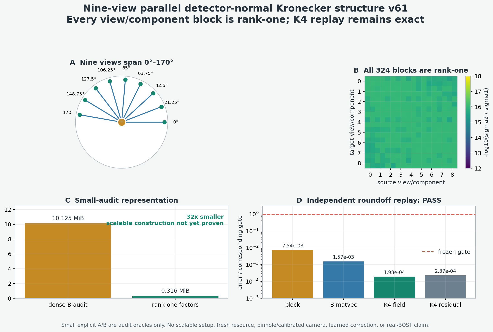

# v61：九视角平行相机的 Kronecker 结构门

## 一句话结论

v60.1 的精确因子化不只适用于 `x/y/z` 三个轴。对于 9 个平行视角、角度等间隔
覆盖 `0°–170°` 的三维 voxel-gradient BOST 算子，固定任意源视角、目标视角和
UV 分量后，`B=A A^T` 的 detector block 在“竖直坐标 × 水平坐标”重排下全部为
rank one。

正式 runner 检查了 324 个 block、17 个随机 detector vector 和 5 个 K4
observation；另一套不导入正式 core/runner 的程序重新生成几何、显式 `A/B` 和
全部指标，最大报告差为 0：

```text
maximum sigma2 / sigma1                    3.196016e-16
maximum rank-one block reconstruction      7.538547e-15
maximum factorized B matvec difference     1.572304e-15
maximum K4 field difference                1.977188e-15
maximum K4 residual difference             2.374825e-15
operator adjoint difference                0.0
```

这是从三轴走向九视角的正式代数正结果，但 v61 仍是小尺寸 parallel-ray 结构审计：

```text
nine_view_parallel_algebra_transfer=true
online_resource_result=false
scalable_factor_construction=false
pinhole_camera_transfer=false
calibrated_camera_transfer=false
curved_ray_transfer=false
operator_learning_result=false
real_bost=false
algorithm_breakthrough=false
paper_success=false
```



## 1. 为什么这一步比“再换一组坐标”更重要

v59 只改变坐标尺度和长宽比，三条 LOS 仍与 `x/y/z` 轴重合。v60.1 利用这个
三轴结构删除了 stored `B`，但仍可能只是特殊几何技巧。

何远哲师兄的
[NeRIF](https://arxiv.org/html/2409.14722v2)
在数值实验中使用 9 个视角，覆盖 `0°–170°`；实验系统也使用九路光纤输入和
相机标定。v61 因此把正式角度固定为：

```text
0, 21.25, 42.5, 63.75, 85, 106.25, 127.5, 148.75, 170 degrees
```

其中 8 个视角都不是笛卡尔轴方向。它要回答的是：

> v60.1 的可分结构能否跨越“轴对齐”限制，进入九视角 tomography？

## 2. 结果前冻结与 scratch 披露

在冻结正式协议前做过一个小 scratch：

- `8³` 场、`8×8` detector；
- 9 个角度为 `0,20,...,160°`；
- 324 个 block 在相对奇异值阈值 `1e-10` 下都显示 rank one。

正式协议在看到正式结果前改变了角度集合，改成 NeRIF 数值范围的
`0°–170°` 等间隔九视角，并新增：

- `sigma2/sigma1 <= 1e-12`；
- block rank-one 重建误差 `<=1e-12`；
- 17 个随机 `Bv` 误差 `<=1e-12`；
- 5 个 K4 field/residual 误差 `<=1e-11`；
- exact adjoint 误差 `<=1e-11`；
- 必须由不导入正式 core/runner 的 validator 完整复算。

v61 没有资源门，也没有读取 PoolFire、BLASTNet、validation、fresh 或 test truth。

## 3. 为什么九视角仍出现 Kronecker rank one

当前九个 parallel view 都围绕 `z` 轴旋转，detector 的竖直方向保持为 `z`。
把第 `θ` 个视角的两个分量分别记为 `A_{θ,u}` 和 `A_{θ,v}`。

在规则张量网格、固定平行射线和可分边界 support 下：

```text
A_{θ,u} = Z_u ⊗ H_{θ,u}
A_{θ,v} = Z_v ⊗ H_{θ,v}
```

其中：

- `Z_u` 是竖直方向的 support 与 interpolation；
- `Z_v` 还包含竖直导数；
- `H_{θ,u}` 是 xy 平面内沿 camera-u 方向求导后的 LOS 投影；
- `H_{θ,v}` 是 xy 平面 LOS 投影。

因此任意目标/源视角和分量的 detector-normal block 为：

```text
B_{(t,c_t),(s,c_s)}
  = A_{t,c_t} A_{s,c_s}^T
  = (Z_{c_t} Z_{c_s}^T)
    ⊗
    (H_{t,c_t} H_{s,c_s}^T).
```

将 block 从 `(v_t,u_t,v_s,u_s)` 重排为
`(v_t,v_s) × (u_t,u_s)` 后，它就是两个矩阵向量化后的外积，所以 Kronecker
rank 为 1。

这个解释也说明了边界：

- 角度在 xy 平面变化不会破坏结构；
- detector-v 方向、roll/elevation、pinhole rays 或每条 ray 不同的校准路径可能
  破坏同一个竖直因子；
- 曲折光线依赖未知场，更不能直接继承线性 Kronecker 等式。

## 4. 正式几何与独立复算

| 项目 | 正式设置 |
| --- | --- |
| 场 | `8×8×8`，512 unknowns |
| 视角 | 9，覆盖 `0°–170°` |
| detector | 每视角 `8×8×2` |
| observation | 1,152 values |
| samples per ray | 32 |
| support | 一层 zero-Dirichlet 外边界 |
| dtype | float64 |
| operator | matrix-free voxel gradient + trilinear sampling + camera-plane projection |

正式 runner 为小型审计显式构造 `A∈R^(1152×512)` 和
`B∈R^(1152×1152)`。独立 validator 重新执行同一离散定义，但没有导入正式
factorization、runner 或 replay 函数。

| 检查 | 数量 | 最大误差 | 门 | 结果 |
| --- | ---: | ---: | ---: | --- |
| `sigma2/sigma1` | 324 blocks | `3.196016e-16` | `1e-12` | PASS |
| rank-one block 重建 | 324 blocks | `7.538547e-15` | `1e-12` | PASS |
| factorized `Bv` | 17 vectors | `1.572304e-15` | `1e-12` | PASS |
| K4 field | 5 observations | `1.977188e-15` | `1e-11` | PASS |
| K4 residual | 5 observations | `2.374825e-15` | `1e-11` | PASS |
| adjoint | 1 seeded test | `0.0` | `1e-11` | PASS |

## 5. 当前存储结果为什么还不能写成部署优势

在这个小审计中：

```text
dense B audit       10.125 MiB
rank-one factors     0.316 MiB
factor / dense       0.03125
```

即 factor state 比 dense `B` 小 32 倍。但这些 factors 是从显式小型 `B` 的
block SVD 中提取的。v61 只证明结构存在，还没有证明：

1. 在 `16×16×32` 或更高分辨率上不构造 dense `A/B` 就能直接生成 factors；
2. factorized `B` 的实际实现比 matrix-free `A(A^T y)` 或 CGLS 更快；
3. 101 帧的 fresh outer wall、process memory 和 setup break-even 通过；
4. pinhole/校准几何下仍是 exact rank one。

所以 `32× smaller` 只是一项 small-audit representation 数字，不是正式内存加速
结论。

## 6. 对论文路线的真实提升

v61 把可解释物理核心的适用范围从三条轴扩展到了九视角平行 tomography。由此可以
形成更清楚的方法分工：

```text
exact parallel core
  = nine-view Kronecker detector-normal replay

learned component
  = calibrated pinhole / roll / elevation / curved-ray residual correction
```

与“网络直接 observation→3D field”相比，这条路线的潜在优势是：

- 网络只拟合明确的模型失配，不重复学习已经可精确计算的直线几何；
- exact core 保留 zero-start CGLS K4 的场和 residual；
- correction 可以按相机、view pair 或低 Kronecker rank 解释；
- 可以独立做 no-correction、analytic correction、low-rank correction 和 learned
  correction 的一对一消融。

但数据空间 CG、Kronecker/tensor 分解和 projection-space 计算都有大量先验工作。
当前不能声称“首次使用 data-space”“首次使用 Kronecker”或“全球唯一”。论文的新意
必须来自 BOST 特定的九视角结构、严格的 matched-accuracy/resource 证据、可观测
校准修正和真实实验闭环的组合。

## 7. 下一道正式门

下一步只做一件会改变论文判断的事：

> 从一维竖直和二维水平 operator primitives 直接生成九视角 factors，在
> `16×16×32` 场上完全不 materialize dense `A/B`，再运行 101-call fresh
> resource gate。

必须同时比较：

1. Zero-CGLS K4：`4A+4A^T`；
2. matrix-free detector CR：每步显式 `A(A^T·)`，作为 data-space 但无结构控制；
3. dense/CSR `B`：仅在尺寸允许时作为存储和 setup 对照；
4. analytic Kronecker `B`：四步后一次 `A^T`；
5. exact field/residual、core compute、outer p50/p90/worst、setup、worker/process
   memory。

只有该门通过，才进入 pinhole/elevation/roll 压力测试；只有压力测试显示误差具有
低秩、可观测和稳定结构，才授权最小 learned correction。真实 BOST 仍需师兄提供
相机内外参、九视角 ray layout、位移和重复测量。
