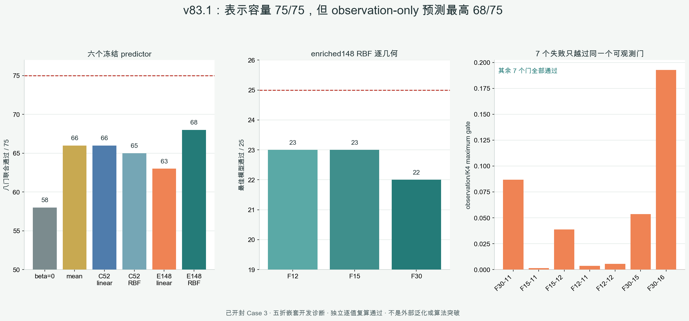

# v83.1：空间调制容量存在，但 observation-only 预测最高 68/75

## 一句话结论

在已经开封的 BLASTNet H2-air Case 3、`25 帧 × 3 档几何 = 75` 个开发单元上，v83.1
严格重做了五折嵌套预测：每一折都只用外折训练部分生成上游系数、四维空间调制标签和超参数，
不复用全局 OOF 标签。四参数表示在 `75/75` 个 held-out 单元中仍能由 truth-aware oracle 找到
八门通过解，但六个冻结的 deployment-visible 预测器没有一个达到 `75/75`，最佳 enriched RBF 为
`68/75`。



因此，v82 的正结果不是被推翻，而是被划清了边界：**表示有容量，不等于只看 observation 就能稳定
找到正确的四个系数。** 当前是可信负结果，`algorithm_breakthrough=false`。

## 为什么必须重做成嵌套实验

v82 的四个空间调制系数由真值可见 oracle 搜索，只回答“这个四维表示里有没有解”。要变成部署算法，
系数必须由 observation 与 known geometry 预测。直接拿全体样本预先生成的上游 OOF 系数再做外折，
会把另一个外折的信息混入当前训练过程，因此 v83.1 为每一个外折重新建立完整上游链：

1. 外折训练部分内部再做 OOF，生成训练用基础系数 `a0`；
2. 外折 held-out 部分只由该折训练数据 refit 后预测 `a0`；
3. 四维 beta 标签只在相应训练上下文内生成；
4. held-out truth 只用于最后容量与八门评分，不进入 feature、模型选择或回退；
5. 五个连续时间外折之间保留一帧 embargo。

这样比较的是一个真正 split-correct 的 `observation/geometry -> beta` 问题，而不是标签先全局生成、
下游再“假装留出”。

## 冻结模型与成本

所有模型输出同一个四维 beta，经过相同参数盒与物理预算投影，再进入相同 strict CGLS K1 壳。
在线 exact 账固定为 `2A+2A^T`，空间调制本身增加 `0A+0A^T`。

| 冻结 arm | 输入 | 八门联合通过 |
|---|---|---:|
| beta-zero | 不做空间调制 | `58/75` |
| constant mean | fold-local 常数 | `66/75` |
| compact52 linear ridge | 52 维部署可见特征 | `66/75` |
| compact52 RBF KRR | 52 维部署可见特征 | `65/75` |
| enriched148 linear ridge | 148 维部署可见特征 | `63/75` |
| enriched148 RBF KRR | 148 维部署可见特征 | **`68/75`** |

训练侧 `276/276` 个目标、held-out 侧 `75/75` 个表示单元都有直接复算的严格八门见证。因此这里的
`68/75` 不能归因于表示容量消失，也不能归因于某些折没有可用监督目标；缺口出现在从部署可见
observation 到安全 beta 的映射上。

## 最关键的失败结构

最佳 enriched RBF 在 F12、F15、F30 分别通过 `23/25`、`23/25`、`22/25`。七个失败集中在
Case 3 的第 `11/12/15/16` 帧附近，而且结构完全一致：

- field 对 Zero-K4 no-harm 与 Zero-K2 equal-call 均通过；
- full-gradient 两个门均通过；
- interior-gradient 两个门均通过；
- observation 对同调用 Zero-K2 通过；
- **只有 observation 相对 Zero-K4 的 1% no-harm 门失败。**

最佳模型的 maximum gate 为：p50 `-0.10728`、p90-higher `-0.01333`、worst `+0.19273`。
负值代表八门仍有余量，所以绝大多数单元不只是勉强过线；但逐单元合同不允许平均值掩盖这七个失败。

这个结构改变了下一步的优先级。失败门对应最终 measurement residual，它在部署时是可观测的；因此
下一步应优先检验可观测安全回退或只对危险单元追加一轮 refinement，而不是继续扩大 beta 回归器。

## 独立复算

独立 validator 不导入 v83 正式 runner 或正式 feature helper，自己重建五折上游、52/148 维特征、
276 个训练目标、六个 arm、450 个 outer prediction、75 个 held-out 容量单元和全部八门。结果为：

```text
fit targets with direct strict witness        276 / 276
held-out capacity with direct strict witness   75 / 75
outer predictions                             450
fit-target maximum difference                   0
held-out-capacity maximum difference             0
outer-row maximum difference                     0
prediction maximum difference                    0
```

把 held-out beta 标签或父标签变异后，预测字节保持完全一致；prediction seal、formal 输出与父证据也
保持不变。Case 4/6 未读取。API 级 noninterference 得到验证，但进程级 never-read 与端到端 physics
完全独立尚未证明，不能扩大证据等级。

## 能说什么，不能说什么

可以说：在这个已开封开发工况、这个 split-correct 五折合同和六个预注册小模型中，spatial-mask4
保持 `75/75` 表示容量，但严格 observation-only 预测最高 `68/75`；七个最佳模型失败都只剩一个
可观测的 observation no-harm 门。

不能说：所有 observation-only 方法都失败、神经算子没有希望、已经外部泛化、已经提速、曲线光线
有效、真实 BOST 有效或论文已经成功。这里也没有打开 Case 4/6 来补考。

## 下一道科学门

关闭“直接回归一个 oracle beta，再靠更大网络补齐”的路线。下一门只做一个小而可证伪的机制诊断：
用部署可见的最终 residual / view balance / margin 决定接受 K1，或对危险单元追加一轮未修改 refinement。
规则必须在结果前冻结，并按实际接受率报告平均 `A/A^T`；若不能在逐单元八门成立时仍稳定少于
Zero-K4，就记录负结果并关闭该支线。已开封 Case 3 只能作为开发诊断，未来外部结论仍必须来自此前
未打开的公开反应流工况。
