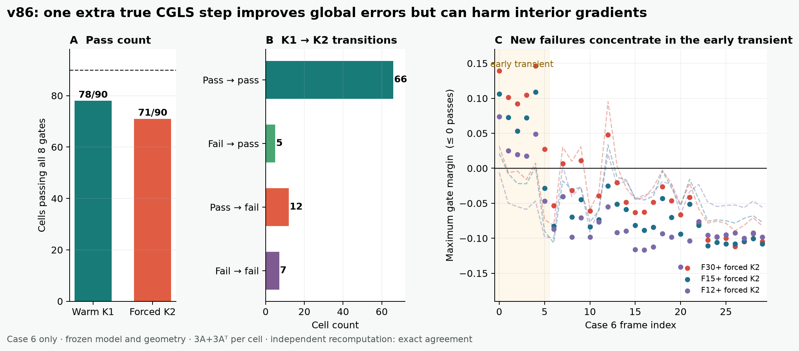

# v86：强制多走一步 CGLS 没有救回 Case 6

## 结论先说

v86 直接回答了 v85 留下的机理问题：Case 6 的失败**不只是**旧 residual gate 把所有单元过早停在 K1。保持模型、归一化、几何和 warm correction 全部不变，强制 90 个单元都沿同一条未修改 CGLS recurrence 再走一步后，完整八门通过数从 `78/90` 降到 `71/90`。

- `66` 个单元从 K1 到 K2 始终通过；
- `5` 个旧失败被 K2 修复；
- `12` 个原本通过的单元被 K2 变成失败；
- `7` 个旧失败继续失败。

因此，准确判决是 `FAIL_FORCED_K2_DOES_NOT_RESCUE_ALL_CASE6_CELLS_V86`。当前 fixed warm representation + scalar residual gate + 固定迭代深度这组方案需要关闭，不能靠“所有单元统一多迭代一步”补救。

## 为什么做这个实验

v85 在外部 Case 4 得到 `84/84`，但 Case 6 只有 `78/90`。更关键的是，Case 6 的门把 `90/90` 都留在 K1，而 12 个失败全部只来自 interior-gradient。这里至少有两种解释：

1. warm K1 本身有能力，只是安全门没有识别应当继续 K2 的单元；
2. 即使继续 K2，冻结表示或固定 recurrence 深度仍不能守住局部梯度。

v86 在读取结果前只冻结一个变化：所有 Case 6 单元无条件执行真实 K2 continuation。没有换模型、改阈值、重做归一化、改变几何或按真值重新选择候选。在线理论账从 K1 的 `2A+2A^T` 增至 `3A+3A^T`；Zero-K4 对照仍为 `4A+4A^T`。

## 结果

| 判据 | Warm K1 | Forced K2 |
|---|---:|---:|
| 全部八门通过 | 78 / 90 | 71 / 90 |
| F30+ | 23 / 30 | 21 / 30 |
| F15+ | 27 / 30 | 25 / 30 |
| F12+ | 28 / 30 | 25 / 30 |
| maximum gate p50 | -0.04173 | -0.07009 |
| maximum gate p90-higher | 0.00735 | 0.07291 |
| maximum gate worst | 0.09529 | 0.14654 |

K2 的中位数更好，但尾部显著更差。这正是不能只报平均误差的原因。

### 哪些量改善，哪些量恶化

在 90 个单元上，K2 相对 K1 的 field、整体 gradient 和 observation relative-L2 **全部下降**。它确实让全局重建和测量残差更好。但 interior-gradient 不具备这种单调性：

- K1 的失败由 `4` 个 interior-gradient / Zero-K4 no-harm 和 `8` 个 interior-gradient / Zero-K2 同调用门组成；
- forced K2 变成 `16` 个 no-harm 失败和 `5` 个同调用失败；
- 新失败高度集中在早期瞬态：frame `0-4` 的 15 个 geometry-cell 中，`11` 个由通过变失败，另外 `4` 个继续失败；frame `15-29` 的 45 个单元全部保持通过。

这说明“观测残差更小”与“局部内部梯度更安全”不是同一件事。完整 CGLS 第二步在全局二范数上继续下降，却可能把早期火焰结构的局部梯度推过 no-harm 边界。

## 独立复算

独立 validator 没有导入正式 v86 runner。它重新构造三档九视角几何、重新生成 observation-only 模型预测、独立实现 K1 和 K2 recurrence、重新预处理真值并计算全部八门。正式与独立结果为：

| 核对项 | 最大差 |
|---|---:|
| 两阶段 fields | 0 |
| 两阶段 residuals | 0 |
| 90 行逐单元结果 | 0 |
| 两组摘要与转移计数 | 0 |

独立终态是 `PASS_INDEPENDENT_RECOMPUTATION_CASE6_FORCED_K2_V86`。这证明数值和判决可复现，但不把负结果变成算法成功。

## 现在关闭什么，保留什么

关闭：

- 继续使用当前单一 relative residual threshold；
- 所有单元统一停 K1；
- 所有单元统一继续 K2；
- 用更小 observation residual 代替局部梯度安全证据；
- 直接扩大 FNO、UNO 或 U-Net 来掩盖这个机理冲突。

保留：

- warm start 在 Case 4 的 `84/84` 外部正结果；
- Case 6 中 K1 的 `78/90` 与 forced K2 的 `71/90`，作为严格的反例；
- `5` 个 fail-to-pass 说明第二步对部分单元确实有用；
- `12` 个 pass-to-fail 说明所需不是固定深度，而是能感知局部风险的阻尼或深度选择。

## 下一门

下一项只在已经开封的 Case 6 做机理可行性诊断，不补考外部结果：沿同一方向检查

`x(t) = x_K1 + t (x_K2 - x_K1),  t in [0,1]`

是否每个单元都存在同时通过八门的 `t` 区间。这里的真值只用于回答“这条一维路径里有没有解”：

- 若 90 个单元都有非空可行区间，说明方向有容量，后续问题才是用部署可见特征预测阻尼或执行 fail-closed 回退；
- 若仍有单元没有可行区间，就关闭 K1-K2 线段，重新设计 warm correction 表示，而不是换一个更大的深度选择网络。

任何新策略都必须在另一个结果前未打开的公开反应流工况上重新做一次性外部门。当前仍是 `algorithm_breakthrough=false`、`paper_success=false`、`external_generalization=false`、`real_bost=false`，也没有 wall/RSS 资源优势结论。
