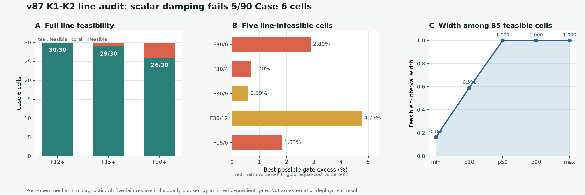

# v87：K1 与 K2 之间不是每个 Case 6 单元都有安全阻尼

## 结论先说

v87 把 v86 的“统一停 K1 失败、统一走 K2 也失败”推进成了一个完整的一维可行性问题：

`x(t) = x_K1 + t (x_K2 - x_K1),  t in [0,1]`

对每个 Case 6 单元，把 field、整体 gradient、内部 gradient 和 observation 相对 Zero-K4 的 no-harm 门，
以及相对同调用 Zero-K2 的四个非劣门，分别写成关于 `t` 的凸二次不等式。结果是：

- `85/90` 个单元有非空可行区间；
- `5/90` 个单元整条线都无解；
- `0/90` 个单元落入数值不确定带；
- F12+、F15+、F30+ 分别为 `30/30`、`29/30`、`26/30`。

正式科学判决是 `FAIL_K1_K2_LINE_LACKS_ALL_CELL_ORACLE_FEASIBILITY_V87`。因此，不再训练一个更复杂的
网络去预测单个全局 `t`；一维 K1-K2 混合家族本身已经被反例关闭。

## 为什么这比试很多阻尼值更严格

每个误差向量都沿线性路径变化：`e(t)=e_K1+t(e_K2-e_K1)`。一个门可以写成

`||e(t)|| <= B`

平方后得到凸二次式 `q(t)=a t^2+b t+c<=0`。v87 没有抽几个 `t` 做网格猜测，而是解析求出每个门在
`[0,1]` 内的完整可行区间，再取八个区间的交集。只有同一个 `t` 同时通过八门，单元才算可行。

这项事后分析没有新增精确 `A/A^T` 调用，因为 K1、K2、两组 reference 与真值已经在开封的 Case 6
机理证据中固定。若未来真正在部署时构造 K2 端点，理论在线账仍是 `3A+3A^T`；本结果不证明 wall 或
RSS 优势。

## 五个反例到底被什么卡住

五个无解单元都不是“八个可行区间彼此错开”。每个单元都有一个 **interior-gradient 门单独在整条线上
无解**：

| 几何 / 帧 | 单独阻塞门 | 线上最佳 t | 最小比值 | 门槛 | 仍超出 |
|---|---|---:|---:|---:|---:|
| F30+ / 0 | 内部梯度对 Zero-K4 不伤害 | 0.12735 | 1.03894 | 1.01000 | 2.894% |
| F30+ / 4 | 内部梯度对 Zero-K4 不伤害 | 0.04620 | 1.01700 | 1.01000 | 0.700% |
| F30+ / 9 | 内部梯度对 Zero-K2 非劣 | 0.68582 | 1.00592 | 1.00000 | 0.592% |
| F30+ / 12 | 内部梯度对 Zero-K2 非劣 | 1.00000 | 1.04770 | 1.00000 | 4.770% |
| F15+ / 0 | 内部梯度对 Zero-K4 不伤害 | 0.15127 | 1.02832 | 1.01000 | 1.832% |

这把机理定位得很具体：K1 到 K2 的全局 Krylov 更新方向不能同时照顾早期瞬态的局部内部梯度。问题不再是
“阻尼器没有学准”，而是单一全局尺度没有足够空间自由度。

## 85 个可行单元说明了什么

这个结果并不是整条主线毫无信号。85 个可行单元中，可行宽度最小为 `0.16227`，p10 为 `0.59073`，
中位数和 p90 都是 `1.0`。也就是说，大多数单元并不需要精细地猜一个尖锐系数；真正的问题集中在五个有
明确局部梯度反例的单元。

这正是为什么下一步不该扩大“预测 t”的网络。再强的选择器也无法从一个空集合里选出答案。

## 独立复算

独立 validator 没有导入正式 v87 求根器。它从原始 Case 6 场重新生成真值和九视角观测，重建三档几何与
observation-only 模型预测，独立实现 K1/K2 recurrence 和两组 reference，然后使用 `long double` 系数、
凸函数极小值分段和左右二分求根。它还用 `100001` 个点做致密交叉检查。

| 核对项 | 最大差 |
|---|---:|
| v86 K1/K2 fields | 0 |
| v86 K1/K2 residuals | 0 |
| 解析 / 独立区间端点 | 3.19e-15 |
| 结果摘要 | 6.38e-15 |

独立终态为 `PASS_INDEPENDENT_RECOMPUTATION_CASE6_K1_K2_LINE_V87`。这使负结论可复现，但不把它变成
算法成功。

## 现在关闭什么，下一步改查什么

关闭：

- 所有单元统一停 K1；
- 所有单元统一走 K2；
- 学一个单元级全局 `t` 在 K1 与 K2 之间插值；
- 用更大的 gate network 挽救这一维家族；
- 用平均误差掩盖五个内部梯度反例。

下一条最短证据链，是在已经开封的 Case 6 上检查 **现有四参数空间 warm 表示** 的 truth-aware 容量，
保持相同 exact-K1 壳和八门：

- 若它能达到 `90/90`，说明表示仍有容量，失败主要来自 Case 3 学到的 predictor 没有跨工况预测对；
- 若它也无法达到 `90/90`，就关闭该表示并增加真正的空间自由度；
- 在容量门通过前，不训练 FNO、UNO 或大 U-Net，也不再打开新的外部工况。

当前仍是 `algorithm_breakthrough=false`、`paper_success=false`、`external_generalization=false`、
`resource_advantage_proven=false`、`curved_ray=false`、`real_bost=false`。
