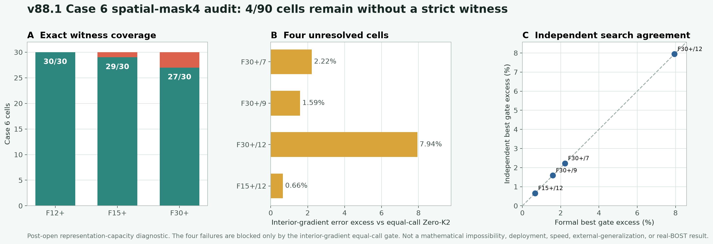

# v88.1：四参数 spatial-mask4 仍不能覆盖全部 Case 6 单元

## 一句话判决

在不改表示、不放宽八个精度门、不增加在线算子调用的前提下，v88.1 对 90 个已开封 Case 6 单元重新做了
truth-aware 可行性搜索。最终只有 `86/90` 找到严格可行 witness；余下四个单元在正式全局搜索和独立搜索中都没有找到解。

因此，当前四参数 spatial-mask4 表示不能作为“全 Case 6 都有可行 warm initializer”的依据。它应当作为工程路线关闭，下一步先增加最小的空间自由度，而不是把更大的网络接在一个容量不足的表示后面。

这不是算法突破，也不是数学上的不可能性证明。

## 为什么要做 v88.1

v87 已经证明，单一的 K1-K2 标量阻尼整条线仍有 `5/90` 个单元无解。v88 随后检查四参数 spatial-mask4，但旧判据把“其他起点的 SLSQP 是否正常终止”也列入单元通过条件：六个已有严格可行 endpoint 的单元，仅因为另一个无关起点返回数值状态 8 而被判失败。因此 v88 的 `80/90` 只能记为 inconclusive。

v88.1 只修正这一层语义：

- 一个 endpoint 经物理预算、exact replay、八门和 `2A+2A^T` 调用账验证后，就足以证明该单元存在可行 witness；
- 其他起点是否正常终止，不得推翻已经成立的存在性证据；
- 表示、方向、系数范围、物理预算、三档九视角几何、K1 shell、Zero-K2/Zero-K4 对照和八门阈值全部不变。

## 正式搜索做了什么

v88 中已有 `86` 个严格 endpoint 被逐个 exact replay 后复用。对剩下四个单元，正式程序在四维系数盒和物理预算内执行：

1. 四个冻结随机种子的 differential evolution；
2. 一次不偏向局部的 DIRECT 全局搜索；
3. 将所有全局候选和原 13 个固定起点送入约束 minimax 局部精化；
4. 对最终候选重新运行真实 K1 shell，逐个复算 field、full-gradient、interior-gradient、observation 的 harm 与 equal-call 八门。

独立 validator 没有导入正式 runner。它从原始 Case 6 场重建 90 个真值、九视角观测、三套几何、模型上下文、方向、物理预算和 Zero-K2/Zero-K4 references；随后逐个 exact replay 正式 endpoint。对于四个失败单元，它另外检查 `16384` 个确定性 Sobol 点，并从最优 `32` 个点做有限差分局部精化。

## 结果

| 几何 | 严格 witness | 未决 |
|---|---:|---:|
| F12+ | 30/30 | 0 |
| F15+ | 29/30 | 1 |
| F30+ | 27/30 | 3 |
| **合计** | **86/90** | **4** |

四个失败单元都只被同一个门阻塞：interior-gradient 相对同成本 `Zero-K2` 的误差比必须不超过 `1.0`。正式搜索得到的最优越线幅度为：

| 单元 | 最优误差比 | 越线 |
|---|---:|---:|
| F30+/7 | 1.022239 | 2.22% |
| F30+/9 | 1.015887 | 1.59% |
| F30+/12 | 1.079417 | 7.94% |
| F15+/12 | 1.006611 | 0.66% |

正式全局搜索和独立 Sobol 搜索对四个单元给出相同的最优严格 gate 边界；独立重放的 field、residual、metrics 和 gates 与正式输出最大差均为 `0`，90 个 exact replay 的调用 receipt 全部为 `2A+2A^T`。原始场重新生成观测与封存观测的最大绝对差为 `2.95e-14`，在冻结的 float64 容差内。

独立状态为：

`PASS_INDEPENDENT_RECOMPUTATION_CASE6_SPATIAL_MASK4_WITNESSES_V88_1`

科学状态为：

`NO_ALL_CELL_SPATIAL_MASK4_WITNESS_FOUND_V88_1`

## 这次真正排除了什么

这次排除了“v88 失败只是局部优化器起点不够好”这一种解释。四套 differential evolution、DIRECT、原 13 起点、独立 Sobol 网格和另一套 32 起点局部搜索，都落回同一条 interior-gradient 边界。

它也说明，继续扩大 observation-only selector 的参数量没有意义：selector 只能从当前四参数空间中选系数，不能为这四个单元创造当前空间里没有找到的严格可行场。

## 不能声称什么

- 不能声称数学上证明四个单元绝对无解；本轮是冻结搜索族下的强负证据，不是全局不可行证书。
- 不能声称算法突破、论文成功、外部泛化、速度或内存优势。
- 不能声称 curved-ray、真实 BOST 或实验室数据迁移成功。
- `86/90` 不能包装成整体成功，因为论文合同要求逐单元八门全部通过。

当前边界保持：`algorithm_breakthrough=false`、`paper_success=false`、`external_generalization=false`、`real_BOST=false`。

## 下一步为什么不是大网络

下一门只需要改变一个问题：以最小代价给 correction 增加更细的空间自由度，再先问 truth-aware capacity 能否达到 `90/90`。当前不训练 selector，也不租 GPU。只有表示容量先通过，才值得研究 observation-only 的系数预测；否则训练更大的 FNO、UNO 或 U-Net 只是让网络更用力地逼近一个容量不足的输出空间。
