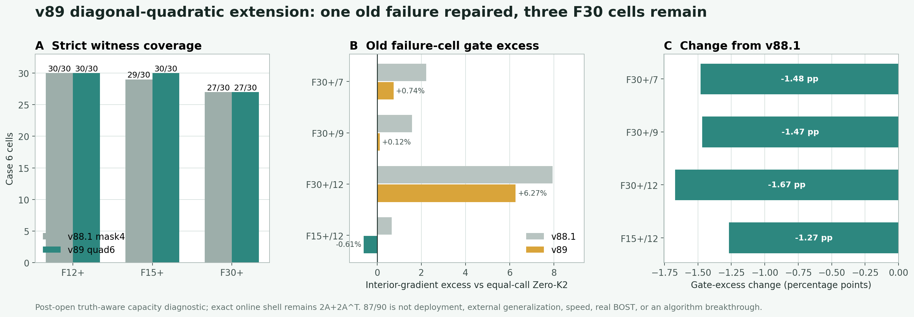

# v89：对角二次空间扩展修复一个旧反例，但仍未覆盖全部 Case 6

## 一句话判决

在 v88.1 的四参数 spatial-mask4 上，v89 只增加两个全局对角二次空间方向，并保持原四维空间精确嵌套、物理预算不变、在线调用仍为 `2A+2A^T`。90 个已开封 Case 6 单元的严格 witness 从 `86/90` 提高到 `87/90`：F15+ frame 12 被修复，但 F30+ frame 7、9、12 仍未找到通过全部八门的解。

因此，这次扩展证明二阶空间自由度确实有用，却也证明“只补全全局对角二次项”还不够。当前六参数表示不能进入 coefficient predictor 或大网络训练；下一门应先检查交叉坐标项提供的最小新增容量。

这不是算法突破，也不是数学上的不可行证明。

## 为什么这样扩展

v88.1 的四个失败都只卡在内部梯度相对同成本 `Zero-K2` 的非劣门。继续扩大网络只会更精确地预测一个容量不足的四维输出空间，所以 v89 先问更基础的问题：在不增加 exact forward / adjoint 调用的前提下，最小的二阶空间形状能不能补上缺口？

新增的两个无量纲、中心化方向为：

- `z^2-y^2`；
- `2x^2-z^2-y^2`。

它们补足对角二阶的两个无迹自由度。构造时不重新旋转原来的四个方向，而是先从新增方向中精确投影掉旧四维子空间，再只对白化后的二维余量做归一化。因此：

- v88.1 的任意四参数候选都能以 `[beta4, 0, 0]` 原样出现在 v89；
- 原有 86 个 witness 不是近似继承，而是 field 和 residual 逐值一致；
- 新增方向只改变几何预计算和便宜线性组合，不改变每个在线候选的 exact 调用账。

## 正式搜索与独立复算

正式程序先 exact replay 86 个父 witness，再只对四个旧失败单元搜索六维系数。每个候选都经过同一物理预算、真实 K1 shell、field / full-gradient / interior-gradient / observation 八门和真实 `2A+2A^T` receipt。

独立 validator 没有导入正式 runner 或正式表示核心。它重新构造六维嵌套表示、90 个问题和全部指标，并对三个残余失败单元分别执行：

- `16384` 个确定性 Sobol 点；
- `48` 个有限差分 SLSQP 局部起点；
- 真实 K1 shell 与八门逐项复算。

正式输出与独立复算的 field、residual、metrics 和 gates 最大差全部为 `0`；90 个最终 receipt 均为 `2A+2A^T`。重新生成的观测与封存观测最大绝对差为 `2.95e-14`，在冻结的 float64 容差内。

## 结果

| 几何 | v88.1 四参数 | v89 六参数 | 变化 |
|---|---:|---:|---:|
| F12+ | 30/30 | 30/30 | 0 |
| F15+ | 29/30 | 30/30 | +1 |
| F30+ | 27/30 | 27/30 | 0 |
| **合计** | **86/90** | **87/90** | **+1** |

四个旧失败的最优 interior-gradient / `Zero-K2` 门变化为：

| 单元 | v88.1 越线 | v89 越线 | 判决 |
|---|---:|---:|---|
| F30+/7 | 2.2239% | 0.7439% | 缓解，但仍失败 |
| F30+/9 | 1.5887% | 0.1202% | 非常接近，但仍失败 |
| F30+/12 | 7.9417% | 6.2713% | 缓解有限，仍失败 |
| F15+/12 | 0.6611% | -0.6062% | **修复并留有余量** |

负值表示已进入门内。三个 F30+ 失败的其他七门都通过，唯一阻塞项仍是内部梯度相对同成本 `Zero-K2`。独立搜索得到的最优越线分别为 `0.743944%`、`0.120169%`、`6.271258%`，与正式结果一致到浮点精度。

独立状态为：

`PASS_INDEPENDENT_RECOMPUTATION_CASE6_QUADRUPLE6_V89`

科学状态为：

`NO_ALL_CELL_SPATIAL_QUADRUPLE6_WITNESS_FOUND_V89`

## 这次真正学到了什么

**局部机制成功，完整算法仍失败。** 下面四点是这次结果真正改变的判断：

1. **新增自由度不是无效装饰。** 它完整修复 F15+/12，并把 F30+/7 与 F30+/9 的越线幅度明显压低。
2. **全局对角二次形状仍不足。** 三个 F30+ 单元需要的内部局部结构没有被六个全局方向完全表达，最坏单元仍超门 `6.27%`。
3. **暂时不该训练六系数预测器。** 即使真值直接参与选系数，六维空间也只有 `87/90`；observation-only 网络不能从这个空间里创造不存在的 witness。
4. **下一增量必须有明确结构意义。** 最小合理候选是加入 `xy`、`xz`、`yz` 三个交叉二次项，形成完整的中心化二次坐标族，并继续精确嵌套当前六维空间。若该九维全局多项式族仍失败，就应关闭全局低阶多项式路线，转向局部、多尺度空间方向。

## 不能声称什么

- 不能声称三个失败单元在数学上绝对无解；两套冻结搜索没有找到 witness，不是全局不可行证书。
- 不能声称已经得到可部署 predictor、神经算子优势、wall / RSS 加速或外部泛化。
- 不能声称 curved-ray、真实 BOST 或实验室数据迁移成功。
- `87/90` 不能包装成整体成功，因为论文合同要求逐单元八门全部通过。

当前边界保持：`algorithm_breakthrough=false`、`paper_success=false`、`external_generalization=false`、`real_BOST=false`。

## 是否需要 GPU

不需要。下一步仍是只有三个旧失败单元参与新增表示的 truth-aware 容量审计，CPU 足够。只有表示先达到 `90/90`，随后严格 observation-only 小模型在外折中显示稳定可预测性，才有理由租 GPU 比较 U-Net、FNO 或其他算子模型。
