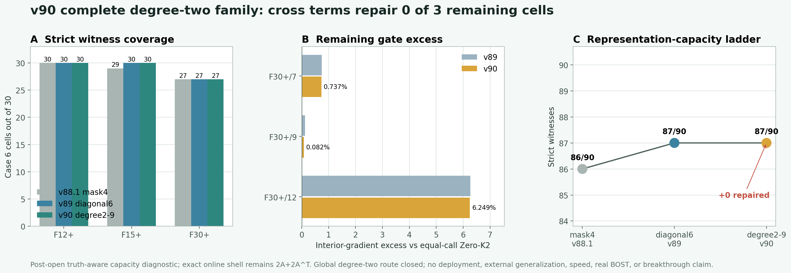

# v90：补齐三个交叉二次项后仍为 87/90，全局低阶多项式路线关闭

## 一句话判决

v90 在 v89 六参数表示上精确嵌套 `xy`、`xz`、`yz` 三个中心化交叉二次方向，形成当前构造下完整的九参数全局二阶坐标多项式族。物理预算、三档九视角几何、真实 K1 shell、八个 field / gradient / observation 门和在线 `2A+2A^T` 调用账全部不变。

结果没有新增通过单元：90 个已开封 Case 6 单元仍为 `87/90`，F12+、F15+、F30+ 分别为 `30/30`、`30/30`、`27/30`。F30+ frame 7、9、12 仍只被 interior-gradient / 同成本 Zero-K2 非劣门阻塞。

因此，这个结果关闭的是**全局中心化低阶坐标多项式表示的工程路线**。下一步不应继续训练九系数 predictor，也不应租 GPU 堆更大模型；应改为结果前冻结的局部或多尺度空间方向容量门。

这不是算法突破，也不是数学上的不可能证明。

## 为什么要补这三个方向

v89 的两个对角二次方向把严格 witness 从 `86/90` 提高到 `87/90`，说明二阶形状有用，但当时还不能判断失败来自“二阶项没有补全”还是“全局低阶形状本身不够”。v90 做最小且可解释的补全：

- `xy`：描述 x-y 联合倾斜；
- `xz`：描述 x-z 联合倾斜；
- `yz`：描述 y-z 联合倾斜。

新增三方向先从 v89 的六维物理度量空间中投影出去，再只对白化后的三维余量归一化。于是：

- v89 的六维表示逐值保留；
- 原有 87 个 witness 可用 `[beta6, 0, 0, 0]` 精确继承；
- 新增自由度不增加在线 exact forward / adjoint 次数；
- 若仍失败，就有充分工程依据停止继续堆叠同类全局二阶项。

## 正式搜索与独立复算

正式程序先对 87 个父 witness 做 exact replay，只对三个旧失败单元搜索九维系数。每个单元使用冻结的多起点全局和局部搜索，并将最终候选重新放回真实 K1 shell 逐项核对八门与 `2A+2A^T` receipt。

独立 validator 不导入正式 runner 或 v90 表示核心。它分别重建 v89 六维父空间和三维交叉项余量，然后对每个未决单元执行：

- `32768` 个确定性 Sobol 点；
- `64` 个有限差分 SLSQP 起点；
- 真实 K1 shell、八门和 exact 调用账复算。

正式输出与独立复算的 field、residual、metrics 和 gates 最大差全部为 `0`；90 个最终 receipt 均为 `2A+2A^T`。重建观测与封存观测最大绝对差为 `2.95e-14`，位于冻结的 float64 容差内。

## 结果

| 几何 | v88.1 四参数 | v89 六参数 | v90 九参数 | v90 新增 |
|---|---:|---:|---:|---:|
| F12+ | 30/30 | 30/30 | 30/30 | 0 |
| F15+ | 29/30 | 30/30 | 30/30 | 0 |
| F30+ | 27/30 | 27/30 | 27/30 | 0 |
| **合计** | **86/90** | **87/90** | **87/90** | **0** |

三个残余失败的唯一越线门变化为：

| 单元 | v89 越线 | v90 越线 | 变化 | 判决 |
|---|---:|---:|---:|---|
| F30+/7 | 0.743944% | 0.737196% | -0.006748 pp | 略有缓解，仍失败 |
| F30+/9 | 0.120169% | 0.082101% | -0.038068 pp | 略有缓解，仍失败 |
| F30+/12 | 6.271258% | 6.248878% | -0.022380 pp | 缓解很小，仍失败 |

负变化表示越线幅度下降。三个单元的其他七门均通过，但交叉二次项没有修复任何一个单元；最难单元仍超门 `6.2489%`。

独立状态为：

`PASS_INDEPENDENT_RECOMPUTATION_CASE6_CROSS_QUADRATIC9_V90`

科学状态为：

`NO_ALL_CELL_SPATIAL_CROSS_QUADRATIC9_WITNESS_FOUND_V90`

## 这次真正改变了什么判断

1. **排除了“只缺交叉项”的解释。** 三个交叉项补齐后通过数仍是 `87/90`。
2. **关闭全局低阶多项式工程路线。** 线性、径向、对角二次和交叉二次都已在同一冻结合同下检查；继续加同类全局参数不再是高价值工作。
3. **失败结构指向局部性。** 三个反例都来自 F30+，且只卡内部梯度门；这与“全局场还可以，但局部梯度结构表达不足”的解释一致。这里是证据支持的推断，不是证明。
4. **避免错误投入 GPU。** 即使真值直接参与选九个系数，表示也不能达到 90/90；更强的系数预测网络无法创造表示空间中没有的 witness。

## 下一道科学门

下一步改为**局部或多尺度方向的最小容量诊断**：在保持 `2A+2A^T` shell 和八门不变的前提下，用少量局部窗、分区或多尺度方向专门表达 F30+ 内部梯度。仍然先做 truth-aware 容量门；只有达到 `90/90`，才授权严格 observation-only predictor。

这一步仍可在 Mac CPU 上完成，不需要租 GPU。

## 不能声称什么

- 不能声称三个失败单元在数学上不存在九维解；两套冻结搜索没有找到 witness，不是全局不可行证书。
- 不能声称已经得到可部署 predictor、神经算子优势、wall / RSS 加速或外部泛化。
- 不能声称 curved-ray、真实 BOST 或实验室数据迁移成功。
- 不能把 `87/90` 包装成整体成功，论文合同要求逐单元八门全部通过。

当前边界保持：`algorithm_breakthrough=false`、`paper_success=false`、`external_generalization=false`、`real_BOST=false`。
