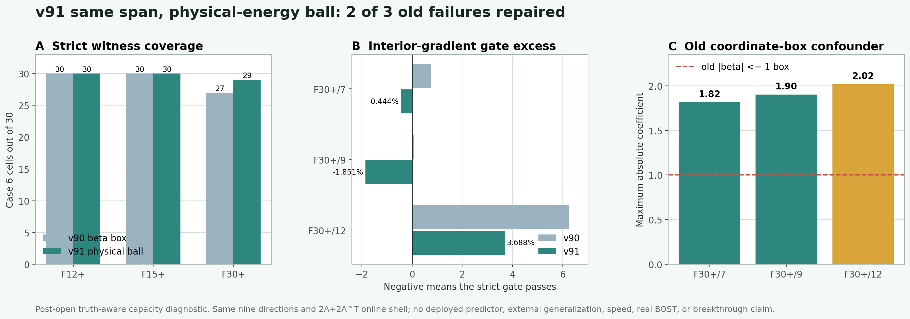

# v91：同一九维表示去掉任意系数盒后修复 2 个反例，严格容量达到 89/90

## 一句话判决

v91 没有增加任何空间方向，也没有改变九视角几何、K1 shell、八个 field / gradient / observation 门或在线 `2A+2A^T` 调用账。它只把 v90 的逐坐标系数盒 `beta in [-1,1]^9` 换成由物理修正场能量定义、对基底变换不敏感的椭球，并将其精确白化为单位球搜索。

独立复算后的结果从 v90 的 `87/90` 提高到 `89/90`：F30+ frame 7 和 frame 9 被修复，两者的见证都位于旧系数盒之外；F30+ frame 12 仍只被 interior-gradient / 同成本 Zero-K2 门阻塞，越线从 `6.248878%` 降到 `3.688360%`。

因此，v90 的旧系数盒确实造成了两个材料性的假阴性。此前“完整全局二阶表示已经整体关闭”的表述过强，应该修订为：**受旧坐标盒约束的 v90 参数化不充分；同一方向空间仍有真实容量 headroom，但还没有达到 90/90。**

这不是算法突破，也不是可部署模型。

## 为什么要先做这个控制，而不是直接增加局部基

v90 的三个失败端点都碰到了同一个人工下界 `beta=-1`，而物理修正能量并没有耗尽。如果此时直接增加局部或多尺度方向，就无法区分：

1. 现有全局二阶方向真的表达不足；
2. 方向本身足够，但任意的坐标盒截断了可行见证。

v91 用同一个九维方向空间做最小控制。物理可行域写成

`E(beta) = b + 2 l^T beta + beta^T G beta <= r^2`。

通过中心平移和 Cholesky 白化，搜索变量变成满足 `||q||_2 <= 1` 的单位球。这个可行域由修正场能量决定，而不是由某一组系数坐标决定；固定的非奇异基底变换不会改变它代表的物理修正集合。

## 正式搜索与独立复算

正式程序逐值继承并 exact replay v90 已通过的 87 个见证，只对三个旧失败单元运行结果前冻结的多起点物理球搜索。每个候选最终都回到真实 K1 shell，重新核对八门、物理能量和 `2A+2A^T` receipt。

独立 validator 不导入正式 v91 runner 或物理球实现。它独立重建物理椭球与白化映射，并对三个未决单元各执行：

- `32768` 个确定性 Sobol 点；
- `64` 个有限差分 SLSQP 起点；
- 每个候选的真实 K1 shell 与八门 exact replay。

独立结果没有找到能修复最后一个单元的新反例见证。正式与独立的 field、residual、metrics、gates 最大差全部为 `0`，`q` 最大差为 `2.78e-17`，90 个调用回执全部通过。重建观测与封存观测的最大绝对差为 `2.95e-14`，位于冻结的 float64 容差内。

独立状态为：

`PASS_INDEPENDENT_RECOMPUTATION_CASE6_PHYSICAL_BALL_V91`

科学状态为：

`NO_ALL_CELL_SAME_SPAN_PHYSICAL_BALL_WITNESS_FOUND_V91`

## 结果

| 几何 | v90 旧系数盒 | v91 物理能量球 | 新修复 |
|---|---:|---:|---:|
| F12+ | 30/30 | 30/30 | 0 |
| F15+ | 30/30 | 30/30 | 0 |
| F30+ | 27/30 | 29/30 | 2 |
| **合计** | **87/90** | **89/90** | **2** |

三个旧失败的变化为：

| 单元 | v90 越线 | v91 越线 | `max |beta|` | 旧盒内 | 判决 |
|---|---:|---:|---:|---|---|
| F30+/7 | 0.737196% | -0.444343% | 1.8155 | 否 | 修复 |
| F30+/9 | 0.082101% | -1.851370% | 1.9020 | 否 | 修复 |
| F30+/12 | 6.248878% | 3.688360% | 2.0186 | 否 | 仍失败 |

负越线表示全部八门已经留出安全裕量。两个新见证都超出旧盒的 `|beta|<=1`，所以“旧盒造成假阴性”不是口头解释，而是由实际见证直接支持。

## 这次真正改变了什么判断

1. **修正了 v90 的过早关线。** 同一方向空间在物理能量球下从 87/90 提到 89/90，不能再把三个失败全部归因于全局二阶方向不足。
2. **证明参数化本身会制造科学假阴性。** 对基底敏感的逐坐标盒不应继续作为表示容量裁决的物理约束。
3. **把问题缩小到一个单元。** 现在只有 F30+ frame 12 仍失败，且越线从 6.25% 降到 3.69%。下一次扩展可以只针对这一个局部内部梯度缺口。
4. **仍然没有授权神经训练。** truth-aware 搜索尚未达到 90/90，更大的系数预测网络不能修复表示中仍不存在的严格见证。

## 下一道科学门

下一步只为最后一个 F30+ 单元结果前冻结**最小、对称、部署可生成的局部或多尺度方向族**，继续使用物理能量参数化，并保持在线 `2A+2A^T` 与八门不变。

只有达到 90/90，才授权一个最小 observation-only predictor；此时再检查 CPU 训练规模是否真的需要 GPU。

## 不能声称什么

- 不能声称最后一个单元在数学上不存在同 span 见证；冻结的正式和独立搜索都没有找到，不是解析不可行证书。
- 不能声称已经得到可部署 predictor、神经算子优势、wall / RSS 加速或跨工况泛化。
- 不能声称 curved-ray、真实 BOST 或实验室数据迁移成功。
- 不能把 89/90 写成论文成功，当前合同仍要求逐单元八门全部通过。

当前边界保持：`algorithm_breakthrough=false`、`paper_success=false`、`external_generalization=false`、`real_BOST=false`。
