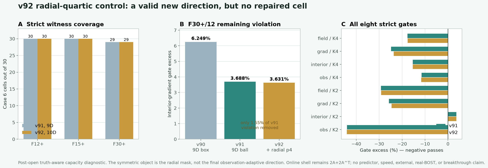

# v92：一个径向四次多尺度掩膜没有修复最后反例，严格容量仍为 89/90

## 一句话判决

v92 在 v91 已验证的九维物理球表示上只增加一个方向：用参数无关的径向四次掩膜

`p4(s) = s^2 - (46/21)s + 97/105,  s=x^2+y^2+z^2`

调制部署可见的基础修正场，再把它在离散物理 Gram 度量中对旧九维空间投影、白化。几何、K1 shell、八个精度门和在线 `2A+2A^T` 全部不变。

正式运行和独立复算都得到 `89/90`。唯一失败的 F30+ frame 12 仍只失配 interior-gradient / 同成本 Zero-K2 门；越线由 v91 的 `3.688360%` 降至 `3.631127%`，只消掉原剩余越线的 `1.551720%`，没有修复任何单元。

因此这条**单径向四次方向**已经得到清晰负结论：它线性独立、物理预算合法，但不是最后缺失的机制。不能用更大的 predictor 挽救一个仍未达到 `90/90` 的表示。

## 为什么做这个试验

v91 把问题缩小到 F30+ frame 12。该单元另外七门都有余量，只有内部梯度相对 Zero-K2 越线；九维物理球的 `q` 范数又远小于 1。这排除了“搜索范围耗尽”作为主要解释，留下“全局二阶调制缺少内部/边界尺度重分配能力”这一具体假设。

径向四次是常数与径向二次之后最低阶、无需带宽或阈值的径向多尺度掩膜。它是一次最小机制试验，而不是为了凑维度。

需要精确区分两件事：

1. 对称的是解析掩膜 `p4(s)`；它只依赖半径平方。
2. 掩膜乘上非对称的观测自适应基础修正场，再对旧空间投影后，最终场方向本身一般不保持坐标置换对称。结果不以“最终方向对称”为论据。

同样，`p4` 对 `1` 和 `s` 的正交性成立于连续均匀立方体测度；冻结的 `32x16x16` 离散网格上的实际物理正交由 Gram 投影建立，不把连续恒等式冒充离散事实。

## 结果

| 几何 | v91 物理球 | v92 加一个径向四次方向 | 新修复 |
|---|---:|---:|---:|
| F12+ | 30/30 | 30/30 | 0 |
| F15+ | 30/30 | 30/30 | 0 |
| F30+ | 29/30 | 29/30 | 0 |
| **合计** | **89/90** | **89/90** | **0** |

唯一失败单元的变化：

| 指标 | v90 | v91 | v92 |
|---|---:|---:|---:|
| interior-gradient / Zero-K2 越线 | 6.248878% | 3.688360% | 3.631127% |
| 是否通过全部八门 | 否 | 否 | 否 |

v92 端点的径向四次系数为 `-0.162204`，`q` 范数为 `0.142162`，物理预算没有超限。新方向相对旧九维空间的最小残余物理能量比为 `0.00349154`，所以失败不能解释为“新方向数值上退化成零”；它确实提供了新方向，但方向内容不对。

## 独立复算

独立 validator 没有导入正式 v92 runner 或径向四次 core。它重新：

- 从立方体精确矩推导 `46/21` 与 `-97/105`；
- 重建径向掩膜、九维父空间、离散物理投影和十维物理球；
- 对 90 个端点执行真实 K1 shell 与八门重放；
- 对未通过单元运行 `32768` 个确定性 Sobol 点和 `64` 个有限差分 SLSQP 起点。

正式与独立的 field、residual、metrics、gates 最大差均为 `0`，`q` 最大差为 `6.94e-18`，调用回执失败数为 `0`。89 个父见证的 field 与 residual 差也均为 `0`。

独立状态：

`PASS_INDEPENDENT_RECOMPUTATION_CASE6_RADIAL_QUARTIC10_V92`

科学状态：

`NO_ALL_CELL_RADIAL_QUARTIC10_WITNESS_FOUND_V92`

独立性边界仍然诚实保留：validator 共享冻结的 A/A^T physics kernels、K1 replay 和 gate evaluator，因此 `end_to_end_physics_independence_proven=false`。

## 这次改变了什么判断

1. **关闭单径向四次路线。** 它只减少 1.55% 的剩余越线，不能支撑继续沿全局径向阶数堆叠。
2. **排除“方向退化”解释。** 新方向的物理残余能量非零、Gram 条件数约为 1；失败来自机制不匹配，不是数值病态。
3. **拒绝提前训练大网络。** truth-aware capacity 仍未达到 90/90，预测器容量无法创造表示里不存在的严格见证。
4. **下一步先定位，再加方向。** 应对最后单元做结果披露的误差定位诊断，检查内部梯度缺口是否具有轴向、局域或观测残差可见结构；只有定位证据明确，才冻结一个小型局域双尺度族。

## 不能声称什么

- 不能声称十维表示在数学上不可能通过；正式和独立有限搜索没有找到见证，不是解析不可行证书。
- 不能声称这是部署模型、算子学习优势、wall / RSS 加速或跨工况泛化。
- 不能声称 curved-ray、真实 BOST 或实验室数据迁移成功。
- 不能把工程实现、独立复算或 `89/90` 写成算法突破。

当前边界：`algorithm_breakthrough=false`、`paper_success=false`、`external_generalization=false`、`real_bost=false`。
