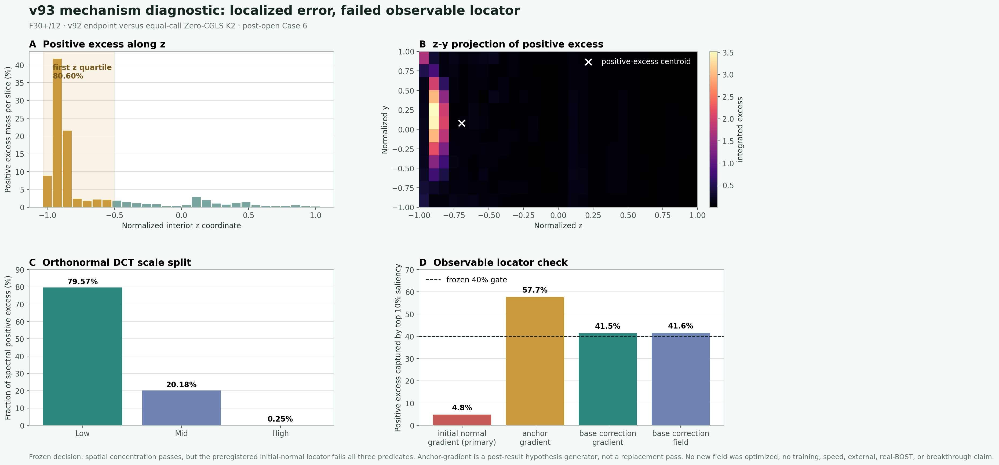

# v93：最后一个内部梯度缺口高度局部，但预注册可观测定位器看不见它

## 一句话判决

v93 没有继续加方向，也没有训练模型。它把 v92 唯一失败单元 `F30+/12` 相对同成本 `Zero-CGLS K2` 多出来的内部梯度误差，严格分解到位置、梯度分量和空间频率。

结果非常明确：前 `10%` 的内部体素承载 `76.713%` 的正误差，`80%` 的正误差只需 `12.624%` 体素；其中 `80.602%` 落在 z 轴第一个四分区，`79.572%` 的频谱正误差属于低频。**缺口确实局部、单侧、低频。**

但是，结果前冻结的部署可见定位器

`s0 = |gradient(A^T(y-Ax0))|^2`

只用其最高 `10%` 区域捕获 `4.844%` 的真实正误差，Spearman 相关为 `0.1926`，归一化质心距离为 `0.2169`；相对冻结要求 `40% / 0.35 / 0.20`，三项全部失败。

因此科学状态是：

`LOCALIZED_BUT_NOT_OBSERVABLY_LOCATED_V93`

这不是算法突破。它只告诉我们：下一步不能直接训练局部双尺度预测器，必须先修改可观测壳，或者明确接受额外的精确算子调用预算。

## 为什么做这个试验

v92 已把 Case 6 严格表示容量压到 `89/90`。最后一个单元只有 interior-gradient / Zero-K2 门高出 `3.631%`，另外七门全部通过。继续盲目增加全局多项式方向，既不能解释缺口在哪里，也容易把一次偶然搜索改进包装成“新模型”。

所以 v93 先问两个更小、更可证伪的问题：

1. 多出来的梯度误差到底是局部还是弥散？
2. 部署时本来就能得到的法向残差信号，能否在不知道真值时指出这个区域？

只有两个问题同时为真，才有理由冻结局部双尺度表示。合同、阈值和主定位器都在读取局部热图前写入版本库。

## 精确误差分解

在固定内部区域 `2:-2` 上，定义：

`e_c = gradient(x_v92) - gradient(x_truth)`

`e_2 = gradient(x_ZeroK2) - gradient(x_truth)`

每个梯度分量、每个体素的有符号差额为：

`d = e_c^2 - e_2^2`

正部分表示 v92 比 Zero-K2 更差的位置，负部分表示 v92 更好的位置。所有 `d` 求和严格等于两个内部梯度平方误差之差；正交 DCT 频谱里的差额也必须由 Parseval 恒等式回到同一个总数。

正式程序的空间恒等式差为 `1.73e-13`，频谱恒等式差为 `1.15e-14`。

## 结果

### 1. 空间上高度集中

| 空间统计 | 数值 |
|---|---:|
| 最高 5% 体素捕获的正误差 | 66.157% |
| 最高 10% 体素捕获的正误差 | 76.713% |
| 最高 20% 体素捕获的正误差 | 86.308% |
| 解释 50% 正误差所需体素 | 2.604% |
| 解释 80% 正误差所需体素 | 12.624% |
| 解释 90% 正误差所需体素 | 26.910% |

正误差质心为归一化坐标 `z/y/x = -0.695 / 0.080 / -0.053`。沿 z 轴四个等长区域的正误差占比依次为：

`80.602% / 6.896% / 9.913% / 2.588%`

这不是全域均匀的小幅退化，而是 z 负侧的一块集中缺口。

### 2. 频率上以低频为主

| DCT 频带 | 正误差占比 |
|---|---:|
| 低频 | 79.572% |
| 中频 | 20.183% |
| 高频 | 0.245% |

因此缺失机制更像一个位置偏置或大尺度局部形状，而不是细碎高频纹理。继续提高全局径向多项式阶数没有得到支持。

### 3. 主定位器三门全部失败

| 预注册判据 | 实测 | 门槛 | 结果 |
|---|---:|---:|---|
| 定位器最高 10% 区域捕获正误差 | 4.844% | >= 40% | 失败 |
| Spearman 排序相关 | 0.1926 | >= 0.35 | 失败 |
| 归一化质心距离 | 0.2169 | <= 0.20 | 失败 |

主定位器本身来自严格 K1 起点处的 `A^T(y-Ax0)`。它几乎把注意力放到了与真实缺口相反的区域，所以不能用它生成局部窗口，也不能据此训练 observation-only 局部预测器。这里“部署可见”只表示定位器生成时不读取当前 Case 6 目标真值；`x0` 仍继承冻结的 Case 3 监督模型，不能扩大成“上游全过程从未使用监督真值”。

## 一个值得保留但不能偷换判决的线索

结果前列入对照的 `|gradient(A^T z_detector)|^2` 捕获了 `57.731%` 的正误差，质心距离仅 `0.0515`，但全局 Spearman 只有 `0.3038`，仍低于原门槛。

这个对照说明“更早的 detector anchor 可能含有粗位置线索”，可以生成下一条假设；但它不能在看过结果后替代失败的主定位器，也不能把 v93 改判为通过。下一步若研究它，必须另冻结合同，并在没有参与选择的局部误差图上验证，或者明确增加一次精确调用并重新做成本账。

## 独立复算

独立程序没有导入正式 v93 runner 或局部诊断 core。它用手写二阶有限差分重建梯度，重新读取 30 个 F30+ 上下文、Zero-K2 对照、部署可见基础状态，重算空间差额、DCT 频带、六个 saliency、稳定排序和全部冻结判据。

- 标量最大差：`1.11e-16`
- 目标热图逐点最大差：`0`
- 正式输出与源码状态在复算前后不变

独立状态：

`PASS_INDEPENDENT_RECOMPUTATION_SPATIAL_ERROR_LOCALIZATION_V93`

独立性边界仍保留：正式与独立程序共享 v93 之前冻结的数据读取和九视角 physics kernels，因此不声称端到端物理实现完全独立。

## 这次成功了什么、失败了什么

- **成功：** 把“最后可能是局部缺口”从猜测变成了可复算事实，并进一步确认它主要是 z 负侧、低频结构。
- **失败：** 当前最自然的 K1 法向残差定位器没有找到这个区域，局部表示和局部 predictor 均未获授权。
- **策略改变：** 不训练大网络，不直接加局部掩膜；先验证一个新的 observation-visible 粗定位壳，或把额外 A/A^T 调用显式写进预算。

## 不能声称什么

- 不能声称已找到新的局部重建算法；v93 没有优化任何新候选场。
- 不能声称 anchor-gradient 对照已经通过；它只是看过结果后的下一假设来源。
- 不能声称外部泛化、速度、内存、curved-ray 或真实 BOST 成功。
- 不能把高度局部的误差图写成算法突破或论文成功。

当前边界：`algorithm_breakthrough=false`、`paper_success=false`、`external_generalization=false`、`real_bost=false`。
