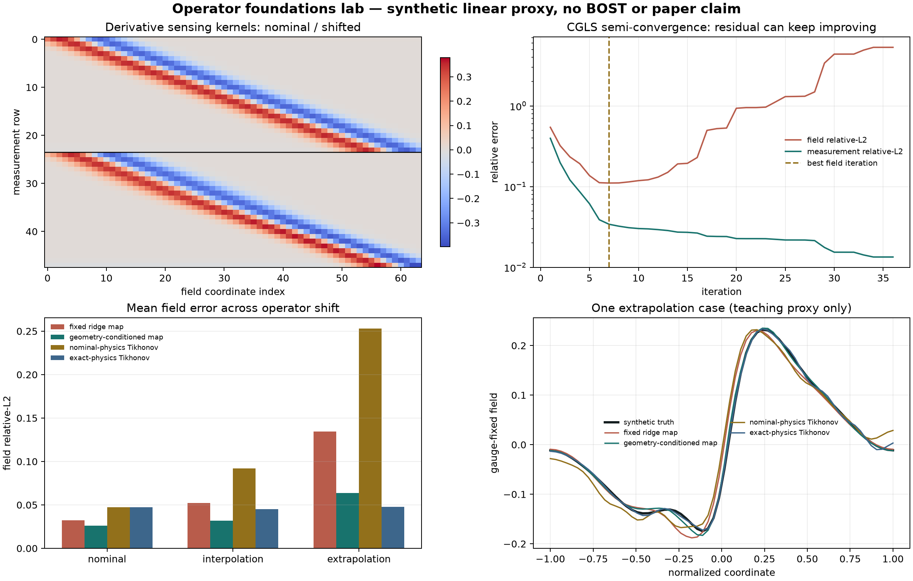

# 算子基础小实验：从伴随、gauge 到几何漂移与半收敛

> 实验等级：`EDUCATIONAL_SYNTHETIC_LINEAR_PROXY_ONLY`
>
> 当前判决：`EDUCATIONAL_LAB_COMPLETE_NO_SCIENTIFIC_AUTHORIZATION`
>
> 适用阶段：14 天学习路线的 Day 2--6 综合检查点
>
> 硬件：CPU 即可，不需要 GPU，也不值得为这个实验租卡

## 1. 先说结论

这个小实验把五个容易混在一起的概念放进同一份可运行代码：

1. `A` 与 `A^T` 的内积恒等式；
2. 导数型观测对常数偏移不敏感的 gauge/nullspace；
3. CGLS 的半收敛：measurement residual 更小，field error 反而可能更大；
4. forward operator 随几何变化时，固定逆映射为何会退化；
5. 把已知几何送入逆映射为何可能有帮助，但为什么这还远不是通用算子学习结论。

固定种子下，几何条件化线性逆映射相对固定线性逆映射的平均 field relative-L2 降低：

| 测试区间 | 几何参数 `g` | 是否在训练范围 | fixed ridge | geometry-conditioned ridge | 相对降低 |
| --- | ---: | --- | ---: | ---: | ---: |
| nominal | 0.00 | 是 | 0.03243 | 0.02605 | 19.68% |
| interpolation | 0.02 | 是 | 0.05208 | 0.03163 | 39.27% |
| extrapolation | 0.06 | 否 | 0.13428 | 0.06382 | 52.47% |

这组数字只说明：**在这一维、线性、同分布 synthetic proxy 和一个固定种子里，显式提供正确的低维几何参数有用。** 它没有证明真实三维 BOST、曲光线、NeRIF、DeepONet、FNO、FFNO 或任何新算法取得优势。

## 2. 实验到底模拟了什么

我们用一个很小的离散逆问题：

```math
y=A_gx+\varepsilon,
```

其中：

- `x in R^64` 是一维、均值固定的 synthetic reaction-morphology proxy；它由平滑峰、薄前沿和局部结构随机组合生成，但不是 CFD、DNS 或实验折射率场。
- `y in R^24` 是 24 个导数型观测。
- `A_g` 的每一行是移动后的 derivative-of-Gaussian sensing kernel，并显式减去行均值。
- `g` 是一个标量几何漂移。它只代表“观测核发生可控位移”这一件事，不等于相机位姿、折射路径、有限孔径或实验标定的完整参数。
- `epsilon` 是按 clean measurement 范数缩放的独立高斯噪声。

训练集有 240 个场，`g` 均匀分布在 `[-0.03, 0.03]`；三个测试区间各有 48 个新场：

- `g=0.00`：nominal；
- `g=0.02`：训练范围内插值；
- `g=0.06`：训练范围外的单点外推。

这个 proxy 保留了 BOST 逆问题的三个结构提醒：导数观测、欠定性和 operator shift。它刻意没有冒充真实 BOST renderer。

## 3. 四个方法怎样公平比较

### 3.1 Fixed ridge map

```math
\hat x=W_0y.
```

它只看 measurement，不知道几何 `g`。`W_0` 在同一批 240 个训练样本上用 ridge regression 拟合。

### 3.2 Geometry-conditioned ridge map

```math
\hat x=W_g[y,\;g y].
```

它使用 `[y, g*y]` 两组特征。它与 fixed map 使用**完全相同的训练 case、truth、噪声、ridge alpha 和测试 case**，但输入信息和参数量并不相同：fixed map 有 `24*64=1,536` 个系数，conditioned map 有 `48*64=3,072` 个系数。因此这里检验的是“额外几何侧信息与一阶交互特征是否有帮助”，不是严格公平的同容量架构排名。

这不是 DeepONet 或 FNO，只是最小条件化线性基线。若连它都没有帮助，就不应急着训练更大的网络。

### 3.3 Nominal-physics Tikhonov

```math
\hat x=\arg\min_x\|A_0x-y\|_2^2+\lambda\|Dx\|_2^2.
```

它始终错误地假设 `g=0`。当测试几何漂移时，它把 operator mismatch 当成场结构解释，因此外推平均 field error 上升到 `0.25288`。

### 3.4 Exact-physics Tikhonov teacher

```math
\hat x=\arg\min_x\|A_gx-y\|_2^2+\lambda\|Dx\|_2^2.
```

它在每个测试 case 都拿到正确的 `A_g`，属于 privileged teacher reference。外推平均 field error 为 `0.04766`，优于条件化 ridge 的 `0.06382`。如果真实部署不知道精确几何，它就不是可部署对照；但它显示了“把物理算子弄对”仍有明显余量。

## 4. 伴随与 gauge：先检查结构，再谈网络

离散伴随检查是：

```math
\langle A x,q\rangle=\langle x,A^Tq\rangle.
```

本次随机探针的相对误差为 `2.41e-16`。这说明代码中的矩阵乘法与转置一致，不说明 sensing kernel 是真实 BOST 物理。

每一行 sensing kernel 都被减去均值，所以：

```math
A_g\mathbf 1=0,
```

常数响应比为 `1.84e-17`。再把任意场平移 `0.7 * 1`，measurement 相对差只有 `2.63e-16`。这给出一个可见反例：measurement 完全相同，并不能唯一确定场的绝对常数。代码通过减去 field mean 固定 gauge；真实 BOST 必须依据实验边界、support 或参考状态声明自己的 gauge。

## 5. 半收敛：残差越小，场未必越真

对一个噪声更高的单例运行 36 步 CGLS：

| 检查点 | field relative-L2 | measurement relative-L2 |
| --- | ---: | ---: |
| field 最佳，第 7 步 | 0.11065 | 0.03412 |
| 最终，第 36 步 | 5.31624 | 0.01340 |

第 7 步以后，CGLS 继续拟合可观测残差和噪声；measurement residual 仍下降，但不可观测/弱可观测的场分量被放大，field error 增长约 48 倍。这里的“第 7 步最好”是用 synthetic truth 事后选择的 **oracle diagnostic**，不是部署可用的停止规则。这就是为什么真实项目不能只报告 training loss 或 reprojection residual，还要在不看测试 truth 的 calibration split 上预先固定 early stopping、正则化、held-out view 和独立物理指标。

## 6. 怎样读四联图



1. **左上：** 上半是 nominal sensing rows，下半是 shifted rows。红蓝相间代表正负导数核，不是折射率场。
2. **右上：** 绿色 measurement error 继续下降，红色 field error 在第 7 步后上升。虚线不是调出来的最好论文点，而是用 synthetic truth 做的教学诊断。
3. **左下：** operator shift 增大时，fixed map 与 nominal-physics Tikhonov 都恶化；条件化 map 较稳，但 exact-physics teacher 仍给出更低外推 field error。
4. **右下：** 只展示一个外推 case 的形状差异，不能代替逐 case 尾部统计。机器表同时保存 mean、median、worst、gradient 和 clean-measurement 指标；其中 clean-measurement 是 evaluator-only 的无噪声投影误差，不是模型实际收到的 noisy observation residual。

## 7. 本机复跑

从仓库根目录运行：

```bash
.venv/bin/python -m pytest -q learning_labs/test_operator_foundations_lab.py
.venv/bin/python -m learning_labs.operator_foundations_lab \
  --output-dir /tmp/operator_foundations_my_run
```

第二条命令要求目标目录不存在，防止静默覆盖旧证据。当前定向测试为 `6 passed`，其中一项会在同一进程内独立运行两次并逐项比较报告与数组。

主要文件：

- [实验源码](../learning_labs/operator_foundations_lab.py)
- [定向测试](../learning_labs/test_operator_foundations_lab.py)
- [完整机器报告](../learning_labs/results/operator_foundations_v1/report.json)
- [逐区间指标 CSV](../learning_labs/results/operator_foundations_v1/metric_rows.csv)
- [半收敛轨迹 CSV](../learning_labs/results/operator_foundations_v1/semiconvergence.csv)

默认结果与第二次独立运行逐字节一致。默认产物 SHA-256：

```text
cd721791...1b603f  report.json
8830d8ed...392ff1  metric_rows.csv
ebaa7052...c08969  semiconvergence.csv
64596d1a...f04     operator_foundations_lab.png
```

哈希只证明相同代码和环境给出相同字节，不证明物理真实性。

## 8. 你应该亲自完成的六个问题

1. 为什么 `A^T` 是伴随而不是逆？
2. 找一个 `x != x'` 但 `Ax=Ax'` 的明确例子。
3. 为什么 measurement residual 不能单独选择 CGLS 停止点？
4. fixed map 与 conditioned map 的训练 case 是否完全相同？从源码指出证据。
5. 为什么 exact-physics Tikhonov 是 teacher，而不是默认可部署方法？
6. 若 `g` 测错了，conditioned map 会怎样？你会设计哪三个误差档位？

能不看答案解释这六题，再进入 DeepONet/FNO/learned preconditioner，会顺很多。

## 9. 从小实验迁移到何远哲师兄方向

下一步不是把 `64` 改成 `64^3`，而是先让师兄确认真实接口：

| 小实验中的对象 | 真实 BOST 需要确认什么 |
| --- | --- |
| 标量 `g` | 相机内外参、视角、背景平面、support、ray bending、f-number/focus 中哪些在部署时可见 |
| 线性 `A_g` | 真实代码能否调用 straight/curved forward、`A/A^T`、JVP/VJP；残差在哪一层形成 |
| synthetic `x` | 重建变量是 voxel RI、density、隐式场参数还是时空张量 |
| 高斯 measurement 噪声 | flow-off repeats、背景相关 bias、位移提取误差和同步误差怎样估计 |
| test geometry | split 应按 ray、camera、rig、session、flow regime 还是时间段独立 |
| field L2 | 还需 gradient/front、held-out reprojection、PIV 补偿误差、尾部和端到端成本中的哪些 |

如果师兄给出 matrix-free `A/A^T`，可以把本实验升级为真实几何下的 classical baseline 与 operator-shift audit；如果只有 nonlinear forward/JVP/VJP，应先做 Gauss--Newton/adjoint consistency 和 straight-to-curved discrepancy；如果只有预计算 observation/field pairs，才考虑 direct inverse operator，并必须按 rig/session 留出，不能随机切 patch 假装泛化。

## 10. 现在绝不能写进论文的句子

- “提出了一种新的 BOST 算子学习算法。”
- “击败了 DeepONet、FNO 或 FFNO。”
- “证明几何条件化可在真实反应流中泛化。”
- “获得了三维重建突破。”
- “外推提升 52.47%，因此可以部署。”

当前唯一准确表述是：

> 在确定性一维线性导数观测代理中，显式几何条件化的 ridge inverse map 相对固定 ridge map 在三个预设几何点均降低平均 field relative-L2；同时 CGLS 展示了 residual--field 半收敛冲突。该结果只用于教学和真实接口设计，不构成 BOST、算法或泛化证据。

## 11. 已知限制与下一道门

- 只有一个随机种子，尚无置信区间或 family-OOD。
- 场与训练/测试都来自同一个手工 generator；外推只发生在标量几何，不发生在流动形态。
- `g` 在推理时精确已知，没有标定噪声、缺失或错配。
- forward 是一维线性导数核，没有多相机、三维插值、ray bending、有限孔径、位移提取或 4D 时间耦合。
- ridge 与 Tikhonov 超参数是固定教学值，不是经过独立 calibration split 选择的论文级参数。
- exact-physics teacher 使用部署时可能拿不到的正确算子。

因此，下一道有效门仍是 [师兄真实接口沟通单](n5_d5_advisor_first_contact_2026-07-19.md) 和 [本地回复工作台](../advisor_interface_intake.html)。在 callable、residual 层级、JVP/VJP、几何标定、认可基线、数据 split 与权限没有确认前，不启动真实科学训练。

**突破监测：没有突破。** 新增的是一个可复跑、可视化、能把五个基础概念串起来的教学实验；真实数据、三维重建、新算法、跨 rig 泛化、DeepONet/FNO 对比和论文贡献仍为 0。
