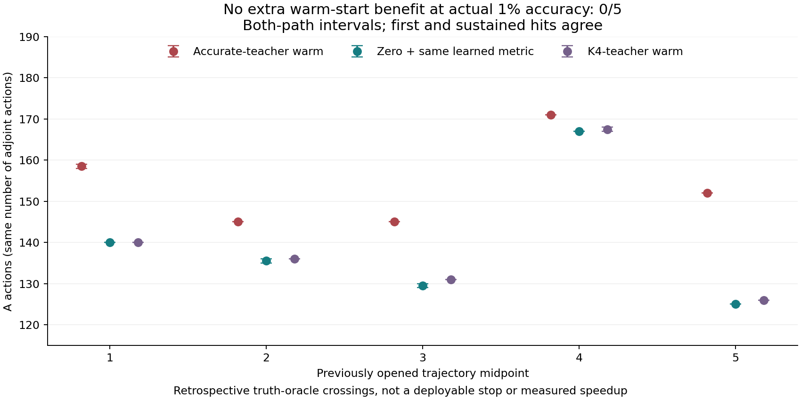

# 实际精度成本 / Actual-Accuracy Costs

2026-09-08

实际精度成本已独立复算：五个已开封轨迹中点，四项误差同时达到1%时，准确教师暖启动需要158–159/145/145/171/152次A及同次数Aᵀ；同一学习度量的零初值为140/135–136/129–130/167/125次。两套实现的成本区间在五点均明确落后，0/5通过；首次达标与持续达标判决一致。因此不能只归因于停机证书保守。仅为回顾性五点证据，不是完整轨迹或可部署停机；505帧学习度量正结果不变。

Actual-accuracy costs are independently checked at five previously opened trajectory midpoints. At simultaneous 1% error in all four metrics, accurate-teacher warm starts need 158–159/145/145/171/152 A actions and the same adjoint counts; zero starts with the same learned metric need 140/135–136/129–130/167/125. Both-path intervals robustly lose at every point: 0/5 pass, with identical first-hit and sustained-hit decisions. Conservative certificates alone do not explain the gap. This is retrospective five-point evidence, not complete trajectories or deployable stopping. The 505-frame metric result stands.

## 测了什么 / What Was Measured

同一五条已开封轨迹各一个既有中点、无噪声固定九相机。保持同一404帧外折训练预测、学习度量、求解递推、原停机证书和预算，仅补记此前未存的迭代状态。每条实现自己的初值、前三步、终点和调用记录均与原试验逐位一致，才读取真值评分；共2950个状态均做独立物理重放。控制曲线直接复用既有封存证据，不重跑控制。

One existing midpoint from each of five opened trajectories, clean fixed nine-camera geometry. The same 404-frame outer-training predictions, learned metric, recurrences, original certificate and budgets are retained; only missing intermediate states are recorded. Each implementation must reproduce its own original initial state, first three steps, endpoint and action receipt bitwise before truth scoring. All 2950 states receive independent physical replay. Sealed control curves are reused, not rerun.

## 固定比较 / Fixed Comparison

场、全梯度、内部梯度、观测四项实际误差均不超过1%，统一比较第0至256步。表中数值为A调用次数，Aᵀ次数相同；暖启动计入初始lift和投影，零场使用已知零投影。每个区间涵盖两套实现，绝不挑选更好路径。首次达标与之后到256步持续达标的次数相同。

Field, full-gradient, interior-gradient and observation actual errors must all be at most 1%, within the same steps 0–256. Entries count A actions, with equal adjoint counts. Warm starts include the initial lift and projection; zero starts use the known zero projection. Intervals cover both implementations, never the favorable path. First-hit and sustained-through-step-256 costs agree.

| 中点 / Midpoint | 准确教师暖启动 / Accurate teacher | 零初值 / Zero | K4教师 / K4 teacher |
|---|---:|---:|---:|
| 1 | 158–159 | 140 | 140 |
| 2 | 145 | 135–136 | 136 |
| 3 | 145 | 129–130 | 131 |
| 4 | 171 | 167 | 167–168 |
| 5 | 152 | 125 | 126 |

五点均满足：即使取暖启动最佳成本，也高于便宜控制最差成本，所以0/5通过、5个稳健失败、0个不确定。旧冷启动曲线的一步差异仍标为原有exact-count不确定；本次预先固定的区间比较不改写旧判决。这里以真值事后确定达标步数，**不是可部署停机规则，也不是实测速度**。

At every point, even the best warm cost exceeds the cheaper control's worst cost: 0/5 pass, 5 robust failures and 0 inconclusive. The cold curve's old one-step exact-count uncertainty remains unchanged; this separately preregistered interval comparison does not rewrite it. Truth identifies the crossing retrospectively: **not a deployable stopping rule or measured speedup**.

## 结论与边界 / Decision and Limits

当前固定准确教师/ridge暖启动组合不因更准确的教学解而减少实际达标调用。停机证书保守不是唯一原因。关闭这套固定组合，不扩到505帧，不改ridge、教学深度、阈值或预算救结果；不否定全部暖启动或C路线。此前完整505帧残差度量收益不变，但那是零初值求解，不是暖启动价值，也没有证明胜过完整缓存直接解。

This fixed accurate-teacher/ridge warm composition does not reduce actual-accuracy calls despite more accurate teaching solutions. Certificate conservatism is not the sole explanation. Close this composition without a 505-frame expansion or changes to ridge, teacher depth, thresholds or budget. This does not refute all warm starts or the C route. The prior full 505-frame residual-metric benefit stands, but concerns zero-start solving, not warm value, and does not establish superiority to a fully cached direct solve.

独立稀疏/网格评分最大相对差3.69e-15，原生投影差7.09e-16；退出后全部封存与区间判决再次核对。恢复计算2950A+2950Aᵀ，1475F+1470Fᵀ+2940T；离线评分另有2950次稀疏A、2950次原生A和10次一致性A。准备、训练和学习度量均非免费；这些是审计账，不是在线部署账。本轮没有新模型、外部数据、资源加速或真实BOST结果。

Independent sparse/grid scoring differs by at most 3.69e-15 relatively; native projections by 7.09e-16. Post-exit auditing rechecks all seals and interval decisions. Recovery uses 2950 A plus 2950 adjoint actions, 1475 F plus 1470 adjoint-F plus 2940 T actions. Offline scoring adds 2950 sparse A, 2950 native A and 10 consistency A actions. Preparation, training and the learned metric are nonfree. This is audit work, not online deployment cost. No new model, external data, resource speedup or real-BOST result is claimed.

[脱敏汇总 / Redacted summary](poolfire_actual_warm_cost_20260908.json) | [保留的505帧证据 / Retained 505-frame evidence](poolfire_full_control_cost_20260908.md)
