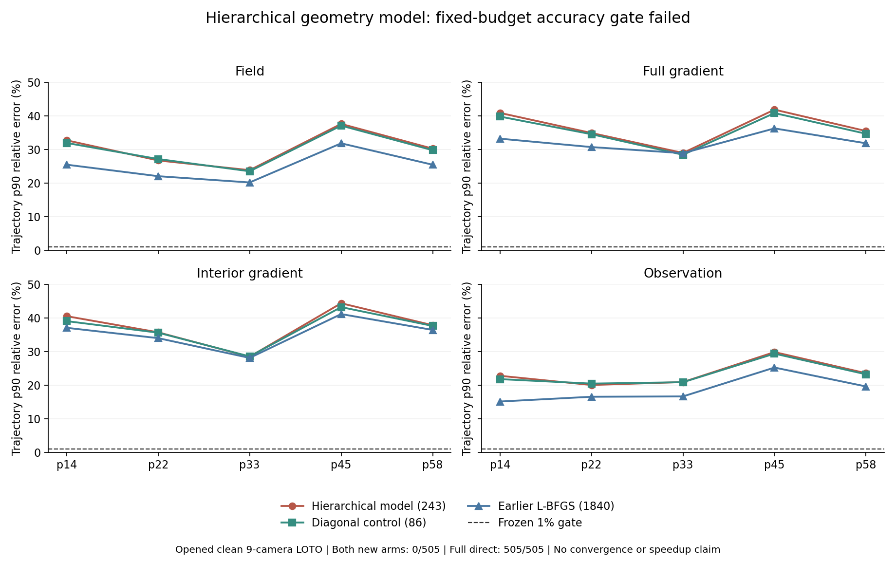

# 243参数分层几何模型 / Hierarchical Geometry Model With 243 Parameters

2026-09-07

243参数分层几何模型完成首次精度训练与独立复算：新模型和86参数便宜对照均为0/505帧、0/5完整轨迹通过四指标1%门。新模型在485帧上至少一项指标差于便宜对照；完整直接解仍505/505通过。十次拟合均在200次迭代预算耗尽后停止，未证明收敛。关闭这套固定训练方案，不推断全部分层表示无效，也不声称算法或速度突破。

The 243-parameter hierarchical geometry model completes its first accuracy fit and independent verification. It and the cheaper 86-parameter control pass 0/505 frames and 0/5 complete trajectories at four-metric 1% accuracy. The new model harms at least one metric on 485 frames versus the cheaper control; full direct still passes 505/505. All ten fits stop at the 200-iteration budget without demonstrated convergence. Close this fixed training recipe, not all hierarchical representations; no algorithm or speed breakthrough is claimed.

## 实际训练 / Actual Training

此前这个结构只做过未训练的固定几何缓存查询耗时筛查，未做精度拟合。原耗时负结果保留，不能用它直接推断新几何准备加查询的总成本。本次另行冻结首次精度门，不重跑旧耗时实验，也没有复活已失败模型的权重。

This architecture previously had only an untrained, fixed-geometry cached-query timing screen, not an accuracy fit. That timing failure remains intact; it alone cannot determine geometry preparation plus query cost under new geometry. This separately frozen first accuracy gate neither repeats the old timing experiment nor revives a failed learner's weights.

新模型使用243个共享参数，根据报告的射线几何产生分层正交旋转及正增益，跨位置、分量和相机混合观测。它是结构化全秩线性映射，不是精确三维频率对齐或保证可逆重建的定理。便宜对照去掉旋转，只保留86个增益参数；两者分别从相同初始化训练，使用相同训练目标、预算和精化器。此处的“便宜”指算术结构更简单，不是实测部署加速。

The new model uses 243 shared parameters to generate hierarchical orthogonal rotations and positive gains from reported ray geometry, mixing observations across positions, components and cameras. It is a structured full-rank linear map, not exact 3D frequency alignment or a reconstruction guarantee. The cheaper control removes rotations and retains 86 gain parameters. Both fit from the same initialization with the same objective, budget and refiner. Cheaper here means simpler arithmetic, not measured deployment speedup.

五条已开封PoolFire轨迹，共505个独立帧；每折404帧训练、完整101帧轨迹留出，训练折相互重叠。只评干净九相机代理；机械支持其他相机数和乱序，不等于其他基数精度通过。输入只有观测和已报告几何；直接解teacher仅供训练折。留出truth/teacher不进入尺度、训练、停止或回退。十个模型和1010个外折端点全部封存后才评分。

There are 505 unique frames from five already-opened PoolFire trajectories. Each fold trains on 404 frames and holds out a complete 101-frame trajectory; training sets overlap. Only the clean nine-camera proxy is scored. Mechanical support for other cardinalities and permutations is not their accuracy validation. Inputs are observations and reported geometry; direct-solver teachers are training-only. Held-out truth/teachers enter no scale, fitting, stopping or fallback. All ten models and 1010 outer endpoints seal before scoring.

## 精度与对照 / Accuracy and Controls

下表为逐轨迹p90相对误差。两版均0/505通过四指标1%门、0/5完整轨迹通过；新模型相对便宜对照485帧至少一项更差，相对原1840参数强学习对照505帧至少一项更差。仍有局部指标改善，不能说每个指标每一帧都恶化。完整直接解505/505通过，22个既有版本与全部24个报告保留。

The table shows trajectory p90 relative errors. Both arms pass 0/505 frames and 0/5 complete trajectories at four-metric 1%. The new model harms at least one metric on 485 frames versus the cheaper control and on 505 versus the earlier strong 1840-parameter learner. Some metrics improve locally; not every metric worsens on every frame. Full direct passes 505/505. All 22 inherited arms and all 24 reports remain.

| 轨迹 / Trajectory | 新模型场 / New field | 对照场 / Control field | 新模型内部梯度 / New inner | 对照内部梯度 / Control inner |
|---|---:|---:|---:|---:|
| p=14kw_size=05 | 32.67% | 31.88% | 40.50% | 39.03% |
| p=22kw_size=03 | 26.68% | 27.10% | 35.70% | 35.59% |
| p=33kw_size=01 | 23.79% | 23.46% | 28.44% | 28.53% |
| p=45kw_size=05 | 37.55% | 37.04% | 44.35% | 43.20% |
| p=58kw_size=03 | 30.19% | 29.73% | 37.80% | 37.60% |

十次拟合均用完200次迭代预算，并未证明收敛。新模型训练目标为0.1070至0.1296，对照为0.1054至0.1276，五折均是对照更低。这是精化前teacher误差，不是外折准确率。当前证据否定这套固定训练方案的有效性，不能证明所有分层模型都没有容量。

All ten fits exhaust the 200-iteration budget without demonstrated convergence. Final training objectives are 0.1070-0.1296 for the new model and 0.1054-0.1276 for the control, which is lower in all five folds. These are pre-refinement teacher errors, not outer accuracy. The evidence rejects this fixed recipe's effectiveness, not the capacity of all hierarchical models.

## 独立复算与边界 / Independent Verification and Scope

正式实现使用原Torch分层旋转和自动微分；另一实现独立构造几何排序、显式二维旋转及解析反向梯度。独立校准十个尺度、核验十个最终训练目标与梯度、重建1010个外折预测和物理端点，并核对尾部、乱序、强对照与调用账。最终梯度最大相对差1.80e-11，评分最大绝对差1.78e-15；原生forward也核验全部1010端点。封存输入输出和源码保持不变。独立复算未再次运行优化器，不称独立重训。

The formal path uses the original Torch hierarchical rotations and autograd. A second implementation independently constructs geometry ordering, explicit two-dimensional rotations and analytic reverse gradients. It recalibrates ten scales, verifies ten final objectives and gradients, rebuilds 1010 outer predictions and physical endpoints, and checks tails, permutations, strong controls and call accounts. Maximum relative final-gradient difference is 1.80e-11; maximum absolute score difference is 1.78e-15. Native forward also checks all 1010 endpoints. Sealed inputs, outputs and sources remain unchanged. The optimizer is not rerun: this is not independent retraining.

最初一次启动因几何数组维度适配错误，在读训练观测、teacher或评分前退出。原失败记录保留；只修形状展平，双实现、真实几何元数据与合成测试通过后另行冻结运行。这个工程错误不算算法失败，也未改超参数或科学门。

The first launch exited on a geometry-shape adapter error before reading training observations, teachers or scores. Its failure receipt remains intact. Only leading-axis flattening was corrected in both implementations, with actual geometry metadata and synthetic tests before the separate frozen run. That engineering error is not algorithm failure and changed no hyperparameters or scientific gates.

每个预测端点仍为2A+2AT，包含精确lift与未修改CGLS一步。分层旋转不是免费操作；训练、teacher、几何及独立审计成本分开计账。旧缓存查询耗时负结果保留，本轮约44分钟离线执行不代表部署时间，没有fresh-process wall、全管线RSS或加速结论。

Each prediction endpoint still costs 2A+2AT, including exact lift and unchanged one-step CGLS. Hierarchical rotations are not free; training, teachers, geometry and independent audits are accounted for separately. The old cached-query timing failure remains. Roughly 44 minutes of offline execution is not deployment timing; no fresh-process wall, whole-pipeline RSS or speedup claim is established.

学习蝶形快速线性变换已有先例，本次共享几何小网络不继承其BOST精度保证。[Dao et al., 2019](https://proceedings.mlr.press/v97/dao19a.html)

Learned butterfly fast linear transforms have prior art; it does not guarantee the BOST accuracy of this tied geometry network. [Dao et al., 2019](https://proceedings.mlr.press/v97/dao19a.html)

关闭当前固定243参数首次训练方案，不追加迭代、宽度或搜索包装成功。下一次拟合前先核对物理耦合是否能被共享表示表达。无需为了本轮失败租GPU或重复索取丢失的实验配对。不是算法突破、论文成功、外部泛化或真实BOST结论。

Close this fixed 243-parameter first-fit recipe without adding iterations, width or searches to relabel failure. Before another fit, examine whether the shared representation can express the required physical coupling. This failure requires neither GPU rental nor another request for lost experimental pairs. It is not an algorithm breakthrough, paper success, external generalization or real BOST result.

[脱敏完整汇总 / Full redacted summary](poolfire_butterfly_accuracy_20260907.json)

[上一轮频率选择模型 / Previous frequency-selective model](poolfire_spectral_camera_precision_20260907.md)
