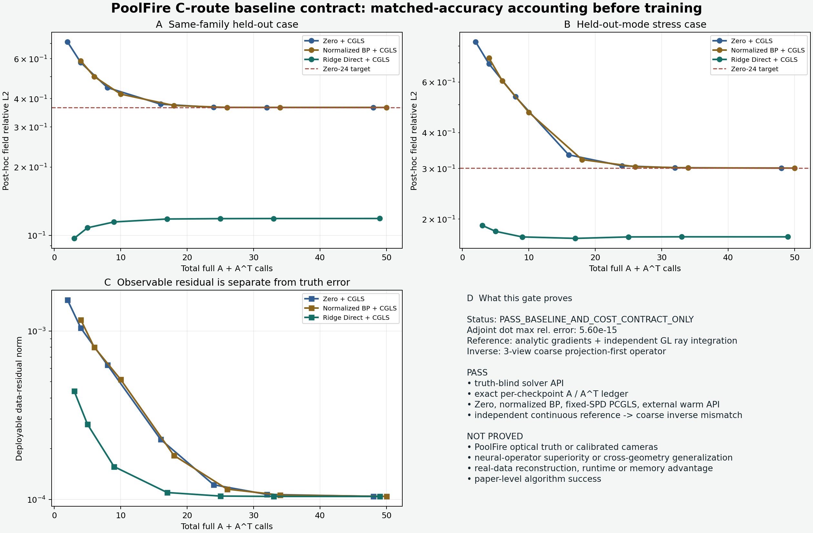

# C 路线统一强基线与成本合同证据

日期：2026-07-23  
状态：`PASS_BASELINE_AND_COST_CONTRACT_ONLY`  
证据等级：`TIER_A_SOLVER_AND_ACCOUNTING_CODE_GATE_ONLY`

## 一句话结论

Zero、归一化 BP、CGLS、固定对角 SPD-PCGLS 和外部 observation-only warm
initializer 已经使用同一个 truth-blind 求解接口，并能在每个 checkpoint 精确报告
完整多视角 `A/A^T` 调用。制造数据使用独立连续参考正演，粗网格 inverse 没有共享
离散矩阵。

这只通过了求解器与公平计账代码门。它没有证明 PoolFire 光学真值、神经算子优势、
真实重建提速、跨几何泛化或论文结果。



## 为什么先做这个

C 路线的论文问题不是“网络初值看起来更像真值”，而是：

> 在最终重建精度等价时，warm start 是否减少完整 BOST forward/adjoint 调用、
> 端到端时间和内存，并且在轨迹、工况与几何变化下仍然成立？

如果 BP 的 `A^T y`、warm start 的初始投影、网络推理或预条件器设置成本被藏起来，
“少迭代”并不等于“低成本”。如果求解器能访问测试真值，matched-accuracy 结果也
不能部署。

## 新冻结的合同

1. `pcgls_checkpoint_trajectory` 的参数中没有 truth；停止轨迹只保存可观测数据残差。
2. truth 只进入独立的 post-hoc evaluator，不会改变迭代、步长或停止。
3. Zero 到第 `K` 步严格使用 `K A + K A^T`。
4. 归一化 BP 使用 `1 A^T + 1 A` 产生最优标量 backprojection，并复用已计费投影；
   后续第 `K` 步总成本为 `(K+1) A + (K+1) A^T`。
5. 非零 Direct/Warm 初值必须显式支付一次初始投影，再进入 `K/K` refinement。
6. 每个 checkpoint 保存累计 `A/A^T`、推理次数、算子时间和端到端墙钟，不只保存
   最大迭代总数。
7. cached projection 不再接受裸数组。token 只携带 opaque ID；field SHA-256 与
   projection 保存在当前 operator 的私有不可写注册表中，读取时重新核对 field；
   scale 会消费旧 token，求解器使用后再消费新 token，批量运行结束注册表必须归零。
8. PCGLS 当前只接受精确类型、不可变且严格正的 `FixedDiagonalSPD`；求解器直接做
   diagonal multiplication，不调用可被子类覆盖的 callable。
9. direct initializer 只接收只读 observation，并由审计层计时；但 Python closure
   仍不能证明没有捕获外部状态，因此当前明确标为
   `CONTROLLED_INPUT_SELF_ATTESTED`。
10. evaluator 默认不去全局均值。去均值必须提供与同一个 inverse 实例绑定、花费
    `2 A` 的数值 gauge certificate。certificate 也只携带 opaque ID，数值报告由签发
    operator 私有保存；伪造记录或换 wrapper 都会拒绝。这里只能叫 numerically
    verified，不能叫数学证明。
11. independent reference 不再由结果文件手写 `true`：runner 会核对 reference/inverse
    的精确类型、实现模块、运行实例、无 adjoint 接口和
    `discrete_inverse_matrix_shared=false` 声明，再汇总机器判决。

## 制造数据设置

| 项目 | 本门设置 |
|---|---|
| field grid | `9 x 9 x 11` cell centres |
| views | 三个轴向正交视角；一次 `A` 表示完整三视角调用 |
| truth/reference | 11 个连续解析 Gaussian 模式及解析梯度 |
| observation generator | 独立 composite Gauss-Legendre straight-ray reference |
| inverse | 三视角 `ProjectionFirstInteriorStraightRayOperator` |
| matched-accuracy checkpoints | 每一步 `1...24`；图上只显示 `1/2/4/8/12/16/24` |
| Direct baseline | 64 个不重叠 coefficient samples 拟合的线性 ridge map |
| stress case | 在测试场中加入一个训练 basis 未见的 Gaussian mode |

reference 与 inverse 对同一 coarse truth 的投影相对差为：

- same-family held-out coefficients：`15.091%`
- held-out-mode stress：`19.370%`

因此这不是 inverse crime，但也意味着误差同时包含 coarse inverse 的 model mismatch。

## 代码门结果

| 检查 | 结果 |
|---|---:|
| 三视角 stacked adjoint dot test，12 cases | 最大相对误差 `5.60e-15` |
| 常数场 inverse 输出绝对范数 | `4.83e-15` |
| 常数响应 / 非常数 probe 响应 | `1.08e-16`，门为 `1e-12` |
| explicit identity PCGLS 与 CGLS 最大场差 | `0` |
| 定向测试 | `14 passed` |
| truth in solver signature | `0` |
| forged/mismatched projection cache | 拒绝 |
| cache one-shot consumption / batch registry | 旧 token 拒绝；运行后 `0` |
| forged/cross-wrapper gauge certificate | 拒绝 |
| arbitrary/time-varying preconditioner | 拒绝 |
| end-to-end peak memory | 未测得，只报告 solver state lower bound |

## 同精度调用账本

目标定义为同一 case 的 Zero-CGLS-24 post-hoc field relative-L2。它不是在线停止规则。

| case / arm | 目标 field rel-L2 | 首次达标迭代 | 达标总 `A` | 达标总 `A^T` |
|---|---:|---:|---:|---:|
| same-family / Zero | `0.365858` | 24 | 24 | 24 |
| same-family / normalized BP | `0.365858` | 22 | 23 | 23 |
| same-family / ridge Direct warm | `0.365858` | 1 | 2 | 1 |
| held-out-mode / Zero | `0.301107` | 24 | 24 | 24 |
| held-out-mode / normalized BP | `0.301107` | 23 | 24 | 24 |
| held-out-mode / ridge Direct warm | `0.301107` | 1 | 2 | 1 |

这些数字**不能**写成算法成功。ridge map 的训练与测试共享一个有限解析模式家族；
stress 也只留出一个模式，不是新相机、新网格、新反应工况或真实 CFD。

## 最重要的机制线索

same-family direct-only 的 field relative-L2 为 `8.39e-10`，但加入一次 coarse inverse
CGLS correction 后误差约为 `9.69e-2`，随后停在约 `1.19e-1`。也就是 observable
residual 继续下降时，truth error 反而上升。

held-out-mode direct-only 误差为 `0.2179`，此时 refinement 又能把最终误差降到
约 `0.1735`。

这说明一个固定 residual correction 规则在 model mismatch 下可能既帮助也伤害。
它为后续 C0 提供了可证伪问题：

> 能否只用部署可见量，判断 warm field 应该被修正多少，并在错误 forward 或新模式
> 下 fail closed？

候选机制是 calibration-aware correction budget、可信 residual envelope 或固定
trust-region，而不是直接把“第一步 field error 好看”写成新算法。

## 突破监测

**没有算法突破。**

新增的是首个可复现、truth-blind、逐 checkpoint 计费的 C 路线求解底座，以及一个
明确的 model-mismatch/refinement 冲突信号。真实 PoolFire/BOST、神经算子、跨工况
泛化、端到端 GPU 时间、峰值内存和论文结论仍然为 0。

## 复现

```bash
cd oerf-bishe-dashboard
python site_tools/run_poolfire_c_baseline_contract_gate.py
python -m pytest -q \
  site_tools/test_poolfire_c_baselines.py \
  site_tools/test_run_poolfire_c_baseline_contract_gate.py
```

机器结果：

`learning_labs/results/poolfire_c_baseline_contract_gate_v0/result.json`

## 下一道主线门

1. 向师兄确认 PoolFire 的 point sample / finite-volume cell average、坐标单位与真实
   domain edges。
2. 冻结 `rho/T/Y_k -> Delta n`、reference/gauge、相机/ROI、deflection 单位与符号。
3. 把同一账本接到公开 CFD 的独立高分辨率 field/observation pair。
4. 在不看测试 truth 的前提下实现 C0：Direct initial field 加受限 adjoint-residual
   correction。
5. 用跨 trajectory、跨 case、跨 geometry 的 matched-accuracy p50/p90/worst 门决定
   C0 是否继续；未过门就否掉，不升级 C1/C2。
