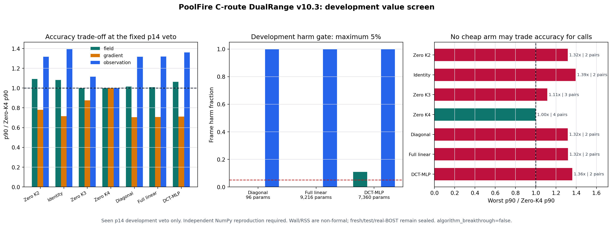

# PoolFire C 路线 v10.3：三种 DualRange 候选均未通过开发兼容性门

## 一句话结论

这轮真正训练并独立复算了三种只看 observation 的 DualRange-K1 候选：

- 96 参数逐频率对角修正；
- 9,216 参数全线性频率耦合；
- 7,360 参数奇对称 DCT-MLP。

它们都只需要每帧 `2A+2A^T`，但没有一个能在已见
`p=14kw_size=01` 开发否决轨迹上匹配 Zero-CGLS K4 的
field / gradient / observation 三项精度。正式判决是：

`FAIL_NO_DUALRANGE_V10_3_MODEL_PASSES_DEVELOPMENT_COMPATIBILITY`

因此不实现正式 outer worker，不打开 fresh holdout 或 test，也不把负结果包装成
算法、速度、泛化或论文成功。



## 这次到底检验了什么

主参考固定为从零开始的 CGLS K4：

```text
Zero-CGLS K4 = 4A + 4A^T
```

候选在观测空间产生 proposal，再由精确伴随提升到三维场：

```text
z_theta = y + B_96 delta_theta(y)
h       = A^T z_theta
x0      = alpha h
x1      = CGLS-K1(x0)
total   = 2A + 2A^T
```

`B_96` 是结果前固定的 96 个低频 detector-DCT 模态，修正范数不超过原始低频
谱范数的 50%。`alpha` 只由部署可见 observation 做解析线搜索。网络不能调用
`A/A^T`，训练目标是五条 fit 轨迹的冻结 K4 teacher；完整轨迹
leave-one-trajectory-out 选择 epoch，最终只在 checkpoint 封存后打开一次 p14
评分。

结果前另有两个冻结合同：

- [v10.3 开发价值筛选合同](../learning_labs/protocols/poolfire_c_dual_development_screen_contract_v10_3.json)
- [v10.3.1 训练语义澄清](../learning_labs/protocols/poolfire_c_dual_development_screen_clarification_v10_3_1.json)

后者在读取 p14 结果前明确了逐 slot 轨迹等权梯度、完整轨迹 checkpoint 选择、
零初始化线性控制、exact 2D projected LS 成本，以及唯一 K4 teacher 来源。

## 先看便宜控制

表中数值是 p14 共 101 帧的 relative-L2 p90，越低越好。`pairs` 是完整
`A/A^T` 对数，不包含虚构的免费物理算子。

| 方法 | pairs | field p90 | gradient p90 | observation p90 | 开发兼容 |
|---|---:|---:|---:|---:|---|
| Zero K2 | 2 | 0.6911 | 0.9503 | 0.4383 | FAIL |
| Identity DualRange-K1 | 2 | 0.6853 | 0.8709 | 0.4645 | FAIL |
| Zero K3 | 3 | 0.6329 | 1.0661 | 0.3713 | FAIL |
| Zero K4 reference | 4 | 0.6332 | 1.2180 | 0.3330 | PASS reference |

这里有两个重要事实：

1. Exact 2D projected LS 与 Zero K2 在全部三类逐帧指标上数值等价，最大差约
   `2.6e-15`。所以“解析求两个系数”没有凭空多出第四步 Krylov 信息。
2. Zero K3 的 field 已非常接近 K4，gradient 甚至更低，但 observation p90 仍高
   11.5%，joint match 为 0。少一次迭代不是只差一个平均数，而是缺少数据一致性。

## 三种拟合模型的结果

三种模型都由 fit-only nested selection 选择 epoch 20。训练时间约 6.3 至
6.5 分钟，只是同进程 CPU 开发时间，不是部署 wall-time 结果。

| 模型 | 参数 | field p90 | gradient p90 | observation p90 | field harm | observation harm | 判决 |
|---|---:|---:|---:|---:|---:|---:|---|
| Diagonal DCT | 96 | 0.6435 | 0.8595 | 0.4385 | 0.00% | 100.00% | FAIL |
| Full linear DCT | 9,216 | 0.6389 | 0.8607 | 0.4389 | 0.00% | 100.00% | FAIL |
| Odd DCT-MLP | 7,360 | 0.6736 | 0.8677 | 0.4534 | 10.89% | 100.00% | FAIL |

对角模型比 Zero K2 的全部 101 帧都改善 field 和 gradient；其 field 与 K2 的
逐帧相关系数为 0.973，observation 相关系数为 0.994。它学到的是一个更平滑的
低频先验，但 observation 中位误差相对 K4 仍多约 0.105。

全线性模型把 field p90 再降到 0.6389，却没有改变 observation 平台。参数从
96 增到 9,216 后仍是同一种失败，说明缺口不是简单的低频模态交叉耦合。

DCT-MLP 也没有通过预注册的非线性门：

```text
相对更好的线性控制
field 改善 = -5.43%
gradient 改善 = -0.96%
要求        = 三项 p90 均不劣，且 field 或 gradient 至少改善 2%
判决        = FAIL
```

因此不能用“再加层、加宽、换种子”在同一已见 p14 上救结果。

## 独立复算

独立 validator 不导入正式训练 runner 的模型前向、Torch 物理算子或评分 helper。
它从封存 checkpoint 重新用 NumPy 实现：

- 三种 proposal；
- observation normalization 与 DCT 变换；
- 50% radial cap；
- `A/A^T`、observable alpha 和 CGLS K1；
- field / gradient / observation 指标与 harm 判决；
- checkpoint selection。

三种模型独立复算的逐指标最大绝对差分别不超过：

| 模型 | 最大逐指标差 |
|---|---:|
| Diagonal | `9.77e-15` |
| Full linear | `1.01e-14` |
| DCT-MLP | `9.88e-15` |

封存输入在复算前后未改变。公开聚合只保留指标、调用账和判决，不导出本地路径、
模型权重、私有 hash 或原始数组：

- [v10.3 公开聚合 JSON](poolfire_c_dual_development_screen_v10_3_public_summary.json)

## 机制判断：先查表示上限，不再盲目换大模型

Diagonal、Full linear 和 MLP 的参数化不同，但共享：

```text
z_theta = y + 96 个低频 DCT 模态中的有界修正
```

三个模型的 observation p90 都停在约 0.438 至 0.453，而 K4 是 0.333。这个共同
平台更像输出表示或修正半径的上限，不像优化器没训够。MLP 的 fit LOTO 损失也没有
优于线性控制，继续把 hidden width 从 32 改成 128 没有科学依据。

下一门改成一个明确标为 post-open mechanism diagnosis 的表示上限实验：

1. 对每帧求当前 96 模态、50% cap 内的 truth-side oracle proposal；
2. 分解 K4 所需 dual correction 在 `B_96` 内外的能量，并报告频段和 view；
3. 分开回答“表示装不下”与“表示装得下但 fit-only 学不到”；
4. oracle 也失败时，关闭当前 `B_96`，另行预注册多分辨率 detector-graph /
   spectral residual proposal；
5. oracle 通过但模型失败时，才研究 fit 目标、条件数与优化，不扩大网络规模。

这个诊断不能授权 fresh、test 或论文性能，只用于选择下一种结构。未来新候选仍必须
重新冻结完整轨迹 fit/selection、matched-accuracy、harm、调用、wall 与 RSS 合同。

## 当前边界

```text
development_screen_only=true
formal_outer_evaluation_authorized=false
fresh_holdout_opened=false
untouched_test_opened=false
formal_wall_or_RSS_measured=false
real_BOST_transfer_completed=false
algorithm_breakthrough=false
paper_result=false
```

这轮的价值不是一个好看的成功数字，而是用约 20 分钟真实训练和独立复算，关闭了
一个参数量从 96 到 9,216 都重复失败的结构族。下一轮计算将直接投入“表示有没有
理论上限”的问题，而不是继续做同义模型。
