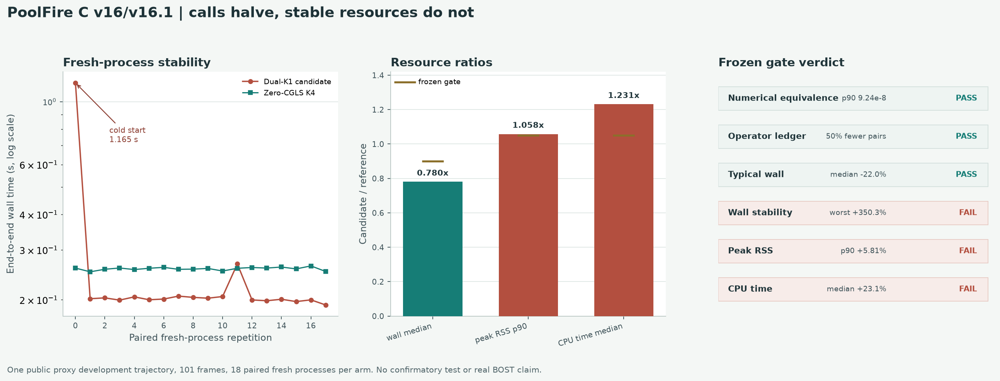

# PoolFire C v16/v16.1：调用减半成立，但稳定资源门失败

## 一句话结论

在一条此前未参与拟合的公开 PoolFire development trajectory、101 帧上，冻结的
`w16d2 Dual-K1` warm start 先通过了 v16 精度与调用门：

```text
101 / 101 frames jointly matched Zero-CGLS K4
joint harm = 0
candidate = 202 A + 202 A^T
reference = 404 A + 404 A^T
operator-pair reduction = 50%
```

随后 v16.1 用 18 组交替先后顺序的 fresh process 实测 wall、peak RSS 和 child
CPU time。candidate 的配对 wall 中位数确实降低 `22.02%`，18 对中有 16 对更快；
但第一次冷启动产生 `350.30%` wall harm，peak-RSS p90 增加 `5.81%`，配对 CPU
时间中位数增加 `23.13%`。三项资源门全部失败：

```text
FAIL_INDEPENDENT_PUBLIC_DEVELOPMENT_RESOURCE_GATE_V16_1
wall_gate_passed=false
peak_RSS_gate_passed=false
CPU_time_gate_passed=false
algorithm_breakthrough=false
```

因此当前只能说：**一条公开代理开发轨迹上，精度兼容与调用减半成立；当前实现没有
把它变成稳定、低 CPU、低内存的端到端加速。**

## 为什么做这次实验

此前多个 fit-only 和 synthetic 实验已经提示，完整 `A/A^T` 调用数减少不自动等于
真实 wall 或内存优势。v16 首次在一条额外公开轨迹上得到 101/101 compatibility，
并把每帧调用从 `4A+4A^T` 降到 `2A+2A^T`。此时最关键的问题不再是继续换网络，
而是直接测量：

> 这 50% 的完整算子对减少，能否在相同输出语义下稳定转化成端到端时间和内存优势？

v16.1 因此没有重新训练、调阈值或打开新数据，只把 v16 已通过的 candidate 和
Zero-K4 reference 改成数值等价的 streaming native 实现，执行单独冻结的资源门。

## 结果前冻结了什么

- 同一条已消费的公开 development trajectory，共 101 帧；
- candidate 与 reference 各 18 个 fresh process；
- 两个 arm 交替先运行，各自恰好先运行 9 次；
- 不做 warmup；
- parent timer 从 `execve` 前开始，到 child 完全退出后结束；
- peak RSS、user CPU 和 system CPU 都由 parent `wait4` 在 child 退出后读取；
- candidate 最多 6 个并发线程，reference 为 1 个；禁止 equal-core speedup 声明；
- candidate 必须数值复现 v16 正式场，reference 必须逐值复现 Zero-K4；
- wall 配对中位收益至少 10%，至少 80% 配对更快，任一配对 harm 不得超过 5%；
- candidate/reference peak-RSS p90 和配对 CPU 中位 ratio 均不得超过 `1.05`；
- 任一门失败后，不允许在这条已消费轨迹上调 runtime 再重测。

本地 canonical path 与独占写入可以阻止正常流程误重跑，但不能排除特权操作者删除
全部收据后回滚。因此权威证据明确保留：

```text
one_time_batch_proven=false
deletion_or_rollback_resistance_proven=false
```

## 数值等价与调用账通过

native candidate 相对 v16 正式 candidate 的逐帧 field relative-L2 为：

| 指标 | 数值 | 冻结上限 |
|---|---:|---:|
| median | `8.54e-8` | - |
| p90 higher | `9.24e-8` | `5e-6` |
| worst | `1.04e-7` | `5e-6` |

streaming Zero-K4 与正式 reference 的差为 0。36 个 worker 在各自 arm 内输出
逐字节确定，逐帧调用 receipt 连续且精确：

```text
candidate: 101 × (2 A + 2 A^T) = 202 A + 202 A^T
reference: 101 × (4 A + 4 A^T) = 404 A + 404 A^T
```

所以 native 实现忠实复现和 50% 调用减少都是真实成功，不是资源成功。

## Wall：典型值更快，冷启动不稳定

| 指标 | Candidate | Zero-K4 |
|---|---:|---:|
| wall median | `0.2014 s` | `0.2581 s` |
| wall p90 higher | `0.2675 s` | `0.2609 s` |
| wall worst | `1.1648 s` | `0.2633 s` |

配对统计为：

```text
median wall reduction = 22.02%
candidate faster pairs = 16 / 18 = 88.89%
worst paired wall harm = 350.30%
allowed worst harm = 5%
```

第一次 candidate fresh process 为 `1.1648 s`，同对 reference 为 `0.2587 s`。
首个 candidate 的内部非求解阶段约 `0.987 s`，后续中位约 `0.038 s`；首次 solver
约 `0.087 s`，后续 solver 中位约 `0.072 s`。因此异常主要来自首次 checkpoint、
native library、context 或文件页缓存初始化，不是 CGLS K1 本身。

这支持“warm-cache fresh-execve 下通常更快”，不支持“冷启动稳定加速”。协议禁止
事后删除第 0 对来改判。

## CPU：wall 收益来自并行，不是更少计算

| 指标 | Candidate | Zero-K4 |
|---|---:|---:|
| child total CPU median | `0.3028 s` | `0.2455 s` |
| paired candidate/reference median ratio | `1.2313` | gate `<=1.05` |

candidate 总 CPU 时间多 `23.13%`。它最多使用 6 个并发线程，reference 为 1 个；
因此典型 wall 降低主要是用更多并发工作换来的，不能称 compute-cost reduction 或
equal-core speedup。

## RSS：只超一点，也必须判失败

| 指标 | Candidate | Zero-K4 |
|---|---:|---:|
| peak-RSS p90 | `116.2 MiB` | `109.8 MiB` |
| candidate/reference ratio | `1.0581` | gate `<=1.05` |

RSS 只比门高约 0.8 个百分点，但阈值在结果前已经冻结，不能因为“很接近”临时改成
通过。可能来源包括模型 workspace、线程资源、动态库页和分配器驻留；当前实验不能
进一步拆分这些来源。

即使只作机制观察、事后忽略第一个冷启动配对，CPU ratio 仍约 `1.228`，RSS ratio
仍约 `1.058`。所以整体负判不只是一个 wall outlier。

## 独立验证

正式运行前，资源协议、源码闭包、父 v16 证据链、`wait4` 计量、配对统计和 worker
身份经过两轮独立红队，最终为 `P0=0 / P1=0`。正式运行后，独立 validator 与只读
审计重新核对：

- 18×2 roster 和交替先后顺序；
- 36 份 worker report 与 `36×101` 条逐帧调用 receipt；
- observation、geometry、checkpoint、parameter、native library 和运行环境身份；
- 数值等价、确定性 field、wall、RSS、CPU 与全部门槛。

独立结果与正式 validator 完全一致，正式证据未重跑、未删掉冷启动、未打开 test。

## 成功、失败与突破边界

已成功：

- 在一条额外公开 development trajectory 上获得 101/101 compatibility；
- 精确把完整算子对从 404/404 降到 202/202；
- native streaming 实现以约 `1e-7` relative-L2 复现正式 candidate；
- 典型配对 wall 中位降低 22.02%，说明调用减少存在实际时间 headroom；
- 36 个 fresh process 的 wall/RSS/CPU 得到独立复算。

未成功：

- 冷启动稳定性失败；
- CPU 成本不降反升 23.13%；
- peak-RSS p90 高 5.81%；
- 整体资源门失败；
- 没有 confirmatory test、跨工况泛化、真实 BOST 或物理同精度证据。

**突破监测：没有算法突破。** 新增的真实价值是把“调用数优势”和“部署资源优势”
分开：当前方法在一条公开代理开发轨迹上已经证明前者，但后者被冷启动、CPU 和 RSS
三个独立瓶颈否决。下一版只有在新轨迹结果产生前冻结更轻的运行机制，并同时降低
CPU/RSS，才值得继续；不能在这条已消费轨迹上调到通过。


