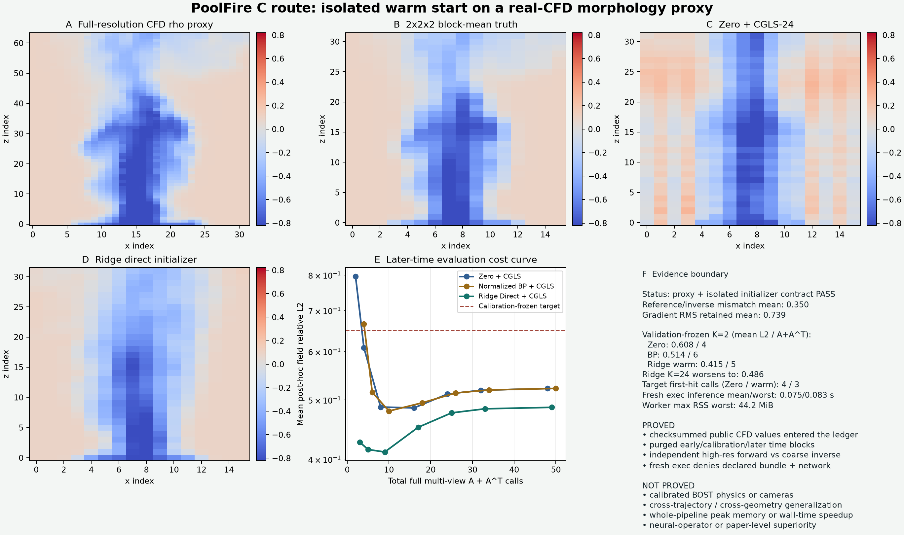

# PoolFire C 路线：独立进程 Warm-Start 成本门

日期：2026-07-23

状态：`PASS_REAL_CFD_MORPHOLOGY_PROXY_WITH_ISOLATED_INITIALIZER_CONTRACT_ONLY`

独立验证：`PASS_INDEPENDENT_ISOLATED_ARTIFACT_VALIDATION`

突破标记：`algorithm_breakthrough=false`

## 先说人话

这一轮没有换模型，也没有继续调后期五帧。它只解决一个会让后续论文结果失去
可信度的问题：

> 测试时的 warm initializer 必须在一个新的进程里，只收到冻结模型和 observation；
> 模型推理的编码、启动、计算、回传、解析时间和子进程内存必须全部记账。

新 runner 共启动了 7 个 fresh-exec worker：2 个用于冻结 refinement depth，5 个用于
后期评价。每个 worker 都通过固定 NPZ 数据协议接收模型和 observation；macOS
Seatbelt 在运行时拒绝读取声明的 CFD bundle、拒绝 canary 读写和网络访问，且没有
继承除 stdin/stdout/stderr 外的文件描述符。

这关闭了旧版 Python callable 直接捕获父进程 `truth`、inverse 或缓存的路径，但没有
证明父进程构造的 observation 与 truth 在数学上完全独立，也没有证明整个文件系统中
不存在数据副本。因此以下两个字段仍必须是：

- `evaluation_truth_noninterference_proven=false`
- `filesystem_wide_noninterference_proven=false`

## 数值有没有被隔离改坏

没有。固定模型、固定 observation 和同一个 CGLS/PCGLS refinement 下，v1 与 v0 的
field 指标一致。

| 方法 | 固定 K | 完整多视角 A | 完整多视角 A^T | 五帧平均 field relative-L2 |
|---|---:|---:|---:|---:|
| Zero + CGLS | 2 | 2 | 2 | `0.60835` |
| normalized BP + CGLS | 2 | 3 | 3 | `0.51445` |
| ridge Direct + CGLS | 2 | 3 | 2 | **`0.41486`** |

Direct warm 在五帧都领先。Direct-only 平均误差为 `0.45864`；两步物理 correction
把它降到 `0.41486`。继续跑到 `K=24` 时平均误差反而升到 `0.48620`，所以当前最值得
继续验证的机制仍是：

> forward mismatch 下，warm start 需要有限、可校准的 correction budget；残差继续
> 下降并不保证 field truth 继续改善。



## 调用数与同精度门

当前 matched target 是 refinement-validation 两帧上
`1.02 x worst Zero-CGLS-24 field-L2`，冻结值为 `0.64945`。在后期五帧中：

| 方法 | 达到 target 的帧数 | 首次达到 target 的平均完整 A+A^T |
|---|---:|---:|
| Zero | 5/5 | `4` |
| normalized BP | 5/5 | `6` |
| ridge Direct | 5/5 | **`3`** |

这提供了“同一冻结精度阈值下减少完整物理调用”的开发证据。但 target 较宽松，五帧
已经在 v0 开发中打开，而且只有一条 trajectory；它不能被写成 fresh 泛化或算法优势。

## 完整推理成本

7 次隔离推理的正式账本：

| 项目 | 结果 |
|---|---:|
| request 大小 | `2,317,566 bytes` |
| response 大小 | `66,973 bytes` |
| fresh-exec wall time mean | `0.07537 s` |
| fresh-exec wall time p90 | `0.08046 s` |
| fresh-exec wall time worst | `0.08305 s` |
| child max RSS mean | `42.66 MiB` |
| child max RSS worst | `44.20 MiB` |

wall time 从 request 编码前开始，到 stdout 完整读取、NPZ 解码、字段类型/shape、模型
SHA、输出 SHA 和 isolation receipt 全部核验后结束。stdout/stderr 在物化前有硬上限，
超限会杀死并回收 child。内存由父进程在 child 退出时用 `wait4` 读取，因此覆盖 worker
生成 response 的阶段。

必须强调：`44.20 MiB` 只表示单个 isolated child 的 `ru_maxrss`，不是训练进程、
CFD bundle、pair generation、solver 和 worker 合并后的全流程峰值。
`whole_pipeline_peak_memory_measured=false`。

在当前 `16 x 16 x 32` CPU 代理算子上，Zero K=2 的平均端到端时间约为
`0.00085 s`，Direct K=2 约为 `0.07515 s`。fresh process 启动和约 2.3 MB 模型传输
完全主导耗时，所以本门**没有 wall-time speedup**。真实 BOST forward 若昂贵得多，
调用数减少才可能抵消推理成本；这必须在更真实算子上重新测，不能从本门外推。

## 这次具体封住了什么

1. worker 使用新的 `python -I -B` exec 进程，不继承父 Python 对象。
2. 请求成员固定为模型数组、模型 metadata 和一帧 observation；truth、inverse、
   projection cache、Python callable 都不是合法字段。
3. ZIP member 名、重复项、dtype、shape、未压缩大小和 stdout/stderr 上限均 fail closed。
4. worker 源码 SHA 由冻结协议固定；运行前文件不一致会拒绝启动。
5. worker 重新计算模型 SHA 和输出 field SHA；父进程再次核验。
6. inference wall time 完整计入 initializer 和 end-to-end ledger。
7. `A/A^T` ledger 在 initializer 前后不变；Direct 只额外支付初始化后的第一次
   projection。

独立 validator 还包含负向变异测试，主动拒绝：

- 把 `evaluation_truth_noninterference_proven` 改成 `true`；
- 把 child RSS 冒充 whole-pipeline RSS；
- 把 `process_isolated` 改成 `false`；
- 重复 NPZ member；
- 超出 stdout 上限；
- 修改模型数组但沿用旧模型 SHA。

## 当前结论

### 已经证明

- v0 的数值信号可由 data-only fresh-exec initializer 复现；
- 固定请求成员、父进程内存不继承、声明 bundle 不可读和网络不可用已机器验证；
- 推理的完整序列化与进程成本已进入 ledger；
- 单轨迹开发帧上，ridge warm start 加两步 correction 的 field-L2 明显低于 Zero/BP；
- 当前冻结 target 下，Direct 首次达到 target 的完整物理调用数更少。

### 没有证明

- evaluation truth 在父进程构造 request 前完全不可见；
- 文件系统范围的独立 noninterference；
- calibrated BOS/BOST、`rho -> Delta n` 或真实相机；
- cross-trajectory、cross-power、cross-size 或 cross-geometry 泛化；
- FNO、FFNO、DeepONet 或新算法优势；
- wall-time 或 whole-pipeline memory 加速；
- 论文成功。

## 下一道唯一主线门

1. 保留当前 `p=14kw_size=03` 五帧为 development，不再调参。
2. 接入至少 3 至 5 条额外 PoolFire trajectory，按 trajectory 冻结
   fit / model-selection / stopping-validation / untouched-test。
3. 先跑完全相同的 ridge、Zero、BP、CGLS 作为多轨迹 classical control。
4. 只有 ridge headroom 在 untouched trajectory 仍存在，才训练最小 3-D
   FNO/UNO/DeepONet warm initializer。
5. 新模型首先预测 `x0`；另用 deployable residual、view balance 和 calibration
   features 决定固定 correction budget 或回退 Zero/BP。
6. 主表同时报告 field/gradient p50、p90、worst，完整 `A/A^T`、推理、端到端时间和
   child/whole-pipeline 不同内存口径。

下一个真正能改变研究结论的结果，不是再完善隔离基础设施，而是新增 trajectory 上
预注册、未打开的比较。

## 复现

```bash
.venv/bin/python site_tools/run_poolfire_cfd_morphology_proxy_gate.py \
  --bundle /path/to/verified/poolfire-rho-bundle

.venv/bin/python site_tools/validate_poolfire_cfd_morphology_proxy_gate.py \
  --bundle /path/to/verified/poolfire-rho-bundle

.venv/bin/python -m pytest -q \
  site_tools/test_poolfire_c_isolated_initializer.py \
  site_tools/test_validate_poolfire_cfd_morphology_proxy_gate.py
```

公开 artifact 不包含原始 508 MB CFD payload、本机路径、VPN 内容、账号或受限论文。
