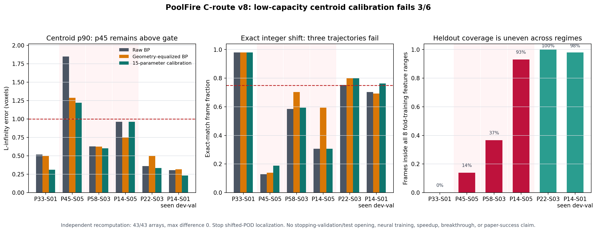

# PoolFire C 路线 v8：低容量质心校准仍未通过跨轨迹门

## 一句话结论

v8 用 8 个部署可见特征和 15 个参数的轴结构岭回归，把 raw BP 质心校准到 K4 teacher 质心。独立 outer-crossfit 只通过 2/5 条轨迹，另有 1/1 条已见开发验证通过；合计 3/6，但正式状态仍是：

`FAIL_T0_OBSERVATION_CENTROID_CALIBRATION_PROXY`

按结果前冻结的规则，**shifted-POD 质心定位路线到此停止**。这不是神经算子结果，不是三维场重建成功，也没有打开 p22 stopping validation 或两条 untouched test。

## 这次到底测了什么

每帧只使用部署时已经可见的信息：

1. raw `BP=A^T y` 的 3 个归一化质心；
2. geometry-equalized BP 与 raw BP 的 3 个质心差；
3. x/z、y/z 三视角单位分量能量的 2 个 log-ratio。

模型每个轴只看本轴位置、本轴均衡响应和两个 view-balance，共 5 个系数；三轴合计 15 个 float64 参数。5 条 fit 轨迹做外层 leave-one-trajectory-out，每个外层内部再按完整轨迹选择同一个 `lambda`。`p=14kw_size=01` 只是一条此前已经看过的开发验证，不是独立或 confirmatory 证据。

正式实现将每个 fold 拆成 fit 和 predict 两个新进程：

- fit worker 只收到训练特征与训练 teacher，不存在 training raw 文件或任何 heldout 输入；
- predict worker 只收到冻结模型、heldout 特征和 heldout raw 质心，不存在训练数据或 teacher；
- 模型、预测和最终结果均用操作系统级 no-replace 原子发布；
- 预测发布后才允许读取对应 heldout teacher 评分。

## 六条轨迹的真实结果

表中 p90 单位为 voxel，exact 是整数 shift 完全一致的帧比例。T0 要求 p90 不超过 1.0、exact 不低于 75%，还需同时满足 p50、worst、within-one 和双控制 harm 门。

| 轨迹 | 选择的 λ | candidate p90 | candidate exact | 最好控制 p90 | 最好控制 exact | 判决 |
|---|---:|---:|---:|---:|---:|---|
| P33-S01 | 1 | 0.310 | 98.02% | 0.501 | 98.02% | PASS |
| P45-S05 | 0.1 | 1.219 | 18.81% | 1.286 | 13.86% | FAIL |
| P58-S03 | 1 | 0.601 | 59.41% | 0.625 | 70.30% | FAIL |
| P14-S05 | 10000 | 0.962 | 30.69% | 0.748 | 59.41% | FAIL |
| P22-S03 | 1 | 0.334 | 80.20% | 0.359 | 80.20% | PASS |
| P14-S01，已见开发验证 | 1 | 0.233 | 76.24% | 0.304 | 70.30% | PASS |

这里最重要的不是“3 条通过”，而是三种不同失败机制：

1. **P45-S05 有材料性改善，但仍不够。** candidate 将 p90 从 raw 的 1.847、equalized 的 1.286 降到 1.219，exact 从 12.87%/13.86% 提到 18.81%，但 p50、p90、exact 和 within-one 仍全部未过 T0。
2. **P14-S05 选择了 λ=10000，几乎退回 raw BP。** 它的 p90 为 0.962、exact 为 30.69%，不仅没有利用 equalized control 的局部优势，还违反 p90 与 exact 的 harm 门。这说明 fit-only 的共同规律不能稳定决定该工况该信 raw 还是 equalized。
3. **P58-S03 连续质心略好，整数决策反而受损。** candidate p90 从最好控制的 0.625 降到 0.601，但 exact 只有 59.41%，低于 equalized 的 70.30%，因此 exact T0 和 harm 同时失败。

## 覆盖诊断告诉了什么

每条 heldout 轨迹还报告“8 个特征同时落在该 fold 训练最小值至最大值内”的帧比例：

| 轨迹 | 8 特征同时在训练范围内 |
|---|---:|
| P33-S01 | 0.00% |
| P45-S05 | 13.86% |
| P58-S03 | 36.63% |
| P14-S05 | 93.07% |
| P22-S03 | 100.00% |
| P14-S01，已见开发验证 | 98.02% |

P45、P58 的低覆盖与失败相符，但 P33 在 0% 全特征联合覆盖下仍通过，P14-S05 在 93% 覆盖下仍失败。因此“是否落在逐特征训练范围内”只能解释一部分工况差异，不能被偷偷升级成接受门或结果后 fallback。

五个 outer fold 的 canonical center 相对五条 fit 全量 center 的最大差为 0.074 至 0.292 voxel。这些差异只作参考中心可比性报告，没有参与 `lambda`、T0 或 harm 判决。

## 独立复算与成本边界

独立 validator 不导入正式 calibrator、runner 或评分 helper，重新计算：

- 8 个特征；
- 331 次嵌套岭求解；
- 6 个模型和 6 条预测；
- fold-training center、raw/equalized/candidate 指标；
- T0、harm 和总判决。

它逐一比较 43 个正式 NPY 数组，最大绝对差为 `0.0`；验证前后正式结果树逐字节不变。独立状态为：

`PASS_INDEPENDENT_VALIDATION_OF_FAIL_T0_OBSERVATION_CENTROID_CALIBRATION_PROXY`

本次正式 runner wall time 为 1.288 s，parent/child peak RSS 分别约为 69.9 MB/39.8 MB。这只是复用既有 observation、BP 和 teacher 的校准审计开销，不包含从 observation 重新执行 `A^T` 的完整部署边界，所以不能宣称端到端速度或内存优势。

## 下一条主线

质心只保留了 3 个位置自由度，无法表达形状、边界、局部梯度和工况相关模糊。v8 的负结果说明继续围绕“先估一个整数平移，再学 shifted basis”投入不划算。

下一门应另行结果前预注册 **observation/BP 到完整 16×16×32 warm field 的低容量空间映射**：

1. 先做可解释的 identity BP、geometry-equalized BP、局部 3D separable convolution/ridge 和频域低模 transfer controls；
2. 目标直接是 zero-start CGLS K4 full field 或其 residual，不再把质心 exact 当作代理终点；
3. 仍以完整 trajectory 做 outer/inner 分组，先用五条 fit 与已见 p14 开发验证冻结表示、正则和 stopping rule；
4. 只有低容量 full-field sentinel 显示稳定 headroom，才允许训练一个小型 BP-conditioned 3D U-Net；FNO、UNO、DeepONet 继续排在它之后；
5. 最终仍必须回到 matched field/gradient/observation accuracy，比较完整 `A/A^T`、wall time、fresh whole-pipeline RSS 和逐轨迹 harm。

p22 stopping validation 和两条 untouched test 继续关闭。当前：

`neural_training_authorized=false`

`algorithm_breakthrough=false`

`paper_success=false`
