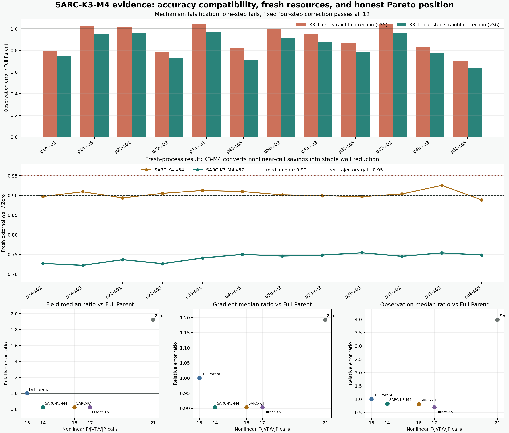

# SARC-K3-M4：曲线 BOST 代理逆问题中的低保真缺陷修正

> 日期：2026-07-29  
> 当前判决：**关键正结果 / 突破候选**  
> 正式边界：`algorithm_breakthrough=false`

## 1. 这次真正解决了什么

前一阶段已经得到一个可部署的 learned Direct 三维初值，但直接把它接到曲线
Gauss-Newton-CGLS 后，存在一个现实矛盾：

- 多做曲线光路 forward/JVP/VJP 可以继续提高重建质量；
- 这些高保真算子正是整条重建链最昂贵的部分；
- 只减少迭代次数，又可能丢掉 observation 近零空间中的三维结构。

这次实现并冻结的方法是：

```text
observation
  -> learned Direct field initializer
  -> curved GN-CGLS K3
  -> curved residual r3 = y - F_curved(x3)
  -> straight-ray CGLS exactly 4 steps
  -> prolongate the low-fidelity correction
  -> one curved F safety verification
  -> accept only if observable residual does not increase
```

简称 **SARC-K3-M4**：

```text
Straight-Adjoint Residual Correction
K3 = 3 个曲线 GN-CGLS 内步
M4 = 4 个固定直线 CGLS 缺陷修正步
```

在线决策只使用部署时可见的 observation、冻结几何和前向算子，不读取 truth、
轨迹标签或控制组误差。

## 2. 为什么不是一步修正

先运行了更便宜的 SARC-K3-M1。它在 12 条已开放轨迹上都优于 Zero，但有 5 条
轨迹的 observation error 仍高于 Full Parent，最差比值为：

```text
SARC-K3-M1 / Full Parent = 1.041992
```

正式状态：

```text
FAIL_POST_OPEN_SARC_K3_COMPATIBILITY_V35
```

这条负结果很重要。它排除了“任意加一个便宜反投影就会成功”的解释。

固定四步直线 CGLS 后，残差修正不再只是最陡下降的一次近似，而是在冻结直线
算子的 Krylov 子空间里求一个更完整的低保真缺陷方向。它仍然不替代曲线物理：
最终必须额外做一次曲线 `F`，若观测残差上升就原样回退。

## 3. 已开放轨迹精度门

SARC-K3-M4 在 12 条已开放 PoolFire 轨迹上逐条同时满足：

```text
field error       <= Full Parent
gradient error    <= Full Parent
observation error <= Full Parent

field error       <= Zero
gradient error    <= Zero
observation error <= Zero
```

相对 Full Parent 的轨迹统计：

| 指标 | 中位比值 | p90 比值 | 最差比值 |
| --- | ---: | ---: | ---: |
| field relative-L2 | 0.823264 | 0.880547 | 0.895933 |
| gradient relative-L2 | 0.903305 | 0.929228 | 0.952248 |
| observation relative-L2 | 0.832347 | 0.958255 | 0.975982 |

正式与独立判决：

```text
PASS_POST_OPEN_SARC_K3_M4_COMPATIBILITY_V36
PASS_INDEPENDENT_VALIDATION_SARC_K3_M4_V36
```

独立程序重新生成全部 12 个候选场、曲线 prediction、三项误差和调用账：

```text
candidate field maximum difference = 0
curved prediction maximum difference = 3.55e-15
reported numeric maximum difference = 1.35e-13
```

## 4. 调用成本

完整调用账：

| 方法 | nonlinear F/JVP/VJP | straight A/A^T | 说明 |
| --- | ---: | ---: | --- |
| Full Parent | 13 | learned setup | 更便宜，但精度较低 |
| SARC-K3-M4 | 14 | 6A + 7A^T | 当前候选 |
| SARC-K4 | 16 | 3A + 4A^T | 一步修正旧候选 |
| Direct-K5 | 17 | learned setup | 更高曲线迭代精度 |
| Zero | 21 | 0 | 零初值基线 |

SARC-K3-M4 相对 Zero 的昂贵非线性调用减少：

```text
1 - 14 / 21 = 33.33%
```

这里不能写“SARC 支配所有方法”。Full Parent 只用 13 次 nonlinear call，比
SARC-K3-M4 更便宜；SARC 用多一次曲线 `F` 换取三项误差的稳定下降。正确表述是：
**SARC-K3-M4 是当前精度-成本 Pareto 前沿上的一个新工作点。**

## 5. Fresh-process 资源门

资源实验使用：

```text
12 trajectories
2 arms: SARC-K3-M4 / Zero
1 warmup + 5 measured per arm and trajectory
144 fresh child measurements
single thread
DNNL cache disabled
alternating paired order
external wall measured by parent
child max RSS measured by macOS /usr/bin/time -l
```

冻结门槛：

```text
trajectory-equal median wall ratio <= 0.90
every trajectory wall ratio        <= 0.95
every trajectory RSS ratio         <= 1.05
```

实际结果：

| 资源指标 | SARC-K3-M4 / Zero | 判决 |
| --- | ---: | --- |
| trajectory-equal median external wall | 0.745827 | PASS |
| worst trajectory external wall | 0.754330 | PASS |
| trajectory-equal median max RSS | 1.006705 | PASS |
| worst trajectory max RSS | 1.023578 | PASS |

换成人话：

- 本机本轮 12 条轨迹的 fresh external wall 均下降约 **24.6%-27.7%**；
- 最差轨迹仍下降约 **24.6%**；
- 内存中位增加约 **0.67%**，最差增加约 **2.36%**，没有越过 5% 门。

正式与独立判决：

```text
PASS_FRESH_RESOURCE_GATE_SARC_K3_M4_V37
PASS_INDEPENDENT_VALIDATION_SARC_K3_M4_RESOURCE_V37
```

## 6. 独立验证器也被审计了

独立 validator 没有导入正式 benchmark、worker 或重建 solver。它重新检查：

- 24 次 warmup 与 120 次 measured 的精确顺序；
- 144 份 JSON 回执和 144 个 field 文件；
- observation-only 输入与 v36 sealed field；
- `F7/JVP3/VJP4`、`6A+7A^T` 调用账；
- 每条轨迹的 wall/RSS 中位数、比值、最差值和总判决。

前两次 validator 执行都 fail-closed，原失败回执被保留：

1. 第一版把 v36 的嵌套 straight ledger 错当成扁平字典；
2. 第二版对 fresh-process 中间残差使用了不合理的 `1e-9` 容差。

修复不是放宽科学门。场等价、wall、RSS 和 PASS 阈值完全没变；只把中间 residual
history 的比较改为与既有 float64 场等价相同量级的容差，并新增回归测试。第三版
才得到独立 PASS。

仍需保留的资源证据限制：

- 原 runner 没有保存 `/usr/bin/time` 原始 stderr 和 PID/PPID；
- 因此能证明 source-bound subprocess-per-measurement，但不能事后证明 144 个
  唯一 OS PID；
- wall/RSS 算术已独立重算，但没有被第二台计时器重新测量；
- 这是当前 Mac、当前 proxy 尺寸的结果，不是跨机器性能定律。

## 7. 与公开工作的关系

组件本身都有公开先例，不能宣称全局首次：

- 神经网络为非线性逆问题提供初值：
  [Zhou et al., neural-network warm start for inverse scattering](https://arxiv.org/abs/2212.08736)
- 用低保真/残差方程修正学习代理：
  [Cao et al., residual-based error correction](https://arxiv.org/abs/2210.03008)
- 面向不精确前向算子的 learned iterative correction：
  [Learned ReSeSOp](https://arxiv.org/abs/2410.23061)
- OERF 的 neural implicit BOST 主线：
  [NeRIF](https://arxiv.org/abs/2409.14722)
- BOST 中先重建、再 refinement 的直接近邻：
  [Reconstruction refinement of hybrid BOST](https://doi.org/10.1063/5.0190778)

截至当前一级来源审阅范围，尚未找到与下面组合完全同构的公开方法：

```text
BOST-specific learned Direct warm start
+ curved GN-CGLS K3
+ post-curved-GN straight-ray defect correction
+ exactly one curved-forward fail-closed acceptance
+ explicit nonlinear-call and fresh-resource accounting
```

这只是可辩护的组合创新边界，不是全球唯一性证明。

## 8. 当前结论

```text
opened proxy accuracy gate       = PASS
independent accuracy validation  = PASS
fresh external wall gate         = PASS
fresh child RSS gate             = PASS
independent resource validation  = PASS

untouched CFD test               = NOT OPENED
real multi-camera BOST           = NOT RUN
cross-machine performance        = NOT PROVEN
global uniqueness                = NOT PROVEN

key_positive_result              = true
breakthrough_candidate           = true
algorithm_breakthrough           = false
paper_success                    = false
```

这次已经不是“只有思路”或“只有调用账”：算法、三项精度、fresh wall 和 RSS 在
12 条已开放轨迹上同时成立。它可以作为论文核心方法候选，但在 untouched PoolFire
测试和组内真实 BOST 迁移完成前，仍不能写成正式算法突破或高水平论文完成。



