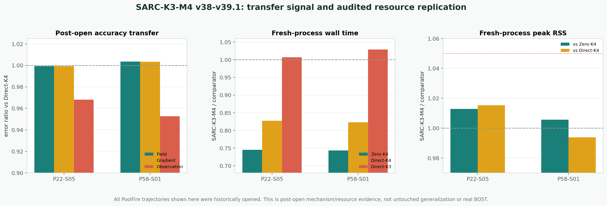

# SARC-K3-M4 v38-v39.1：迁移信号与资源复验判决

> 判决日期：2026-07-29
> 当前标签：关键正结果，尚非算法突破
> 证据范围：已历史打开的 PoolFire 曲线 BOST 代理

## 一句话结论

SARC-K3-M4 在两条未参与 v35-v37 方法开发、但已经被历史流程打开过的 PoolFire
轨迹上保住了精度兼容；随后 72 个全新进程的修正版资源实验，用 macOS 原始系统
计时回执确认：相对 Zero-K4，中位端到端时间下降约 **25.57%**；相对
Direct-K4，下降约 **17.46%**，峰值内存仍在冻结的 5% 容差内。

这个结果成功回答了“同一算法在另外两个已打开工况上是否仍有数值和资源价值”，
但没有回答“面对真正未见数据或真实相机 BOST 是否泛化”。因此：

```text
key_positive_result=true
post_open_transfer_proven=true
fresh_process_resource_replication_proven=true
generalization_proven=false
real_BOST=false
algorithm_breakthrough=false
paper_success=false
```



## 为什么做这一步

v37 已经在 12 条开发期打开的轨迹上通过了精度与资源门，但仍有两个明显疑问：

1. 方法是不是只适配了 v35-v37 已反复查看的那 12 条轨迹？
2. v37 的资源证据没有保留每个子进程的操作系统原始计时文本，独立验证器只能
   复核 runner 已声明的 wall/RSS，证据强度不够。

因此这次没有改模型、没有调阈值，也没有追加更大网络，而是先在两条历史测试流上
做方法迁移，再用更严格的独立进程计时把资源结论重做一遍。

## 方法没有变

在线流程仍是：

```text
部署可见 observation
  -> learned Direct 三维初值
  -> curved GN-CGLS K3
  -> curved residual
  -> frozen straight CGLS M4 defect correction
  -> one curved-forward fail-closed acceptance
```

候选的高保真 nonlinear 逻辑调用为 `14`，Zero-K4 为 `21`；额外直线低保真账为
`6A + 7A^T`。在线阶段不读取三维 truth、误差指标或轨迹标签。

## v38.1：两条轨迹的迁移结果

两条轨迹都通过相对 Full Parent 与 Zero 的 field、gradient、observation 三项门；
候选也没有被更便宜的 Direct-K3 在精度-成本意义上支配。

| 轨迹 | candidate field | candidate gradient | candidate observation | field / Direct-K4 | gradient / Direct-K4 | observation / Direct-K4 |
|---|---:|---:|---:|---:|---:|---:|
| P22-S05 | 0.377172 | 0.750618 | 0.010339 | 0.999344 | 0.999342 | 0.968067 |
| P58-S01 | 0.394918 | 0.694652 | 0.029653 | 1.003505 | 1.003326 | 0.952726 |

P58-S01 上，candidate 的 field/gradient 比 Direct-K4 高约 0.35%/0.33%，但
observation 低约 4.73%。这不是“每个指标都严格支配 Direct-K4”，而是预冻结
兼容范围内的精度-成本折中。

独立验证器重建候选场后通过；v38.2 又从封存数组重新计算 16 组指标，最大声明
差为浮点舍入量级，并确认没有成本感知 Pareto 支配者。v38.2 同时保留了关键限制：
原始预注册验证链没有被事后修复，所以这里只能称 post-open transfer。

## v39.1：修正版 fresh-process 资源复验

正式批次包含：

```text
2 trajectories x 4 arms x (1 warmup + 8 measured) = 72 child processes
```

四个 arm 是 SARC-K3-M4、Zero-K4、Direct-K3、Direct-K4。每条轨迹中，每个 arm
在四个执行顺序位置各出现恰好两次，避免固定“先跑/后跑”偏置。

每个子进程都由 `/usr/bin/time -l` 直接写出一份原始 wall/RSS 回执。正式 runner
只解析，不拥有这些数值；独立 validator 再次解析、哈希并重算全部汇总。

### 逐轨迹时间与内存

| 轨迹 | SARC wall | Zero wall | Direct-K3 wall | Direct-K4 wall | SARC / Zero | SARC / Direct-K4 |
|---|---:|---:|---:|---:|---:|---:|
| P22-S05 | 7.295 s | 9.790 s | 7.245 s | 8.815 s | 0.745148 | 0.827567 |
| P58-S01 | 7.430 s | 9.995 s | 7.220 s | 9.025 s | 0.743372 | 0.823269 |

| 冻结资源门 | 实测 | 门槛 | 判决 |
|---|---:|---:|---|
| 轨迹等权中位 wall / Zero | 0.744260 | <= 0.90 | PASS |
| 最差轨迹 wall / Zero | 0.745148 | <= 0.95 | PASS |
| 轨迹等权中位 wall / Direct-K4 | 0.825418 | <= 0.95 | PASS |
| 最差轨迹 wall / Direct-K4 | 0.827567 | <= 1.00 | PASS |
| 最差 RSS / Zero | 1.012848 | <= 1.05 | PASS |
| 最差 RSS / Direct-K4 | 1.015228 | <= 1.05 | PASS |

SARC-K3-M4 相对 Direct-K3 的轨迹等权中位 wall 比为 `1.017994`，即平均约慢
1.80%。这是重要反例：候选不是全局最快。它的价值是用接近 Direct-K3 的时间，
获得比 Direct-K3 更低的 observation error，同时明显快于 Direct-K4 与 Zero-K4。

## 独立验证到底检查了什么

独立 validator 不导入正式 benchmark、worker 或 solver，重新完成：

- 72 份 worker receipt、72 个场文件、72 份原始 macOS time receipt 的读取与绑定；
- 四臂、两轨迹、warmup/measured roster 的独立重建；
- 每个 arm 在四个执行位置恰好出现两次的顺序平衡检查；
- 每个重建场与封存预期场的比较；
- 原始 wall/RSS 的再次解析和全部资源比值重算；
- 私有运行资产与冻结执行身份的一致性检查。

结果：

```text
formal:
PASS_FRESH_RESOURCE_GATE_SARC_K3_M4_POSTOPEN_V39_1

independent:
PASS_INDEPENDENT_VALIDATION_SARC_POSTOPEN_RESOURCE_V39_1

maximum field absolute difference = 3.793420197406583e-08
maximum summary numeric difference = 0.0
```

唯一仍未证明的是“72 个任务对应 72 个全局唯一 OS PID”的独立身份命题；这不影响
原始 time receipt、场输出和资源汇总的复算，但仍保留在证据边界中。

## 是否成功

**成功的部分：**

- 方法迁移到两条额外、未参与 v35-v37 开发的 PoolFire 轨迹；
- 两条轨迹都通过冻结的精度兼容门；
- v39.1 用 72 份操作系统原始回执补上 v39 的资源证据漏洞；
- 相对 Zero-K4 和 Direct-K4 的 wall 优势在两条轨迹上都成立；
- 峰值 RSS 没有超过冻结的 5% 容差；
- 正式程序与独立程序给出完全一致的汇总判决。

**没有成功或尚未回答的部分：**

- 所有官方 PoolFire test stream 都已经在历史流程中打开，没有 untouched PoolFire；
- 两条轨迹仍属于同一公开数据族，不证明跨数据集泛化；
- 还没有真实相机噪声、背景图、标定误差和曲线折射测量；
- 相对 Direct-K3 没有 wall 优势；
- 没有跨机器或 GPU 的资源复现；
- 不能写成 SOTA、全球唯一、真实 BOST 成功或论文完成。

## 突破性进展判决

这是一个**关键正结果**，因为算法的数值迁移与端到端资源优势第一次在同一组额外
轨迹上同时被原始系统回执和独立程序支持。它比“少调用的纸面推导”强，也比只在
开发轨迹上的通过更强。

但它仍不是**正式突破**。当前最缺的不是再跑同一 PoolFire，而是一个结果前冻结、
真正未见的外部三维密度场，或组内真实多相机 BOST。只有在不改算法的条件下继续
守住 matched-accuracy、wall 和 RSS，`algorithm_breakthrough` 才有理由转为
`true`。

## 当前最有价值的下一证据

下一实验应直接改变论文判断，而不是继续扩建审计设施：

1. 结果前冻结外部三维密度场的坐标裁剪、归一化、观测器和所有阈值；
2. 不用外部 truth 调模型，只运行冻结的 SARC、Zero、Direct-K3/K4；
3. 报告逐场 field/gradient/observation、harm、完整调用、fresh wall 和 RSS；
4. 若外部数据通过，再迁移到组内真实 BOST；若失败，记录失败工况并定位
   几何、温度范围、噪声或折射模型的真实边界。
