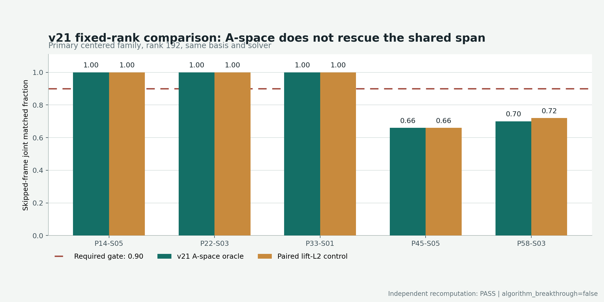

# PoolFire C 路线 v21：A-space 系数没有救活共享线性 lift 子空间

日期：2026-07-28

正式判决：
`FAIL_PREREGISTERED_A_SPACE_LIFT_RANKS_V21`

独立复算：`PASS_INDEPENDENT_RECOMPUTATION_V21`

突破状态：`algorithm_breakthrough=false`

## 一句话结论

v21 保留 v20 的关键帧、共享子空间、rank、求解器和精度门，只把 oracle
系数的选择目标从 lift-L2 改成与最终观测更接近的 A-space 误差。结果仍是
p45 与 p58 逐条未过 90% 跳帧同精度门，因此当前“跨工况共享线性子空间 +
固定 50% 跳帧”路线应当关闭。

## 1. 为什么要做这次最小实验

v20 的 oracle 在冻结子空间内最小化三维 lift 误差：

```text
min_c ||h_base + Uc - h_exact||_2
```

但三维 lift 更接近，不保证投影到相机观测后也更接近。v21 不换表示、不加
网络，只把系数改成：

```text
c_A = argmin_c ||A(h_base + Uc) - A h_exact||_2
```

这里的系数仍然看见留出 trajectory 的真实目标，所以它是不可部署的机制
oracle。它只回答一个判别问题：

> v20 的失败主要是系数目标选错了，还是同一个共享线性 span 本身就覆盖不够？

## 2. 哪些东西保持完全相同

- 五次 trajectory-level leave-one-out，每次只用另外四条轨迹建立 span；
- 每条轨迹 101 帧，其中偶数 51 帧是 exact keyframes，奇数 50 帧被跳过；
- primary 使用 trajectory-balanced centered lift innovation，raw family
  只作敏感性分析；
- 公共数值 rank 固定为 `0, 16, 32, 64, 96, 128, 160, 192`；
- `effective_full` 只检查 span，不允许冒充公共数值 rank；
- 每个候选仍走 exact `A^T`、observable alpha 与未修改 strict CGLS K1；
- all-frame 与 skipped-only 使用同一 field / gradient / observation
  compatibility 与 harm 门。

这保证 v21 和 v20 的差异只来自系数目标，而不是事后换 rank、换 solver 或换
评分阈值。

## 3. 独立复算是否通过

通过。独立验证得到：

```text
candidate lift max |difference| = 4.496403249731884e-14
reported metric max |difference| = 3.219646771412954e-15
sealed inputs unchanged = true
```

Stage 1 在开放真值前已通过独立预检，记录的 truth bytes read 为 `false`。
同一批 v20 lift-L2 controls 也逐数组复现，因此 A-space 与 lift-L2 的比较
使用相同 span 和相同 rank。

这说明负结果可复算；它不把负结果升级为算法成功。

## 4. 最关键的固定 rank 192 对照

冻结门要求 skipped-only joint matched fraction 至少 90%，且同一数值 rank
必须让五条留出轨迹逐条通过。

| Trajectory | A-space rank 192 | 同 span lift-L2 rank 192 | A-space harm | 是否过 90% |
|---|---:|---:|---:|---|
| p14-s05 | 100% | 100% | 0% | 通过 |
| p22-s03 | 100% | 100% | 0% | 通过 |
| p33-s01 | 100% | 100% | 0% | 通过 |
| p45-s05 | 66% | 66% | 0% | 失败 |
| p58-s03 | 70% | 72% | 0% | 失败 |

p14、p22、p33 至少存在一个通过的 A-space 数值 rank；p45 的最佳
skipped joint 仍为 66%，p58 的最佳结果仍来自配对 lift-L2 control，为 72%。
没有一个公共数值 rank 能让五条轨迹同时过门。



## 5. A-space 到底带来了什么

变化是混合且很小的：

- rank 192 下，p14、p22、p33、p45 与 lift-L2 相同；
- p58 的 A-space 从配对 control 的 72% 变为 70%；
- p45 与 p58 的 joint harm 都是 0，所以问题不是少数帧灾难性发散；
- 同时检查 centered primary 与 raw sensitivity 后，仍没有公共 passing rank。

因此不能说 A-space 更优，也不能说只要把 loss 换到观测空间就能解决时间
摊销。它排除了一个很具体的解释：**v20 失败不只是 lift-L2 系数错配。**

## 6. 调用账为什么不是速度结果

如果未来存在可部署的系数预测器，反事实部署账仍是：

```text
temporal lift candidate: 202 A + 152 A^T
full-CNN Dual-K1:       202 A + 202 A^T
Zero-CGLS K4:           404 A + 404 A^T
```

但本轮为了让 oracle 求解 A-space 系数，额外执行了 2500 次 `A`。这些调用
只属于机制诊断，不能藏进部署成本，也不能用来声称 native CNN skip、实测
`A^T` 减少、wall time 或内存优势。

## 7. 失败后应该关闭什么、保留什么

应关闭：

- 当前跨工况共享的单一线性 lift innovation span；
- 固定 51/101 exact keyframes 的 50% 时间摊销主张；
- 在同一 span 上继续加 rank、换一个相似 L2 loss 或直接训练更大 FNO/GRU。

仍未被否定：

- 由部署可见特征选择的 regime-conditioned 或局部字典；
- 非线性、history-aware 表示；
- 降低跳帧比例，或使用 observation-visible abstention/fallback；
- 在真实 BOST 几何与噪声合同下重新定义同精度门。

这些方向若继续，必须先各自预注册一个最小、可证伪的实验，不能把 v21 的旧
oracle 结果当成新方法的训练或测试成绩。

## 8. 能否称为突破或论文成功

不能。当前明确为：

```text
fresh_trajectory_result=false
native_CNN_speedup=false
measured_A_transpose_reduction=false
wall_time_speedup=false
whole_pipeline_RSS_benefit=false
independent_end_to_end_generalization=false
real_BOST=false
algorithm_breakthrough=false
paper_success=false
```

这次真正完成的是一次有信息量的淘汰：在完全相同的表示与 rank 下，改成
measurement-aware oracle 仍不能修复 p45/p58。它把后续问题从“再换一个 loss
试试”收缩为“表示必须具备工况条件、局部性、非线性或更保守的跳帧策略”。
