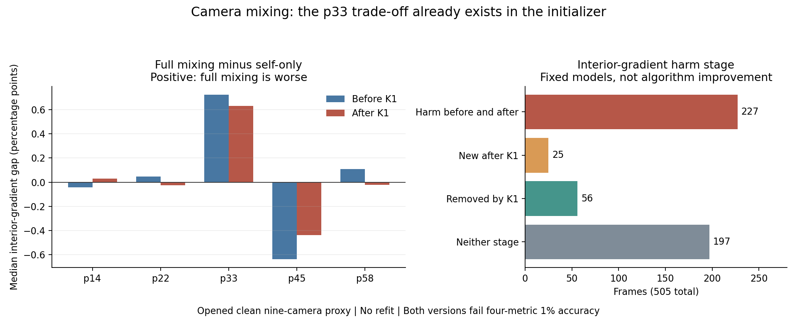
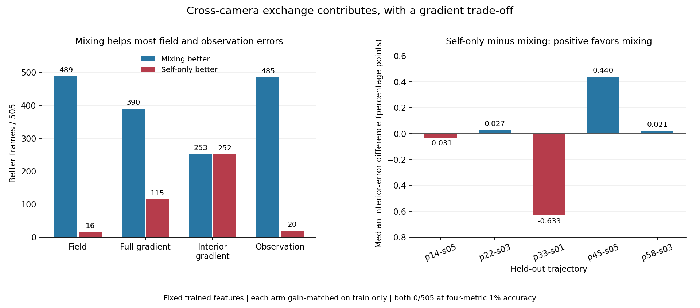

# 跨相机混合消融 / Cross-Camera Mixing Ablation

## 阶段归因更新 / Stage Attribution Update

进一步独立归因：p33的101帧内部梯度损失在暖启动阶段已全部存在，并非CGLS一步新造成。两版误差差距中位数从0.725个百分点缩小到0.633个百分点。全505帧中仍有25帧出现新的内部梯度损失、56帧原有损失消失，不能泛化为CGLS永不伤害。两版均未达到四指标1%；下一步优先研究暖启动的空间与相机耦合。

Further independent attribution: all101 p33 interior-gradient harms already exist in the warm initializer, rather than being newly caused by the CGLS step. The median gap between versions shrinks from0.725 to0.633 percentage points. Across505 frames,25 new interior-gradient harms appear and56 old harms disappear, so this does not mean CGLS never harms. Neither version meets four-metric1% accuracy; prioritize initializer spatial-camera coupling.

表中差距为“保留混合误差减去关闭混合误差”，正值表示保留混合更差；单位为相对误差的百分点。分类按相同1e-9方向容差，不替代严格1%精度门。

Gaps are full-mixing error minus self-only error; positive means full mixing is worse, in percentage points of relative error. Stage categories use the same1e-9 directional tolerance, not a replacement for strict1% accuracy.

| 轨迹 / Trajectory | K1前差距中位数 / Pre gap | K1后 / Post gap | 已有 / 新增 / 消除 / 均无损失 |
|---|---:|---:|---|
| p=14kw_size=05 | -0.0425 pp | 0.0311 pp | 40 / 16 / 0 / 45 |
| p=22kw_size=03 | 0.0472 pp | -0.0271 pp | 43 / 0 / 22 / 36 |
| p=33kw_size=01 | 0.7254 pp | 0.6328 pp | 101 / 0 / 0 / 0 |
| p=45kw_size=05 | -0.6389 pp | -0.4396 pp | 1 / 7 / 0 / 93 |
| p=58kw_size=03 | 0.1076 pp | -0.0213 pp | 42 / 2 / 34 / 23 |

两版权重、训练折尺度与CGLS一步均固定。令初始误差为e、CGLS改变量为h；对每项指标核对 `||e+h||² = ||e||² + 2<e,h> + ||h||²`，梯度项先施加相同导数，观测项使用投影残差。各分量中位数不能相加当作因果百分比。这里只定位既定模型的阶段，不证明全部架构的误差来源。

Both sets of weights, training-fold scales and the single CGLS step are fixed. For initial error e and CGLS change h, verify `||e+h||² = ||e||² + 2<e,h> + ||h||²`, applying the same derivatives for gradient metrics and using projection residuals for observation. Marginal medians of signed terms are not additive causal percentages. This localizes stages of these fixed models, not every architecture's error source.

独立程序重建全部1010个端点，使用另一套张量收缩、物理矩阵、CGLS和导数计算；平方误差分量最大绝对差为4.02e-16。全部1010个新初始场另经原生forward核验。20个既有对照报告完整保留，直接解仍达标，两种学习版本仍0/505。新增工作没有训练参数，没有获得新的重建或速度成功。

The independent program rebuilds all1010 endpoints with a separate tensor contraction, physical matrix, CGLS and derivative implementation; maximum absolute squared-term difference is4.02e-16. Native forward also checks all1010 new initial fields. All20 prior control reports remain intact; full direct qualifies, while both learned versions remain0/505. This work adds no trained parameters and no reconstruction or speed success.

本轮正式离线账为3030A+1010AT，独立复算为4040A+2020AT，按冻结源码循环与完成状态重建，并非单独实测的部署调用计数。原在线逻辑账仍2A+2AT，训练、teacher与几何成本不免费。没有新增数据、其他相机数量精度或真实BOST结论。

Formal offline work is3030A+1010AT and independent replay4040A+2020AT, reconstructed from frozen source loops and completion rather than a separately instrumented deployment count. Original logical online cost stays2A+2AT; training, teachers and geometry are not free. No new data, other-cardinality accuracy or real-BOST result follows.

本次排除了“p33损失全部由K1新制造”的解释；优先检查暖启动的空间与相机耦合，而不是替换精化器。没有授权事后调混合强度、扩大模型或更换目标包装成功。

This rejects the explanation that K1 newly creates all p33 harm. Prioritize the initializer's spatial-camera coupling rather than replacing the refiner. It does not authorize post-hoc mixing-strength tuning, a larger model or changing objectives to relabel success.

2026-09-07

跨相机消融已独立复算：冻结原模型，只关闭相机间混合，并分别用训练折匹配整体尺度。保留混合时，489/505帧场误差、485/505帧观测误差更好；但内部梯度为253帧更好、252帧更差，p33轨迹101帧内部梯度全部更差。两种版本都未过1%精度门。跨相机交互有贡献，也存在指标取舍；不能简单删掉，更不是算法突破。

The camera-mixing ablation is independently verified: freeze the parent, remove only inter-camera mixing, and match each version with a training-only scalar. Keeping mixing improves field error on489/505 frames and observation error on485/505, but interior-gradient error improves on253 and worsens on252; all101 p33 frames have worse interior gradients. Neither version passes1% accuracy. Cross-camera exchange contributes but involves metric trade-offs; simply deleting it is not a solution or a breakthrough.

## 控制了什么 / Controlled Comparison

保留已训练较强L-BFGS模型的1840个参数和所有空间滤波，仅把相机核的非对角元素设为零。保留混合与关闭混合分别使用404训练帧，拟合一个整体尺度，以免振幅差异混淆判断；101帧完整轨迹留出，五折训练集合重叠。未重训网络、未调整空间滤波、未用留出真值选参数。保留混合的尺度和目标值必须复现上一轮已独立验证的单系数对照。

Freeze all1840 parameters and spatial filters of the stronger L-BFGS parent, removing only off-diagonal camera-kernel entries. Each version fits one global scalar on404 training frames to control for amplitude, holding out an entire101-frame trajectory; the five training folds overlap. No network retraining, spatial-filter adjustment or held-out tuning occurs. The full-mixing scalar and objective must reproduce the previously independently verified scalar-one control.

## 结果 / Results

| 留出轨迹 / Held-out | 保留混合场p90 / Full field | 关闭混合场p90 / Self field | 保留混合内部梯度胜/负 / Inner wins/losses |
|---|---:|---:|---:|
| p=14kw_size=05 | 25.42% | 26.23% | 45/56 |
| p=22kw_size=03 | 21.99% | 22.84% | 58/43 |
| p=33kw_size=01 | 20.13% | 20.44% | 0/101 |
| p=45kw_size=05 | 31.77% | 33.00% | 93/8 |
| p=58kw_size=03 | 25.39% | 26.32% | 57/44 |

四项指标按场、全梯度、内部梯度、观测排序，保留混合的胜数为489、390、253、485；关闭混合的胜数为16、115、252、20，无显著平局。胜负使用预先固定的1e-9绝对差，仅用于方向消融，不替代原有1%精度门。各轨迹场误差p90均受益于混合，但p33所有101帧内部梯度都受损。因此正式判决是混合效应，而非一致有益或一致有害。

For field, full gradient, interior gradient and observation, keeping mixing wins489,390,253,485 frames; removing it wins16,115,252,20, with no significant ties. Directional wins use a fixed1e-9 absolute difference and do not replace the original1% accuracy gate. Field p90 improves in every trajectory, but every101 p33 frame has worse interior-gradient error with mixing. The formal decision is a mixed effect, not uniform benefit or harm.

保留和关闭混合均为0/505、0/5完整轨迹达到四指标1%要求；直接解仍为505/505。关闭版本仍胜过十二个旧弱对照，但相比匹配尺度的完整模型有491帧至少一项指标变差。不能用消融解释或相对改善冒充达标重建。

Both versions remain0/505 and0/5 complete trajectories at four-metric1% accuracy; full direct remains505/505. The self-only version still beats twelve older weak controls, but worsens at least one metric on491 frames against the gain-matched full model. An ablation explanation or relative improvement is not accurate reconstruction.

## 复算与范围 / Verification and Scope

正式与独立路径分别校准尺度、重建训练物理量、505个外折预测、精确lift、未修改K1、四指标、尾部、相机乱序与成本。独立重新校准全部10个尺度，评分最大差1.5e-15，尾部绝对差3.49e-12，全部505端点通过原生forward复核。源码、输入与封存结果前后一致。

Formal and independent paths calibrate scales and rebuild training physics,505 outer predictions, exact lift, unchangedK1, four metrics, tails, camera permutation and costs. All10 scales are independently recalibrated. Score difference is1.5e-15; absolute tail difference is3.49e-12. Native forward checks every505 endpoint. Source, inputs and sealed results remain unchanged.

在线逻辑账仍为2A+2AT；原模型训练、几何与直接解teacher、校准及审计成本单独披露，不是免费缓存。只有已打开、干净九相机代理的固定特征反事实证据，不是独立重训的无混合网络结论；也不是5/7/12相机精度、未开工况、wall/RSS、外部泛化或真实BOST成果。

Logical online cost remains2A+2AT. Parent training, geometry, direct-solver teachers, calibration and audits are separately disclosed, not free caches. This is a fixed-feature counterfactual on an already-opened clean nine-camera proxy, not a conclusion about an independently retrained self-only network. No5/7/12-camera accuracy, unopened condition, wall/RSS, external generalization or real-BOST result follows.

下一步应保留已有跨相机贡献，重点诊断它如何影响空间梯度细节。当前结果既不支持简单删除交互，也不证明几何重采样或更大网络必然有效。梯度线积分不能直接当成多视角点对应。

Next, preserve the demonstrated cross-camera contribution and diagnose how it affects spatial-gradient detail. This evidence supports neither simply deleting exchange nor assuming geometry resampling or a larger network will work. Gradient line integrals are not direct multi-view point correspondences.

[脱敏汇总 / Redacted summary](poolfire_camera_mix_ablation_20260907.json)

[上一项条件分量诊断 / Previous conditional-component diagnostic](poolfire_world_component_head_20260907.md)
