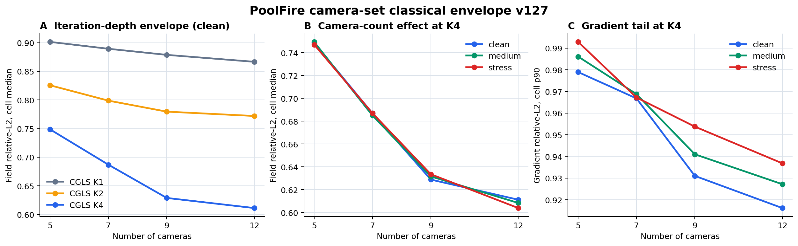

# v127：PoolFire 变相机集合经典重建难度图

## 一句话结论

我们已经把师兄要求的“相机可换序、可增删、数量可变，并加入观测噪声与机位/标定误差”真正接到公开 PoolFire CFD 三维场上。独立程序完整复算通过。增加相机数量对 CGLS K4 的三维场误差有稳定而明显的改善；在当前扰动幅度下，少视角与浅迭代仍比噪声本身更主导误差。

**这不是算法突破。** v127 只建立公开 CFD 上的经典基线难度图，尚未训练 camera-set warm initializer，也没有证明速度、外部泛化或真实 BOST 性能。

## What was actually run

The validated screen contains:

- five already-opened PoolFire fit trajectories;
- five preregistered frames per trajectory;
- `5 / 7 / 9 / 12` nested camera subsets;
- `clean / medium / stress` observation-and-calibration profiles;
- 300 physical cells in total;
- five controls per cell: zero field, scaled exact backprojection, and zero-start CGLS K1/K2/K4;
- 1,500 classical-control rows in total.

For every trajectory, a deterministic 12-camera ordering is frozen. Smaller camera sets are prefixes of that order, so adding cameras preserves every existing camera identity. The true rig stays fixed over time. Observation noise changes by frame and camera. Observations are generated with the true rig, while reconstruction receives only the reported, perturbed calibration.

## 核心结果图

### 1. 相机数量是当前最清楚的主效应

在 clean 条件下，CGLS K4 的场相对 L2 中位数随相机数变化为：

| 相机数 | 5 | 7 | 9 | 12 |
|---:|---:|---:|---:|---:|
| K4 field relative-L2 p50 | 0.7486 | 0.6869 | 0.6288 | 0.6112 |

从 5 台增至 12 台，相对下降约 `18.35%`。stress 条件下对应数值为 `0.7471 / 0.6870 / 0.6335 / 0.6039`，趋势仍然保持。

### 2. 迭代深度仍提供显著收益

clean、12 相机条件下，场相对 L2 中位数从 K1 的 `0.8665` 降至 K2 的 `0.7720`，再降至 K4 的 `0.6112`。这说明标准 Krylov 迭代仍有明显空间，也说明未来 warm initializer 必须在更少 exact calls 下追上 K4，而不能只展示视觉上更平滑的结果。

### 3. 当前噪声/标定扰动不是最大瓶颈

K4、12 相机时，梯度相对 L2 的 p90 从 clean 的 `0.9162` 增至 stress 的 `0.9368`。它是可测的恶化，但远小于减少相机数量或减少迭代深度造成的变化。

这不能被解释为“噪声不重要”，原因有三点：

1. 每个 profile 目前只有一套确定性扰动 realization；
2. noise 与 pose/calibration error 在同一 profile 中同时变化，尚未分离各自贡献；
3. 这仍是 coarse-grid straight-ray proxy，不是真实实验噪声。

## 独立验证

第二个程序没有导入 v127 正式 core 或 runner。它重新实现了：

- 相机嵌套顺序与随机键；
- 真实机位和报告标定误差；
- 逐帧、逐相机观测噪声；
- PoolFire 坐标转换与支撑；
- scaled BP、CGLS K1/K2/K4；
- field、full-gradient、interior-gradient 和 observation 指标；
- 所有聚合统计。

独立复算结果：

- 300 / 300 physical cells 完整；
- 1,500 / 1,500 control rows 完整；
- 输入数组最大差：`0`；
- 逐项指标最大差：`0`；
- 聚合统计最大差：`0`；
- 相机 token / rig 最大差：`0`；
- 正式数据与 manifest 在验证前后未变化；
- validation truth 与 test truth 均未打开。

正式程序还验证了最大 adjoint relative error 为 `1.0561e-14`，相机换序恢复误差为 `0`，scaled exact BP 与 CGLS K1 的最大场差为 `2.2204e-16`，符合两者应当代数等价的预期。

## What this changes

v127 changes the research decision in two concrete ways:

1. Variable camera count is not merely an interface feature; it creates a measurable reconstruction-difficulty axis that a camera-set model must handle.
2. The present combined perturbation profiles are too confounded to justify neural training. The next experiment must separate noise-only, pose-only, and combined perturbations and compare stronger cheap controls first.

## 下一有效门

下一步先做 `noise-only / pose-only / combined` 因子化重复，并补上 geometry-equalized BP 与 PCGLS 控制。只有在多个扰动 realization、逐轨迹尾部和同价调用预算下仍存在稳定剩余缺口，才训练最小 permutation-invariant camera-set initializer。

仍然保持：`algorithm_breakthrough=false`、`paper_success=false`、`external_generalization=false`、`real_bost=false`。

脱敏数值摘要：[`poolfire_camera_set_classical_screen_v127_public_summary.json`](poolfire_camera_set_classical_screen_v127_public_summary.json)
