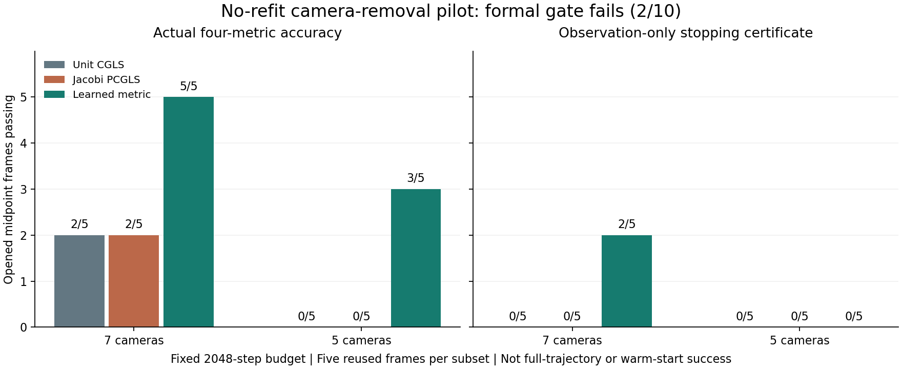

# 减少相机后的冻结学习度量 / Frozen Metric After Camera Removal

2026-09-08

不重新训练的五／七相机学习度量小门失败。七相机实际四项1%精度通过5/5个固定帧，五相机通过3/5；但在预先固定的2048步内，观测／几何停止证明只通过2/10个条件。普通CGLS和Jacobi的实际精度分别在七相机通过2/5、五相机0/5，停止证明均未通过。学习信号仍在，但不能声称稳定的相机减少迁移；不延长预算、不重训挽救。这里是五条已打开轨迹的中点，不是完整轨迹或外部验证，暖启动优势仍未成立。

The no-refit five/seven-camera learned-metric pilot fails. Actual four-metric 1% accuracy passes5/5 fixed frames with seven cameras and3/5 with five; the observation/geometry stopping certificate passes only2/10 conditions within the preregistered2048 steps. Both ordinary CGLS and Jacobi pass actual accuracy on2/5 seven-camera and0/5 five-camera frames, with no certified stops. A learning signal remains, but stable camera-removal transfer is not established. No budget extension or rescue refit. These are midpoints of five opened trajectories, not complete trajectories or external validation; warm advantage remains unproved.

| 相机 / Cameras | 方法 / Method | 实际精度 / Actual accuracy | 停止证明 / Certified stop |
|---|---|---:|---:|
| 7 | unit | 2/5 | 0/5 |
| 7 | jacobi | 2/5 | 0/5 |
| 7 | learned | 5/5 | 2/5 |
| 5 | unit | 0/5 | 0/5 |
| 5 | jacobi | 0/5 | 0/5 |
| 5 | learned | 3/5 | 0/5 |

## 具体结论 / Precise Conclusion

这是两个固定相机子集、五个已打开中点、共10个条件单元的小门。所有预测先封存，之后才读取CFD真值；没有重新训练、改变alpha、挑选子集或用真值决定停止。每个条件用完整留一轨迹模型，不把重叠数据叫外部验证。正式结论为`FAIL_SUBSET_METRIC_CERTIFIED_ACCURACY`，不授权全量扩跑。

This pilot covers two fixed subsets and five opened midpoints, totaling10 condition-cells. All predictions seal before CFD-truth scoring. No refit, alpha change, subset selection or truth-driven stopping. Each query uses a model excluding its complete trajectory; overlapping development data are not external validation. The formal result is`FAIL_SUBSET_METRIC_CERTIFIED_ACCURACY`, with no full-roster expansion authorized.

七相机学习度量的最坏场／内部梯度相对误差为0.2066%／0.2203%，五相机为1.1294%／1.1522%。因此不能把失败全归咎于停止证明保守：五相机确有两个帧在2048步端点仍未达到实际1%精度。另一方面，实际达标也不能事后替代部署时的停止证明，或直接宣称减少调用。

Worst learned-metric field/interior-gradient errors are0.2066%/0.2203% with seven cameras and1.1294%/1.1522% with five. Failure is not entirely certificate conservatism: two five-camera frames still miss actual1% accuracy at the2048-step endpoint. Conversely, posterior accuracy cannot replace a deployment-time certificate or prove call reduction.

两个通过停止证明的七相机条件，对普通CGLS与Jacobi各有保守调用优势，共4/20项比较通过。其余控制在预算内未得到停止证明，只能记为有限预算截断，不是永远无法收敛。停止深度没有用结果后延长。

The two certified seven-camera conditions have conservative call advantages against both ordinary CGLS and Jacobi, totaling4/20 comparisons. Other controls lack certificates within the budget and are censored, not declared permanently unable to converge. No post-result budget extension is allowed.

## 独立复算与成本 / Independent Computation and Cost

正式FA-CGLS与独立加权法方程递推分别运行；几何停止常数由Cholesky与列主元QR分别重建，最大相对差2.08e-10。相机乱序等变差2.24e-16，原生物理投影差7.30e-16，递推残差与实际残差差2.15e-15；60个端点的四指标评分与退出后审裁一致。独立通过验证的是计算与判决，不是算法成功。

Formal FA-CGLS and an independent weighted-normal recurrence run separately. Geometry certificate constants are rebuilt through Cholesky and pivoted QR, differing by at most2.08e-10 relatively. Camera-permutation discrepancy is2.24e-16, native projection7.30e-16, and recursive versus physical residual2.15e-15. Four-metric scoring of60 endpoints and post-exit adjudication agree. Independent validation establishes the computation and decision, not algorithm success.

零初始投影没有假计一次A；每个迭代计1A+1Aᵀ，实际残差确认额外计1A，F/Fᵀ/T运算单列。缓存直接解仍只需0A+1Aᵀ与两次三角求解，不能声称击败它。几何因子、停止常数和过去的训练成本并非免费。本轮约317秒、峰值6.28GB仅是审计遥测，不是部署速度／内存优势。没有新的暖启动、噪声、标定扰动、外部泛化或真实BOST结论。

Known-zero initial projection is not charged a fictitious A. Each iteration costs1A+1 adjoint A; physical confirmation adds1A, with F/adjoint F/T counted separately. Cached direct still uses only0A+1 adjoint A and two triangular solves; it has not been beaten. Geometry factors, certificate construction and historical training are nonfree. About317seconds and6.28GB are audit telemetry, not deployment speed/memory gains. No new warm-start, noise, calibration, external-generalization or real-BOST result.

当前固定九相机的完整505帧学习度量证据保留。本次关闭的是这套不重新训练、固定停止规则和预算的直接迁移，不证明所有可变相机算法都失败；下一步只读定位已封存误差，不靠改步数、参数或大模型挽救。

The full505-frame fixed-nine-camera learned-metric evidence remains. This result closes the unchanged transfer recipe with its fixed stopping rule and budget, not every variable-camera algorithm. Next, inspect sealed errors without rescuing this recipe through steps, parameters or larger models.

[脱敏汇总 / Redacted summary](poolfire_camera_subset_metric_20260908.json) · [参考解 / Classical references](poolfire_camera_subset_reference_20260908.md)
