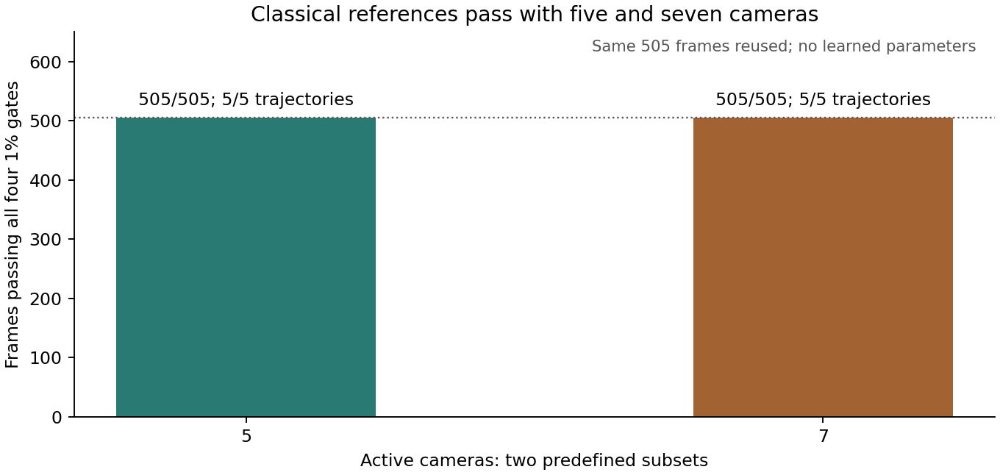

# 五、七相机经典参考解 / Five- and Seven-Camera Classical References

2026-09-08

五、七相机的经典参考解均通过：两个预定子集各505/505帧、5/5完整轨迹达到场、全梯度、内部梯度、观测四项1%门。合计1010个条件单元重复使用同一505帧，不是1010个独立新样本。未加正则的直接解与独立QR解、物理重放一致。这解除这两个无噪声子集的参考解障碍，不是学习度量迁移、暖启动收益或实际加速；缓存直接解仍是强对照。

Classical references pass for both fixed five- and seven-camera subsets: each reaches all four 1% gates (field, full gradient, interior gradient and observation) on 505/505 frames and 5/5 complete trajectories. The 1010 condition-cells reuse the same 505 frames, not 1010 independent new samples. Unregularized direct and independent QR solutions agree with physical replay. This removes the reference obstacle for these two clean subsets, not learned-metric transfer, warm benefit or measured speedup. Cached direct remains a strong control.

| 相机 / Cameras | 已有帧 / Existing frames | 四项门通过 / Four-gate pass | 完整轨迹 / Complete trajectories |
|---|---:|---:|---:|
| 7 | 505 | 505/505 | 5/5 |
| 5 | 505 | 505/505 | 5/5 |

## 测了什么 / What Was Tested

从既有九相机按结果前固定索引保留两个子集；仍使用原检测器、同一批505帧无噪声合成观测、5880个未知量及完整8192体素的评分域。没有缩小真值区域、减均值、拟合参数、正则加载或挑选其他相机组合。两种相机数的全部预测先封存，再读取CFD真值评分。

Two index subsets are fixed before results from the existing nine-camera list. The detector, same505 clean synthetic frames,5880 unknowns and full8192-voxel scoring domain remain unchanged. No reduced truth domain, mean subtraction, fitted parameters, regularization/loading or alternative camera selection. All predictions for both counts seal before CFD-truth scoring.

正式路径使用未加正则的法矩阵Cholesky；独立路径使用相机顺序反转的矩形列主元QR，两个子集均为满数值秩。完整场最大相对差9.11e-11，观测图像差1.96e-13，指标绝对差1.07e-10，原生投影差8.08e-16；退出后独立重新归约2020行评分及完整轨迹尾部，差值0。

The formal path uses unshifted normal Cholesky; the independent path uses rectangular column-pivoted QR with reversed camera order. Both subsets have full numerical rank. Maximum field relative difference is9.11e-11, image difference1.96e-13, metric absolute difference1.07e-10, and native-projection difference8.08e-16. Post-exit independent reduction of2020 score rows and complete-trajectory tails differs by0.

## 意义与边界 / Meaning and Limits

在这两个具体无噪声子集上，原三维场仍可被充分的经典参考解恢复，下一步可公平检验原学习度量。但它没有证明所有相机子集、十二相机、标定误差或噪声下都可行；没有加载学习参数，没有新的学习、暖启动或外部泛化结果。此前固定九相机的505帧学习度量收益保留，不自动推广。

For these two specific clean subsets, an adequate classical reference recovers the original fields, enabling a fair subsequent test of the frozen learned metric. This does not establish arbitrary subsets, twelve cameras, calibration errors or noise. No learned parameters are loaded, and no new learning, warm-start or external-generalization result is claimed. The prior fixed-nine-camera505-frame learned-metric evidence remains but is not automatically transferred.

缓存后经典场解逻辑账为0A+1Aᵀ和两次三角求解；要求物理残差则再加1A。每个几何的主因子约276.6MB，准备和验证并非免费。新增预测账1010Aᵀ、1010Qᵀ、3030次三角求解及2020次物理A；评分另外各2020次交叉A、真值生成A和完整九相机原生A。约152秒与9.58GB只是整轮遥测，不是部署基准或速度优势。

After caching, a classical field solve logically uses0A+1 adjoint A and two triangular solves; a physical residual adds1A. Each geometry's primary factor is about276.6MB; preparation and verification are nonfree. New predictions use1010 adjoint A,1010 adjoint Q,3030 triangular solves and2020 physical A. Scoring additionally uses2020 each of cross A, truth-generation A and full-nine native A. About152seconds and9.58GB are whole-audit telemetry, not a deployment benchmark or speed advantage.

[脱敏汇总 / Redacted summary](poolfire_camera_subset_reference_20260908.json) · [既有学习度量证据 / Prior learned-metric evidence](poolfire_full_control_cost_20260908.md)
