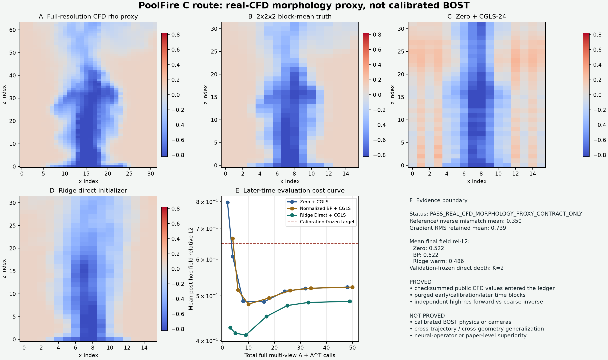

# PoolFire 真实 CFD 形态代理与 Warm-Start 第一闭环

日期：2026-07-23

状态：`PASS_REAL_CFD_MORPHOLOGY_PROXY_CONTRACT_ONLY`

证据等级：`PUBLIC_CFD_MORPHOLOGY_PROXY_ONLY`

突破标记：`algorithm_breakthrough=false`

## 先说人话

这次终于不再只用 Gaussian 制造场，而是把一条经过 SHA-256 校验的公开
PoolFire `rho` 轨迹真正送进了 C 路线：

> 高分辨率真实 CFD 密度形态出题 → 独立连续梯度射线积分生成数值观测 →
> 粗网格 inverse 重建 → ridge Direct warm start → 同一个 CGLS 物理细化器。

在没有参与模型拟合的 refinement-validation 两帧上，固定选出 `K=2`。把这个
固定深度应用到后期五帧时：

| 方法 | 固定深度 | 完整多视角 `A` | 完整多视角 `A^T` | 后期五帧平均 field relative-L2 |
|---|---:|---:|---:|---:|
| Zero + CGLS | 2 | 2 | 2 | `0.60835` |
| normalized BP + CGLS | 2 | 3 | 3 | `0.51445` |
| ridge Direct + CGLS | 2 | 3 | 2 | **`0.41486`** |

这个结果说明：在当前单轨迹数值代理中，观测到三维场的直接先验确实给物理迭代
提供了有用起点，而且只做少量 correction 比一直迭代更好。

但它**不是算法突破**。训练、选择和后期评估仍来自同一条 CFD 轨迹；后期五帧也已在
v0 开发过程中被打开，因此只是 exploratory evidence，不是 fresh confirmatory test。



## 公开数据到底是什么

本地包来自 REALM PoolFire 的公开 train trajectory
`p=14kw_size=03`。`rho.npy` 为 `101 x 80 x 80 x 200`、`float32`，
源归档 SHA-256 为：

`6080ddcc595f38296bff5bfabbad098c2c48cf402ca68bee112a16875781383c`

正式协议还把 trajectory、split、archive 名、source/metadata SHA、四个 payload SHA、
`101 x 80 x 80 x 200` shape、`float32` dtype 和 `101` 个时间标签共同锁成
`realm-poolfire-p14kw-size03-rho-v1`。任何一项变化，runner 都会在生成 pair 前
fail closed，不能悄悄换另一条轨迹后沿用旧结论。

正式 runner 重新核对了：

- `rho.npy`、`coords.npy`、`times.npy`、`manifest.json` 四个 payload digest；
- `checksums.sha256` 自身 digest；
- `READY.json` 与 manifest digest；
- 数组 shape、dtype、Cartesian separability、坐标方向和时间单调性；
- 每个实际读取 ROI 的 `rho` 都 finite 且严格为正；
- 公共结果中没有写入本机路径、VPN、账号或原始 CFD 数组。

公开入口：

- [REALM 项目页](https://realm-bench.org/)
- [REALM 官方代码仓库](https://github.com/deepflame-ai/REALM)
- [PoolFire Hugging Face 数据集](https://huggingface.co/datasets/realm-bench/realm-bench-PoolFire/tree/main)
- [REALM benchmark 论文](https://arxiv.org/abs/2512.18595)

## 为什么仍然 fail closed

官方项目概览写 PoolFire 有 `21` 个 time steps，本地校验包是 `101` 帧；官方仓库概览
写 domain 为 `3 x 3 x 3 m^3`，但文件坐标范围为：

- `x: -0.5925 ... 0.5925`
- `y: -0.5925 ... 0.5925`
- `z: 0.0075 ... 2.9925`

此外，当前还不知道 `rho` 的明确单位，也没有确认它是 point sample 还是有限体积
cell average。因此代码只把坐标当作“未确认单位中的均匀数值坐标”，把 `rho` 当作
真实 CFD 形态，不把结果叫 metre、refractive index、radian 或 BOST pixel shift。

## 四段时间隔离

随机抽帧会把强时间相关性泄漏到测试中。本门按顺序冻结四段，并在相邻段之间留下
至少五个未使用帧：

| 角色 | frame indices | 数量 | 可以做什么 |
|---|---|---:|---|
| train | `0,2,...,48` | 25 | 拟合 ridge |
| ridge selection | `55,60` | 2 | 选择 ridge multiplier |
| refinement-depth validation | `67,74` | 2 | 固定 `K=2`，也冻结 matched target |
| later-time evaluation | `80,85,90,95,100` | 5 | 只做冻结后的评价 |

最终 ridge 用 train 加 ridge-selection 两段共 `27` 帧重拟合，没有使用
refinement-validation 或 later-time evaluation。

这仍然只有一条 trajectory，不能把 34 个使用帧说成 34 个独立工况。

## 如何避免 inverse crime

### 出题端

1. 从完整轨迹中固定裁出 `32 x 32 x 64` ROI；
2. 把 full-resolution `rho` 解释为连续三线性 point-sample 代理；
3. 对三线性场求解析梯度；
4. 对三个轴向视角分别做 composite Gauss-Legendre 射线积分；
5. 每帧形成 `2072` 维双分量 observation。

### 答题端

1. 对高分辨率 ROI 做严格 `2 x 2 x 2` block mean；
2. 得到 `16 x 16 x 32` coarse truth；
3. 使用另一个模块中的三视角
   `ProjectionFirstInteriorStraightRayOperator`；
4. reference 不暴露 adjoint，不与 inverse 共享离散矩阵或体素算子。

34 个 pair 中，高分辨率 reference 与 coarse inverse 对同一 coarse truth 的投影相对差：

- mean：`35.011%`
- min：`31.840%`
- max：`37.980%`
- x/y/z 三个 LOS 的 mean：`40.041% / 42.745% / 32.631%`

`2 x 2 x 2` 粗网格只保留平均 `73.911%` 的 gradient RMS。

这证明当前不是 inverse crime，同时也说明 forward mismatch 很强。曲线中的误差不只来自
求解器，还来自 coarse inverse 无法精确解释 high-resolution observation。

## Direct baseline 怎么训练

本门故意不用 FNO/FFNO/DeepONet，先用可审计的 classical control：

- 输入：一帧 `2072` 维 observation；
- 输出：`16 x 16 x 32` 三维 coarse field；
- 模型：dual-form affine ridge；
- ridge 候选：`1e-10, 1e-8, 1e-6, 1e-4, 1e-2`；
- 选择规则：ridge-selection 两帧 mean field-L2 最小，再比 worst，再选更小 multiplier；
- 最终 multiplier：`1e-2`；
- 最终模型大小：`2,299,136 bytes`；
- 模型 SHA-256：
  `31b5de432444349c0d70b348a18b31af356ee3fabbfd3470e3193e80e88aab9d`。

它不是神经算子。作用是先回答“可学习 observation-to-field prior 有没有基本 headroom”，
没有 headroom 就不值得立刻堆 FNO。

## 后期五帧逐帧结果

下表使用 validation 冻结的 `K=2`，不是看测试 truth 后给每帧挑最优步数：

| frame / time label | Zero | normalized BP | Direct warm | Direct only |
|---|---:|---:|---:|---:|
| `80 / 31.6` | `0.59411` | `0.49390` | **`0.39807`** | `0.44036` |
| `85 / 31.7` | `0.61686` | `0.51102` | **`0.44289`** | `0.49087` |
| `90 / 31.8` | `0.63270` | `0.54820` | **`0.44508`** | `0.48805` |
| `95 / 31.9` | `0.60462` | `0.52212` | **`0.39062`** | `0.42909` |
| `100 / 32.0` | `0.59345` | `0.49703` | **`0.39762`** | `0.44480` |

Direct warm 在五帧都低于 Zero 和 normalized BP。它比 Direct-only 也更好，说明前两步
物理 correction 有用。

但 Direct 路线继续跑到 `K=24` 后，平均 error 从 `K=2` 的 `0.41486` 恶化到
`0.48620`，同时 data residual 继续下降。这个冲突是本门最有价值的机制线索：

> 在 forward mismatch 下，“更符合 coarse observation”不等于“更接近 CFD truth”。
> 下一算法不应只做更大的网络，而应学习或校准一个部署可见的 correction budget，
> 在过度精修开始前 fail closed。

## 成本账没有藏什么

每次 `A` 表示完整三个视角的一次 forward，每次 `A^T` 表示完整三个视角的一次 adjoint。

- Zero 第 `K` 步：`K A + K A^T`；
- normalized BP 第 `K` 步：`(K+1) A + (K+1) A^T`；
- Direct 第 `K` 步：模型推理一次、初始投影 `1 A`、再做
  `K A + K A^T`；
- reference observation generation、模型 fitting、模型 inference、inverse calls 和 solver
  overhead 分开记录；
- 测试 truth 只进入 solver 外的 post-hoc evaluator；
- 所有 projection cache 运行后回到 `0`。

还有一个必须保留的审计边界：solver 的公开 API 没有 truth，Direct inference 实际只接收
只读 observation 和冻结模型；但当前仍在同一个 Python 进程中执行，不能从机制上排除
callable 捕获外部状态。因此 initializer 只标
`CONTROLLED_INPUT_SELF_ATTESTED`，`independent_noninterference_proven=false`。
进入 fresh trajectory 确认实验前，必须把冻结模型推理放进只接收
`model parameters + observation` 的独立进程。

三视角 inverse 的 12-case adjoint dot test 最大相对差为 `3.05e-14`，门为 `2e-12`；
常数响应相对非平凡 probe 为 `1.19e-16`。

## 当前最诚实的结论

### 已经证明

- 公开 PoolFire CFD 数值确实进入了 C 路线，不再只是 Gaussian smoke；
- high-resolution reference 与 coarse inverse 已经非同构；
- 四段时间角色、purge、solver callable 不接 truth 和调用账本能机器验证；
- Direct initializer 当前只达到同进程
  `CONTROLLED_INPUT_SELF_ATTESTED`，没有冒充独立非干扰证明；
- 单轨迹后期帧上，classical direct prior 加两步 correction 有清晰数值 headroom；
- 过度 correction 在 model mismatch 下会把好初值拉坏。

### 没有证明

- `rho -> Delta n`、Gladstone-Dale、真实相机或 pixel displacement；
- calibrated BOS/BOST observation；
- 新轨迹、新功率、新池尺寸、新 geometry 或实验数据泛化；
- ridge、FNO、FFNO、DeepONet 中任何一个具有论文级优势；
- 真实 BOST 的速度、显存或 wall-time 优势；
- 可以投稿。

## 下一道唯一主线门

1. 先把 evaluation initializer inference 放进只接收
   `model parameters + observation` 的独立进程，封死同进程 callable 捕获
   test truth、inverse 或未计费缓存的路径。
2. 再下载至少 3 至 5 条不同 PoolFire trajectory，固定：
   train trajectories、ridge/neural validation trajectory、stopping validation trajectory
   和完全未打开的 test trajectories。
3. 当前五个 later-time frames 只留作 development，不再充当 fresh test。
4. 在相同 pair 与账本上加入最小 3D FNO/UNO 或 low-rank spectral warm initializer，
   首先比较 ridge，而不是直接宣称优于 FFNO。
5. 新算法重点放在 **calibration-aware correction budget**：
   网络预测 `x0`，另一个小门控只用 deployable residual/spectral features 决定固定 correction
   强度或拒绝精修。
6. 只有跨 trajectory 的 fixed-rule p50/p90/worst 都成立，才向师兄申请组内真实
   `rho/Delta n + camera + observation` 小样。

## 复现与独立验证

正式运行需要把 `--bundle` 指向已校验的本地公开数据包；路径不会写入结果：

```bash
.venv/bin/python site_tools/run_poolfire_cfd_morphology_proxy_gate.py \
  --bundle /path/to/verified/poolfire-rho-bundle

.venv/bin/python site_tools/validate_poolfire_cfd_morphology_proxy_gate.py \
  --bundle /path/to/verified/poolfire-rho-bundle

.venv/bin/python -m pytest -q \
  site_tools/test_operator_learning_n3_page.py \
  site_tools/test_poolfire_cfd_proxy.py \
  site_tools/test_poolfire_c_warm_models.py \
  site_tools/test_validate_poolfire_cfd_morphology_proxy_gate.py \
  site_tools/test_poolfire_c_baselines.py \
  site_tools/test_run_poolfire_c_baseline_contract_gate.py
```

现场结果：

- 正式 runner：`PASS_REAL_CFD_MORPHOLOGY_PROXY_CONTRACT_ONLY`
- 独立 artifact validator：`PASS_INDEPENDENT_ARTIFACT_VALIDATION`
- 聚焦回归：`39 passed`
- 受限论文、VPN 内容、原始 508 MB CFD payload：均未上传
