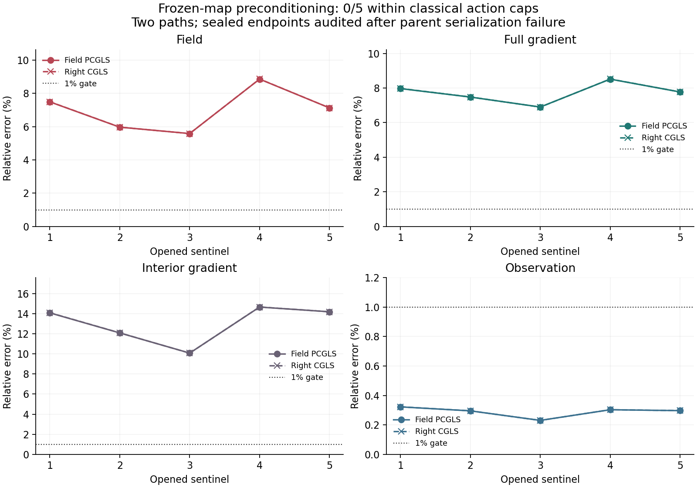

# 冻结模型的求解器角色检验 / Frozen-Model Solver-Role Test

2026-09-07

复用冻结学习模型作PCGLS预条件器，在五个已开封哨兵的经典对照调用预算内，两条路径均0/5通过四项1%精度。观测误差均低于0.33%，场误差仍约5.6%-8.9%。原报告序列化失败保留；另行端点独立审计通过，关闭此用法，不是算法或速度突破。

Reusing the frozen learned map as a PCGLS preconditioner passes four-metric 1% accuracy on 0/5 opened sentinels in both paths within cheaper classical-control action caps. Observation errors stay below 0.33%, but field errors remain about 5.6%-8.9%. The parent serialization failure is retained; a separate independent endpoint audit passes. This reuse is closed, not an algorithm or speed breakthrough.

## 问题与唯一变化 / Question and Only Change

此前冻结模型改善了初值，却未稳定减少精度认证所需调用。这次不重训、不改参数，而让同一线性正定dual映射T参与每步修正：初值x0=A^T T y，预条件器M=A^T T² A。正式版在场空间做PCGLS，独立版在B=A^T T的观测坐标中做右预条件CGLS。正定性仅针对已验证满秩的有效场支撑，不声称整个含边界网格均正定。

The frozen model improved its initial field but did not reliably reduce certified solution cost. Without retraining or parameter changes, reuse the same positive linear dual map T in each correction: x0=A^T T y and M=A^T T² A. The formal path uses field-space PCGLS; the independent path uses right-preconditioned CGLS with B=A^T T. Positive definiteness is limited to the verified full-rank active support, not the entire boundary-inclusive grid.

只检查五条已打开轨迹各一个既定中点，原有完整轨迹外折模型保持不变。这是五个post-open必要哨兵，不是新的外部泛化测试、全部505帧或完整算法家族。主候选的调用上限，在结果前固定为Zero-CGLS、Jacobi、归一化反投影和dual-ridge四个已合格迭代对照中，两版最小A/AT次数各减1。CFD真值只在端点封存后评分，不参与预测、上限或停止。

Use one fixed midpoint from each of five opened trajectories and retain the original whole-trajectory outer-fold models. These are five post-open necessary sentinels, not a new generalization test, all 505 frames or a complete algorithm family. Before results, each action cap is the minimum A/AT count across both implementations of four qualified iterative controls (Zero-CGLS, Jacobi, normalized BP and dual ridge), minus one. CFD truth scores sealed endpoints only; it does not affect predictions, caps or stopping.

## 结果 / Result

| 哨兵 / Sentinel | 场 / Field | 全梯度 / Full gradient | 内部梯度 / Interior gradient | 观测 / Observation | A / AT |
|---|---:|---:|---:|---:|---:|
| 1 | 7.487% | 7.967% | 14.079% | 0.322% | 869 / 869 |
| 2 | 5.966% | 7.477% | 12.084% | 0.295% | 877 / 877 |
| 3 | 5.583% | 6.902% | 10.080% | 0.231% | 863 / 863 |
| 4 | 8.853% | 8.513% | 14.658% | 0.303% | 929 / 929 |
| 5 | 7.124% | 7.771% | 14.189% | 0.297% | 779 / 779 |

表为正式路径，独立路径各项略有浮点差别，但两者都0/5达到四项1%精度及原有仅观测认证门。两版的场误差范围约5.58%-8.86%，内部梯度约10.07%-14.67%，观测则约0.230%-0.323%。这不仅是保守认证未通过，实际三维指标也失败。它否定这次固定复用方式的稳定省调用主张，不证明全部学习预条件器或C路线不可能。

The table shows the formal path. The independent path has slightly different floating-point endpoints, but both pass four-metric 1% accuracy and the unchanged observation-only certificate on 0/5 frames. Across both paths, field errors span about 5.58%-8.86%, interior-gradient errors 10.07%-14.67%, and observation errors 0.230%-0.323%. This is not solely a conservative-certificate rejection: actual 3D accuracy also fails. It rejects stable action savings for this fixed reuse, not every learned preconditioner or the C route.

## 独立审计与格式失败 / Independent Audit and Serialization Failure

原程序完成两版求解并封存十个端点后，因未通过的误差上界为正无穷、严格JSON拒绝写入而退出1；原失败和全部文件原样保留，不能称正式程序执行成功。另行冻结的端点审计没有重跑求解，重新校验输入、端点、费用账与经典对照，使用稀疏/原生forward及两套梯度评分重放，并逐端点重算两套认证。无界值明确记为unbounded，不改成零或通过。该审计退出0，退出后的独立哈希复验通过，才形成这里的必要负判决。

The parent completed both solver paths and sealed ten endpoints, then exited 1 because strict JSON could not serialize positive infinity from an unbounded error certificate. Its failure and files remain unchanged; this is not a successful parent execution. A separately frozen endpoint audit did not rerun the solver. It rechecked inputs, endpoints, action receipts and classical controls, replayed sparse/native forwards and two gradient-scoring implementations, and recomputed both certificates for every endpoint. Unbounded values remain explicit, never zero or passing. That audit exited 0 and a separate post-exit hash check passed before this necessary negative decision.

原生物理重放最大差7.07e-16，递归残差重放差1.29e-15，同一场的两套指标差2.18e-16，前3步两路径场差1.41e-15。并不声称几百步后的两版端点逐位一致；报告保留两版指标。仅主候选失败后，预注册的固定T归因对照不再执行，也不扩跑505帧。

Maximum native replay difference is 7.07e-16, recursive-residual replay difference 1.29e-15, same-field metric difference 2.18e-16, and first-three-iterate difference 1.41e-15. This does not claim bitwise-identical endpoints after hundreds of iterations; both paths' metrics are retained. The optional fixed-T attribution control was not run after primary rejection, and there is no 505-frame expansion.

## 成本与边界 / Cost and Boundaries

每步额外计算明确计入2A+2AT+2T；每帧389-464步。十个端点累计8634A+8634AT和8634次T应用，包含初值与初始残差，不把预条件器当免费。端点审计另加50A+10AT。已有稠密几何认证构建、模型训练与原程序离线检查均不免费，不能用本次执行耗时声称部署加速。全缓存直接解仍是更强的独立经典对照，不因这里只比迭代方法而消失。

Each iteration costs 2A+2AT+2T, with 389-464 iterations per frame. The ten endpoints total 8634A+8634AT and 8634 T applications, including initial fields and residuals; preconditioning is not free. The endpoint audit adds 50A+10AT. Existing dense geometry-certificate setup, model training and parent offline checks are not free, and audit elapsed time is not deployment speed. The fully cached direct solution remains a stronger separate classical control, not removed by this iterative-method comparison.

学习预条件器已有先例；这次只是冻结模型的特定复用，不是该文复现或首创主张。[Li et al., ICML 2023](https://proceedings.mlr.press/v202/li23e.html)。当前不追加迭代、混合Jacobi、缩放、改损失或训练；没有算法突破、资源加速、外部泛化或真实BOST结论。

Learned preconditioning has prior work; this is a specific reuse of a frozen model, not a reproduction or novelty claim. [Li et al., ICML 2023](https://proceedings.mlr.press/v202/li23e.html). No deeper iteration cap, Jacobi blending, rescaling, loss change or training is authorized. There is no algorithm breakthrough, resource speedup, external generalization or real-BOST result.

[脱敏汇总 / Redacted summary](poolfire_dual_pcgls_20260907.json)

[此前误差保留诊断 / Previous error-retention diagnosis](poolfire_inverse_moment_20260907.md)
