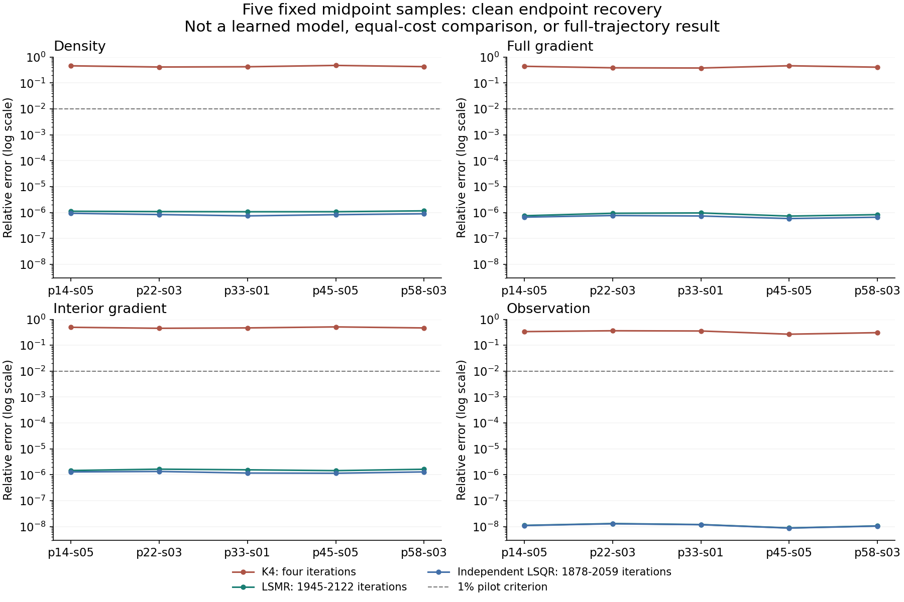

# 五点经典求解诊断 / Five-Point Classical Endpoint Pilot

## 中文

**结论：现有干净数据的这5个样本可以恢复，接近K4并不等于重建准确。**

从五条已经开封的PoolFire训练轨迹各固定取中间一帧，保持相同九相机、观测与网格。传统LSMR从零开始求解，另一条路径独立构造算子并用LSQR求解；两条路径的全部重建先封存，再读取真值评分。预先规定的四项相对误差均不超过1%的诊断门，双方均通过5/5。

| 样本来源 | K4密度相对误差 | LSMR密度相对误差 | LSMR迭代数 |
|---|---:|---:|---:|
| p14-s05 |0.461409|1.12131e-6|2042|
| p22-s03 |0.414607|1.08831e-6|2101|
| p33-s01 |0.424083|1.07345e-6|2107|
| p45-s05 |0.478149|1.07583e-6|2122|
| p58-s03 |0.428817|1.16228e-6|1945|

这说明这五点的K4早停误差包含大量仍能恢复的信号，不能把它归因于数据天然无法恢复。现有小模型“接近K4”的比较仍有效，但尚不能称准确重建；旧模型的负结果全部保留。

**边界与成本：**这不是学习算法，也不是同价比较。LSMR使用1945--2122次迭代，每次1A+1AT；还需初始化、数值检查和几何构建。这不是达到1%误差所需的最小调用数。独立LSQR使用1878--2059次迭代。几何构建分别使用29700条解析行和8192次基向量forward；探针另计4A+4AT，数据和物理检查另计40A。没有调用减少或速度结论。

独立场最大相对差5.23e-7，观测相对差7.94e-9，指标最大绝对差3.87e-7，均通过结果前固定的数值门。两种算法的条件数估计不可直接互比，也不是已认证的矩阵条件数。

这只是**5个点，不是5条完整轨迹**。合成数据与反演使用同一离散forward，是有利的无噪声一致性检查，不证明独立物理模拟、噪声鲁棒性、真实BOST或论文成功。下一步优先明确可靠绝对精度及经典方法的精度-计算量关系，再决定新的学习目标。

## English

**Finding: these five existing clean samples are recoverable; matching K4 is not the same as accurate reconstruction.**

Take the fixed midpoint frame from each of five already-open PoolFire training trajectories, retaining the same nine cameras, observations and grid. Classical LSMR starts from zero; a separate path rebuilds the operator and solves with LSQR. All ten reconstructions are sealed before truth scoring. Both paths pass the predeclared diagnostic of at most1% relative error in all four metrics on5/5 points.

| Source | K4 relative density error | LSMR relative density error | LSMR iterations |
|---|---:|---:|---:|
| p14-s05 |0.461409|1.12131e-6|2042|
| p22-s03 |0.414607|1.08831e-6|2101|
| p33-s01 |0.424083|1.07345e-6|2107|
| p45-s05 |0.478149|1.07583e-6|2122|
| p58-s03 |0.428817|1.16228e-6|1945|

K4 truncation leaves substantial recoverable signal on these five points; intrinsic information loss does not explain those K4 errors. Previous K4-relative model comparisons remain valid, but do not establish accurate reconstruction. All prior negative model judgments remain unchanged.

**Cost and limits:** this is neither learning nor an equal-cost comparison. LSMR takes1945--2122 iterations, each1A+1AT, plus initialization, numerical checks and geometry construction. These are not minimum calls needed for1% error. Independent LSQR takes1878--2059 iterations. Geometry uses29700 analytical rows and8192 canonical forward actions; probes add4A+4AT and data/physical checks add40A. There is no call-reduction or speedup result.

The maximum independent relative field difference is5.23e-7, relative observation difference7.94e-9, and absolute metric difference3.87e-7, within predeclared numerical limits. Algorithm-specific condition estimates are not directly comparable or certified matrix condition numbers.

These are **five points, not five completed trajectories**. Synthetic generation and inversion share the same discrete forward, a favorable clean inverse-consistency check. This does not establish independent physical simulation, noise robustness, real BOST or paper success. Next prioritize useful absolute accuracy and classical accuracy-versus-compute before choosing any new learned target.

[数值汇总 / Numerical summary](poolfire_endpoint_pilot_20260906.json)

方法不是新发明 / Established methods: [Stanford LSMR](https://web.stanford.edu/group/SOL/software/lsmr/), [SciPy LSMR](https://docs.scipy.org/doc/scipy/reference/generated/scipy.sparse.linalg.lsmr.html), [SciPy LSQR](https://docs.scipy.org/doc/scipy/reference/generated/scipy.sparse.linalg.lsqr.html).
