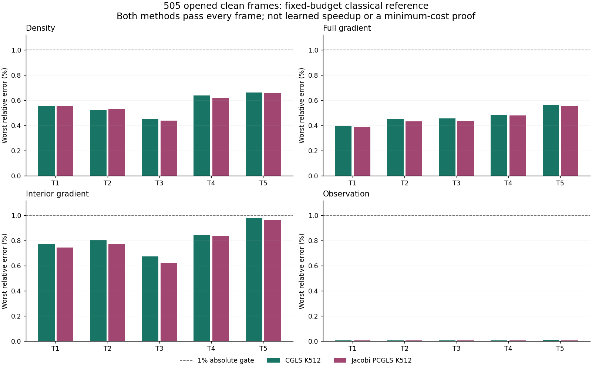

# 完整序列的固定预算经典基线 / Fixed-budget classical sequence reference

## 中文

2026-09-06。普通CGLS主基线与几何Jacobi PCGLS同价对照，固定512步，正式和独立实现均通过505/505帧、5/5条完整轨迹。每条101帧，每帧密度、全梯度、内部梯度和观测相对误差均不超过1%，不是只让平均值通过。最坏值在两种实现中取较大者：

| Metric / 指标 | Worst primary error / 主基线最坏误差 |
|---|---:|
| Density / 密度 | 0.659559% |
| Full gradient / 全梯度 | 0.560067% |
| Interior gradient / 内部梯度 | 0.978795% |
| Observation / 观测 | 0.008466% |

这把此前的五点可恢复性检查扩展成完整已打开序列上的经典精度标尺。它支持后续研究在有用的最终精度下减少计算，而不是只模仿误差较大的K4。内部梯度仍接近1%门，不能推断噪声鲁棒。

范围必须说明：固定512来自已经看过的五点试点；复用5个试点，另外500帧首次在这个预算下评价，但五条轨迹都是已打开的训练资料。只有一个干净九相机几何，数据生成和反演使用同一离散forward。不是独立测试、相机增删泛化、学习成功、真实BOST或论文突破。此前中间迭代曲线的数值不确定判决保持不变；本次没有重新认证它们，也没有证明512是最小调用数。

独立检查区分了同一场的物理重放与第二条求解路径。跨路径场/投影/指标最大差为8.98e-5/1.12e-5/9.99e-5，均在原有数值界内；同一场的投影/指标差仅7.87e-16/2.02e-17。每帧1%判断完全一致。严格同价非劣计数主基线为86/88、Jacobi为301/301；前者的数值排序不完全一致，因此不声称主基线更优。

每次逻辑求解为512A+512AT，不是加速结果。两臂、两实现的2000次新增离线求解共1,024,000A+1,024,000AT。复用几何的8192次基向量forward及29700解析行构建、原试点全部40960A+40960AT和本次额外4040次forward重放均单独披露。没有训练参数，也没有端到端时间或内存优势结论。

## English

Both the ordinary CGLS primary and equal-cost geometry-Jacobi PCGLS control at fixed512 steps pass505/505 frames and5/5 complete101-frame sequences in both implementations. EVERY frame meets1% relative density, full-gradient, interior-gradient and observation error, not merely the mean. The table takes the worse value across both implementations.

This extends the earlier five-point recoverability check to a useful-accuracy classical reference across the opened sequences. It motivates reducing computation at equivalent final accuracy, rather than only imitating the weak K4 comparator. Interior-gradient error remains close to the gate; noise robustness does not follow.

The budget is pilot-informed: five design points are reused and500 other frames are newly evaluated at this budget, but all trajectories are already-opened training material. Only one clean nine-camera geometry and the same discrete forward are used for data generation and inversion. This is not an independent test, variable-camera generalization, learned success, real BOST or a paper breakthrough. The old intermediate-curve numerical verdict remains inconclusive and is NOT requalified;512 is not proven minimal.

Same-field physical replay and the second solver trajectory are checked separately. Cross-path field/image/metric differences8.98e-5/1.12e-5/9.99e-5 satisfy the original bounds; same-field image/metric differences are7.87e-16/2.02e-17. All1% cell decisions agree. Strict equal-cost nonharm counts are86/88 for the primary and301/301 for Jacobi, so the primary ranking is not numerically identical and no primary-superiority claim is made.

Each logical solve costs512A+512AT. The2000 new offline solves cost1,024,000A+1,024,000AT, separately from reused geometry setup (8192 canonical forwards and29700 analytical rows), the entire inherited pilot (40960A+40960AT), and4040 new physical forwards. No parameters are trained and no end-to-end time or memory speedup is established.

[Redacted aggregate / 去隐私汇总](poolfire_fixed512_reference_20260906.json)

## 后续方向诊断 / Follow-on direction diagnosis

密度误差指预处理后的固定规范网格场，不是原分辨率CFD或实验绝对密度精度。本次没有训练模型或追加求解迭代，只读取已封存的K4、K512、观测和已验证的几何算子。

方向诊断：K4到合格参考的修正，在全部505帧上平均法向算子灵敏度更低。沿实际观测残差梯度，任何单个标量步长的场误差下界都至少29.57%，不能一步达到1%目标；这不排除后续多步CGLS或多方向暖启动，尚无学习加速结论。

K4到参考的场差异逐轨迹中位数约40.6%至48.6%。修正量的平均灵敏度更低，但灵敏度比在0.159至0.627之间，不能宣称全部落在近零特征值或某个空间低频带。参考误差法向方向上的最优标量只能消除18%至32%的场差异能量。

第二项检查使用真实部署可见方向 `g4=AT(y-Ax4)`，没有把它与参考误差的法向方向混为一谈。令 `R=x512`，`m=min_alpha ||R-x4-alpha*g4||/||R||`，由已验证的参考误差不超过1%，三角不等式给出每个真实场误差的下界 `max(0,0.99*m-0.01)`。每帧下界都超过29.57%；表格是下界，不是测得误差的范围。

| Trajectory / 轨迹 | Median late/K4 Rayleigh / 灵敏度比中位数 | Minimum scalar-step error lower bound / 标量一步误差下界最小值 |
|---|---:|---:|
| p=14kw_size=05 | 0.2347 | 38.1634% |
| p=22kw_size=03 | 0.4242 | 31.5886% |
| p=33kw_size=01 | 0.4792 | 29.5737% |
| p=45kw_size=05 | 0.2722 | 32.5921% |
| p=58kw_size=03 | 0.3621 | 33.3510% |

两实现逐帧排除结论一致，下界最大绝对差为2.31e-6，步长最大相对差为1.99e-6。合计新增3030A+2020AT，无CFD真值数组解析、训练或新求解终态。该排除只适用于单次标量修正直接完成任务，不排除其后继续CGLS、多方向修正或其他暖启动；旧学习失败和本页经典基线通过的结论都不变。

Density errors concern preprocessed gauge-fixed grid fields, not original-resolution CFD or calibrated experimental density. No training or additional solver iterations occur: the diagnostic reads sealed K4/K512 fields, observations and verified geometry operators.

Direction diagnosis: the K4-to-qualified-reference correction has lower mean normal-operator sensitivity on all 505 frames. Along the actual observation-residual gradient, every scalar step has a field-error lower bound of at least 29.57%, excluding one-step attainment of the 1% gate. This does not exclude further CGLS or multidirection warm starts and establishes no learned speedup.

Trajectory-median K4-to-reference field gaps are 40.6%--48.6%. The lower mean sensitivity ratio ranges from 0.159 to 0.627; it is NOT an exclusive near-null or spatial low-frequency band certificate. An oracle scalar along the reference-error normal direction removes 18%--32% of late field-error energy.

The second check instead uses the actual visible direction `g4=AT(y-Ax4)`. For qualified reference `R=x512`, define `m=min_alpha ||R-x4-alpha*g4||/||R||`. The verified 1% reference guarantee and reverse triangle imply the truth-field error lower bound `max(0,0.99*m-0.01)` for EVERY scalar. The table reports lower bounds, not measured-error ranges. Both implementations exclude all 505 frames, with maximum absolute bound difference 2.31e-6 and relative alpha difference 1.99e-6. Total new work is 3030A+2020AT, with no CFD truth array parsing, model fitting or new solver endpoint. Further CGLS, multidirection corrections and other warm initializers are not excluded.

文献提供的是方法提醒，不是本任务的成功证据：[HINTS](https://arxiv.org/abs/2208.13273)强调神经与经典迭代的误差成分互补；[DL-HIM训练与更新可靠性研究](https://arxiv.org/html/2602.06842v1)讨论训练初始右端项和部署残差之间的分布差异。这里没有复现其PDE速度结果，也没有证明本任务出现其假固定点现象。

The literature supplies methodological context, not our performance evidence: [HINTS](https://arxiv.org/abs/2208.13273) motivates complementary error correction; the [DL-HIM training/update study](https://arxiv.org/html/2602.06842v1) discusses mismatched initial training inputs and deployment residuals. Their PDE speed results are not reproduced here, and their false-fixed-point phenomenon has not been established for our one-shot initializer.

## 局部近似逆对照 / Local approximate-inverse control

经典对照进展：局部稀疏近似逆配合固定256步，在五个已打开哨兵的四项误差上均优于同预算Jacobi；全部1%门通过3/5，对照为0/5。两个失败点的内部梯度误差约1.111%与1.186%。当前配置封存，不加深或调参；不是完整序列、学习加速或真实BOST成果。

Classical control: a local sparse approximate inverse at fixed 256 steps improves all four errors over same-budget Jacobi on five opened sentinels. The 1% gate passes 3/5 versus 0/5; two interior-gradient errors remain about 1.111% and 1.186%. This configuration is closed without depth or parameter tuning. No complete-sequence, learned-speedup or real-BOST result is established.

| Opened midpoint / 已打开中点 | FSAI interior error / 内部梯度误差 | Jacobi interior error / 内部梯度误差 |
|---|---:|---:|
| p=14kw_size=05 | 1.110643% | 2.887197% |
| p=22kw_size=03 | 1.185324% | 2.306541% |
| p=33kw_size=01 | 0.832263% | 2.113687% |
| p=45kw_size=05 | 0.851966% | 2.937497% |
| p=58kw_size=03 | 0.793125% | 2.108898% |

这只是同一干净九相机设置的五个历史中点，不是五条完整轨迹。FSAI的场、全梯度与观测误差五点均通过，只有上表前两个内部梯度误差失门；不能事后放宽1%标准。两实现逐项判决一致，场/观测/指标最大差约2.04e-4/3.22e-5/1.88e-4，守住预先固定的数值界。相同场的独立物理回放差约7.03e-16。

These are five historical midpoints in one clean nine-camera acquisition, not five complete trajectories. FSAI field, full-gradient and observation errors pass all five points; only the first two interior-gradient errors miss the unchanged 1% threshold. Both implementations agree on every gate. Maximum field/image/metric differences are about 2.04e-4/3.22e-5/1.88e-4 within the preset numerical bounds; independent replay of the same field differs by about 7.03e-16.

每个求解仍需256A+256AT，另有256次L和257次L转置稀疏乘法。每套几何因子有103548个CSR存储项，约1.22MiB，需8192个局部求解；不能把几何预处理和因子运算当免费。20个离线终态合计5120A+5120AT，评分/探针另33A。没有端到端速度或新学习参数结果。

Each solve still needs 256 A+256 AT plus 256 L and 257 transposed-L sparse actions in the formal path. Each geometry factor stores 103548 CSR entries, about 1.22 MiB, and requires 8192 local solves; setup and factor actions are not free. Twenty offline endpoints total 5120 A+5120 AT, plus 33 scoring/probe A calls. There is no end-to-end speed or new learned-parameter result.

最初启动在观测/评分前发现常数零空间假设错误，已作为工程失效保留。现有forward先施加外边界零支撑再求梯度，因此不能任意减去求解均值；修正版本不做该后处理，不改因子配置、步数或门。几何边界应由实际算子决定，不能直接套用连续无限域直觉。

The first attempt stopped before observations/scoring because its constant-nullspace premise was invalid. This forward applies outer-zero support before differentiation, so arbitrary mean subtraction is not legitimate. The corrected run omits that postprocessing without changing factor settings, depth or gates. Boundary semantics must follow the actual operator, not an unbounded-domain intuition.

[FSAI原始论文 / Original FSAI paper](https://epubs.siam.org/doi/10.1137/0614004)是该经典方法的来源，不是本任务的突破证据。This is established numerical methodology, not component originality or proof of learned BOST acceleration.

## 三维状态小算子 / Small Field-State Operator

新一轮学习验证：81参数三维状态小算子完成10个完整轨迹外折拟合，505个预测先封存。七种同预算方法在五个预定中点均为0/5通过；候选内部梯度误差2.12%至3.02%，高于1%门，且普通CGLS、BP与旧dual-ridge的四项误差都更低。每次部署258A+258AT，另计几何准备与映射；已关闭该配置并跳过余下500帧重建。不是完整序列通过、学习加速或真实BOST成果。

New learning check: an 81-parameter field-state operator completed 10 whole-trajectory outer-fold fits, with all 505 predictions sealed first. All seven same-budget methods passed 0/5 prescribed midpoints. Candidate interior-gradient errors were 2.12% to 3.02%, above the 1% gate; ordinary CGLS, BP and frozen dual-ridge had lower errors on all four metrics. Each deployment costs 258 A+258 AT, plus geometry setup and maps. This configuration is closed and the remaining 500 refinements were skipped. No complete-sequence, learned-speedup or real-BOST success is established.

| 已开中点 / Opened midpoint | 正式内部梯度误差 / Formal interior error | 独立复算 / Independent |
|---|---:|---:|
| p=14kw_size=05 | 2.941796% | 2.948222% |
| p=22kw_size=03 | 2.285119% | 2.284554% |
| p=33kw_size=01 | 2.127788% | 2.121805% |
| p=45kw_size=05 | 3.015663% | 3.017217% |
| p=58kw_size=03 | 2.144515% | 2.148611% |

本次真正训练了一个新的共享参数模型：观测先经物理伴随与固定局部几何映射汇合到三维，再由逐点小网络预测修正，经精确正向与伴随构造暖启动，最后使用未修改的CGLS。训练目标是已通过精度门的K512参考，不再是较弱K4。每折仅用其余四条轨迹的404帧，留出的101帧不进入训练目标或归一化；两种表示各五折，每个模型81参数。只有干净九相机的历史数据证据，不是新工况泛化。

A new shared-parameter model was actually trained: an adjoint and fixed local geometry map fuse observations into a 3D state, a pointwise small network predicts a correction, exact forward/adjoint actions form the initializer, and unchanged CGLS refines it. Teachers are the qualified K512 reference rather than weak K4. Each fold trains on404 frames from four other trajectories; its101 withheld frames do not enter teacher fitting or normalization. Two representations use five folds each, with81 parameters per model. Evidence is restricted to opened clean nine-camera data, not a new-condition generalization result.

在两套数值实现中，候选四项误差均优于自身无学习几何滤波对照，但均劣于同预算普通CGLS、BP和旧dual-ridge。对同参数量Jacobi小网络的细微优势未在两套实现中完全一致，不能称稳定优势。候选场与全梯度误差也失门，只有观测误差通过。因此小幅降低训练损失不是节省精确调用的证据，合格参考仍未被更便宜的学习算法替代。

In both numerical paths the candidate improves all four errors over its own no-learning geometry filter, but loses on all four to same-budget ordinary CGLS, BP and frozen dual-ridge. Small differences from the same-size Jacobi network do not yield identical dominance in both implementations and are not a reliable advantage. Candidate field and full-gradient errors also fail; only observation passes. Lower training loss is therefore not evidence of exact-call savings, and a cheaper learned algorithm has not replaced the qualified reference.

五个必要中点的逐指标判决一致，独立状态/观测/指标最大差为2.43e-4/3.78e-5/2.25e-4，守住预定数值界；同一场的原生物理回放差7.12e-16。这里不是五条完整轨迹：根据结果前停止规则，其余500帧未做最终重建。全部505个预测已经封存，不能把预测数量写成505个准确重建。

Every metric decision agrees at the five necessary midpoints. Independent state/image/metric discrepancies of2.43e-4/3.78e-5/2.25e-4 satisfy the preset numerical bounds; same-field native replay differs by7.12e-16. These are not five complete trajectories: the pre-result stopping rule skipped the remaining500 final reconstructions. All505 predictions were sealed, but that count must not be reported as505 accurate reconstructions.

新离线训练、预测、核验与评分总账329650A+249850AT；实际70个终态求解另18030A+17990AT，初始化已在预测阶段执行并单列。每种方法的单次部署账均为258A+258AT；几何因子、映射以及已有参考的构建成本不免费。没有fresh wall/RSS优势、GPU需求或论文成功结论。不扩大或调参挽救这个固定配置，也不据此否定所有三维算子学习。

New offline training, prediction, audits and scoring total329650 A+249850 AT; the70 actual endpoint solves add18030 A+17990 AT, with initializer work executed and recorded in the prediction stage. Each method's per-deployment ledger is258 A+258 AT; geometry factors, maps and inherited reference construction are not free. No fresh wall/RSS advantage, GPU need or paper-success claim is established. This fixed configuration will not be enlarged or retuned, and its failure does not rule out all3D operator learning.

## 固定几何经典直接解 / Fixed-Geometry Classical Direct Solve

补齐关键经典对照：固定九相机几何的缓存直接分解，经独立QR复算，在505帧、5条完整轨迹上四项1%精度门全部通过。每种方法三次新进程测量，直接分解/CGLS512/Jacobi-PCGLS512的505帧总耗时中位数为2.80/166.85/168.86秒，进程峰值内存中位数为1.21/0.72/0.73GiB。包含重新分解、求解和写盘；不包含原始BOS矩阵构建与观测生成。该结果是经典方法对照，不是学习算法加速或真实BOST成果。

Classical comparator completed: cached direct factorization for one fixed nine-camera geometry passed all four 1% gates on505 frames and five complete trajectories, independently checked by rectangular QR. Across three fresh processes per method, median505-frame wall times for direct factorization/CGLS512/Jacobi-PCGLS512 are2.80/166.85/168.86seconds; median process peak memory is1.21/0.72/0.73GiB. Measurements include refactorization, solves and output writing, but exclude original BOS matrix construction and observation generation. This is a classical comparison, not learned acceleration or a real-BOST result.

| 经典方法 / Classical method | 505帧总秒数中位数 / Median seconds | 进程峰值GiB中位数 / Median peak GiB | 准备秒数中位数 / Median setup seconds |
|---|---:|---:|---:|
| factor | 2.798 | 1.208 | 0.9211 |
| cgls | 166.852 | 0.725 | 0.0000 |
| pcgls | 168.856 | 0.725 | 0.0076 |

这次补齐的是一个简单但关键的对照：同一相机几何被505帧复用时，可以先分解有效场空间的正规矩阵，再对每帧做一次伴随和两次三角求解。独立实现不形成正规方程，而是对相机行块乱序后的矩形矩阵做带列主元QR。未加新的正则、截断或训练参数；两者的场最大差2.242e-12、观测最大差3.680e-14，全部轨迹均通过。直接解的四项误差也都小于已合格的两种K512参考。

The missing comparator is simple but important:505 frames share the same camera geometry, so the active field normal matrix can be factored once and each frame solved using one adjoint and two triangular solves. The independent implementation forms no normal equations: it uses column-pivoted rectangular QR after camera-block row permutation. No new regularization, truncation or trained parameters are used. Maximum field and observation discrepancies are2.242e-12 and3.680e-14; every complete trajectory passes. Direct-solve errors are also lower on all four metrics than both qualified K512 references.

计时在独立精度门之后另行冻结。三种方法按固定轮换次序各启动三次，重新加载矩阵与观测并重建各自准备；全部九次的505个场和物理残差都通过独立回放与精度核验。直接分解使用8个BLAS线程，迭代法使用8个帧线程且每帧BLAS单线程。内存是整个求解进程峰值，包含因子、临时数组、输入和输出；监督进程另列，二者峰值之和只是并发内存上界，不是同步采样的精确峰值。操作系统文件缓存未清空。

Resource measurements were frozen separately after independent accuracy qualification. Each method ran three times in a fixed rotated order, reloading matrices and observations and rebuilding its own preparation. All505 fields and physical residuals from all nine runs passed independent replay and accuracy checks. Direct factorization uses eight BLAS threads; iterative methods use eight frame threads with single-thread BLAS. Peak memory covers the entire solve process, including factors, temporaries, inputs and outputs. Supervisor memory is listed separately; the sum of separate peaks is only a concurrent-memory upper bound, not an exactly synchronized peak. Operating-system file caches were not purged.

保留的直接因子约263.8MiB；其几何准备成本和三角求解不能当作免费操作。返回场及物理残差时直接法为1A+1AT加两次三角求解，两种K512迭代法为513A+512AT，其中一次A用于重新计算物理残差。这里没有证明512倍加速、最小迭代步数、任意相机变化、观测噪声稳定性或完整BOS端到端加速。现有几何矩阵与无噪声观测已就绪是比较的前提。

The retained direct factor occupies about263.8MiB; geometry preparation and triangular solves are not free. Returning a field and physical residual costs1A+1AT plus two triangular solves for the direct method, versus513A+512AT for either K512 method, including one fresh residual projection. This does not establish a512-fold speedup, minimum iteration depth, arbitrary camera changes, noise stability or complete BOS end-to-end acceleration. Existing geometry matrices and clean observations are prerequisites for this comparison.

科学判断：固定小规模、干净线性代理上的精度与调用数，单独不足以支持学习优势。后续学习必须说明为何不能直接复用这个经典解，并在同样计入准备与内存的条件下胜过它；不能只拿较慢的迭代法当对照。当前没有学习算法突破或真实实验结论。

Scientific consequence: accuracy and exact-call counts alone on this small, fixed, clean linear proxy do not support a learned advantage. Future learning must explain when this classical solution cannot simply be reused and beat it with preparation and memory included, not compare only against slower iterative solvers. No learned algorithm breakthrough or real-experiment conclusion follows.

## 合成噪声边界 / Synthetic Noise Boundary

适用边界已确认：同一固定几何加入1%合成观测噪声，三个固定种子共1515个样本，直接解为0/1515、完整轨迹0/5。场/全梯度/内部梯度误差p90为5.59%/6.19%/10.10%，都超过1%门；观测残差却全部通过。Zero、BP和两种512步迭代对照在15个固定中点也均未通过。干净数据的快速结果仍有效，但不能当作噪声下的准确重建；这不是实验噪声或学习成果。

Applicability boundary confirmed: adding1% synthetic observation noise to the same fixed geometry gives1515 samples across three fixed seeds. The direct inverse passes0/1515 samples and0/5 complete trajectories. Field/full-gradient/interior-gradient p90 errors are5.59%/6.19%/10.10%, above the1% gates, although every observation-residual gate passes. Zero, BP and both512-step controls also fail their15 fixed midpoints. Clean-data speed remains valid, but does not establish accurate noisy reconstruction. These are not measured experimental noise or learned results.

| 轨迹 / Trajectory | 场p90 / Field | 全梯度p90 / Full gradient | 内部梯度p90 / Interior gradient | 噪声观测p90 / Noisy residual |
|---|---:|---:|---:|---:|
| p=14kw_size=05 | 5.617% | 5.762% | 10.022% | 0.898% |
| p=22kw_size=03 | 4.657% | 5.769% | 8.669% | 0.898% |
| p=33kw_size=01 | 4.820% | 6.423% | 8.988% | 0.898% |
| p=45kw_size=05 | 6.389% | 6.259% | 10.898% | 0.898% |
| p=58kw_size=03 | 5.072% | 5.919% | 9.738% | 0.898% |

每行汇总同一轨迹101帧、三个预先固定噪声种子，共303个样本。噪声是作用于全部观测分量、按干净观测L2范数归一到1%的高斯方向，不是归一化后仍相互独立的高斯噪声，也不是实验测量。输入构造不读取密度真值，求解器只读有噪观测与已知几何；全部直接解及中点对照先封存，再读取真值评分。两套实现分别构造输入、执行Cholesky/QR求解与物理回放，逐指标离散判决完全一致。

Each row covers101 frames and three pre-fixed noise seeds, or303 samples. Noise is a Gaussian direction over every observation component, normalized to1% of the clean observation's L2 norm. Its components are not independent Gaussian samples after normalization, and it is not experimentally measured noise. Input construction does not read density truth; solvers receive only noisy observations and known geometry. All direct fields and midpoint controls are sealed before truth scoring. The two paths independently construct inputs, solve by Cholesky/QR and replay the physics, with identical discrete metric decisions.

独立场/观测/指标最大差2.32e-12/3.81e-14/6.70e-13，正规方程驻点残差1.11e-16。观测残差p90约0.898%，但内部梯度误差p90约10.10%，最坏12.48%。干净到有噪的场变化也通过独立线性回放。因此这里暴露的是该未正则化估计器对所测噪声的放大，不是求解尚未收敛。观测拟合好，不等于三维场恢复准确。

Maximum independent field/image/metric discrepancies are2.32e-12/3.81e-14/6.70e-13, with normal-stationarity residual1.11e-16. Observation-residual p90 is about0.898%, but interior-gradient p90 is10.10% and worst error12.48%. Clean-to-noisy field changes also pass independent linear replay. This exposes amplification of the tested noise by the unregularized estimator, not an unconverged solve. A good observation fit does not imply accurate3D recovery.

四个经典对照各自的0/15只针对五个固定中点乘三个种子，不是它们完整轨迹的结论，也不是最优迭代深度的结论。没有事后换参考、改噪声、放宽门或加大模型。上一节干净数据的505/505和计时结果保持原结论，仅将其适用范围限定清楚：当前直接逆不能作为1%噪声下满足同一精度门的教师。该负结果不证明所有去噪先验或估计器不可能；它要求后续方法先解决噪声下的估计稳定性，再讨论暖启动加速。

Each classical control's0/15 refers only to five fixed midpoints times three seeds, not its complete trajectories or an optimal iteration count. There is no post-hoc reference switch, noise change, relaxed gate or larger model. The previous clean505/505 and timing result remains intact; its boundary is now explicit: this direct inverse is not a teacher meeting the same accuracy gate at1% noise. This negative result does not prove all denoising priors or estimators impossible. It requires future work to address estimation stability under noise before claiming warm-start acceleration.

## 四参数非线性去噪 / Four-Parameter Nonlinear Denoising

四参数去噪已完成独立复算：五折完整轨迹留出先封存1515个预测，再检验15个固定中点，最终0/15通过。相比同样15个样本的直接逆，场/全梯度/内部梯度p90从6.14%/6.22%/10.82%降到5.67%/5.80%/10.13%，但仍远超1%门，观测残差也升至1.14%。学习阈值优于不训练的通用阈值，但不足以解决噪声恢复；已跳过剩余1500次重建验证，关闭这个固定配置。不是完整重建、加速或真实BOST成功。

Four-parameter denoising independently checked: five complete-trajectory outer folds seal1515 predictions before15 fixed midpoint tests; the final result is0/15. Against the direct inverse on those same15 samples, field/full-gradient/interior-gradient p90 decreases from6.14%/6.22%/10.82% to5.67%/5.80%/10.13%, still far above the1% gates; observation-residual p90 rises to1.14%. Learned thresholds outperform untrained universal thresholds, but do not solve noisy recovery. The remaining1500 reconstruction checks are skipped and this fixed configuration is closed. This is not complete reconstruction, acceleration or real BOST success.

| 方法 / Method | 场p90 / Field | 全梯度p90 / Full gradient | 内部梯度p90 / Interior gradient | 噪声观测p90 / Noisy residual |
|---|---:|---:|---:|---:|
| 直接逆 / Direct inverse | 6.144% | 6.221% | 10.820% | 0.898% |
| 学习阈值 + K1 / Learned thresholds + K1 | 5.673% | 5.799% | 10.125% | 1.136% |
| 通用阈值 + K1 / Universal thresholds + K1 | 14.209% | 13.391% | 23.594% | 6.706% |
| 学习阈值，不迭代 / Learned thresholds, no refinement | 5.727% | 5.860% | 10.256% | 1.246% |

表内严格比较同样的五条轨迹中点乘三个噪声种子，合计15个样本，不能与上一节1515个样本的分位数混用。三项场指标在全部15个配对样本上都比直接逆改善，但观测拟合在全部15个样本上变差；未达到四指标同时通过。学习模型好于通用阈值，只是这个小型对照的相对改善，不是稳定算法优势。

Every row compares the same five trajectory midpoints times three noise seeds, totaling15 samples. These quantiles must not be mixed with the previous1515-sample summary. All three field metrics improve over the direct inverse in every paired sample, while observation fit worsens in every sample. The four metrics do not pass together. Beating universal thresholds is a relative improvement within this small control, not an established algorithmic advantage.

只学习四个共享的尺度阈值；逐系数的噪声放大量仅由已知几何计算。训练、目标归一化都只用外折中的其他完整轨迹，部署输入只含有噪观测与几何。两套独立实现分别重新训练五折，并核对预测、精确lift、原有一步CGLS与物理观测。最终场/观测/指标最大差为1.65e-12/3.11e-12/2.65e-13，全部离散判决一致。1515是先封存的外折预测数，不是1515次已经通过或完成的重建验证。

Only four shared scale thresholds are learned; coefficientwise noise amplification comes solely from known geometry. Training and target normalization use only the other complete trajectories in each outer fold. Deployment receives noisy observations and geometry only. Two implementations independently refit all five folds and check predictions, exact lift, one unchanged CGLS step and physical observations. Maximum final field/image/metric discrepancies are1.65e-12/3.11e-12/2.65e-13, with identical discrete decisions. The1515 count denotes sealed outer predictions, not1515 completed or successful reconstruction checks.

输入先经过直接逆，再去噪、精确lift与K1，完整逻辑在线账为3A+3A^T和四次三角求解；几何因子与噪声放大表构建另计，不能把缓存当作免费。通用阈值、有/无K1、Zero、BP、CGLS3、Jacobi3和历史dual-ridge+K2均作明确对照，各0/15。不训练的直接逆对照已从上一轮封存证据复用，没有重复重跑。没有做新的wall/RSS速度比较。

The input first passes through the direct inverse, followed by denoising, exact lift and K1. The complete logical online ledger is3A+3A^T and four triangular solves. Geometry factorization and the noise-amplification table cost extra; cached work is not free. Explicit controls include universal thresholds, with/without K1, Zero, BP, CGLS3, Jacobi3 and historical dual-ridge+K2, each0/15. The untrained direct control is reused from the previous sealed evidence without rerunning it. No new wall/RSS speed comparison was performed.

本轮只关闭这个固定四阈值、小波表示和训练损失的配置，不证明其他非线性先验不可能。数据仍是已打开的公开训练轨迹与固定九相机合成噪声，不是未打开的外部门、可变相机泛化或实验位移图。小波收缩是经典方法，本项目不作首创声明，参见[Donoho与Johnstone的原始研究](https://statistics.stanford.edu/technical-reports/ideal-spatial-adaptation-wavelet-shrinkage)。

This closes the fixed four-threshold wavelet representation and training-loss configuration, not every nonlinear prior. The data remain previously opened public training trajectories with fixed nine-camera synthetic noise, not an untouched external condition, variable-camera generalization or experimental displacement images. Wavelet shrinkage is classical; no first-use claim is made. See [Donoho and Johnstone's primary report](https://statistics.stanford.edu/technical-reports/ideal-spatial-adaptation-wavelet-shrinkage).

## 局部相关性与误差来源 / Local Correlation and Error Sources

局部统计先验仍未过关：用其他完整轨迹学习邻近密度相关性，配合几何噪声协方差与一步CGLS，15个固定中点仍为0/15。场/全梯度/内部梯度误差p90为5.10%/5.41%/9.08%，较单体素控制改善，但远超1%门。独立误差分解显示，残留输入误差较大，先验本身也会改动真实结构；这不支持简单加强去噪或增加迭代。已关闭这个固定配置，跳过剩余1500次重建验证；不是完整重建、加速或真实BOST成功。

Local statistical prior still fails: neighboring-density correlations learned from other complete trajectories, combined with geometry-noise covariance and one CGLS step, give0/15 on fixed midpoints. Field/full-gradient/interior-gradient p90 errors are5.10%/5.41%/9.08%, better than the pointwise control but far above1%. Independent error decomposition finds substantial remaining input error and distortion of true structure by the prior itself. This does not support simply stronger denoising or more iterations. This fixed configuration is closed and1500 further reconstruction checks are skipped. No complete reconstruction, acceleration or real BOST success.

| 同一15个中点 / Same 15 midpoint-seed cases | 场p90 / Field | 全梯度p90 / Full gradient | 内部梯度p90 / Interior gradient | 观测p90 / Observation |
|---|---:|---:|---:|---:|
| 局部联合先验+K1 / Local joint prior+K1 | 5.097% | 5.410% | 9.079% | 1.134% |
| 单体素先验+K1 / Pointwise prior+K1 | 6.129% | 6.210% | 10.788% | 0.949% |
| 局部先验，无迭代 / Local prior, no refinement | 5.170% | 5.505% | 9.304% | 1.310% |
| 单体素先验，无迭代 / Pointwise prior, no refinement | 6.131% | 6.210% | 10.789% | 0.966% |

先验只用外折中的其他完整轨迹估计共享局部均值与协方差；单体素控制只使用中心均值与方差。两个先验各自封存1515个外折预测，然后进行15个必要中点检查。独立实现分别重建统计量、噪声相关性、增益、预测、精确lift、原有K1与物理观测，13项检查全真。场/观测/指标最大差1.85e-12/5.49e-12/3.93e-13。表内四臂均0/15，不是它们已完成1515次重建。旧的直接逆、小波、Zero、BP、CGLS、Jacobi和dual-ridge证据仅复用，没有换参数重跑。

The prior estimates shared local means and covariance only from other complete trajectories in each outer fold; the pointwise control uses central mean and variance only. Both priors seal1515 outer predictions before15 necessary midpoint checks. Independent implementations rebuild statistics, noise correlation, gains, predictions, exact lift, unchanged K1 and physical observations. All13 checks pass; maximum field/image/metric differences are1.85e-12/5.49e-12/3.93e-13. Each table arm passes0/15, not1515 completed reconstruction checks. Earlier direct, wavelet, Zero, BP, CGLS, Jacobi and dual-ridge evidence is reused without retuned reruns.

局部联合先验对全部15个配对样本的场与两种梯度指标都比单体素控制好，但观测拟合全部变差。完整逻辑在线账仍为3A+3A^T和四次三角求解，几何因子、逆矩阵、局部噪声表及外折增益构建另计。估计405个统计量不等于神经网络训练；没有新的实测速度或内存优势。

The local joint prior improves all three field metrics over the pointwise control in all15 paired samples, while observation fit worsens in all15. The complete logical online ledger remains3A+3A^T and four triangular solves; geometry factorization, inverse, local-noise tables and fold gain construction cost extra. Estimating405 statistics is not neural-network training. No new measured speed or memory advantage is established.

### 结果后归因 / Post-Open Attribution

封存后才读取已评分真值，分解“最终误差 = 先验偏差 + 保留的输入误差 + K1校正”，不重训、不选参数、不新增A/A^T调用。状态闭合相对差7.78e-15，平方指标闭合差6.08e-18，独立能量项最大差4.61e-14。这是用于理解失败的真值可见诊断，不是部署可用的去噪器。

Only after sealing, already-scored truth is used to decompose final error into prior bias, propagated inverse-state error and K1 correction. There is no refitting, parameter selection or extra A/A^T call. Relative state closure is7.78e-15, squared-metric closure6.08e-18 and maximum independent energy-term difference4.61e-14. This truth-aware diagnostic explains failure; it is not a deployable denoiser.

| 分量中位相对范数 / Median component norm | 先验偏差 / Prior bias | 保留的输入误差 / Propagated inverse error | K1校正 / K1 correction |
|---|---:|---:|---:|
| 场 / Field | 1.878% | 3.694% | 0.417% |
| 全梯度 / Full gradient | 2.564% | 4.517% | 0.621% |
| 内部梯度 / Interior gradient | 4.617% | 6.943% | 1.030% |

这些范数不是能相加的百分比份额，分量之间有带符号交叉项。三项指标中，全部15个样本的保留输入误差能量都大于先验偏差能量，但先验偏差本身也不小。K1在全部15个样本上改善了三项场指标，仍不足以通过门。下一步不能把问题简单归咎于算得不够久，也不能假设加强去噪一定有效。

These norms are not additive percentage shares: signed cross terms are present. For all three metrics, propagated input-error energy exceeds prior-bias energy in every one of15 cases, but the bias itself is substantial. K1 improves all three field metrics in all15 cases and still does not pass. The gap cannot simply be attributed to insufficient computation, nor does it imply stronger denoising must work.

本轮关闭这个固定局部高斯先验配置，不调整块大小、协方差秩、数值载荷或深度来补救。数据仍为已打开的公开训练轨迹、固定九相机与合成噪声。高斯先验只是工作模型，不证明实际信号或归一化后的噪声具有高斯独立分布，也不提供经校准的后验区间。贝叶斯小块模型已有[经典原始研究](https://www.ipol.im/pub/art/2013/16/)；本试验不是NL-Bayes完整复现、组件首创、外部门或真实BOST结果。

This fixed local-Gaussian configuration is closed, without patch-size, covariance-rank, numerical-load or depth rescue. Data remain opened public training trajectories with fixed nine-camera synthetic noise. The Gaussian prior is a working model, not proof that actual signals or normalized noise are independent Gaussian samples, nor a calibrated posterior interval. Bayesian patch models have [established primary literature](https://www.ipol.im/pub/art/2013/16/). This is not a full NL-Bayes reproduction, component novelty, untouched external result or real BOST result.

## 真实场与噪声观测门 / Truth Oracle and the Noise Gate

观测门审计发现一个小但真实的问题：加入1%合成噪声后，旧观测门会拒绝308/1515个真实三维场输入。噪声按干净观测归一化，评分却除以带噪观测；最大超门仅0.000141个百分点，解释不了已有5%至10%的场与梯度误差。同一15个中点的旧候选，即使按已知噪声预算诊断，联合通过仍均为0/15。独立复算确认，这是评价口径问题，不是算法成功；旧失败不翻案，后续新试验才可另冻噪声一致的指标。

Observation-gate audit finds a small but real issue: with1% synthetic noise, the old gate rejects308/1515 exact true-field inputs. Noise is normalized by clean observations, but scoring divides by noisy observations. Maximum excess is only0.000141 percentage points and cannot explain existing5% to10% field/gradient errors. On the same15 midpoints, all inherited candidates still pass0/15 jointly even under a known-noise-budget diagnostic. Independent recomputation confirms a metric-semantics issue, not algorithm success. Old failures stand; only new preregistered experiments may adopt noise-consistent metrics.

令干净投影为b，噪声为e，观测y=b+e，且||e||=delta||b||，delta=0.01。
真实场的旧观测分数为delta/sqrt(1+delta^2+2delta*c)，其中c是b与e夹角余弦。
它超过delta当且仅当c<-delta/2。这是范数恒等式，不是新算法或新定理。

Let clean projection be b, noise e, y=b+e and ||e||=delta||b|| with delta=0.01.
The truth oracle's old score is delta/sqrt(1+delta^2+2delta*c), where c is the angle cosine between b and e.
It exceeds delta exactly when c<-delta/2. This is a norm identity, not a new algorithm or theorem.

独立矩阵各重放505个真实场，合计离线1010A、0A^T；1515个噪声样本逐项复算，三个seed分别拒绝95/112/101个。五条轨迹分别拒绝65/73/53/64/53个，每条303样本。两实现离散判决完全一致，公式差1.74e-17，重放相对差7.86e-16。球面均匀噪声方向下理论拒绝概率约19.4435%，本次实际20.3300%；前者不是本次实测比例。归一化后的噪声方向不是独立高斯分量，也不是实验测得噪声。

Each independent matrix replays505 true fields, totaling1010 offline A calls and0 A^T. All1515 noisy cases are recomputed; three seeds reject95/112/101 cases. The five trajectories reject65/73/53/64/53 out of303 each. Discrete decisions agree exactly; formula discrepancy is1.74e-17 and relative replay discrepancy7.86e-16. Uniform sphere directions imply about19.4435% theoretical rejection probability; observed rejection is20.3300%, not the theoretical value. Normalized noise directions do not have independent Gaussian components and are not measured experimental noise.

| 同一15个中点 / Same15 midpoints | 干净投影误差p90 / Clean projection | 带噪拟合误差p90 / Noisy fit | 场与梯度联合通过 / Field+gradient passes |
|---|---:|---:|---:|
| 直接逆 / Direct inverse | 0.4502% | 0.8982% | 0/15 |
| 小波+K1 / Haar+K1 | 0.8075% | 1.1356% | 0/15 |
| 局部先验+K1 / Local prior+K1 | 0.7971% | 1.1338% | 0/15 |
| 单体素先验+K1 / Pointwise prior+K1 | 0.5415% | 0.9487% | 0/15 |
| 局部先验，无迭代 / Local prior, no refinement | 1.0350% | 1.3105% | 0/15 |

四个带迭代/直接逆候选在这15个样本中，干净投影误差都低于1%，但场与梯度均未过关。投影接近并不意味着三维恢复准确。平方带噪残差由干净投影误差能量、噪声能量和带符号交叉项组成，独立闭合差5.43e-20。不能把去噪后残差增大直接等同于三维恢复变差，也不能把投影变准当作三维成功。

For the four refined/direct candidates, clean projection error is below1% on all15 samples, yet field/gradient accuracy fails throughout. Projection agreement does not imply accurate3D recovery. Squared noisy residual decomposes into clean-projection error energy, noise energy and a signed cross term, with independent closure discrepancy5.43e-20. A larger post-denoising residual is not by itself worse3D recovery, and a better projection is not3D success.

新增的已知噪声预算残差||prediction-y||/||e||仅作诊断，单位门加1e-12相对舍入余量；它不替换旧门，也不让旧失败候选通过。未来若采用，需要结果前另行冻结，真实实验还需要独立噪声估计，不能偷读真值生成噪声预算。[经典差异原则背景](https://www.imm.dtu.dk/~pcha/Regutools/)不构成本项目首创。

The known-budget residual ||prediction-y||/||e|| is diagnostic only, with a unit bound and1e-12 relative roundoff allowance. It neither replaces frozen gates nor rescues failed candidates. Future use requires a new preregistration; real experiments need independent noise estimation, not a truth-derived budget. [Classical discrepancy-principle context](https://www.imm.dtu.dk/~pcha/Regutools/) is not project novelty.

执行备注：第一次任务在数组封存后因JSON布尔序列化失败退出；保留原始失败、只重建报告，未重放、未改数组或门。独立数值检查14项与额外终态核验通过。工程修复不是科学结果；本轮没有训练、速度优势、外部泛化或真实BOST结论。

Execution note: the first task failed during JSON boolean serialization after array sealing. The failure was retained and only the report rebuilt, without replay or altered arrays/gates. All14 numerical checks and a separate terminal audit pass. Engineering repair is not science; no training, speed advantage, external generalization or real BOST result is claimed.

## 实际场是否互相混淆 / Are Actual Source Fields Ambiguous?

实际CFD配对审计：505个已打开的处理后三维场共127,260对，在1%有界观测噪声下没有相互重叠，最接近的一对也需约8.93%噪声才相交。只看观测幅值则有11,468对发生歧义，完整投影结构包含额外信息。但505/505个场的最近邻都来自自身轨迹，有限样本可区分不等于未见轨迹可重建。独立复算已确认；这是对失败原因的约束，不是学习、重建或真实BOST成功。

Actual-CFD pair audit: among127,260 pairs of505 opened, processed3D fields, no observation balls overlap at1% bounded noise. Even the closest pair needs about8.93% noise to intersect. Amplitude-only observations admit11,468 ambiguous pairs, so full projection structure carries additional information. However, nearest neighbors of505/505 fields belong to their own trajectories. Finite-sample distinguishability is not unseen-trajectory reconstruction. Independently verified; this constrains failure explanations, not learned, reconstruction or real BOST success.

本轮仅使用已有五条公开训练轨迹的505个规范与边界处理后CFD目标，不合成任意节点扰动、不改变幅值、不打开新数据。对观测b_i和b_j，两个相对有界噪声球相交的最小半径为eta=||b_i-b_j||/(||b_i||+||b_j||)。若它不超过1%，而某个场或梯度分离比B_D=||D*x_i-D*x_j||/(||D*x_i||+||D*x_j||)超过1%，同一个观测下就不能同时为两个真值提供1%相对精度。这是三角不等式，不是新定理。

Only505 existing gauge- and boundary-processed CFD targets from five public training trajectories are used, without arbitrary nodal perturbations, amplitude changes or new data. For observations b_i,b_j, the minimum relative bounded-noise radius for ball intersection is eta=||b_i-b_j||/(||b_i||+||b_j||). If eta is at most1% while a field/gradient separation ratio B_D=||D*x_i-D*x_j||/(||D*x_i||+||D*x_j||) exceeds1%, a single estimate at the common observation cannot be within1% of both truths. This follows from the triangle inequality, not a new theorem.

全部127,260对的eta都大于1%，最小为8.92899335%。最近一对的场/全梯度/内部梯度分离比为8.4470%/10.9610%/18.7920%，但构造共同观测需要两端各8.9290%噪声，因此不能拿它充当1%的反例。只用观测范数这一便宜信息时，11,468对会混淆；这里没有运行任何新重建器。

Every one of127,260 pairs has eta above1%; the minimum is8.92899335%. The closest pair has field/full-gradient/interior-gradient separation ratios8.4470%/10.9610%/18.7920%, but its common observation needs8.9290% noise at either endpoint. It is therefore not a1%counterexample. Using only the cheap observation norm admits11,468 ambiguous pairs; no new reconstructor is run here.

| 已打开轨迹 / Opened trajectory | 最近邻来自同轨迹 / Same-trajectory nearest | 最近邻噪声交叠半径p90 / Nearest overlap radius p90 |
|---|---:|---:|
| 1 | 101/101 | 12.0986% |
| 2 | 101/101 | 16.8384% |
| 3 | 101/101 | 15.5848% |
| 4 | 101/101 | 19.2312% |
| 5 | 101/101 | 20.5547% |

正式Gram距离与独立直接差分距离、独立导数的最大比值差4.23e-14，全部阈值与最近邻判决一致。独立物理重放最近一对及其加权组合，总计离线6A、0A^T；共同观测相对差7.43e-16以内。7项数值检查与单独终态核验通过，无模型训练和速度主张。

Formal Gram distances and independent direct differences/derivatives agree within4.23e-14 in ratios; all threshold and nearest-neighbor decisions match. Independent physical replay of the closest endpoints and their weighted combination totals6offline A calls and0 A^T, with common-observation relative discrepancy below7.43e-16. All7 numerical checks and a separate terminal audit pass, without model training or speed claims.

这只排除了“已存这505个实际场在1%有界噪声下彼此不可区分”的解释。有限字典辨认甚至可以靠记忆完成，不证明连续CFD流形、帧间状态、未见轨迹、物理模型偏差或真实实验可辨识。它也不是之前球面随机噪声的平均风险结论。最近邻全部属于自身轨迹，更要求保持整轨迹外折，不能拿随机帧划分冒充外推。旧先验和旧预测器失败保持不变；不恢复已关闭的幅值、最近邻库或更大模型路线。

This only excludes mutual1% bounded-noise ambiguity among these505 stored actual fields. Finite-dictionary identification can be memorization; it proves nothing about a continuous CFD manifold, between-frame states, unseen trajectories, physical-model mismatch or real experiments. It is not an average-risk result for earlier random sphere noise. All nearest neighbors being within their own trajectories reinforces complete-trajectory outer folds; random-frame splits cannot stand in for extrapolation. Old prior/predictor failures remain unchanged; closed amplitude, nearest-library and larger-model paths are not revived.

物理先验用于约束病态逆问题是[经典背景](https://www.imm.dtu.dk/~pcha/Regularization/regu.html)。本次增量是实际源类别的可审查证据，不是组件首创、算法突破、泛化或真实BOST结果。

Physical solution constraints for ill-posed inverses are [established background](https://www.imm.dtu.dk/~pcha/Regularization/regu.html). This increment is inspectable evidence about the actual source class, not component novelty, algorithm breakthrough, generalization or real BOST.

## 查询自身的非局部相似性 / Within-Query Nonlocal Similarity

非局部自相似恢复失败：只从当前输入寻找相似三维小块，并考虑几何传播的块间噪声相关性，再做精确lift与一步CGLS，固定15个样本仍为0/15。场/全梯度/内部梯度/干净投影误差p90为15.39%/23.85%/25.75%/9.00%，比直接逆更差。独立复算已确认；关闭此固定配置，未运行剩余1500个样本，不调带宽、块大小或深度补救。零训练参数；不是算法、速度或真实BOST成功。

Nonlocal self-similarity reconstruction fails: matching3D patches only within the current input, accounting for geometry-propagated interpatch noise correlation, then exact lift and one CGLS step gives0/15 fixed samples. Field/full-gradient/interior-gradient/clean-projection p90 errors are15.39%/23.85%/25.75%/9.00%, worse than the direct inverse. Independently verified. This fixed configuration is closed and1500 remaining samples are not run; no bandwidth, patch-size or depth rescue. Zero trained parameters; no algorithm, speed or real BOST success.

本次与旧固定局部高斯先验不同：不拟合均值或协方差，只在当前带噪重建内寻找形状相似的小块，再平均其中心值。噪声强度由当前最小二乘残差及已知剩余维数估计，不读取真值、其他帧或轨迹标签。使用同一块大小、同一噪声估计的便宜控制忽略块间噪声协方差。两条路线的预测及物理输出先封存，才读取真值评分。

Unlike the previous fixed local Gaussian prior, this method fits no signal mean or covariance: it matches similarly shaped patches inside the current noisy reconstruction and averages their centers. Noise strength is estimated from the current least-squares residual and known residual dimension, without truth, another frame or trajectory labels. A cheaper control uses the same patch size and noise estimate but ignores interpatch noise covariance. Both routes seal predictions and physical outputs before truth is read for scoring.

| 同一15个样本 / Same15 cases | 场p90 / Field | 全梯度p90 / Full gradient | 内部梯度p90 / Interior gradient | 干净投影p90 / Clean projection |
|---|---:|---:|---:|---:|
| 相关NLM+K1 / Correlated NLM+K1 | 15.388% | 23.851% | 25.747% | 9.000% |
| 忽略块间相关+K1 / Interpatch-independent+K1 | 14.766% | 23.531% | 24.433% | 8.829% |
| 相关NLM，无迭代 / Correlated NLM, no refinement | 16.796% | 27.100% | 28.148% | 12.402% |
| 忽略块间相关，无迭代 / Interpatch-independent, no refinement | 16.243% | 26.836% | 27.028% | 13.156% |
| 原直接逆 / Inherited direct inverse | 6.144% | 6.221% | 10.820% | 0.450% |
| 原局部高斯先验+K1 / Inherited local Gaussian+K1 | 5.097% | 5.410% | 9.079% | 0.797% |

新试验结果前固定场、全梯度、内部梯度和干净投影各1%的门；带噪观测拟合单独报告。表内所有方法均0/15，不是旧方法改门后的成功。旧Zero/BP/CGLS3/Jacobi3/dual-ridge、小波及局部先验证据只复用，不重新训练或调整，其场与梯度失败保持不变。

Before results, this new experiment fixes1% bounds for field, full gradient, interior gradient and clean projection, with noisy-observation fit reported separately. Every table method passes0/15; this is not success obtained by changing old gates. Sealed Zero/BP/CGLS3/Jacobi3/dual-ridge, wavelet and local-prior outputs are reused without retraining or adjustment; their field/gradient failures stand.

相关NLM相比忽略块间相关的控制，场/全梯度/内部梯度/干净投影分别在15/13/15/4个样本上更差。两种方法的有效加权邻居数中位数为4.41/4.21，它不是独立样本数或已校准的方差降低倍数。主方法带噪拟合p90为9.0445%，明显不属于旧观测门的微小归一化误差。

Relative to the interpatch-independent control, correlated NLM worsens field/full-gradient/interior-gradient/clean projection in15/13/15/4 cases. Median effective weighted-neighbor counts are4.41/4.21, not independent sample counts or calibrated variance-reduction factors. Primary noisy-fit p90 is9.0445%, far beyond the tiny normalization mismatch in the old observation gate.

独立13项数值检查全真；几何噪声量/预测场/物理投影/指标最大差4.57e-13/2.79e-12/1.57e-12/7.45e-13。额外终态核验重查60个配对物理输出、192个权重计算及全部轨迹尾部和调用账。完整逻辑在线账4A+3A^T和四次三角求解，稠密几何协方差与非局部匹配成本另计，不构成算子调用或资源优势。

All13 numerical checks pass independently; maximum geometry-noise/predicted-field/physical-projection/metric differences are4.57e-13/2.79e-12/1.57e-12/7.45e-13. A separate terminal audit rechecks60 paired physical outputs,192 weight computations and all trajectory tails/cost receipts. The complete logical online ledger is4A+3A^T plus four triangular solves; dense geometry covariance and nonlocal matching cost extra. No exact-call or resource advantage is established.

关闭的是这个固定权重、块大小、搜索、噪声估计、自权重和K1组合，不否定所有自相似方法。更多平均并未保住当前三维结构，不能靠更大搜索、调带宽、块大小、top-k或深度来挽救。剩余1500个样本未执行，不是完整序列失败率。数据仍为已打开公开轨迹、固定九相机和合成噪声，没有真实BOST或外部泛化结果。

Only this fixed weighting, patch, search, noise-estimation, self-weight and K1 combination is closed, not all self-similarity methods. More averaging did not preserve the current3D structure; larger search, bandwidth, patch-size, top-k or depth tuning is not authorized as rescue. The remaining1500 samples are unexecuted, not a complete-sequence failure rate. Data remain opened public trajectories, fixed nine cameras and synthetic noise, without real BOST or external-generalization evidence.

[非局部均值原始说明](https://www.ipol.im/pub/art/2011/bcm_nlm/revisions/2011-09-13/bcm_nlm.htm)与[相关噪声原始研究](https://webpages.tuni.fi/foi/papers/ICIP2019_Ymir.pdf)是背景。本试验不是完整BM3D/NL-Bayes复现、组件首创或新噪声理论。

The [original nonlocal-means description](https://www.ipol.im/pub/art/2011/bcm_nlm/revisions/2011-09-13/bcm_nlm.htm) and [primary correlated-noise study](https://webpages.tuni.fi/foi/papers/ICIP2019_Ymir.pdf) are background. This is not a full BM3D/NL-Bayes reproduction, component novelty or new noise theory.

## 删相机后的完整参考 / Complete References After Camera Removal

五/七相机完整序列参考通过：固定两个相机子集各505/505帧满足场、全梯度、内部梯度与投影的1%门，合计1010/1010、10/10完整轨迹分组；同观测一步CGLS各0/505。Cholesky与独立QR及物理重放一致。每个子集需另建几何因子，在线1A+1A^T及两次三角求解，不等于免费或速度优势。仅限这两个无噪声子集，未验证任意增删、12相机、噪声或新工况；不是学习算法突破。

Complete-sequence references pass for five and seven cameras: each of two fixed subsets achieves505/505 frames within the1% field, full-gradient, interior-gradient and projection gates, totaling1010/1010 and10/10 complete trajectory groups. Same-observation one-step CGLS passes0/505 for each subset. Cholesky agrees with independent QR and physical replay. Each subset needs its own geometry factor; online cost is1A+1A^T plus two triangular solves, not free work or a speed advantage. Only these two clean subsets are tested, not arbitrary camera changes,12 cameras, noise or new conditions; this is not a learned algorithm breakthrough.

同一批五条已打开公开PoolFire轨迹、每条101帧，保留原三维网格和每台相机50x33双分量采样。两个子集保持全部原5880个有效未知量，数值QR秩均5880，无正则、无缩小未知区域、无真值选择。全部预测在真值评分前封存。下表为相对误差分数，不是百分比；四项门均0.01。

The same five opened public PoolFire trajectories contain101 frames each, retaining the original3D grid and50x33 two-component sampling per camera. Both subsets retain all5880 original active unknowns and have numerical QR rank5880, without regularization, shrinking the unknown region or truth-based selection. All predictions seal before truth scoring. Table entries are relative fractions, not percentages; all four gates are0.01.

| 固定相机数 / Fixed camera count | 通过 / Passing | 场最坏值 / Worst field | 全梯度 / Full gradient | 内部梯度 / Interior gradient | 投影 / Projection |
|---|---:|---:|---:|---:|---:|
| 5 | 505/505 | 9.1053e-11 | 5.9644e-11 | 1.0716e-10 | 1.9611e-13 |
| 7 | 505/505 | 7.1518e-11 | 3.5908e-11 | 6.7846e-11 | 1.3900e-13 |

每档独立8项数值检查全真。两档最大场/投影/指标实现差约9.11e-11/1.97e-13/1.07e-10，原生物理重放差不超过8.08e-16。另一次终态核验检查4040个物理输出及全部指标、尾部和调用账，指标差不超过2.23e-16。九相机已有505/505证据只继承，不重跑、不计入新1010个单元。

All eight numerical checks pass independently for each subset. Across both subsets, maximum field/projection/metric implementation differences are approximately9.11e-11/1.97e-13/1.07e-10, with native physical replay within8.08e-16. A separate terminal audit checks4040 physical outputs and all metrics, tails and calls, with metric discrepancy at most2.23e-16. The existing nine-camera505/505 evidence is inherited, not rerun or counted among the new1010 cells.

每档均需要一个276595200字节的几何因子，因子构建与保存、原始算子构建另计。一步CGLS虽然同为1A+1A^T，却不需要两次三角求解，所以相同调用数不是相同计算量。本轮包含独立QR与物理审计，不能拿总耗时当部署速度。没有新的fresh wall/RSS优势结论。

Each subset requires its own276595200-byte geometry factor; factor construction/storage and original operator construction are additional work. One-step CGLS also uses1A+1A^T but needs no triangular solves, so equal call counts are not equal computational work. This run includes independent QR and physical audits; its total duration is not deployment speed. No new fresh wall/RSS advantage is claimed.

这排除了在上述干净离散采样中“删相机必然丢掉有效自由度”的解释，不表示任意五相机都够，也不表示抗噪。五/七相机法方程倒条件数估计约1.80e-8/3.51e-8，满秩不等于噪声稳定。旧低采样配置、旧带噪九相机和已关闭学习器的失败均不变。后续可变相机学习器必须与合格经典因子比较，而非只战胜一步CGLS或不充分参考；完整跨轨迹预测、抗噪、资源收益和真实BOST仍待证明。

This rules out loss of a numerically active degree of freedom for these clean discrete acquisitions, not the claim that any five cameras suffice or that reconstruction is noise-robust. Five/seven-camera reciprocal normal-condition estimates are approximately1.80e-8/3.51e-8; full rank is not noise stability. Failures of earlier lower-sampling configurations, noisy nine-camera data and closed learners remain unchanged. A future variable-camera learner must compete with qualified classical factors, not merely one-step CGLS or inadequate references. Complete cross-trajectory prediction, noise robustness, resource benefits and real BOST remain unproved.

方法采用既有[Cholesky分解](https://docs.scipy.org/doc/scipy/reference/generated/scipy.linalg.cholesky.html)与独立[带列主元QR](https://docs.scipy.org/doc/scipy/reference/generated/scipy.linalg.qr.html)，不是组件首创。

The methods use established [Cholesky factorization](https://docs.scipy.org/doc/scipy/reference/generated/scipy.linalg.cholesky.html) and independent [column-pivoted QR](https://docs.scipy.org/doc/scipy/reference/generated/scipy.linalg.qr.html), without component novelty.

## 单因子迁移学习失败 / Single-Factor Transfer Learning Fails

小学习器的实测负结果：64参数模型完成五折整轨迹留一训练，2525个外折预测在评分前封存；随后25个必要检验点只通过5个，这5个九相机点不用学习也能通过。删相机后的20个点全部失败，44参数线性对照也仅5/25，合格直接因子为25/25。按预定规则停止其余2500个细化，不称完整序列失败或成功；关闭这条单因子迁移学习机制，不追加模型或训练轮数。独立物理复算通过，但学习优势、速度收益和论文突破均未成立。

Measured negative result for the small learner: a64-parameter model completes five complete-trajectory outer folds, with2525 outer predictions sealed before scoring. Only5/25 necessary cases pass; the same five nine-camera cases also pass without learning. All20 camera-removal cases fail. The44-parameter linear control also passes5/25, while qualified direct factors pass25/25. The preregistered stop skips2500 remaining refinements; this is neither a complete-sequence failure count nor a complete-sequence success. This single-factor transfer recipe is closed, with no larger-model or longer-training rescue. Independent physical recomputation passes, but learned advantage, speed benefits and a paper breakthrough remain unestablished.

本轮不再只建立经典参考，而是实际训练并检验一个小学习器：复用完整九相机几何因子，由当前观测和有效相机几何构造四个双空间方向，用64个共享参数预测方向系数，再精确伴随提升并执行未修改CGLS一步。每折完全排除一条101帧轨迹，另有两个相机子集完全不进入拟合。三套训练几何和两套留出子集仍来自同一套已知相机，不能称任意新位姿或外部流场泛化。

This run actually trains and tests a small learner rather than only establishing another classical reference. One full-nine-camera factor generates four dual-space directions from the current observation and active geometry. A64-scalar shared predictor mixes them, followed by exact adjoint lift and unchanged one-step CGLS. Each fold excludes an entire101-frame trajectory; two further camera subsets never enter fitting. The three fit geometries and two held-out subsets still use the same known cameras, not arbitrary new poses or external flow conditions.

唯一主模型64参数，线性学习对照44参数；各五折、20轮，末轮封存，无真值选择、无外折调参。训练教师为不读CFD真值的直接求解器。学习器的四项训练误差穿过实际CGLS一步；独立导数与Adam更新核验通过。下表只统计25个必要点，误差为分数，四门均0.01，不能拿剩余未运行点凑分母。

The unique primary has64 parameters and the linear learned control44. Each has five folds and20 fixed epochs; the final epoch is sealed without truth-based selection or outer-fold tuning. Training teachers are direct solvers that do not read CFD truth. The four training errors differentiate through actual one-step CGLS, with independent derivative and Adam-update checks. The table covers only25 necessary cases. Errors are fractions and each gate is0.01; unexecuted cases do not belong in the denominator.

| 方法 / Method | 通过 / Passing | 场p90 / Field | 全梯度 / Full gradient | 内部梯度 / Interior gradient | 投影 / Projection |
|---|---:|---:|---:|---:|---:|
| 学习器 / Learned64 | 5/25 | 0.69821 | 0.715908 | 0.798396 | 0.599012 |
| 线性学习器 / Linear44 | 5/25 | 0.697975 | 0.716417 | 0.79734 | 0.596223 |
| 不学习组合 / Unlearned mix | 5/25 | 0.688378 | 0.755672 | 0.80411 | 0.598003 |
| Zero-CGLS | 0/25 | 0.426924 | 0.424733 | 0.525954 | 0.323146 |
| Jacobi-PCGLS | 0/25 | 0.423392 | 0.428612 | 0.524184 | 0.32137 |
| BP-CGLS | 0/25 | 0.459991 | 0.436444 | 0.526963 | 0.343495 |
| Dual ridge | 0/25 | 1801.45 | 1744.49 | 2177.03 | 1044.67 |
| 直接因子 / Direct factor | 25/25 | 6.8383e-11 | 5.74847e-11 | 1.11498e-10 | 1.61451e-13 |

学习器、不学习组合、线性对照均只在五个九相机点通过；四组五/七相机检验各0/5。全九相机恢复来自已经可用的解析因子，而非新学到的优势。两个新留出子集的经典参考已独立达到1010/1010，故这次不能归因于参考本身不充分。直接因子在必要点25/25通过，同时明确需要各子集自己的几何预处理。

The learner, unlearned mix and linear control pass only the five nine-camera cases; each of the four five/seven-camera groups passes0/5. Full-nine recovery comes from the already available analytic factor, not a newly learned advantage. References for the two new held-out subsets independently pass1010/1010, so inadequate references do not explain this rejection. Direct factors pass25/25 necessary cases but explicitly require geometry-specific preprocessing.

候选九相机在线为4A+4A^T及4次三角求解，删相机为10A+10A^T及16次三角求解；同预算Zero/BP/Jacobi/dual-ridge均披露。直接因子含投影只需1A+1A^T及两次三角求解，几何构建和存储另计。单个公共几何因子约276.6MB，学习训练、参考QR、离线物理响应和独立复算并不免费。没有测得新的部署速度或内存优势。

Candidate online work is4A+4A^T plus four triangular solves for nine cameras, and10A+10A^T plus16 triangular solves after camera removal. Same-budget Zero/BP/Jacobi/dual-ridge controls are disclosed. A direct factor including projection uses1A+1A^T and two triangular solves, with separate geometry construction and storage. One shared factor occupies about276.6MB; learning, reference QR, offline physical responses and independent validation are additional work. No new deployment speed or memory advantage has been measured.

独立终态又重放400个物理输出，指标最大差4.55e-13，原生/稀疏投影最大差7.25e-16，全部输入和封存预测不变。这是可核验的负算法证据，不是突破。关闭这套固定四方向单因子迁移配方，不增加方向数、网络规模、训练轮数或事后换控制。它不证明整个C路线不可能；新推进必须带来不同的物理信息或机制，而不是重命名本次失败。

A separate terminal audit replays400 physical outputs, with metric discrepancy at most4.55e-13 and native/sparse projection discrepancy at most7.25e-16. Inputs and sealed predictions remain unchanged. This is verifiable negative algorithm evidence, not a breakthrough. The fixed four-direction single-factor transfer recipe is closed: no extra directions, larger network, longer training or post-hoc control substitution. It does not prove the whole C route impossible; further progress needs different physical information or a different mechanism, not a renamed retry.

## 为什么多训也不够 / Why More Training Is Insufficient Here

已定位上一学习器的表示缺口：只审计同样25个必要点。即便让每项指标分别选择最理想的系数，并把原四方向加一次CGLS的所有可能输出放进一个更宽松的九列空间，删相机的20/20点仍有不可消除的超门误差；四组场误差下界p90约58%–63%，远高于1%。原学习器输出的空间包含检查及独立SVD/QR复算通过。这不是新算法或完整序列结果，也不是整个逆问题不可能；它说明继续训练同一套方向表示无法补上当前缺口。

The previous learner has a localized representation gap on the same 25 necessary cases. Even allowing a separate ideal coefficient choice for each metric, in a relaxed nine-column space containing every possible output of the old four directions plus one CGLS step, all 20/20 camera-removal cases retain unavoidable gate violations. Across four groups, field-error lower-bound p90 remains about 58%-63%, far above 1%. Original-output containment and independent SVD/QR checks pass. This is not a new algorithm, a complete-sequence result, or an impossibility claim for the inverse problem. More training within these same directions cannot close the measured gap.

这是对上一轮已开封25个中点的事后归因，不重训、不重跑2525个预测、不新增相机或工况。令四个观测生成方向的精确提升为D，H=A^T A，b=A^T y。任意系数a加未修改CGLS一步都满足x=D a+alpha(b-H D a)，所以输出一定属于span([D,b,HD])。诊断给这个九列空间独立自由系数，比真实四系数和受约束线搜索更宽松；每项误差又分别求自己的最优解。因此表中是乐观下界，不是一组可同时部署的重建。

This is post-open attribution on the previous 25 midpoint cases: no refit, rerun of 2525 predictions, new camera set or new flow condition. Let D contain exact lifts of the four observation-generated directions, H=A^T A and b=A^T y. Arbitrary coefficients followed by unchanged one-step CGLS satisfy x=D a+alpha(b-H D a), hence lie in span([D,b,HD]). The diagnostic allows independent coefficients on this nine-column space, more freedom than the actual four coefficients and constrained line search. Each metric also gets its own optimum. Thus the table shows optimistic lower bounds, not one jointly deployable reconstruction.

下表误差为分数，原冻结门均0.01。g0/g1为参与拟合的五/七相机集合，g3/g4为未参与拟合的五/七相机集合；g2为完整九相机。每组仅五条轨迹各一个中点，不能称完整序列证据。

Errors below are fractions; the original frozen gates are all 0.01. g0/g1 are five/seven-camera sets used in fitting; g3/g4 are excluded from fitting; g2 is the full-nine set. Each group contains only one midpoint from each of five trajectories, not complete-sequence evidence.

| 相机组 / Camera group | 必然超门 / Unavoidable misses | 场下界p90 / Field bound | 全梯度 / Full gradient | 内部梯度 / Interior gradient | 投影 / Projection |
|---|---:|---:|---:|---:|---:|
| g0 (5) | 5/5 | 0.612763 | 0.678434 | 0.793058 | 0.503534 |
| g1 (7) | 5/5 | 0.577922 | 0.643026 | 0.758816 | 0.561746 |
| g2 (9) | 0/5 | 1.35265e-12 | 1.35543e-12 | 2.17726e-12 | 1.47635e-13 |
| g3 (5) | 5/5 | 0.593791 | 0.669346 | 0.765124 | 0.505905 |
| g4 (7) | 5/5 | 0.630654 | 0.669435 | 0.775093 | 0.577508 |

正式SVD与独立带列主元QR分别重建方向、梯度、投影和乐观误差。最大下界指标差4.82e-13，目标归一化投影残差向量差3.26e-12，原输出空间包含残差1.71e-15。删相机各指标九列矩阵的最小/最大奇异值比均至少0.0733，明显高于结果前1e-10数值条件门；不是靠丢弃病态小方向制造下界。九相机近秩亏只报告已有近精确可达性，不制造不可能性证书。

Formal SVD and independent column-pivoted QR separately rebuild directions, gradients, projections and optimistic errors. Maximum lower-bound metric discrepancy is 4.82e-13, target-normalized projection-residual vector discrepancy 3.26e-12, and original-output containment residual 1.71e-15. For every camera-removal metric, the nine-column matrix has a minimum/maximum singular-value ratio of at least 0.0733, well above the preregistered 1e-10 conditioning guard. The bound is not manufactured by dropping ill-conditioned small directions. Near-rank-deficient full-nine cases only report existing near-exact reachability, not an impossibility certificate.

科学变化：上一轮只知道学习器失败，现在能排除“同一表示只要再学好系数就够了”这个解释。关闭的是固定九相机因子生成的这四个方向及其一次CGLS修正，不是所有几何条件学习器、其他物理表示或BOST本身。继续研究必须改变信息或表示，而非继续调该模型的规模、轮数和系数。没有新增部署收益，全部算子工作是单独披露的离线诊断。

Scientific change: the previous result established learner failure; this audit rules out the explanation that better coefficients in the same representation would suffice. The closure applies to these four shared-nine-factor directions with one CGLS correction, not all geometry-conditioned learners, other physical representations or BOST itself. Further research must change information or representation, not keep tuning this model's size, epochs or coefficients. No new deployment benefit is claimed; all operator work is separately disclosed offline diagnosis.

## 全局输入加局部学习仍未过门 / Global Input With Local Learning Still Fails

49参数学习实验已独立确认失败：使用完整九相机几何逆算子提供全局信息，再学习共享局部响应，仍只通过25个必要点中的5个九相机点；这5个不学习也能通过。其余20/20删相机点失败，四组场误差p90为87.7%–90.8%，目标为1%。15参数线性对照同样未通过。已封存2525个外折预测，但其余2500次物理修正按规则不再运行。关闭该固定配置；不是完整序列验证、学习优势、提速或真实BOST成果。

The 49-parameter learner independently fails: a shared local response on global full-nine inverse information passes only the five full-nine cases among 25 necessary cases, which also pass without learning. All 20/20 camera-removal cases fail; field-error p90 across four groups is 87.7%-90.8% against 1%. The 15-parameter linear control also fails. All 2525 outer predictions are sealed, but the other 2500 physical refinements are skipped by the fixed rule. This closes the fixed recipe, not a complete-sequence validation, learned advantage, speedup or real-BOST result.

这次是真正的跨轨迹拟合，不是测试数或页面工作。五折分别留一整条轨迹，49参数奇对称点映射和15参数线性对照各固定20轮；拟合只用训练侧观测生成的合格直接解作为教师。完整九相机逆算子是共享的全局输入/输出动作，当前相机几何还进入覆盖率特征与精确forward/adjoint。额外两组五/七相机完全未参与拟合。CFD真值仅在全部预测封存后作否决评分，不能参与归一化、停止或回退。

This is actual complete-trajectory leave-one-out fitting, not engineering test counts or page work. Each of five folds trains a 49-parameter odd point map and a 15-parameter linear control for exactly 20 epochs, using qualified observation-derived direct solutions only on the training side. One full-nine inverse supplies shared global input/output actions; active geometry also enters coverage features and exact forward/adjoint operations. Two additional five/seven-camera sets are excluded from fitting. CFD truth is used only for veto scoring after every prediction is sealed, never normalization, stopping or fallback.

| 相机组 / Camera set | 学习 / Learned | 线性 / Linear | 不学习 / Unlearned | 直接参考 / Direct | 学习场p90 / Learned field p90 |
|---|---:|---:|---:|---:|---:|
| g0 (5) | 0/5 | 0/5 | 0/5 | 5/5 | 0.908141 |
| g1 (7) | 0/5 | 0/5 | 0/5 | 5/5 | 0.876949 |
| g2 (9) | 5/5 | 5/5 | 5/5 | 5/5 | 1.35496e-12 |
| g3 (5) | 0/5 | 0/5 | 0/5 | 5/5 | 0.899071 |
| g4 (7) | 0/5 | 0/5 | 0/5 | 5/5 | 0.892178 |

表中每组只有五条轨迹各一个中点，误差为分数，冻结四指标门均为0.01。九相机时模型校正被结构性设为零，所以通过来自已验证的直接逆信息，不是神经网络贡献。删相机的20个点上，学习器均至少有一项指标劣于不学习版本；Zero-CGLS3、Jacobi-PCGLS3与BP+CGLS2也都未通过绝对门。完整直接参考25/25通过，不能用弱迭代对照替代它。详细四指标与所有控制汇总见配套JSON。

Each group has one midpoint from each of five trajectories; errors are fractions and all four frozen gates are 0.01. At nine cameras the learned correction is structurally zero, so those passes come from verified direct-inverse information, not the network. On all 20 removal cases the learner harms at least one metric versus its unlearned version. Zero-CGLS3, Jacobi-PCGLS3 and BP+CGLS2 also fail the absolute gates. The qualified direct reference passes 25/25 and cannot be replaced by weak iterative controls. The companion JSON includes all four metrics and every control summary.

独立链核验训练特征、物理损失、显式梯度、Adam更新、两套预测、未修改K1与400个物理场。梯度最大相对差3.03e-11；两套终点指标最大绝对差3.47e-8；退出后的重放指标最大差1.82e-12，原生forward差7.19e-16，输入与预测树前后不变。上一轮H8/K64的数值不确定仍原样保留，未被这次结果“修复”。本次负结果不证明所有局部/非线性学习不可能，也没有证明20轮拟合达到全局最优。

Independent checks cover features, physical loss, explicit gradients, Adam updates, both prediction paths, unchanged K1 and 400 physical fields. Maximum gradient relative difference is 3.03e-11; paired endpoint-metric absolute difference is 3.47e-8; post-exit metric replay differs by at most 1.82e-12 and native forward by 7.19e-16, with input/prediction trees unchanged. The preceding H8/K64 numerical uncertainty remains unchanged, not retroactively repaired. This negative result does not disprove every local/nonlinear learner or establish global optimality after 20 epochs.

成本：候选每查询3A+3AT、4次三角求解，另有约276.6MB的共享因子及其构建；分组直接参考每查询1A+1AT、2次三角求解，但各组需自己的因子。不能把共享大因子当免费输入，也不能仅凭K1或49参数声称部署更快。42.6分钟、峰值约7.71GiB只是这次拟合与审计的本地遥测，不是fresh wall/RSS对比。

Cost: the candidate uses 3A+3AT and four triangular solves per query, plus a shared factor of about 276.6MB and its setup. Each subset direct reference uses 1A+1AT and two triangular solves but requires its own factor. The large shared factor is not free; K1 or 49 parameters alone cannot establish faster deployment. About 42.6 minutes and a 7.71GiB peak are local fit/audit telemetry, not a fresh wall/RSS comparison.

## 训练没到最优，但固定特征也不够 / Optimization Gap and Frozen-Feature Limit

训练侧最优性诊断已独立完成：固定49参数模型的隐藏特征后，只调整输出层，原训练目标仍可降低19.86%–47.08%；15参数线性对照可降低76.22%–83.53%。但无正则物理训练损失的最小值仍分别为3.56–6.11和0.565–0.576，不能让所有训练样本的原始四项误差都达1%。这是优化缺口与固定特征拟合限制同时存在，不是新预测或留出集成功；不约束观测线搜索与K1后的误差，也不证明所有隐藏表示无效。旧学习失败判决不变。

The training-only optimality diagnostic is independently complete: with the 49-parameter hidden features fixed, output coefficients alone could reduce the original training objective by 19.86%-47.08%; the 15-parameter linear control allows 76.22%-83.53%. Yet minimum unregularized physical training losses remain 3.56-6.11 and 0.565-0.576, excluding 1% raw accuracy on all four metrics for every training query. Optimization gaps and frozen-feature fit limits coexist. This is no new prediction or held-out success, no bound after observation line search and K1, and no disproof of all hidden representations. The old learned-failure verdict is unchanged.

| 外折 / Fold | 原始训练损失 / Old loss | 固定特征物理最小值 / Physical minimum | 输出层目标余地 / Objective gap | 线性物理最小值 / Linear minimum |
|---|---:|---:|---:|---:|
| 0 | 5.277930 | 3.795179 | 28.09% | 0.575867 |
| 1 | 5.384785 | 4.073942 | 24.33% | 0.569750 |
| 2 | 9.122746 | 6.110322 | 33.02% | 0.567083 |
| 3 | 4.446019 | 3.561916 | 19.86% | 0.568411 |
| 4 | 7.942268 | 4.203244 | 47.08% | 0.564952 |

五折分别只使用原先404帧训练侧、三组相机，共1212查询；不读留出教师或CFD真值。表内损失是原始lift在观测线搜索/K1之前的四项相对平方误差均值，不是留出误差百分比。物理最小值来自无正则目标；目标余地来自原先固定正则训练目标。正则损失不是物理下界。数值证明只针对固定隐藏特征和输出系数，不证明隐藏层全局最优，也不排除精确修正后的改善。

Each fold uses only its original 404 training frames across three camera sets, totaling 1212 queries, with no held-out teacher or CFD truth. Losses are means of four squared relative raw-lift errors before observation line search/K1, not held-out error percentages. Physical minima use the unregularized objective; objective gaps use the original fixed-ridge training objective. A regularized loss is not a physical lower bound. These certificates concern only frozen hidden features and output coefficients, not global hidden-layer optimality or possible improvement after exact refinement.

正式Gram/Cholesky与独立物理重建/流式QR复算一致，Gram和物理最小值最大差分别为5.06e-13与3.07e-11。没有保存新系数、checkpoint或预测，没有重新训练或改写旧判决。两实现离线诊断合计246440A、117160AT、234320次三角求解；共享因子与其构建仍非免费。约298秒、峰值2.18GiB仅为本次诊断遥测，不是部署提速。下一步应核查表示与训练目标到最终精确修正的接口，不能把这份诊断当成增加轮数或大模型救援的许可。

Formal Gram/Cholesky and independent physical reconstruction/streaming QR agree, with maximum Gram and physical-minimum differences of 5.06e-13 and 3.07e-11. No new coefficients, checkpoints or predictions were saved, and no retraining or old-verdict revision occurred. Across both implementations this offline diagnostic costs 246440A, 117160AT and 234320 triangular solves; the shared factor and setup are not free. About 298 seconds and 2.18GiB peak are diagnostic telemetry, not deployment speedup. Subsequent work must examine representation and the interface between training loss and final exact refinement, not treat this diagnostic as permission for more epochs or larger-model rescue.

## 理想输出层加K1也救不回固定特征 / Ideal Heads Plus K1 Cannot Rescue Fixed Features

精确修正后的容量归因已独立完成：在原先25个已打开检验点中，20/20个删相机点即使允许理想输出系数、观测线搜索和一次K1，当前固定49参数模型特征仍无法达到四指标1%门槛。四组场误差下界p90为67.7%–70.5%；固定线性特征也全部失败。九相机近精确结果仍来自不学习即可通过的恒等情形。这排除了仅优化当前输出层来补救的解释，不证明所有隐藏表示或全C路线无效；不是新预测、完整序列或新的泛化成功。

Post-refinement capacity attribution is independently complete: among the same 25 opened cases, all 20/20 camera-removal cases remain outside the four-metric 1% gates even with ideal output coefficients, observation line search and one K1 on the frozen 49-parameter features. Field-error lower-bound p90 is 67.7%-70.5% across four groups; the fixed linear features also fail throughout. Near-exact nine-camera cases remain identities that need no learning. This rules out rescue by output-head optimization alone, not every hidden representation or the whole C route. It is no new prediction, complete-sequence result or fresh generalization success.

| 相机组 / Camera set | 固定非线性特征排除 / Fixed nonlinear excluded | 场下界p90 / Field bound p90 | 固定线性特征排除 / Fixed linear excluded | 场下界p90 / Field bound p90 |
|---|---:|---:|---:|---:|
| g0 (5) | 5/5 | 0.704517 | 5/5 | 0.693666 |
| g1 (7) | 5/5 | 0.677197 | 5/5 | 0.66297 |
| g2 (9) | 0/5 | 1.35269e-12 | 0/5 | 1.35269e-12 |
| g3 (5) | 5/5 | 0.689551 | 5/5 | 0.666031 |
| g4 (7) | 5/5 | 0.688738 | 5/5 | 0.659209 |

这里的数值是误差分数。每组只有五条轨迹各一个已打开中点，门为0.01。没有部署新基底或进行训练：令X为原先特征经过精确lift的方向，b=A^Ty、H=A^TA；任意输出系数和观测标量线搜索后，一步CGLS的输出一定包含在span[X,b,HX]内。我们分别为每项指标在这个更宽松空间里找理想解，甚至不要求不同指标共用一个解、不同样本共用输出层。连这种乐观下界都失败，才可排除相应固定特征；下界通过则不能证明实际模型可行。

Values are error fractions. Each group contains one already-opened midpoint from each of five trajectories; the gate is 0.01. No basis expansion or training is deployed: let X contain the original feature directions after exact lift, b=A^Ty and H=A^TA. Any output coefficients, scalar observation line search and one CGLS step produce a field inside span[X,b,HX]. We independently optimize each metric in this larger space, without requiring one solution across metrics or one shared head across samples. Only a failed optimistic lower bound can exclude these fixed features; a passing bound would not establish a realizable model.

删相机的80个单元/指标界限在两套实现中均满足条件数门，最小奇异值比非线性/线性为1.76e-4/1.26e-5，远高于1e-10。九相机空间退化，不作不可能性认证；其近精确输出早已由不学习对照给出。训练侧最优性诊断发现的优化缺口仍成立，但填平缺口不足以救回这些固定特征经过K1的结果。不同隐藏特征或真正非局部表示未被排除，旧失败判决不变。

All 80 removal cell/metric bounds per model meet the two-implementation conditioning gate: minimum singular ratios are 1.76e-4 and 1.26e-5 for nonlinear and linear features, well above 1e-10. Nine-camera spaces are degenerate and receive no impossibility certificate; their near-exact outputs were already supplied without learning. The training-side optimization gaps remain real, but closing them cannot rescue these frozen features after K1. Different hidden features or genuinely nonlocal representations are not excluded, and the old failure verdict is unchanged.

所有观测/几何方向在读取评分真值前封存。SVD与独立逆序行QR、独立物理重建及原生forward重放通过；旧输出包含误差2.58e-11，两套误差下界差1.92e-10，退出后800项投影重算差3.34e-15。没有新模型、预测或最优系数。离线额外3100次子集A、1190次子集AT、1960次原生九相机A和1140次三角求解；退出验证再加1960次子集A。原候选3A+3AT及4次三角求解的在线账和大因子成本没有改变。约74秒、峰值9.97GiB是归因遥测，不是部署提速、真实BOST或论文突破。

All observation/geometry directions seal before scoring-truth access. SVD and independent reversed-row QR, separate physical reconstruction and native-forward replay pass; old-output containment differs by at most 2.58e-11, paired error bounds by 1.92e-10 and 800 post-exit projection recomputations by 3.34e-15. No new model, prediction or optimum coefficients are produced. Additional offline work is 3100 subset A, 1190 subset AT, 1960 native nine-camera A and 1140 triangular solves; post-exit verification adds 1960 subset A. The original online 3A+3AT and four triangular solves, large factor and setup remain unchanged. About 74 seconds and 9.97GiB peak are attribution telemetry, not deployment speedup, real BOST or a paper breakthrough.

## 全模式全局滤波仍不够 / Full-Mode Global Filtering Is Insufficient

全模式非局部经典对照已独立确认失败：保留全部5880个有效正弦模式，仅用相机几何构造逆滤波，经过精确lift与K1仍为0/25通过；节点对角对照也为0/25，直接参考25/25。相同3A+3AT预算下，Zero-CGLS3在全部25点的四项指标均不劣于新对照。每组只需47040字节对角数据，但额外几何构建与变换不是免费的，精度失败更不能包装成提速。关闭这个固定模式对角近似，不排除所有非局部学习；没有新的完整序列、泛化或真实BOST成果。

The full-mode nonlocal classical baseline independently fails: all 5880 active sine modes are retained, with an inverse filter derived only from camera geometry, yet exact lift and K1 pass 0/25 cases. The nodal-diagonal control also passes 0/25; direct reference passes 25/25. At the same 3A+3AT budget, Zero-CGLS3 is no worse on all four metrics at every one of the 25 cases. Each subset needs only 47040 bytes of diagonal data, but setup and transforms are not free and failed accuracy cannot establish speedup. This closes one fixed mode-diagonal approximation, not every nonlocal learner; it provides no new complete-sequence, generalization or real-BOST result.

| 相机组 / Camera set | 正弦场p90 / Sine field p90 | 节点场p90 / Nodal field p90 | Zero3场p90 / Zero3 field p90 | 正弦通过 / Sine pass | 直接参考 / Direct pass |
|---|---:|---:|---:|---:|---:|
| g0 (5) | 0.864123 | 0.877023 | 0.657781 | 0/5 | 5/5 |
| g1 (7) | 0.866053 | 0.868680 | 0.630135 | 0/5 | 5/5 |
| g2 (9) | 0.761361 | 0.861751 | 0.587162 | 0/5 | 5/5 |
| g3 (5) | 0.806865 | 0.865133 | 0.629517 | 0/5 | 5/5 |
| g4 (7) | 0.825199 | 0.863002 | 0.614968 | 0/5 | 5/5 |

这里是原先五条轨迹的已打开中点乘五组相机，共25必要点；误差为分数，四指标门均为0.01。全部2525预测在读取评分真值前封存，剩余2500次修正按失败规则跳过。候选不训练、不用稠密因子、不截断模式：对每个相机计算每个正弦模式的真实投影能量，按当前相机集合相加，形成正弦域的正规算子对角。仅保留这个对角后作逆平方滤波，再精确lift、观测线搜索和一次未修改CGLS。节点对角是便宜的新对照；旧控制复用已封存端点并重新物理评分，没有重复训练。

These are the same opened midpoints from five trajectories across five camera sets, totaling 25 necessary cases; errors are fractions and every gate is 0.01. All 2525 predictions seal before scoring truth; the other 2500 refinements are skipped after failure. No training, dense factor or mode truncation is used: exact per-camera sine-mode projection energies are summed over the active set to form the normal-operator diagonal in sine coordinates. Its inverse-square filter precedes exact lift, observation line search and unchanged CGLS K1. A nodal-diagonal filter is the cheap new control; old controls reuse sealed endpoints with fresh physical scoring, not repeated training.

正式FFT与独立正弦张量定义得到一致的几何能量、预测和修正；新终点最大相对差1.44e-13，退出后重应用100个预测、重放400个物理场，指标最大差1.82e-12。每查询3A+3AT、2次DST、0次三角求解；每相机组47040字节，全部九相机能量表423360字节。但每套实现需5880次九相机forward构建，直接参考仍只需1A+1AT和2次三角求解（另计各组稠密因子与构建）。约61秒、峰值2.93GiB只是诊断遥测，不是部署wall/RSS优势。此负结果没有定量证明所有跨模式耦合的作用，也不许可事后调滤波幂次或增加K。

Formal FFT and independent sine-tensor definitions agree on geometry energies, predictions and refinement; the new endpoint relative difference is at most 1.44e-13. Post-exit checks reapply 100 predictions and replay 400 physical fields, with metric difference at most 1.82e-12. Per query: 3A+3AT, two DSTs and zero triangular solves; 47040 bytes per subset and 423360 bytes for all nine camera energies. Each implementation nevertheless requires 5880 full-nine forward setup actions. Direct reference still needs only 1A+1AT and two triangular solves, plus its per-subset dense factor/setup. About 61 seconds and 2.93GiB peak are diagnostic telemetry, not deployment wall/RSS advantage. This negative result neither quantifies all cross-mode coupling nor permits post-hoc filter-exponent or K tuning.

来源边界 / Source Boundaries: [SciPy DST定义 / DST definition](https://docs.scipy.org/doc/scipy/reference/generated/scipy.fft.dst.html)支持所用正交变换；[Chan 1988](https://doi.org/10.1137/0909051)仅查阅了出版方摘要，其循环/Toeplitz预条件结论不能直接用于本BOS算子；[MGKN 2020](https://arxiv.org/abs/2006.09535)已有多层非局部图核，非局部性本身不构成首创。The SciPy definition supports the transform convention. Only the publisher abstract of Chan 1988 was read; its circulant/Toeplitz claims do not validate this BOS operator. MGKN already develops multilevel nonlocal graph kernels, so nonlocality alone is not a novelty claim here.

## 精确更新不一定省存储 / Exact Updating Does Not Necessarily Save Storage

精确相机删减更新的存储审计已独立完成：四组5/7相机均需要至少2436个独立修正方向。对于本次限定的“稠密修正矩阵＋压缩存储的小型因子”，增量至少138335568字节，已不小于压缩存储的直接因子138321120字节，且尚未计入共享九相机因子。因此不再构建这个没有存储优势依据的稠密缓存。只关闭这种表示，不排除结构化或流式更新；没有读取真值、预测、重建或实测提速结论。

The exact camera-removal cache audit is independently complete: all four 5/7-camera sets require at least 2436 independent correction directions. For the specific dense correction plus packed small-factor representation, incremental storage is at least 138335568 bytes, already no smaller than a packed direct factor at 138321120 bytes, before the shared nine-camera factor is counted. This dense cache has no basis for a storage-saving claim and will not be built. Only this representation is closed, not structured or streaming updates; no truth reading, prediction, reconstruction or measured speedup is established.

| 相机组 / Set | 相机 / Cameras | 修正秩下界 / Rank lower bound | 最小奇异值/余量 / Smallest singular value/margin |
|---|---:|---:|---:|
| g0 | 5 | 2436 | 1675379.81 |
| g1 | 7 | 2436 | 717328.11 |
| g3 | 5 | 2436 | 2307249.87 |
| g4 | 7 | 2436 | 617894.42 |

设未知数n=5880、修正秩r；所测试的通用稠密Woodbury表示需n*r+r*(r+1)/2个数，压缩存储的直接Cholesky因子需n*(n+1)/2个数。结果前由此固定临界r=2436，再用唯一均匀列选取见证验证四组删减算子至少具有这个秩；不是查看结果后选择秩。正式QR加三角SVD与独立矩形SVD分开重建几何，归一化奇异谱最大差4.58e-16，最小证书余量倍率超过61万。没有估计完整秩，没有截断或调秩。该比较针对压缩三角表示，并非现有完整方阵数组实现的内存实测。

With n=5880 unknowns and correction rank r, the tested generic dense Woodbury representation stores n*r+r*(r+1)/2 scalars, while a packed direct Cholesky factor stores n*(n+1)/2. This fixes the break-even witness rank r=2436 before results. A single uniformly selected column witness certifies that lower bound for each removal operator; rank was not selected afterward. Formal QR plus triangular SVD and independent rectangular SVD separately rebuild geometry, with normalized singular-spectrum difference at most 4.58e-16 and minimum certificate margin ratio above 610000. No full rank is estimated or truncated. This compares packed triangular representations, not measured memory of the current full-square array implementation.

这里没有CFD真值或观测读取，也没有新预测、物理重放或重建评分，新增账0A+0AT；四次QR、四次三角SVD与四次矩形SVD作为离线几何审计另记。约24秒、峰值3.70GiB不是部署wall/RSS优势。该结论不排除流式、稀疏或层次化更新，不证明自然CFD场不可压缩，更不能作为扩大网络的许可。

No CFD truth or observations are read, and no prediction, physical replay or reconstruction score is produced: 0A+0AT. Four QR, four triangular SVD and four rectangular SVD setups are charged separately as offline geometry auditing. About 24 seconds and 3.70GiB peak are not deployment wall/RSS advantage. This does not reject streaming, sparse or hierarchical updates, prove natural CFD fields incompressible, or authorize a larger network.

来源边界 / Source boundaries: [Hager1989](https://doi.org/10.1137/1031049)与[Yip1986](https://doi.org/10.1137/0907034)是既有逆更新与稳定性文献，本次只读取出版方摘要；不将其结论冒充本BOS系统的稳定性或速度证明。These are prior inverse-update and stability references; only publisher abstracts were read, and no BOS stability or speed guarantee is imported.

## 两级混合仍未通过 / Two-Stage Mixing Still Fails

两级非局部Monarch近似已独立确认失败：几何构造的1572864个系数可表达全局满秩映射，但接上精确lift与K1仍为0/25通过，单级块对照也为0/25，直接参考25/25。同等3A+3AT预算下，普通CGLS3在全部25点的四指标均不更差。关闭这个固定的矩阵Frobenius近似配方；矩阵近似最优不等于物理重建最优，不能据此否定所有Monarch权重。12MiB仅为主候选系数载荷，不是全流程内存，更不是提速成果。

The two-stage nonlocal Monarch approximation independently fails: 1572864 geometry-derived coefficients can represent a globally full-rank map, yet exact lift and K1 pass 0/25 cases; the single-stage block control also passes 0/25, and direct reference passes 25/25. At the same 3A+3AT budget, ordinary CGLS3 is no worse on all four metrics at all 25 points. This closes the fixed matrix-Frobenius approximation recipe; matrix-optimal does not mean reconstruction-optimal and does not reject all possible Monarch weights. The 12MiB figure is only the primary coefficient payload, not whole-pipeline memory or a speed result.

| 相机组 / Set | 原始逆矩阵Frobenius相对误差 / Raw inverse error | 主候选场p90 / Primary field p90 | 块对照场p90 / Block field p90 | Zero3场p90 / Zero3 field p90 |
|---|---:|---:|---:|---:|
| g0 (5) | 0.386451 | 0.906215 | 0.907138 | 0.657781 |
| g1 (7) | 0.234257 | 0.902575 | 0.902389 | 0.630135 |
| g2 (9) | 0.517523 | 0.919011 | 0.895137 | 0.587162 |
| g3 (5) | 0.356364 | 0.892936 | 0.897503 | 0.629517 |
| g4 (7) | 0.293023 | 0.899824 | 0.900739 | 0.614968 |

仍是五条已打开轨迹的中点乘五组相机，共25必要点，四项相对误差门均为0.01。全部2525预测在CFD评分真值前封存；失败后跳过剩余2500次修正，不将其记为失败或成功。主候选把8192个节点固定拆成64×128，两级块混合可连接全部输入输出；每个重排小块的秩1约束不等于整个算子秩1。正式SVD和独立Gram特征分解分别得到矩阵Frobenius近似，再用带零边界mask的T转置乘T构造正半定逆平方作用，最后精确lift、观测线搜索与未修改CGLS K1。

These remain the opened midpoints of five trajectories across five camera sets: 25 necessary cases, with all four relative-error gates at 0.01. All 2525 predictions seal before CFD scoring truth; the other 2500 refinements are skipped, not scored failures or successes. The 8192 nodes split into a fixed 64×128 layout, whose two block-mixing stages connect all inputs and outputs. Rank one for each reshuffled small block does not mean a globally rank-one operator. Formal SVD and independent Gram eigendecomposition produce the matrix-Frobenius approximation. Its masked adjoint-product supplies a positive-semidefinite inverse-square action, followed by exact lift, observation line search and unchanged CGLS K1.

独立逆矩阵/Monarch矩阵/新终点最大相对差为9.38e-11/1.10e-10/7.08e-11；退出后100预测重应用、400物理场重放，指标最大差1.82e-12。81920个块未出现最大奇异值并列。每查询3A+3AT、4级块乘、0次稠密三角求解；主系数12MiB，对照系数8MiB，实验档案还保留离线逆矩阵与全部预测。五组几何双实现的117600次三角右端求解、40960次SVD与40960次Gram特征分解全部另记，几何构造不是免费。约109秒、峰值4.77GiB只是诊断遥测，不是部署wall/RSS优势。

The independent inverse/Monarch-matrix/new-endpoint relative differences are at most 9.38e-11/1.10e-10/7.08e-11. Post-exit checks reapply 100 predictions and replay 400 physical fields, with metric difference at most 1.82e-12. No top-singular-value ties occur in 81920 blocks. Each query uses 3A+3AT, four block-multiply stages and zero dense triangular solves. Primary coefficients occupy 12MiB and controls 8MiB; the experiment archive also retains offline inverses and all predictions. Across five geometries and two definitions, 117600 triangular RHS solves, 40960 SVDs and 40960 Gram eigendecompositions are charged separately: geometry construction is not free. About 109 seconds and 4.77GiB peak are diagnostic telemetry, not deployment wall/RSS advantage.

来源与边界 / Sources and boundaries: [Monarch 2022](https://proceedings.mlr.press/v162/dao22a.html)提供两级结构和矩阵Frobenius投影依据，不保证本BOS物理误差；[FIO inverse 2021](https://arxiv.org/html/2105.02995v1)将forward蝶形结构与正规算子的层次逆结合，不能直接套用其假设；[fast transforms 2019](https://proceedings.mlr.press/v97/dao19a.html)是可学习快速结构变换的先例。Monarch supplies the structure and matrix-projection argument, not a BOS accuracy guarantee. The FIO paper combines a forward butterfly with a hierarchical normal inverse under assumptions not asserted here. Learnable fast structured transforms are established prior art. 此次不训练模型、不扩大块/层/秩或K救援，也不将此结果称为全部Monarch权重的物理能力上界。No model is trained or rescued by larger blocks, stages, rank or K; this is not a physical-capacity upper bound for all Monarch weights.
